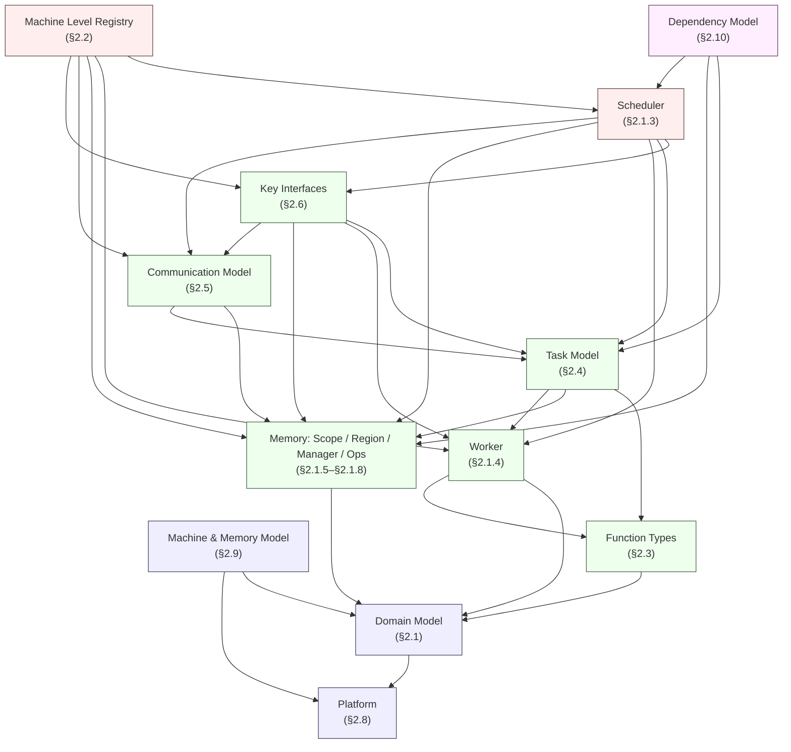

# 2. Logical View

This view describes the Simpler runtime's structure in terms of domain concepts, responsibilities, and relationships — independent of runtime behavior or deployment.

For readability, the logical view is split into one sub-document per module component under [`02-logical-view/`](02-logical-view/). This document is the **overview**: it introduces the domain model, names every module, and links to the detailed sub-documents.

---

## 2.0 Overview

The Simpler runtime is built upon a formal **Abstract Machine** — a computational model that defines how hardware resources are organized, work is scheduled, data is moved, and execution is managed.

The Abstract Machine is composed of **five pillars**:

1. A **Machine Level Registry** — the configurable, named hierarchy of compute and memory resources, with registered vertical and horizontal communication implementations.
2. A stack of **Execution Layers** — the recursive scheduling and execution framework, instantiated from the Machine Level Registry. Each Layer is a triple `(Scheduler, Workers[], MemoryScope)`.
3. A set of **Function** types — the callable units of computation.
4. A **Task** model — the unit of schedulable work.
5. A **Communication** model — how layers, workers, and nodes exchange control and data, implemented through the registered channels.

The Abstract Machine is parameterized by a **Platform** (e.g., `a2a3`, `a5`) and a **Platform Variant** (`ONBOARD` or `SIM`). Runtime behavior is platform-independent; only the Machine Level implementations and HAL are platform-specific.

### Structural Diagram

```
                            ┌────────────────────────┐
                            │  Machine Level Registry│
                            │  (blueprint / types)   │
                            └───────────┬────────────┘
                                        │ instantiate
                                        ▼
        ┌───────────────────────────────────────────────────────────┐
        │                     Layer Stack                           │
        │                                                           │
        │   L_N (root)      Scheduler ─ Workers[] ─ MemoryScope     │
        │     │                                                     │
        │     │   Vertical Channel (parent ↔ child)                 │
        │     ▼                                                     │
        │   L_k             Scheduler ─ Workers[] ─ MemoryScope     │
        │     ↔   Horizontal Channel (sibling ↔ sibling)            │
        │     │                                                     │
        │     ▼                                                     │
        │   L_0 (leaf)      Scheduler ─ Workers[] ─ MemoryScope     │
        └───────────────────────────────────────────────────────────┘

        Each Layer: Scheduler drives ── Workers execute ── inside MemoryScope.
        Workers may submit child Tasks that descend via Vertical Channels.
```

---

## 2.1 Module Breakdown

The logical view decomposes the Abstract Machine into the following module components. Each is described in its own sub-document; cross-references use the original §-numbering so links from other views continue to be stable.

| # | Module Component | Sub-Document | Primary Concepts |
|---|------------------|--------------|------------------|
| §2.1 | **Domain Model** (Abstract Machine, Execution Layer) | [02-logical-view/01-domain-model.md](02-logical-view/01-domain-model.md) | The five pillars, recursive Layer structure, Layer Stack, Layer Ordinal |
| §2.1.3 | **Scheduler** | [02-logical-view/02-scheduler.md](02-logical-view/02-scheduler.md) | TaskManager, WorkerManager, ResourceManager, event-driven loop, Scheduler–Worker deployment flexibility |
| §2.1.4 | **Worker** | [02-logical-view/03-worker.md](02-logical-view/03-worker.md) | Worker state machine, Worker Types, Worker Groups, Resource Exclusion Rule, Core Wraps |
| §2.1.5–§2.1.8 | **Memory** (Scope, Region, Manager, Operations, Access-Efficiency) | [02-logical-view/04-memory.md](02-logical-view/04-memory.md) | `IMemoryManager`, `IMemoryOps`, Memory Regions with backing-store / cacheability / cache-line characteristics, `PlacementHint` for cache-line-aware control-plane placement, address spaces, ring-buffer / pool / RDMA / scratchpad implementations |
| §2.2 | **Machine Level Registry** (incl. Vertical & Horizontal Channels) | [02-logical-view/05-machine-level-registry.md](02-logical-view/05-machine-level-registry.md) | `MachineLevelDescriptor`, factories, DSL aliases, level elision, `IVerticalChannel`, `IHorizontalChannel` |
| §2.3 | **Function Types** | [02-logical-view/06-function-types.md](02-logical-view/06-function-types.md) | AICore / Orchestration / Host / Distributed Orchestration Functions, Function Cache |
| §2.4 | **Task Model** | [02-logical-view/07-task-model.md](02-logical-view/07-task-model.md) | Task structure, TaskKey/Handle, ContinuousTensor, Task state summary, tensor lifecycle, SPMD, Task Execution Types |
| §2.5 | **Communication Model** | [02-logical-view/08-communication.md](02-logical-view/08-communication.md) | Message types, transport memory models, reference transports, data movement, shared/message-passing access models |
| §2.6 | **Key Interface Definitions** | [02-logical-view/09-interfaces.md](02-logical-view/09-interfaces.md) | `ISchedulerLayer`, Distributed Scheduler, `ITaskSchedulePolicy`, `IWorkerSelectionPolicy`, `IResourceAllocationPolicy`, `IEventSource`, `IEventQueue`, `IExecutionPolicy` |
| §2.8 | **Platform** | [02-logical-view/10-platform.md](02-logical-view/10-platform.md) | Platform parameters (a2a3, a5), Variants (ONBOARD, SIM), build targets |
| §2.9 | **Machine Model & Memory Model Abstraction** | [02-logical-view/11-machine-memory-model.md](02-logical-view/11-machine-memory-model.md) | Abstraction boundaries & invariants, hardware-to-abstract mapping, hierarchical address space, visibility/consistency/ordering rules |
| §2.10 | **Dependency Model** (frontend ↔ runtime dependency contract) | [02-logical-view/12-dependency-model.md](02-logical-view/12-dependency-model.md) | Two-stage pipeline, frontend contract on `intra_edges` / boundary masks, runtime `producer_index` lifecycle, non-aliasing invariant, RAW-only v1 scope |

> Section §2.7 below retains the implementation-oriented component decomposition summary, linking the logical-view modules to the code modules described in the [Development View](03-development-view.md).

---

## 2.1.1 Module Dependency Graph

The logical-view modules form a strict DAG. An edge `A → B` means "module A references concepts or interfaces owned by module B" — i.e., B must be understood/available before A can be defined. No cycles exist; this is enforced at the logical level and mirrored by the code-level DAG in the [Development View §3.2](03-development-view.md#32-dependency-graph).



**Ascii equivalent (dependencies point upward to the module being depended on):**

```
                Machine Level Registry (§2.2)
                          │
     ┌────────────┬───────┼─────────┬────────────┐
     ▼            ▼       ▼         ▼            ▼
  Scheduler    Worker   Memory   Comm.      Key Interfaces
   (§2.1.3)   (§2.1.4) (§2.1.5-7) (§2.5)        (§2.6)
     │           │        │         │            │
     └───────────┴────┬───┴─────────┘            │
                     Task Model (§2.4)           │
                         │                       │
                         └──── Function Types (§2.3)
                                      │
                Machine & Memory Model (§2.9)
                         │
                   Domain Model (§2.1)
                         │
                     Platform (§2.8)
```

**Dependency rules:**

| Module | Depends On | Depended On By |
|--------|-----------|----------------|
| Platform (§2.8) | (none) | Domain Model, Machine &amp; Memory Model |
| Domain Model (§2.1) | Platform | Machine &amp; Memory Model, Function Types, Memory, Worker |
| Machine &amp; Memory Model (§2.9) | Domain Model, Platform | (cross-cutting: constrains all modules below Registry) |
| Function Types (§2.3) | Domain Model | Worker, Task Model |
| Memory (§2.1.5–§2.1.8) | Domain Model | Task Model, Communication, Key Interfaces, Scheduler, Registry |
| Worker (§2.1.4) | Domain Model, Function Types | Task Model, Key Interfaces, Scheduler, Registry |
| Task Model (§2.4) | Function Types, Memory, Worker | Communication, Key Interfaces, Scheduler |
| Communication Model (§2.5) | Memory, Task Model | Key Interfaces, Scheduler, Registry |
| Key Interfaces (§2.6) | Task Model, Worker, Memory, Communication | Scheduler, Registry |
| Scheduler (§2.1.3) | Key Interfaces, Task Model, Worker, Memory, Communication | Registry |
| Machine Level Registry (§2.2) | Scheduler, Worker, Memory, Communication, Key Interfaces | (top-level assembler) |
| Dependency Model (§2.10) | Task Model, Memory, Scheduler | (specification module: enforced by frontend + `scheduler/` TaskManager + `memory/`) |

**Notes:**

- **Foundation layer** (Platform, Domain Model, Machine &amp; Memory Model) establishes vocabulary and invariants. No other logical module can be defined without them.
- **Contract layer** (Function Types, Memory, Worker, Task Model, Communication, Key Interfaces) introduces the domain concepts and the abstract interfaces that pluggable implementations must honor. These are the **extension points** of the runtime.
- **Assembler layer** (Scheduler, Machine Level Registry) composes the contracts into a runnable system. The Scheduler wires the three internal sub-components (TaskManager / WorkerManager / ResourceManager); the Registry wires per-level factory bindings and assembles the Layer Stack.
- The graph is a **strict DAG** (Rule D6). Cyclic references at the concept level are forbidden; any apparent cycle (e.g., Registry factories producing Scheduler instances while the Scheduler uses Registry-provided channels) is broken by the **interface/implementation** split — the Registry depends on the interface contracts, not on concrete scheduler code.
- Mapping to code modules (`hal/`, `core/`, `scheduler/`, etc.) is given in [§2.7](#27-component-decomposition-summary) and the code-level DAG lives in the [Development View §3.2](03-development-view.md#32-dependency-graph).

---

## 2.1.2 Module Interfaces Summary

Each logical module either **owns** a set of interfaces (defines them, specifies their contracts) or **consumes** interfaces owned by other modules. This table is the single-page index of those interfaces; full signatures and contracts are in the module sub-documents.

| Module | Interfaces Owned (defined here) | Interfaces Consumed (depended on) | Primary Sub-Document |
|--------|----------------------------------|-----------------------------------|----------------------|
| **Domain Model** (§2.1) | `LayerId`, `Layer Ordinal`, `Layer` triple `(Scheduler, Workers[], MemoryScope)` *(conceptual, not a code interface)* | — | [01-domain-model.md](02-logical-view/01-domain-model.md) |
| **Scheduler** (§2.1.3) | `TaskManager`, `WorkerManager`, `ResourceManager` *(internal sub-component contracts)*; `SchedulerEvent` type | `ISchedulerLayer` (implements), `ITaskSchedulePolicy`, `IWorkerSelectionPolicy`, `IResourceAllocationPolicy`, `IEventSource`, `IEventQueue`, `IEventCollectionPolicy`, `IExecutionPolicy`, `SourceCollectionConfig`, `EventLoopDeploymentConfig`, `IMemoryManager`, `IVerticalChannel`, `IHorizontalChannel` | [02-scheduler.md](02-logical-view/02-scheduler.md) |
| **Worker** (§2.1.4) | `WorkerState` state machine, `WorkerTypeDescriptor`, `WorkerGroup`, `Worker` record | `FunctionRef` (executes), `IMemoryManager`/`IMemoryOps` (scope access) | [03-worker.md](02-logical-view/03-worker.md) |
| **Memory** (§2.1.5–§2.1.8) | `IMemoryManager`, `IMemoryOps`, `MemoryScope`, `MemoryRegionDescriptor`, `RegionId`, `BackingStore`, `Cacheability`, `PlacementHint`, `BufferRef`, `TaskSlotRef`, `ScopeHandle`, `WorkspaceHandle`, `GlobalAddress`, `MemoryManagerConfig`, `MemoryOpsConfig` | HAL `IMemory` (for transport, including per-region characteristics) *(in Development View)* | [04-memory.md](02-logical-view/04-memory.md) |
| **Machine Level Registry** (§2.2) | `MachineLevelDescriptor`, `MachineLevelRegistry`, `LevelParams`, `IVerticalChannel`, `IHorizontalChannel`, factory interfaces (`ISchedulerFactory`, `IWorkerFactory`, `IMemoryManagerFactory`, `IMemoryOpsFactory`, `IVerticalChannelFactory`, `IHorizontalChannelFactory`, `ITaskSchedulePolicyFactory`, `IWorkerSelectionPolicyFactory`, `IResourceAllocationPolicyFactory`, `IEventSourceFactory`, `IEventCollectionPolicyFactory`, `IExecutionPolicyFactory`) | All contract-layer interfaces (produced by factories) | [05-machine-level-registry.md](02-logical-view/05-machine-level-registry.md) |
| **Function Types** (§2.3) | `FunctionRef`, `FunctionCache`, function-type classification (AICore / Orchestration / Host / Distributed Orchestration) | — | [06-function-types.md](02-logical-view/06-function-types.md) |
| **Task Model** (§2.4) | `Task`, `TaskKey`, `TaskHandle`, `TaskState`, `TaskDescriptor`, `Submission`, `SubmissionDescriptor`, `SubmissionHandle`, `DepMode`, `IntraGroupEdge`, `WorkspaceRequest`, `ContinuousTensor`, `TaskArgs`, `DepList`, `ResourceReq`, `TaskExecType`, `SPMDTaskDescriptor`, `ArgDirection`, `DataType` | `FunctionRef` (invokes), `BufferRef`, `WorkspaceHandle`, `WorkerTypeDescriptor` (via `TaskExecType.required_slots`) | [07-task-model.md](02-logical-view/07-task-model.md) |
| **Communication Model** (§2.5) | Message catalogue (`TASK_SUBMIT`, `REMOTE_SUBMIT`, `DMA_REQUEST`, …), transport memory-model classification, data-access model | `IVerticalChannel`, `IHorizontalChannel`, `IMemoryOps` | [08-communication.md](02-logical-view/08-communication.md) |
| **Key Interfaces** (§2.6) | `ISchedulerLayer`, Distributed Scheduler contract, `ITaskSchedulePolicy`, `IWorkerSelectionPolicy`, `IResourceAllocationPolicy` (incl. `AdmissionDecision` / `should_admit`), `IEventSource`, `IEventQueue`, `IEventCollectionPolicy`, `IExecutionPolicy`, `EventHandlingConfig`, `SourceCollectionConfig`, `EventLoopDeploymentConfig`, `IPartitioner`, supporting types (`SubmissionDescriptor`, `SubmissionHandle`, `DepMode`, `IntraGroupEdge`, `WorkspaceRequest`, `ResourceSnapshot`, `ResourceAllocationResult`, `WorkerGroupAvailability`, `WorkerAllocation`, `SchedulerStats`, `LayerConfig`, `LayerStats`) | `TaskDescriptor`/`TaskHandle`, `TaskExecType`, `WorkerState`, `BufferRef`, `WorkspaceHandle`, `IMemoryManager`, `IMemoryOps`, `IVerticalChannel`, `IHorizontalChannel` | [09-interfaces.md](02-logical-view/09-interfaces.md) |
| **Platform** (§2.8) | `Platform` parameter set, `PlatformVariant` (`ONBOARD` / `SIM`), `SimulationMode` (`PERFORMANCE` / `FUNCTIONAL` / `REPLAY`), build-target identifier | — | [10-platform.md](02-logical-view/10-platform.md) |
| **Machine &amp; Memory Model** (§2.9) | Abstraction boundaries (Platform / Level / Variant), abstraction invariants, hierarchical Address Space rules, visibility / consistency / ordering rules, memory-lifetime rule | All contract-layer interfaces (constrains their behavior); HAL `IPlatformFactory` (for Platform boundary) | [11-machine-memory-model.md](02-logical-view/11-machine-memory-model.md) |
| **Dependency Model** (§2.10) | Frontend contract on `SubmissionDescriptor.intra_edges` / `boundary_in_tasks` / `boundary_out_tasks`; runtime `producer_index` lifecycle rules; non-aliasing intermediate-memref invariant (specification, not a code interface) | `SubmissionDescriptor`, `IntraGroupEdge`, `DepMode` (§2.6.1.A); `producer_index` (§2.1.3.1.B); `SUBMISSION_RETIRED` (§2.1.3.5); `IMemoryManager` (§2.1.6) | [12-dependency-model.md](02-logical-view/12-dependency-model.md) |

### Interfaces at a Glance

Grouped by role, the principal interface families exposed by the Abstract Machine are:

| Family | Interfaces | Purpose |
|--------|-----------|---------|
| **Layer execution** | `ISchedulerLayer` | Uniform Scheduler contract per Layer (submit, dispatch, drain, scope, lifecycle). |
| **Memory** | `IMemoryManager`, `IMemoryOps` | Allocation/lifetime and data-transfer operations per Layer. |
| **Channels** | `IVerticalChannel`, `IHorizontalChannel` | Control-plane messaging between parent↔child and sibling↔sibling. |
| **Scheduling policy** | `ITaskSchedulePolicy`, `IWorkerSelectionPolicy`, `IResourceAllocationPolicy` | Pluggable decision points inside the three Scheduler sub-components. |
| **Event / execution** | `IEventSource`, `IEventQueue`, `IEventCollectionPolicy`, `IExecutionPolicy`, `SourceCollectionConfig`, `EventLoopDeploymentConfig` | Event-loop input sources and transport, source-collection ordering/fairness, stage-to-execution-unit deployment, and Scheduler–Worker deployment mode. |
| **Assembly** | `MachineLevelDescriptor` + all factory interfaces | Registry-level composition of a Layer from its component factories. |
| **Distribution** | Distributed Scheduler protocol, `IPartitioner` | Cross-node task partitioning and coordination. |

Every interface in this section is an **extension point**: a new platform, a new transport, a new scheduling heuristic, or a new simulation mode is added by implementing the relevant interface and binding it via the registry — no framework code is modified (Rule D2).

---

## 2.7 Component Decomposition Summary

The runtime decomposes into the following code modules (detailed in [Development View](03-development-view.md)):

| Module | Responsibility | Logical-View Sub-Document |
|--------|---------------|---------------------------|
| `hal/` | Hardware Abstraction Layer (IDevice, IMemory, IExecutionEngine, IRegisterBank, INetwork, IPlatformFactory) | [§2.9](02-logical-view/11-machine-memory-model.md) |
| `core/` | Task model, Worker model (including WorkerTypeDescriptor, WorkerGroup, TaskExecType), state machines (TaskState, WorkerState), SchedulerEvent, function registry, `ISchedulerLayer` interface, `IEventSource`, `IEventQueue`, `IExecutionPolicy` interfaces, parent-child task tracking | [§2.3](02-logical-view/06-function-types.md), [§2.4](02-logical-view/07-task-model.md), [§2.1.4](02-logical-view/03-worker.md), [§2.6](02-logical-view/09-interfaces.md) |
| `scheduler/` | Per-level `ISchedulerLayer` implementations decomposed into TaskManager, WorkerManager, ResourceManager sub-components; event loop, event sources, event queues; schedule policy interfaces, execution policies, and default implementations | [§2.1.3](02-logical-view/02-scheduler.md), [§2.6.3–§2.6.4](02-logical-view/09-interfaces.md) |
| `memory/` | TensorMap, address translation, region layout and characteristics (`MemoryRegionDescriptor`), allocation strategies with `PlacementHint`, distributed address space | [§2.1.5–§2.1.8](02-logical-view/04-memory.md) |
| `transport/` | Intra-node (ring buffer, shared memory, registers) and inter-node (message framing, serialization) transports | [§2.2.5–§2.2.6](02-logical-view/05-machine-level-registry.md), [§2.5](02-logical-view/08-communication.md) |
| `distributed/` | Distributed scheduling protocol, remote task proxy, data movement coordinator, partition strategies | [§2.6.2](02-logical-view/09-interfaces.md) |
| `profiling/` | Profiling, tracing, and logging | — (see [Cross-Cutting Concerns](07-cross-cutting-concerns.md)) |
| `error/` | Error handling and propagation | — (see [Cross-Cutting Concerns](07-cross-cutting-concerns.md)) |
| `runtime/` | Runtime composition, lifecycle, layer assembly | [§2.2](02-logical-view/05-machine-level-registry.md) |
| `bindings/` | Python bindings and public API | — |

---

## Reading Order

For readers new to the runtime, we recommend the following order:

1. [§2.1 Domain Model](02-logical-view/01-domain-model.md) — the foundational concepts.
2. [§2.2 Machine Level Registry](02-logical-view/05-machine-level-registry.md) — how topology is configured.
3. [§2.1.3 Scheduler](02-logical-view/02-scheduler.md) and [§2.1.4 Worker](02-logical-view/03-worker.md) — the execution engine.
4. [§2.1.5–§2.1.8 Memory](02-logical-view/04-memory.md) — memory management, region characteristics, data transfer, and access-efficiency rules.
5. [§2.3 Functions](02-logical-view/06-function-types.md) and [§2.4 Tasks](02-logical-view/07-task-model.md) — units of work.
6. [§2.5 Communication](02-logical-view/08-communication.md) — inter-layer and inter-node messaging.
7. [§2.6 Key Interfaces](02-logical-view/09-interfaces.md) — the contracts that bind everything together.
8. [§2.8 Platform](02-logical-view/10-platform.md) and [§2.9 Machine & Memory Model](02-logical-view/11-machine-memory-model.md) — cross-cutting abstraction contracts.
9. [§2.10 Dependency Model](02-logical-view/12-dependency-model.md) — the frontend ↔ runtime dependency contract.
