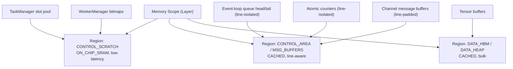

# Memory: Scope, Manager, and Operations

> Part of the [Logical View](../02-logical-view.md). This module groups the memory-related concepts owned by each Layer: the **Memory Scope** (the addressable region itself), the **Memory Region** (attributed sub-range of the scope), the **Memory Manager** (allocation and lifetime), and the **Memory Operations** (data transfer into, out of, and within the scope).

The Memory module serves **both planes** of the runtime:

- **Data plane** — tensor buffers consumed by Tasks on Workers.
- **Control plane** — task slots, worker / resource records, event queues, channel message buffers, atomic flags, ring-buffer head/tail pointers, and any other runtime bookkeeping that the Scheduler and Channel components produce and consume on the critical path.

Intrinsic memory **characteristics** (backing store, cacheability, cache-line size, whether same-line atomics are serialized by the memory engine, etc.) are *reported* by runtime data structures — principally [`MemoryRegionDescriptor`](#2151-memory-region) (§2.1.5.1). Access-**efficiency considerations** that decide how to exploit those characteristics (which consumer goes where, when to isolate a cache line, when to pad) are consolidated separately in [§2.1.8 Access-Efficiency Considerations](#218-access-efficiency-considerations). The data-structure sections define facts; the efficiency section defines rules.

## 2.1.5 Memory Scope

A **Memory Scope** is a region of addressable memory owned by a Layer. All Workers within the Layer can read from and write to their Layer's Memory Scope. A Scope is the union of one or more **Memory Regions** (§2.1.5.1); regions partition the scope by physical backing and access characteristics but do not alter its visibility rules.

**Visibility rules:**
- **Directly accessible** by all Workers in the same Layer.
- **Transferable** to adjacent Layers via the registered Vertical Channel.
- **Not directly accessible** by Workers in non-adjacent Layers (multi-hop required).

**Address Space:** Each Memory Scope defines an Address Space with local addresses. A **Global Address** is `(level_path[], local_address)` — the ordered sequence of instance indices from root to target scope, plus the local address.

## 2.1.5.1 Memory Region

A **Memory Region** is a named sub-range of a Memory Scope with **uniform physical backing** and **uniform access characteristics**. A Memory Scope is the union of one or more Regions. Regions are declared per Machine Level at Memory Manager construction time (via `MemoryManagerConfig.regions[]`); they are static for the lifetime of the Layer instance and are sub-allocated by the Memory Manager.

Regions are an *intra-scope* refinement: they do not change any visibility, consistency, or ordering rule defined in §2.1.5 or §2.9. Every Worker in the Layer may address every Region of its Scope; regions only refine where the bytes live and how they behave under caching, coherence, and atomic access.

**Region characteristics** — every field in `MemoryRegionDescriptor` is a **fact** reported by the hardware / Level factory, not a usage decision:

```cpp
enum class BackingStore {
    HBM, ON_CHIP_SRAM, SCRATCHPAD, HOST_DRAM, RDMA_REGISTERED
};
enum class Cacheability {
    CACHED, UNCACHED, WRITE_COMBINE, WRITE_THROUGH, NON_ALLOCATE
};

struct MemoryRegionDescriptor {
    RegionId     id;
    std::string  name;                     // e.g. "CONTROL_SCRATCH", "DATA_HBM"

    BackingStore backing;                  // where the bytes physically live
    Cacheability cacheability;             // cache behavior for this range
    size_t       cache_line_bytes;         // 0 if cacheability == UNCACHED
    size_t       natural_alignment;        // required minimum alignment
    size_t       size_bytes;               // total capacity of the region

    // Hardware-reported behavioral facts that the control plane must honor
    // to reason about performance. These are facts, not policies.
    bool         atomic_same_line_serialized;  // HW serializes atomics that
                                                // share a cache line
    bool         coherent_with_peers;           // visible to sibling Workers
                                                // without an explicit fence
    uint32_t     approx_access_latency_ns;      // coarse indicator, platform-
                                                // reported
};
```

> Every field above is a **characteristic** — a fact about the region that the hardware or the Level factory reports. No field in this struct expresses a usage decision; placement decisions are expressed via [`PlacementHint`](#216-memory-manager) (§2.1.6) and governed by the rules in [§2.1.8](#218-access-efficiency-considerations).

**Registration.** Machine Level factories populate each region's descriptor from HAL `IMemory` metadata at Memory Manager initialization. Regions cannot be added or resized at runtime.

## 2.1.6 Memory Manager

A **Memory Manager** (`IMemoryManager`) is a per-Layer component managing allocation, deallocation, and lifetime of memory within the Layer's Memory Scope. The interface is uniform; implementations are pluggable per Machine Level.

> **Non-Aliasing Intermediate-Memref Invariant (normative).** Every `IMemoryManager` implementation MUST guarantee that a `BufferRef` returned from `alloc_buffer(...)` / `alloc_task_slot(...)` does not share any address range with another still-live `BufferRef`, except through the explicit sub-range APIs (`workspace_subrange(...)`, [§2.1.6.A](#216a-group-workspace-memory)) whose callers opt into shared-arena lifetime. A `BufferRef` is "still live" from the moment it is returned by the Manager until either (a) `free_buffer(...)` / `free_task_slot(...)` is called, or (b) the scope whose token implicitly owns it exits ([§2.4.5](07-task-model.md#245-tensor-lifecycle)). This invariant is consumed by the runtime's [Dependency Model §2.10](12-dependency-model.md) — in particular, it is what makes the single-valued `producer_index` ([§2.1.3.1.B](02-scheduler.md#2131b-dependency-resolution-per-submission)) sound for cross-Submission RAW-only dependency resolution: if two `BufferRef` values do not alias, there is no cross-Submission WAR / WAW for the runtime to miss. The invariant matches the precondition stated by [`tensor-dependency.md` §1.3](../../../tensor-dependency.md) for the frontend analyzer.

Each implementation declares a **default region layout** partitioning its scope into control-plane and data-plane regions:

| Implementation | Default region layout | Description | Typical Level |
|---------------|-----------------------|-------------|---------------|
| `RingBufferMemoryManager` | `CONTROL_AREA`, `DATA_AREA` | Multi-layer ring stack indexed by scope depth | `"Chip"`, `"Device"` |
| `PoolMemoryManager` | `CONTROL_HEAP`, `MSG_BUFFERS`, `DATA_HEAP` | Slab allocator + dynamic buffers | `"Host"` |
| `RDMARegisteredMemoryManager` | `CONTROL_RDMA`, `DATA_RDMA` | RDMA-registered host memory pools | `"Pod"`, `"Supernode"` |
| `ScratchpadMemoryManager` | `CONTROL_SCRATCH` (ON_CHIP_SRAM), `DATA_L1`, `DATA_L0A/B/C` | Static partitioning of core-local SRAM | `"Core"` |

The actual region set, sizes, and descriptor values are supplied by the Machine Level factory at `init()` time; the names above are conventions.

### Expressing efficiency intent

Callers express placement / cache-alignment / cache-isolation requirements through a `PlacementHint`. The struct is a data structure, but each field is a caller-supplied **efficiency expression** that the Memory Manager satisfies using the targeted region's characteristics from `MemoryRegionDescriptor`. The rules for *which* hint to use for *which* consumer are not part of the interface — they are in [§2.1.8](#218-access-efficiency-considerations).

```cpp
struct PlacementHint {
    RegionId region        = RegionId::Default; // which region to allocate from
    size_t   alignment     = 0;                 // 0 => region.natural_alignment
    bool     pad_to_cache_line  = false;        // round size up to a whole line
    bool     isolate_cache_line = false;        // no other alloc shares the line
};
```

### IMemoryManager interface

```cpp
class IMemoryManager {
public:
    virtual ~IMemoryManager() = default;

    // Region-aware allocation (preferred). A default-constructed PlacementHint
    // targets the implementation's Default region with natural alignment.
    virtual TaskSlotRef alloc_task_slot(PlacementHint hint = {}) = 0;
    virtual void        free_task_slot(TaskSlotRef slot) = 0;

    virtual BufferRef   alloc_buffer(size_t size, PlacementHint hint = {}) = 0;
    virtual void        free_buffer(BufferRef buf) = 0;

    // Backwards-compatible overload: builds a PlacementHint with the given
    // alignment and targets RegionId::Default.
    virtual BufferRef   alloc_buffer(size_t size, size_t alignment) = 0;

    // Group Workspace allocation (§2.1.6.A). Used by the Scheduler at
    // Submission admission (§2.4.A) to allocate non-boundary tensor storage
    // as a single coherent arena that is freed as one unit.
    virtual WorkspaceHandle alloc_workspace(size_t total_bytes,
                                            PlacementHint hint = {}) = 0;
    virtual BufferRef       workspace_subrange(WorkspaceHandle handle,
                                               size_t offset,
                                               size_t size) = 0;
    virtual void            free_workspace(WorkspaceHandle handle) = 0;

    virtual ScopeHandle scope_enter() = 0;
    virtual void        scope_exit(ScopeHandle scope) = 0;

    virtual void        mark_tensor_free(BufferRef buf) = 0;

    virtual void*       resolve_address(BufferRef buf) const = 0;
    virtual size_t      available() const = 0;
    virtual size_t      available(RegionId region) const = 0;
    virtual MemoryStats get_stats() const = 0;

    // Region introspection — consumers read characteristics here and then
    // synthesize PlacementHints. Control-plane code MUST NOT hard-code
    // platform constants such as cache line size; read them from describe().
    virtual std::span<const MemoryRegionDescriptor> regions() const = 0;
    virtual const MemoryRegionDescriptor&           describe(RegionId) const = 0;
    virtual RegionId                                region_of(BufferRef) const = 0;

    virtual void init(const MemoryManagerConfig& config) = 0;
    virtual void shutdown() = 0;
};
```

### 2.1.6.A Group Workspace Memory

A **Group Workspace** is a single coherent arena that holds the non-boundary tensors of one Group Submission ([§2.4.D](07-task-model.md#24d-group-workspace-memory)). It is allocated once at Submission admission and freed once at Submission retirement.

**Shape**
- One `WorkspaceHandle` per Submission that has non-boundary tensors. Single-Task Submissions and Submissions whose every task is boundary omit the workspace entirely.
- Internal layout is a bump / offset arena: each non-boundary tensor is assigned `(offset, size, alignment)` at admission, and `workspace_subrange(handle, offset, size)` exposes that region as an ordinary `BufferRef` the Task's dispatch payload can consume.
- The arena lives in a data-plane Region (`DATA_*`). Control regions are **not** eligible — the workspace carries bulk tensor data, not control-plane state.

**Lifecycle**
1. At Submission admission, the Scheduler builds a `WorkspaceRequest` from per-tensor sizes (sum of aligned non-boundary tensor sizes) and calls `alloc_workspace(total_bytes, hint)`.
2. Per-tensor `BufferRef`s are produced via `workspace_subrange(...)` and embedded in each Task's `ContinuousTensor` arguments ([§2.4.3](07-task-model.md#243-task-arguments-and-continuoustensor)) — they are indistinguishable from ordinary `BufferRef`s to the Worker.
3. When the Submission reaches retirement (last Task RETIRED → `SUBMISSION_RETIRED`), the Scheduler calls `free_workspace(handle)`, which reclaims every sub-range in one operation.

**Invariants**
- Sub-range `BufferRef`s obtained from a workspace MUST NOT be retained past Submission retirement. The runtime treats any cross-Submission reference as a boundary tensor and allocates it outside the workspace.
- `free_workspace` is O(1): it does not walk sub-ranges; it simply releases the underlying arena allocation.
- `alloc_workspace` honors the same `IResourceAllocationPolicy` back-pressure as ordinary `alloc_buffer`; if the data region does not have `total_bytes` contiguous, admission waits (`AdmissionDecision::WAIT`, [§2.6.3](09-interfaces.md#263-schedule-policy-interfaces)).
- Workspaces are internally linear (bump offset); they do **not** support per-tensor `free`. Tensors with distinct lifetimes must be either boundary (use `alloc_buffer`) or allocated in a different workspace.

**Benefits**
- A single allocation + single free per Submission replaces `N` allocations + `N` frees for non-boundary tensors.
- Per-tensor ref-count / scope-exit bookkeeping is bypassed for non-boundary tensors, removing a major control-plane cost for large Group Submissions.
- Memory-manager traffic on the admission/retirement critical paths is bounded by the number of outstanding Submissions, not by the number of tasks.

## 2.1.7 Memory Operations

**Memory Operations** (`IMemoryOps`) define data transfer operations available at a Machine Level — how data moves into, out of, and within the Layer's Memory Scope. The interface separates the **what** (a transfer request) from the **how** (DMA, RDMA, memcpy, etc.):

| Implementation | Transport | Typical Level |
|---------------|-----------|---------------|
| `DMAMemoryOps` | DMA engine via HAL | `"Host"` → `"Device"` |
| `OnChipDMAMemoryOps` | On-chip DMA for HBM↔shared memory | `"Device"` → `"Chip"` |
| `CoreLoadStoreMemoryOps` | Core load/store instructions | `"Chip"` → `"Core"` |
| `RDMAMemoryOps` | RDMA read/write for inter-node transfer | `"Pod"` horizontal |
| `TPushTPopMemoryOps` | TPUSH/TPOP flag-based ring buffer | `"Chip"` / `"CoreGroup"` horizontal |
| `LoopbackMemoryOps` | `memcpy` on host memory | Any level in `SIM` variant |

**IMemoryOps interface:**

```cpp
class IMemoryOps {
public:
    virtual ~IMemoryOps() = default;

    // Vertical transfers (parent ↔ child scope)
    virtual Status copy_to_child(BufferRef src, BufferRef dst, size_t size) = 0;
    virtual Status copy_from_child(BufferRef src, BufferRef dst, size_t size) = 0;

    // Horizontal transfers (sibling ↔ sibling scope)
    virtual Status copy_to_peer(uint32_t peer_index, BufferRef src, BufferRef dst, size_t size) = 0;
    virtual Status copy_from_peer(uint32_t peer_index, BufferRef src, BufferRef dst, size_t size) = 0;

    // Local operations
    virtual Status copy_local(BufferRef src, BufferRef dst, size_t size) = 0;
    virtual Status fill(BufferRef dst, uint8_t value, size_t size) = 0;

    // Address translation
    virtual GlobalAddress to_global(BufferRef local) const = 0;
    virtual BufferRef     from_global(GlobalAddress global) const = 0;

    // Async support
    virtual AsyncHandle   copy_async(BufferRef src, BufferRef dst, size_t size) = 0;
    virtual Status        wait(AsyncHandle handle) = 0;
    virtual bool          poll(AsyncHandle handle) = 0;

    virtual void init(const MemoryOpsConfig& config) = 0;
    virtual void shutdown() = 0;
};
```

> [UPDATED: A5-P7: `Timeout` on `IMemoryOps` async operations]
> `wait(AsyncHandle) → Status` is normatively `wait(AsyncHandle, Timeout) → Status`, and `poll(AsyncHandle) → bool` is normatively `poll(AsyncHandle, Timeout = Timeout::zero()) → bool`. On deadline expiry both operations return `Status = TransportTimeout`. Idempotent retry side-effects are covered by the dedup window + A5-P10 idempotency policy; see `modules/memory.md` for the dedup-window policy summary and the `REMOTE_*` idempotency tags. Zero-timeout `poll()` preserves the non-blocking check contract.

The Vertical Channel carries **control messages**; `IMemoryOps` handles the **bulk data path**. This separation allows each to be optimized independently. Note that both planes share the Memory module: they are separated by **Region** (§2.1.5.1), not by a different module — the characteristics / efficiency split in [§2.1.5.1](#2151-memory-region) and [§2.1.8](#218-access-efficiency-considerations) is what keeps that sharing safe at performance-sensitive levels.

## 2.1.8 Access-Efficiency Considerations

> This section is **implementation guidance**, not data-structure definition. It references the characteristics reported by `MemoryRegionDescriptor` (§2.1.5.1) and the efficiency expressions carried by `PlacementHint` (§2.1.6), and prescribes how control-plane components should combine them. Nothing here introduces new types.

### Why placement matters for the control plane

The control plane is on the critical path of every Task: every submission, every dependency-edge notification, every dispatch, every completion touches a Scheduler data structure, an event-loop queue, or a Channel message buffer. At performance-sensitive Machine Levels (in particular the Chip level, where Chip → Core dispatch latency directly bounds AICore utilization) these accesses must complete in sub-microsecond time. Placement of control-plane data is therefore a performance concern on par with data-plane tensor placement — and it is controlled through the same Memory Manager.

### Control-plane consumers

The following runtime data structures live in memory and care about placement:

- **TaskManager** — task slot pool, dependency DAG state, parent–child tracking tables.
- **WorkerManager** — worker records, per-group availability bitmaps.
- **ResourceManager** — buffer / worker accounting structures.
- **Event loop** — Stage A→B inline-dispatch queue, Stage B→C deferred queue, per-`IEventSource` queues.
- **Vertical / Horizontal Channels** — message rings, DMA descriptor tables, completion flags.
- **Profiling / error** — ring buffers for event records and error contexts.

### Placement rules

The table below is the canonical mapping from *consumer pattern* to *required region characteristics* and the `PlacementHint` fields that express those requirements. Implementations MUST follow this table at performance-critical levels (Chip, Device); higher levels MAY relax it when latency is not binding.

| Consumer pattern | Required region characteristics | `PlacementHint` settings | Rationale |
|---|---|---|---|
| Chip-level scheduler hot state (task slots, ready bitmap, per-group availability) | `backing = ON_CHIP_SRAM` or `SCRATCHPAD`; low `approx_access_latency_ns` | `region = CONTROL_SCRATCH` | Chip → Core dispatch critical path demands sub-μs access; HBM/DRAM latencies would dominate the dispatch time. |
| Cross-thread event queue head / tail pointers (Stage A→B, B→C when stages split across execution units) | `cacheability = CACHED`; `cache_line_bytes` known | `isolate_cache_line = true` — head and tail each on their own line | Enforces a single-writer-per-line discipline; avoids the coherence-traffic storm that results from producer and consumer both bouncing the same line. |
| Atomic hotspot (fan-in counter, dispatch counter, per-worker state flag, per-Task Slot ref-count) | `atomic_same_line_serialized = true` observed from descriptor | `isolate_cache_line = true` | On hardware where `atomic_same_line_serialized` is true, atomic ops whose addresses share a cache line are serialized by the memory engine regardless of byte address. Isolating each counter on its own line restores parallelism. |
| Channel message buffer (producer and consumer on different cores / threads) | `cacheability = CACHED`; `cache_line_bytes` known | `region = MSG_BUFFERS` (or equivalent), `pad_to_cache_line = true` | Padding to a whole line eliminates false sharing with adjacent allocations in the same region. |
| Bulk tensor (data plane) | `backing ∈ {HBM, HOST_DRAM, RDMA_REGISTERED}`; natural alignment sufficient | `region = DATA_*` (default), no cache-line flags | Capacity and bandwidth dominate; cache-line-isolation / padding tricks waste capacity without helping. |
| Group Workspace (non-boundary tensors of a Group Submission, §2.1.6.A) | `backing ∈ {HBM, HOST_DRAM, RDMA_REGISTERED}`; natural alignment sufficient for each sub-range | `region = DATA_*` (default), no cache-line flags; requested via `alloc_workspace(total_bytes, hint)` | One arena allocation per Submission carries many non-boundary tensors; cache-line isolation between sub-ranges is unnecessary because tasks within a Submission are coordinated by intra-group dependency edges, not by concurrent atomics on shared lines. |

### Worked example — chip-level scheduler

Concretely, a chip-level scheduler at `init()` time builds its critical runtime data structures as follows, using the region set published by `ScratchpadMemoryManager` / `RingBufferMemoryManager` for the chip scope:

```cpp
// 1. Task slots pinned to on-chip scratchpad for sub-μs access.
for (uint32_t i = 0; i < cfg.task_slot_count; ++i) {
    slots_[i] = mm.alloc_task_slot({ .region = CONTROL_SCRATCH });
}

// 2. Fan-in / dispatch counters each on their own cache line so the memory
//    engine does not serialize concurrent atomic updates.
const auto& ctrl = mm.describe(CONTROL_AREA);
for (uint32_t i = 0; i < cfg.counter_count; ++i) {
    counters_[i] = mm.alloc_buffer(sizeof(std::atomic<uint32_t>),
                                   { .region            = CONTROL_AREA,
                                     .alignment         = ctrl.cache_line_bytes,
                                     .isolate_cache_line = true });
}

// 3. Stage-A → Stage-B inline dispatch queue: head and tail pointers live on
//    separate cache lines (single-writer-per-line).
inline_q_.head = mm.alloc_buffer(sizeof(uint64_t),
                                 { .region = CONTROL_AREA,
                                   .isolate_cache_line = true });
inline_q_.tail = mm.alloc_buffer(sizeof(uint64_t),
                                 { .region = CONTROL_AREA,
                                   .isolate_cache_line = true });

// 4. Channel message buffers padded to whole cache lines to avoid false
//    sharing across producer / consumer cores.
msg_buf_ = mm.alloc_buffer(msg_bytes,
                           { .region = MSG_BUFFERS,
                             .pad_to_cache_line = true });
```

No platform constants appear in the code above; every cache-line-aware decision is expressed as a `PlacementHint` flag and resolved by the Memory Manager against the region descriptor.

### Portability rule

Control-plane code **MUST** read `cache_line_bytes`, `atomic_same_line_serialized`, and `approx_access_latency_ns` from `IMemoryManager::describe(RegionId)` rather than hard-coding platform constants. This preserves the **Platform Transparency** invariant from §2.9.1: switching from `a2a3` to `a5` changes descriptor values, not Scheduler code. A Scheduler implementation that hard-codes a 64-byte cache line violates this rule and is considered non-portable.

### Placement diagram


