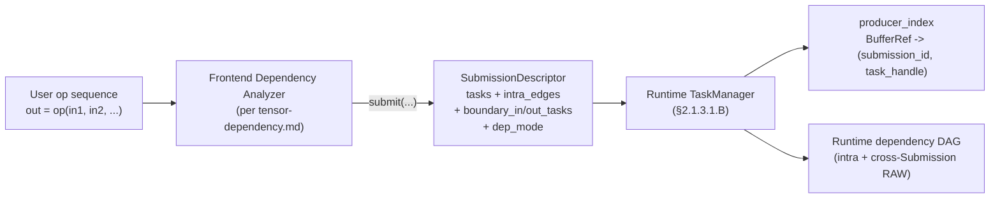

# 2.10 Dependency Model

> Part of the [Logical View](../02-logical-view.md). This module describes **how task-level dependencies are constructed and maintained** across the two-stage pipeline that drives the Scheduler: a **frontend dependency analyzer** (owner of the user op sequence and of per-Submission intra-group hazards) and the **runtime TaskManager** (owner of cross-Submission dependency resolution via the `DATA` mode producer index). The two stages meet at the `SubmissionDescriptor` handoff.

The runtime's existing Submission model ([§2.4.A–§2.4.D](07-task-model.md#24a-submission-model)) already defines the handoff fields (`intra_edges`, `boundary_in_tasks`, `boundary_out_tasks`, `dep_mode`); this document specifies **who fills them in, what they must guarantee, and how the runtime consumes and garbage-collects the derived state**. The frontend's internal hazard-analysis algorithm is documented separately in [`tensor-dependency.md`](../../../tensor-dependency.md) — a normative specification of the intra-Submission analysis that produces these fields.

## 2.10.1 Pipeline Overview



| Stage | Owner | Scope | Output |
|---|---|---|---|
| Frontend analysis | Tracer / DSL / compiler layer **above** `bindings/` | One Submission's worth of ops | `SubmissionDescriptor` with pre-built `intra_edges` covering every intra-Submission hazard (RAW, WAR, WAW, assemble-style memref sub-range overlap) |
| Runtime analysis | `scheduler/` `TaskManager` ([§2.1.3.1](02-scheduler.md#2131-taskmanager)) | Cross-Submission edges, per `dep_mode` | Installed dependency edges on boundary-in Tasks + maintained `producer_index` |

The split is deliberate: the frontend knows the program semantics (handle re-assignment, tensor-object identity, assemble sub-ranges) and can resolve hazards symbolically before admission; the runtime only needs to reason about `BufferRef` identity across Submissions, which it can do in O(1) per argument via a single hash map.

## 2.10.2 Frontend Contract

The frontend dependency analyzer is the **normative owner** of the tensor-dependency.md algorithm. When it calls `ISchedulerLayer.submit(SubmissionDescriptor)`, it MUST guarantee the following properties of the descriptor:

| Field | Requirement |
|---|---|
| `tasks` | Each Task's `TaskArgs` carries tensor arguments keyed by `BufferRef`. A single `BufferRef` value corresponds to a single runtime-visible tensor identity — the frontend's "tensor object" concept collapses to `BufferRef` at the runtime boundary. |
| `intra_edges` | Acyclic. Covers **every** intra-Submission hazard: RAW (producer→consumer on shared `BufferRef`), WAR (reader→writer on shared `BufferRef`), WAW (writer→writer ordering on shared `BufferRef`), and any sub-range overlap for assemble-style operations. No runtime extension exists for intra-Submission WAR/WAW — if the frontend omits such an edge, the runtime will not detect the hazard. |
| `boundary_in_tasks` | Exactly the set of Tasks that may read a tensor produced by a **prior** Submission (or by host/external code). Tasks whose every input comes from another task in the same Submission MUST NOT be listed here. |
| `boundary_out_tasks` | Exactly the set of Tasks whose outputs may be consumed by a **later** Submission (or read back by the host). |
| `dep_mode` | Selects the cross-Submission edge construction the runtime will perform on `boundary_in_tasks`; see [§2.4.B](07-task-model.md#24b-dependency-modes). |
| `workspace_request` | When present, lists non-boundary tensors of the Submission as `subranges` carved from a single arena ([§2.4.D](07-task-model.md#24d-group-workspace-memory)). |

**Conversion of `tensor-dependency.md` concepts to runtime fields:**

| Frontend concept | Runtime field |
|---|---|
| Handle (`a`, `b`, …) | Not surfaced to the runtime (purely a source-language binding). |
| Tensor object identity | `BufferRef` on `TaskArgs` (one `BufferRef` per tensor object). |
| Memref | `BufferRef` (the runtime collapses the memref/tensor distinction; the frontend must pick the storage it wants reused). |
| Version list on memref | A topological ordering of intra-Submission ops, serialized into `intra_edges`. |
| Token tensor (§7 of tensor-dependency.md) | **Not** a runtime type. The runtime uses explicit `IntraGroupEdge` to carry the same ordering information. Tokens, if used, are an internal frontend artifact that is lowered into edges before submission. |
| Per-memref version GC | Not needed at the runtime boundary — the per-Submission frontend graph is discarded after `submit()` returns. |

## 2.10.3 Runtime Construction — Cross-Submission `DATA` Mode

Once admitted, the runtime's TaskManager performs **only** cross-Submission dependency resolution, governed by `dep_mode`:

- `BARRIER`: join every boundary-in Task on the completion of all still-outstanding Submissions (independent of any tensor identity).
- `DATA`: scan each boundary-in Task's `IN` / `INOUT` `BufferRef`s and, for each one, consult the `producer_index` for a matching still-outstanding producer; install one producer→consumer edge per hit. **RAW-only in v1** — see [§2.10.5](#2105-scope-limits-v1).
- `NONE`: no external edges.

The canonical data structure:

```
producer_index : BufferRef -> (submission_id, task_handle)
```

- Single-valued (one producer per `BufferRef`): the runtime does **not** maintain a per-`BufferRef` version list or a consumer set.
- Populated lazily: on Submission admission, for each Task in the Submission and for each `OUT` / `INOUT` argument of that Task, the entry is **upserted** (the most recent producer wins). Because the frontend contract guarantees that every intra-Submission WAW hazard is already expressed as an `intra_edges` edge, the upsert is safe within a single Submission — the edge orders the two writers, so the later writer is always the logical producer.
- Consulted synchronously on `DATA`-mode admission only — the read path is a single hash lookup per boundary-in argument, which is what keeps `DATA`-mode admission O(boundary_in_count × avg_arg_count).

## 2.10.4 Dependency Maintenance

The runtime's share of the dependency state is the `producer_index` plus the installed edges on task slots. Both are maintained as follows:

**Insertion (at admission):**

1. Atomic admission ([§2.1.3.1.A](02-scheduler.md#2131a-submission-admission--outstanding-window)) allocates Task slots for every `TaskDescriptor`.
2. `intra_edges` are installed verbatim — these are the only source of intra-Submission edges.
3. If `dep_mode == DATA`, each boundary-in Task's inputs are resolved against `producer_index` and the matching edges are added to `DepList`.
4. For every Task's `OUT` / `INOUT` argument, `producer_index[BufferRef] = (submission_id, task_handle)` is upserted. (Writer-most-recent-wins; safe under the frontend's WAW-edge guarantee.)

**Eviction (at retirement):**

1. When every Task of a Submission reaches `RETIRED`, TaskManager emits `SUBMISSION_RETIRED` ([§2.1.3.5](02-scheduler.md#2135-event-driven-execution-model)).
2. Before freeing the Submission's window slot, TaskManager walks the Submission's recorded `OUT` / `INOUT` arguments and, for each `BufferRef`, removes the `producer_index` entry if the stored `(submission_id, task_handle)` still matches that Submission. (A later Submission may have already overwritten the entry as the new producer — in that case no eviction is needed.)
3. Task slots are recycled; `TaskHandle.generation` is incremented so any stale `producer_index` reference that slipped past eviction is detected via generation mismatch at lookup time.

**Correctness note.** Steps 2 and 3 together keep the `producer_index` bounded in size by the set of `BufferRef`s produced by currently-outstanding Submissions. A Submission's entries are evicted exactly once, at its own retirement, unless a later Submission already produced the same `BufferRef` (in which case the newer entry is the authoritative one and the older eviction is a no-op).

**Generation guard.** The `generation` counter in `TaskHandle` ([§2.4.2](07-task-model.md#242-task-key-and-handle)) is the backstop: if a boundary-in Task's lookup hits a `producer_index` entry whose `(slot_index, generation)` no longer names a live Task, the entry is treated as stale and discarded. This covers races between admission of a new Submission and eviction of a retiring one.

**Concurrency.** The three insertion/eviction paths above can execute concurrently in multi-threaded scheduler deployments (`scheduler_thread_count > 1`) or when `ISchedulerLayer.submit(...)` performs admission inline on the caller's thread rather than dispatching through the event loop. Because the `producer_index` and the fan-in counters of newly admitted boundary-in Tasks are the *only* cross-Submission dependency state the runtime owns, they are also the *only* state that requires explicit synchronization:

- **`DATA`-mode admission** is the single path that reads `producer_index` while a concurrent eviction (from a retiring prior Submission) may be mutating it. It therefore takes the per-Layer dep-metadata lock (RW or per-shard equivalent) for the duration of external edge construction. Fan-in counter increments for the newly installed edges happen while the lock is held so that no completion handler observes a half-built edge set.
- **Eviction on `SUBMISSION_RETIRED`** takes the same lock in write mode; `producer_index` removal is serialized against `DATA`-mode lookups and against the producer-index upserts of concurrently admitting Submissions.
- **Completion-driven fan-in decrement** on successor Tasks is a lock-free atomic RMW; it does not take the dep-metadata lock.
- **`BARRIER`-mode admission** does not take the dep-metadata lock — it only needs an atomic snapshot of the outstanding-Submission set and a single barrier-token allocation.
- **`NONE`-mode admission** touches no shared dep metadata and takes no lock.

Under the default single-threaded Stage B ([§2.1.3.5](02-scheduler.md#2135-event-driven-execution-model)), the event loop serializes admission and completion handlers and the lock degenerates to an uncontended acquire/release. The lock is what keeps the contract portable across multi-threaded and inline-admission deployments. The full scheme is specified in [§2.1.3.1.B](02-scheduler.md#2131b-dependency-resolution-per-submission).

## 2.10.5 Invariants

Two invariants hold across the pipeline and are relied upon by every stage:

**(I1) Non-aliasing intermediate memrefs.** `IMemoryManager` ([§2.1.6](04-memory.md#216-memory-manager)) MUST NOT return a `BufferRef` whose address range overlaps with any other still-live `BufferRef`, except via the explicit `workspace_subrange(...)` API (whose sub-ranges share an arena lifetime) or via explicit `mark_tensor_free(...)` + reuse. This matches the precondition stated by [`tensor-dependency.md` §1.3](../../../tensor-dependency.md) and is what justifies the RAW-only `DATA` mode: without this invariant, silent WAR/WAW would arise from memory reuse and the single-producer `producer_index` would be unsound.

**(I2) Tensor identity ≡ `BufferRef` at the runtime boundary.** The frontend concept of "tensor object" collapses to `BufferRef` when the Submission is built. A Task that reads a frontend-distinct-but-memref-shared tensor (e.g., `f2` vs. `f3` in [`tensor-dependency.md` §5.2](../../../tensor-dependency.md)) MUST be serialized behind the preceding writer via an `intra_edges` entry supplied by the frontend; the runtime cannot recover the distinction from the `BufferRef` alone.

**(I3) Frontend-sufficient intra-Submission DAG.** `intra_edges` captures every intra-Submission RAW, WAR, and WAW hazard, including sub-range overlaps in assemble-style ops. The runtime does not attempt intra-Submission hazard detection — missing edges are a frontend defect, not a runtime-recoverable condition.

## 2.10.6 Scope Limits (v1)

The runtime's v1 dependency surface covers only cross-Submission RAW. The following are intentionally **not** modeled at the runtime boundary and are either the frontend's responsibility or tracked as forward work:

| Concern | Status | Pointer |
|---|---|---|
| Intra-Submission RAW / WAR / WAW | Frontend-owned (via `intra_edges`) | [`tensor-dependency.md`](../../../tensor-dependency.md) §3 |
| Assemble-style sub-range overlap detection | Frontend-owned (emits `intra_edges` for overlapping writes) | [`tensor-dependency.md`](../../../tensor-dependency.md) §2.3, §6 |
| Cross-Submission WAR / WAW | **Deferred** — no runtime mechanism in v1 | [09-open-questions.md](../09-open-questions.md) |
| Runtime per-memref version list | **Deferred** — single-valued `producer_index` only | [09-open-questions.md](../09-open-questions.md) |
| Sub-range `(offset, length)` on `TaskArgs` tensors | **Deferred** — not currently carried at the runtime boundary | [09-open-questions.md](../09-open-questions.md) |
| Token-tensor dep representation in the runtime | **Rejected for v1** — runtime uses explicit `IntraGroupEdge`; tokens may remain as a frontend-internal technique | [09-open-questions.md](../09-open-questions.md), [08-design-decisions.md ADR-013](../08-design-decisions.md) |

Because the runtime depends on the frontend upholding the invariants in [§2.10.5](#2105-invariants), deferring runtime-side WAR/WAW tracking does **not** limit the expressiveness of user programs — it only restricts where the analysis runs. The split is revisited when workloads require cross-Submission memref reuse that the frontend cannot resolve at trace time (e.g., dynamic runtime aliasing).

> [UPDATED: A5-P4: DS4 idempotent bit semantics + retry catalog]
> **DS4 — Idempotent retry contract.** The runtime MAY retry a `FAILED` Task if and only if `TaskDescriptor.idempotent == true` AND the failure cause is listed in the retry catalog below. The flag defaults to `true` and is frontend-asserted; authors of side-effectful Tasks (SPMD allreduce, device-side mutable buffers, host-callback Functions) MUST set it to `false`. The runtime MUST NOT re-execute a non-idempotent Task on transient failures — the Submission is marked `ERROR` and `DEP_FAILED` is propagated via the A3-P4 successor walk ([§2.1.3.1.B](02-scheduler.md#2131b-dependency-resolution-per-submission)).
>
> **Retry catalog.** A failure is retryable only if it maps to one of the following `ErrorCode`s:
>
> | ErrorCode | Cause | Default retry budget |
> |---|---|---|
> | `TransportTimeout` | Vertical/horizontal channel wait deadline expired (A5-P7) | 3 |
> | `WorkerTransientFault` | Worker ran and returned a soft-error status (ECC-corrected read, throttle) | 2 |
> | `QuarantineCleared` | Worker was quarantined then recovered (A5-P9 UNAVAILABLE+Quarantine(duration)) | 1 |
> | `AdmissionStatus::WAIT` (back-pressure) | Resource policy returned WAIT; re-try after drain event | unbounded (bounded by `max_deferred`) |
>
> Failures not in the catalog (`InvariantViolation`, `ValidationFailure`, `InternalError`, memory-manager non-aliasing violations) are **never retried**, regardless of the `idempotent` flag. The full catalog is canonicalized in `07-cross-cutting-concerns.md §5 Error Taxonomy`.
>
> **Interaction with the producer_index.** When a retry succeeds, the `producer_index` entry for the retried Task's `OUT`/`INOUT` `BufferRef`s is unchanged (same `(submission_id, task_handle)` — only `generation` stays stable because the slot is not recycled). Consumers observing `DEP_SATISFIED` after the retry see the retried producer, not a stale predecessor. When retry is exhausted, the runtime walks the Task's successor list from the cold tail, emits `DEP_FAILED`, and transitions the Submission to `ERROR`.

## 2.10.7 Module Role

| Interface Owned | Interface Consumed |
|---|---|
| **Frontend Contract** on `SubmissionDescriptor.intra_edges` / `boundary_in_tasks` / `boundary_out_tasks` (specified here, enforced by the frontend). | `SubmissionDescriptor`, `IntraGroupEdge`, `DepMode` ([§2.6.1.A](09-interfaces.md#261a-submission-types)); `producer_index` ([§2.1.3.1.B](02-scheduler.md#2131b-dependency-resolution-per-submission)); Non-aliasing invariant on `IMemoryManager` ([§2.1.6](04-memory.md#216-memory-manager)); `SUBMISSION_RETIRED` event ([§2.1.3.5](02-scheduler.md#2135-event-driven-execution-model)). |

This module is a **specification**, not a new code module. Its requirements are enforced by:

- The frontend (tracer/DSL above `bindings/`) — contract producer.
- `scheduler/` `TaskManager` — `producer_index` maintenance ([`modules/scheduler.md`](../modules/scheduler.md)).
- `memory/` `IMemoryManager` implementations — non-aliasing invariant ([`modules/memory.md`](../modules/memory.md)).
