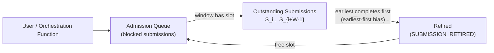
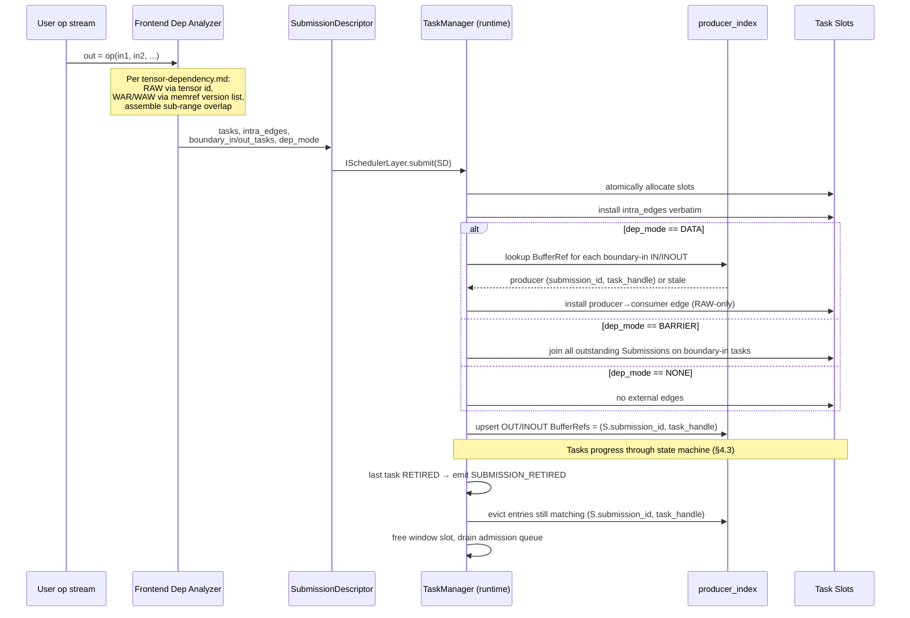

# 4. Process View

This view describes the Simpler runtime's behavior at runtime — concurrency, communication, synchronization, and data flow.

---

## 4.1 Concurrency Model

### 4.1.1 Thread Architecture

The runtime uses a hierarchical thread model aligned with the Layer Stack:

| Machine Level | Thread Type | Count | Role |
|--------------|------------|-------|------|
| `"Host"` | Host process threads | `scheduler_thread_count` (default 1) + `worker_thread_count` (default 1) | Run HostScheduler loop; execute Host Functions |
| `"Device"` | AICPU orchestration threads | `worker_thread_count` (default 4 on a2a3) | Execute Orchestration Functions on AICPU |
| `"Chip"` | AICPU scheduler thread | `scheduler_thread_count` (default 1) | Run AicpuScheduler: dispatch tasks to AICores |
| `"Core"` | AICore hardware pipeline | `worker_count` (72 on a2a3, 108 on a5) | Execute AICore Functions (hardware execution, not OS threads) |
| `"Pod"` (distributed) | Host threads | `scheduler_thread_count` + network I/O threads | Run DistributedScheduler; handle network messages |

Each level's Scheduler runs its event loop (§4.1.4) in its own thread(s). In **Dedicated** deployment mode, Worker threads are separate from Scheduler threads — this separation prevents worker execution from blocking the Scheduler's event loop. In **Interleaved** mode (§2.1.3.6 in Logical View), a single thread alternates between Scheduler and Worker roles under `IExecutionPolicy` control.

### 4.1.2 Synchronization Mechanisms

| Boundary | Mechanism | Details |
|----------|-----------|---------|
| Scheduler ↔ Workers (same level) | `IEventQueue` (lock-free ring) | MPSC (multiple worker completion producers) or SPSC (single scheduler). Events delivered via queue or polled from hardware (§2.1.3.5) |
| Parent ↔ Child level | Vertical Channel implementation | Register Bank (Chip→Core), shared memory (Device→Chip), DMA+MMIO (Host→Device) |
| Sibling ↔ Sibling | Horizontal Channel implementation | TPUSH/TPOP (Core↔Core), RDMA (Pod level) |
| Task dependency tracking | Atomic fan-in counters | Per-task counter decremented on predecessor completion (lock-free; paired with the dep-metadata lock below when the counter is first installed) |
| Cross-Submission dep metadata | Per-Layer RW lock (or per-shard equivalent) on `producer_index`; atomic RMW on fan-in counters | Taken by `DATA`-mode admission (shared or exclusive for lookup + upsert + fan-in install) and by `SUBMISSION_RETIRED` eviction (exclusive). `BARRIER` mode takes only an atomic snapshot of the outstanding-Submission set; `NONE` mode takes nothing. Under single-threaded Stage B the event loop serializes access and the lock is uncontended. See [02 §2.1.3.1.B](02-logical-view/02-scheduler.md#2131b-dependency-resolution-per-submission), [02 §2.10.4](02-logical-view/12-dependency-model.md#2104-dependency-maintenance). |
| Scope management | Scope depth counter + ring layer index | Per-level scope tracking with scope-exit token |

### 4.1.3 Synchronous vs Asynchronous Processing

Task state transition handlers can operate in two modes, corresponding to the **inline** and **deferred** event handling modes defined in the Scheduler's event-driven model (§2.1.3.5 in Logical View):

**Synchronous (Inline):** Handler runs immediately within the Scheduler's event loop iteration. Follow-on events are available for processing in subsequent iterations.

**Asynchronous (Deferred):** Event is placed in the Scheduler's internal pending queue. The handler executes when the pending queue is drained at a policy-determined point (e.g., after collecting all external events). Queue types for external event delivery:
- Bounded MPSC ring (multiple producers from completion paths).
- SPSC (single scheduler thread).

Configuration: per event type × per Machine Level via `EventHandlingConfig` in `LevelParams`.
Default: internal follow-on events inline, external completion events via queue.

### 4.1.4 Scheduler Event Loop

The Scheduler is structured as an **event loop** (see §2.1.3.5 in Logical View) that is the sole entry point for all state machine transitions. The loop runs on the Scheduler's dedicated thread(s).

#### Event Loop Structure

```
Scheduler Thread
│
├─ INIT: register event sources (queues, poll-based)
│
└─ LOOP:
    │
    ├─ 1. COLLECT: for each registered IEventSource
    │   ├── QUEUE sources: dequeue all pending events
    │   └── POLL sources: call poll() to check hardware flags
    │
    ├─ 2. DISPATCH: for each collected event
    │   ├── INLINE events: invoke handler immediately
    │   └── DEFERRED events: push to internal pending queue
    │
    ├─ 3. PROCESS DEFERRED: drain the pending queue
    │   └── invoke handlers for all deferred events
    │
    ├─ 4. EXECUTION POLICY: call IExecutionPolicy.next_action()
    │   ├── CONTINUE_SCHEDULING → go to step 1
    │   ├── EXECUTE_TASK → run one ready task inline, then go to step 1
    │   └── YIELD → wait (busy-wait, sleep, or signal-wait per config)
    │
    └─ (repeat)
```

#### Event Sources per Level

| Machine Level | Primary Event Sources | Delivery Mode |
|---------------|----------------------|---------------|
| `"Core"` | AICore COND registers (completion flags) | Poll |
| `"Chip"` | AICPU completion queue; ring buffer from Device level | Queue |
| `"Device"` | Worker thread completion queue; shared memory channel from Host | Queue |
| `"Host"` | Device completion interrupts/queue; Python submission queue | Queue |
| `"Pod"` | Network I/O completion; Host-level completion queue | Queue |

Internal events (e.g., DEP_SATISFIED generated by a completion handler) are always handled inline within the same loop iteration that produced them, unless explicitly configured as deferred.

#### Deployment Modes at Runtime

The `IExecutionPolicy` (§2.6.4 in Logical View) determines how the physical execution unit splits time between scheduling and task execution:

| Mode | IExecutionPolicy | Behavior | Used At |
|------|-----------------|----------|---------|
| **Dedicated** | `DedicatedExecutionPolicy` | Scheduler thread never executes tasks; Workers are separate threads or hardware units. `next_action()` always returns `CONTINUE_SCHEDULING`. | Host, Core (hardware Workers) |
| **Interleaved** | `InterleavedExecutionPolicy` | After draining events, executes one ready task inline before returning to the event loop. | Device (AICPU — limited threads) |
| **Batched** | `BatchedExecutionPolicy` | Accumulates N ready tasks, executes all inline, then returns to scheduling. Reduces context-switch overhead. | Chip (batch dispatch to cores) |

> [UPDATED: A1-P12: Pin `Dedicated` as the default IExecutionPolicy; `BatchedExecutionPolicy` must be explicit.]
> `Dedicated` is the default `IExecutionPolicy` at every level (including Chip). No path silently enables `BatchedExecutionPolicy`; it is opt-in via deployment config. When Batched is active, `BatchedExecutionPolicy.max_batch` default = 8 at Chip level and tail latency for a batched task ≤ `max_batch × Chip→Core stage` (≤ 16 μs at `max_batch = 8`). §4.8.1 uses the adjusted stage target whenever Batched is active.

This flexibility allows the same Scheduler implementation to operate efficiently across different hardware contexts without code changes — only the `IExecutionPolicy` and `IEventSource` registrations differ.

#### Thread Safety Guarantees

- The event loop is **single-threaded** within one Scheduler instance (even if `scheduler_thread_count > 1`, each thread runs an independent partition of the event space).
- External producers (Workers, Channels) interact with the Scheduler **only** through `IEventQueue.try_enqueue()` or by writing to hardware registers that are polled. No direct method calls cross the thread boundary.
- The deferred pending queue is internal to the event loop thread — no synchronization needed.

---

## 4.2 Key Interaction Flows

### 4.2.1 Hierarchical Task Submission (Single-Node)

```
User Python
  │
  │  submit(orch_func, tensors)
  ▼
"Host" Scheduler
  │  TaskManager: alloc slot → SUBMITTED → PENDING → DEP_READY
  │  TaskManager: ITaskSchedulePolicy.rank_ready_tasks()
  │  ResourceManager: IResourceAllocationPolicy.allocate_resources()
  │    → query IMemoryManager (DMA buffer) + WorkerManager (Device₀)
  │  WorkerManager: IWorkerSelectionPolicy.select_worker() → Device₀
  │    → dispatch via Vertical Channel (DMA Control)
  │    → Device₀ Worker: IDLE → ASSIGNED → EXECUTING
  ▼
"Device" Scheduler
  │  AICPU Thread₀ (Worker: EXECUTING) runs orch_func body:
  │    TaskManager.submit(compute_A, ...)  ──→ child task
  │    TaskManager.submit(compute_B, deps=[A])  ──→ child task
  │  orch_func returns
  │  Worker: EXECUTING → COMPLETING (waiting for children)
  │  Task state → COMPLETING
  │  (via Vertical Channel: SharedMemory writes)
  ▼
"Chip" Scheduler
  │  TaskManager: compute_A DEP_READY
  │  ResourceManager: allocate core + buffer
  │  WorkerManager: IWorkerSelectionPolicy.select_worker() → AICore₀
  │    → dispatch via RegisterBank ACK/FIN
  │    → AICore₀ Worker: IDLE → ASSIGNED → EXECUTING
  │  compute_A completes → WorkerManager: AICore₀ → IDLE
  │    → TaskManager.notify_dep_satisfied(compute_B)
  │  compute_B dispatched to AICore₁ (same flow)
  │  compute_B completes → TaskManager.notify_child_complete(parent)
  │
  ▲  parent Task (at "Device") transitions COMPLETING → COMPLETED → RETIRED
  │  Device Worker: COMPLETING → IDLE
  │  propagates completion to "Host" via Vertical Channel
  ▲
"Host" → WorkerManager: Device₀ Worker → IDLE
"Host" → TaskManager: task COMPLETED → RETIRED
"Host" → Python: task.result() returns
```

### 4.2.2 Distributed Task Submission (Multi-Node)

```
User Python
  │  submit(distributed_orch_func, tensors)
  ▼
"Pod" Scheduler (Coordinator Node)
  │  Apply partition strategy → Node₀ gets partition A, Node₁ gets partition B
  │  Send REMOTE_SUBMIT to Node₁ via Horizontal Channel
  │  Submit local partition to own "Host" Scheduler via Vertical Channel
  │
  ├─────────────────────────────────────────────────┐
  │                                                 │
  ▼ Node₀                                          ▼ Node₁
"Host" Scheduler                              "Host" Scheduler
  │ → "Device" → "Chip" → "Core"                │ → "Device" → "Chip" → "Core"
  │   (local hierarchical execution)              │   (local hierarchical execution)
  │                                               │
  │  compute completes                            │  compute completes
  │  notify_child_complete → "Pod"                │  send REMOTE_COMPLETE → Coordinator
  │                                               │
  ◄───────────────────────────────────────────────┘
  │
"Pod" Scheduler: all children complete → Task COMPLETED
  │
  ▼
Python: task.result() returns
```

### 4.2.3 Cross-Node Data Movement

```
Node₀ "Pod" Scheduler                    Node₁ "Pod" Scheduler
  │                                          │
  │ Submit DataMovement Task                 │
  │ (tensor T from Node₀ → Node₁)           │
  ▼                                          │
IMemoryOps.copy_to_peer(1, T_src, T_dst)    │
  │                                          │
  │ RDMA_WRITE → ────────────────────────→   │
  │                                          │ RDMA completion
  │                                          │
  │ ◄──── REMOTE_DATA_READY ────────────     │
  │                                          │
  │ DataMovement Task COMPLETED              │
  │ notify_dep_satisfied(consumer_task)       │
```

### 4.2.4 Function Registration and Caching Flow

```
Python: register_aicore_func(name, binary)
  │
  ▼
"Host" Function Registry: store {func_id, binary, content_hash}
  │
  │ On first Task targeting "Device":
  │   Transfer binary to Device via DMA
  │   Device Function Cache: store {content_hash → binary_ptr}
  │
  │ On subsequent Tasks with same content_hash:
  │   Cache hit → skip transfer
  │
  │ For distributed (REMOTE_SUBMIT to Node₁):
  │   Check if Node₁ cache has content_hash
  │   If not: include binary in REMOTE_SUBMIT message
  │   If yes: reference by content_hash only
```

> [UPDATED: A1-P3: Function Cache is bounded and LRU; cache presence advertised via HEARTBEAT Bloom filter.]
> The per-node Function Cache is bounded by `function_cache_bytes` (default **64 MiB**) and evicts LRU. Evictions are counted in `RuntimeStats` and surfaced by A8-P5 alert rules. Peer cache presence is published in `HeartbeatPayload.function_bloom[4]` (`uint64_t[4]`); the coordinator Bloom-checks the target before deciding whether to inline a binary in `REMOTE_SUBMIT`.
>
> [UPDATED: A1-P6: Function binaries stage over `REMOTE_BINARY_PUSH`, not inlined in `REMOTE_SUBMIT`.]
> When the Bloom check (A1-P3) indicates a peer does **not** hold the binary for `content_hash`, the coordinator issues `MessageType::REMOTE_BINARY_PUSH` **before** the first `REMOTE_SUBMIT` that needs it. `RemoteSubmitPayload` carries only `uint32_t descriptor_template_id` + delta-encoded `TaskDescriptor[]` against a per-peer template registry (see `modules/transport.md §2.3` / `§4.3`). Per-peer projection (absorbed A10-P5) emits only tasks/edges/boundaries touching that peer subset; a shared `correlation_id` lets `REMOTE_DEP_NOTIFY` still join across peers.

---

## 4.3 Task State Machine

The task state machine is **uniform across all layers**. Every Task progresses through the same states, though not all transitions are meaningful at every level.

> [UPDATED: A3-P14: Leaf workers (AICore and any other non-orchestrator executor) take the `EXECUTING → COMPLETED` skip edge, bypassing `COMPLETING`.]
> Orchestration Tasks still transition `EXECUTING → COMPLETING → COMPLETED` because they wait on children. Leaf Tasks with no children (AICore compute, data-movement, barrier) transition directly `EXECUTING → COMPLETED`. §4.3.5 level-specific table records which layers take the skip edge via the `Skip COMPLETING?` column.

### 4.3.1 State Transition Diagram

```
    ┌──────────┐
    │   FREE   │ ◄──── slot recycled
    └────┬─────┘
         │ alloc_task_slot()
         ▼
    ┌──────────┐
    │SUBMITTED │
    └────┬─────┘
         │ register deps
         ▼
    ┌──────────┐
    │ PENDING  │ ◄──── waiting for predecessors
    └────┬─────┘
         │ all deps completed (including remote deps acknowledged)
         ▼
    ┌──────────┐
    │DEP_READY │
    └────┬─────┘
         │ memory/cores/network buffers allocated
         ▼
    ┌──────────────┐
    │RESOURCE_READY│
    └────┬─────────┘
         │ payload written to lower layer or remote node
         ▼
    ┌──────────┐
    │DISPATCHED│
    └────┬─────┘
         │ Worker begins execution
         ▼
    ┌──────────┐
    │EXECUTING │ ────────────┐
    └────┬─────┘             │ (leaf worker, no children: skip COMPLETING)
         │ Function body     ▼
         │ returns       (→ COMPLETED)
         ▼
    ┌───────────┐
    │COMPLETING │ ◄──── waiting for child Tasks (if any)
    └────┬──────┘
         │ all children COMPLETED (child_pending_count == 0)
         ▼
    ┌──────────┐
    │COMPLETED │ ──── results available, notify dependents (local + remote)
    └────┬─────┘
         │ resources freed, profiling flushed
         ▼
    ┌──────────┐
    │ RETIRED  │ ──── slot eligible for recycling
    └──────────┘
```

### 4.3.2 Transition Handlers

Each handler is owned by a specific sub-component. Policy hooks are invoked at marked decision points.

| Handler | Owner | Trigger | Actions | Policy Hook |
|---------|-------|---------|---------|-------------|
| `on_submit_submission(submission)` | TaskManager | Submission accepted (§2.4.A in Logical View) | Check Outstanding Submission Window; if admitted, atomically allocate Task slots for every task in the Submission, install `intra_edges`, resolve `dep_mode` into external edges attached only to `boundary_in_tasks`, request Group Workspace via `IMemoryManager::alloc_workspace` if `workspace_request` is set; assign monotonic `submission_id` | `IResourceAllocationPolicy.should_admit()` |
| `on_submit(task)` | TaskManager | Task accepted (within an admitted Submission) | Validate args, register deps, alloc slot, check parent linkage | `ITaskSchedulePolicy.on_task_state_change()` |
| `on_dep_ready(task)` | TaskManager | All predecessors done | Invoke policy for ready queue ordering (default: earliest `submission_id` first to preserve window forward progress); request resources from ResourceManager | `ITaskSchedulePolicy.rank_ready_tasks()` |
| `on_resource_ready(task)` | ResourceManager | Memory + worker available | Allocate buffer via `IMemoryManager`; reserve worker(s) via WorkerManager (group-aware for `requires_worker_group` tasks, §2.1.4.2) | `IResourceAllocationPolicy.allocate_resources()` |
| `on_dispatch(task)` | WorkerManager | Task dispatched to Worker(s) | Resolve `TaskExecType` from `exec_type_id` (§2.4.8); select worker(s) via policy — for `requires_worker_group` tasks, find a WorkerGroup satisfying all `required_slots`; write dispatch payload; Worker(s) → ASSIGNED; update per-group availability | `IWorkerSelectionPolicy.select_workers()` |
| `on_completion(task)` | TaskManager (via WorkerManager) | Worker(s) report completion | Worker(s) → IDLE; restore per-group availability; notify dependents (local + remote), notify parent if child | `IWorkerSelectionPolicy.on_worker_state_change()` |
| `on_retire(task)` | TaskManager + ResourceManager | Resources freed | Release buffer to `IMemoryManager`; flush profiling; recycle slot | `IResourceAllocationPolicy.on_resource_change()` |
| `on_submission_retired(submission)` | TaskManager | Last task in a Submission reaches RETIRED | Emit `SUBMISSION_RETIRED`; call `IMemoryManager::free_workspace` if the Submission held a Group Workspace; decrement `outstanding_submissions`; drain the admission queue until the window fills or the queue empties | `IResourceAllocationPolicy.on_resource_change()` |

### 4.3.3 Hierarchical Task Completion

When an Orchestration Task enters EXECUTING, its Function body calls `scheduler.submit(child_task)`. The parent Task transitions to COMPLETING only after:
1. Its Function body returns, AND
2. All submitted children have COMPLETED.

Child completion triggers `parent.on_child_complete()` which decrements the parent's pending child counter. When it reaches 0, the parent transitions COMPLETING → COMPLETED.

### 4.3.4 Task Slot Management

Per-layer pre-allocated task slot pool:

```
Slot lifecycle: FREE → ALLOCATED → IN_USE → RECYCLED → FREE
```

- Generation counter (monotonic increment per reuse) detects stale handles.
- `TaskHandle = {slot_index, generation}` — validated on every access.
- Pool size configurable per layer.

### 4.3.5 Worker State Machine

The Worker state machine is **uniform across all layers** and managed by the WorkerManager (§2.1.3.2 in Logical View). It tracks the lifecycle of each Worker within a Layer's worker pool.

#### State Transition Diagram

```
    ┌──────────┐
    │   IDLE   │ ◄──────────────────────────────┐
    └────┬─────┘                                │
         │ WorkerManager.on_assign(worker, task)│
         ▼                                      │
    ┌──────────┐                                │
    │ ASSIGNED │                                │
    └────┬─────┘                                │
         │ Worker confirms execution started    │
         ▼                                      │
    ┌──────────┐                                │
    │EXECUTING │                                │
    └────┬─────┘                                │
         │ Function body returns                │
         ├──────────────────────┐               │
         ▼                      ▼               │
    ┌───────────┐          ┌────────┐           │
    │COMPLETING │          │ FAILED │           │
    └────┬──────┘          └───┬────┘           │
         │ all children done   │                │
         │                     ▼                │
         │               ┌────────────┐         │
         │               │ RECOVERING │         │
         │               └────┬───────┘         │
         │                    │                 │
         │           ┌────────┴────────┐        │
         │           ▼                 ▼        │
         │     ┌─────────────┐    (recovered)───┘
         │     │ UNAVAILABLE │
         │     └─────────────┘
         │
         └──────────────────────────────────────┘
```

#### Transition Handlers (owned by WorkerManager)

| Handler | Trigger | Actions | Policy Hook |
|---------|---------|---------|-------------|
| `on_assign(worker(s), task)` | ResourceManager reserves worker(s) | Write dispatch payload to assigned Worker(s); start timeout timer; Worker(s) → ASSIGNED; update per-group availability (§2.1.4.2) | `IWorkerSelectionPolicy.select_workers()` |
| `on_execute(worker)` | Worker ACK (register, signal) | Record execution start timestamp; Worker → EXECUTING | `IWorkerSelectionPolicy.on_worker_state_change()` |
| `on_complete(worker(s), task)` | Function done + children done | Report to TaskManager; release Worker(s); Worker(s) → IDLE; restore per-group availability | `IWorkerSelectionPolicy.on_worker_state_change()` |
| `on_fail(worker, error)` | Timeout or hardware fault | Create ErrorContext; Worker → FAILED → RECOVERING; update per-group availability (group capacity reduced) | `IWorkerSelectionPolicy.on_worker_state_change()` |
| `on_recover(worker)` | Cleanup complete | Worker → IDLE (recoverable) or UNAVAILABLE (permanent); update per-group availability | `IWorkerSelectionPolicy.on_worker_state_change()` |

#### Group-Level Availability Derivation

For levels with Worker Groups (§2.1.4.2), the WorkerManager maintains a **per-group availability index**: for each Worker Group, the count of IDLE workers per Worker Type. This index is updated on every Worker state transition and is provided to `IWorkerSelectionPolicy.select_workers()` and `IResourceAllocationPolicy.allocate_resources()` via `WorkerGroupAvailability` (§2.6.3 in Logical View).

A Worker Group's capacity for a given `TaskExecType` is determined by:
1. For each `required_slots` entry `{worker_type_id, count}`, check that the group has ≥ `count` IDLE Workers of that type.
2. If **all** slots are satisfiable, the group can accept the Task.

This derivation is O(G × S) where G = number of groups and S = number of slots — efficient for typical configurations (24 groups × 2 slot types).

#### Level-Specific Notes

| Level | Worker Types | Grouping | ASSIGNED Duration | COMPLETING Applicable? | Skip COMPLETING? (A3-P14) | Failure Detection |
|-------|-------------|----------|-------------------|----------------------|-------------------------|-------------------|
| `"Core"` | AIC, AIV (heterogeneous) | Core Wraps (1 AIC + 2 AIV) | Register write → ACK | No (leaf executor) | Yes — leaf; `EXECUTING → COMPLETED` | COND register timeout |
| `"Chip"` | AICore cluster (logical) | None (flat pool) | Dispatch payload write | No | Yes — leaf aggregator; `EXECUTING → COMPLETED` when the dispatched cores terminate | Aggregate core failures |
| `"Device"` | AICPU thread | None (homogeneous) | Thread wakeup | Yes (orchestration children) | Only when submitted Task has no children | Thread exit detection |
| `"Host"` | Device worker | None (homogeneous) | DMA setup | Yes (device-level children) | Only when submitted Task has no children | DMA timeout |
| `"Pod"` | Node worker | None (homogeneous) | Network message | Yes (remote children) | Only when submitted Task has no children | Heartbeat timeout |

---

## 4.4 Task Taxonomy

Individual **Tasks** classify by the kind of work they perform:

| Task Type | Description | Layer |
|-----------|-------------|-------|
| **Compute Task** | AICore kernel execution (leaf) | Core, Chip |
| **Orchestration Task** | Control flow that submits children | Chip, Device |
| **Data Movement Task** | DMA/copy within a node | Any |
| **Distributed Data Movement Task** | Cross-node transfer (RDMA, network) | Pod+ |
| **Barrier Task** | Sync point within a layer | Any |
| **Distributed Barrier Task** | Cross-node sync | Pod+ |

**Submissions** (§2.4.A in Logical View) classify by how tasks are grouped at admission:

| Submission Kind | Description | Typical Use |
|-----------------|-------------|-------------|
| **Single** | Exactly one Task; no intra-Submission edges. | Ordinary one-shot launch. |
| **Group** | Pre-built intra-Submission DAG of N tasks; caller supplies edges and boundary classification. External dep edges are attached only to boundary-in tasks. | Fused operator blocks; compiler-emitted op graphs. |
| **SPMD** | Specialization of Group: N sub-tasks of the same Function, typically with no intra-Submission edges. | Data-parallel fan-out. |

A Submission's **Dependency Mode** (`BARRIER` / `DATA` / `NONE`, §2.4.B in Logical View) is orthogonal to its kind and governs how it relates to previously admitted Submissions; see §4.5.5 below.

---

## 4.5 Dependency Model

### 4.5.1 Intra-Layer DAG

Task → task edges within the same layer:
- Fan-in counter per task (decremented on predecessor completion).
- Fan-out list per task (successors to notify).

### 4.5.2 Cross-Layer Parent-Child

- Parent at layer N, children at layer N−1.
- Parent COMPLETING state guards on child completion.

### 4.5.3 Cross-Node Dependencies

- Remote dep edges tracked via `REMOTE_DEP_NOTIFY` messages.
- Each remote dep has a `{source_node, task_id}` pair.

### 4.5.4 Scope-Based Dependencies

All tasks in a scope must complete before the scope exit task runs.

### 4.5.5 Per-Submission Dependency Modes

Each Submission (§2.4.A in Logical View) carries a `dep_mode` that governs how its boundary-in tasks are tied to Tasks in previously admitted, not-yet-retired Submissions. Intra-Submission edges (`intra_edges`) are always installed regardless of mode.

| Mode | TaskManager action at admission | Cost | When to use |
|------|---------------------------------|------|-------------|
| `BARRIER` | Join every boundary-in task on the completion of all outstanding prior Submissions (implemented with one barrier token per prior Submission). | O(W + B) edges. | Submission is an explicit synchronization point (e.g., end-of-iteration collective, checkpoint). |
| `DATA` | For each boundary-in task, scan `IN`/`INOUT` tensors; attach a producer→consumer edge for every tensor whose `BufferRef` matches an output of a Task in an outstanding Submission. | O(B × A). | Default. Lets true producer→consumer parallelism flow while preserving correctness. |
| `NONE` | Install no external edges. Intra-group edges still apply. | O(1). | Streams of provably independent work (e.g., data-loader submissions, independent micro-batches). Caller-asserted. |

```mermaid
flowchart LR
    subgraph outstanding [Outstanding Submissions]
        S0[S_i]
        S1[S_{i+1}]
        S2[S_{i+2}]
    end
    Snew[new Submission S_k]
    S0 -->|"BARRIER: wait for all"| Snew
    S1 -->|"BARRIER: wait for all"| Snew
    S2 -->|"BARRIER: wait for all"| Snew
    S1 -. "DATA: only if S_k reads tensors produced by S_{i+1}" .-> Snew
    Snew -. "NONE: no edges installed" .- Snew
```

The diagram shows which prior Submissions contribute edges under each mode. Under `DATA`, only those prior Submissions whose outputs are actually read by `S_k`'s boundary-in tasks contribute. Under `NONE`, the Submission has no external fan-in.

### 4.5.6 Outstanding Submission Window

The Scheduler maintains a per-Layer **Outstanding Submission Window** that bounds how many Submissions are concurrently in-flight (not individual tasks). This decouples submission pressure from per-task back-pressure and bounds:
- the cost of the `DATA`-mode scan (proportional to window depth),
- the lifetime of entries in the `BufferRef → producer_task` index,
- worst-case dependency-fan-in at BARRIER submissions.



**Mechanics**
- The window holds at most `max_outstanding_submissions` (per-Layer `LevelParams`).
- When full, `submit()` enqueues the Submission on the admission queue (or returns a back-pressure status per `IResourceAllocationPolicy.should_admit`, §2.6.3 in Logical View).
- A `SUBMISSION_RETIRED` event (§2.1.3.5 in Logical View) fires when the last Task in a Submission reaches RETIRED; on that event the window opens by one and the oldest queued Submission is admitted.
- The default `ITaskSchedulePolicy` (`FifoTaskSchedulePolicy`) biases ready-queue ordering by ascending `submission_id` so the earliest outstanding Submission tends to retire first — this is what keeps the admission queue draining instead of stalling behind a long-running later Submission.

### 4.5.7 Group Submission Workspace Lifetime

When a Group Submission has non-boundary tensors, the Scheduler requests a **Group Workspace** (§2.4.D in Logical View) from `IMemoryManager::alloc_workspace` at admission and releases it via `IMemoryManager::free_workspace` on `SUBMISSION_RETIRED`. Non-boundary tensors exposed to Tasks as `BufferRef`s obtained from `workspace_subrange` are only valid between admission and retirement of the owning Submission; the runtime relies on boundary classification to ensure no valid reference escapes.

### 4.5.8 Dependency Construction Pipeline

Dependencies flowing through a Submission are constructed in two stages — one frontend, one runtime — meeting at the `SubmissionDescriptor`. See [Logical View §2.10](02-logical-view/12-dependency-model.md) for the normative contract.



| Stage | Owner | Purpose |
|---|---|---|
| Frontend analysis | Tracer / DSL / compiler above `bindings/` | Convert user op stream into a `SubmissionDescriptor` with **all** intra-Submission RAW / WAR / WAW / assemble edges pre-built in `intra_edges`, and accurate `boundary_in_tasks` / `boundary_out_tasks` masks ([`tensor-dependency.md`](../../tensor-dependency.md) — workspace root). |
| Runtime admission | `TaskManager` (§2.1.3.1.B) | Install `intra_edges` verbatim; resolve `dep_mode` into cross-Submission RAW edges via the single-valued `producer_index`; upsert `OUT`/`INOUT` `BufferRef` → producer mappings. |
| Runtime retirement | `TaskManager` on `SUBMISSION_RETIRED` (§2.1.3.5) | Walk the retired Submission's outputs and evict `producer_index` entries that still identify Tasks in the retired Submission; free the window slot. |

**v1 limits.** Cross-Submission WAR / WAW and assemble-style sub-range overlap analysis are **not** performed by the runtime. The frontend MUST capture these hazards intra-Submission via `intra_edges`; the runtime relies on the [non-aliasing intermediate-memref invariant](02-logical-view/04-memory.md#216-memory-manager) to ensure no cross-Submission WAR / WAW arises through memory reuse. See [§2.10.6](02-logical-view/12-dependency-model.md#2106-scope-limits-v1) and [09-open-questions.md](09-open-questions.md).

---

## 4.6 Distributed Scheduling Protocol

### 4.6.1 Message Types

| Message | Direction | Payload |
|---------|-----------|---------|
| `REMOTE_SUBMIT` | Coordinator → Target | Serialized TaskDescriptor, parent info |
| `REMOTE_DEP_NOTIFY` | Source → Dependent | Completed TaskHandle, output metadata |
| `REMOTE_COMPLETE` | Target → Coordinator | TaskHandle, output summary, profiling |
| `REMOTE_DATA_READY` | Source → Consumer | Global Address of transferred data |
| `REMOTE_ERROR` | Any → Coordinator | Serialized ErrorContext |
| `HEARTBEAT` | Bidirectional | Node status, load metrics |

### 4.6.2 Remote Task Lifecycle

1. Coordinator decides target node via partition strategy.
2. Coordinator sends `REMOTE_SUBMIT` with serialized task descriptor.
3. Target node allocates local task slot, runs normal FSM.
4. On completion, target sends `REMOTE_COMPLETE` to coordinator.
5. On error, target sends `REMOTE_ERROR` with error context.

### 4.6.3 Consistency Guarantee

**Causal consistency** per task chain: if Task A completes before Task B is submitted and B depends on A, then B observes A's outputs. Enforced by dependency tracking and `REMOTE_DEP_NOTIFY` protocol. Cross-chain ordering is eventual.

> [UPDATED: A5-P1: Remote retries use exponential backoff with jitter, capped at `max_ms = 2000`.]
> `RetryPolicy { base_ms = 50, max_ms = 2000, jitter = 0.3, max_retries = 5 }`. The n-th retry waits `min(max_ms, base_ms · 2^n) · (1 + U[-jitter, +jitter])`. A8-P5 alert rule surfaces an SLO breach at `n = 4`. Authoritative definition in `modules/distributed.md`.
>
> [UPDATED: A5-P3: v1 deterministic coordinator fail-fast; add `coordinator_liveness_timeout_ms`.]
> v1 is fail-fast: every surviving peer surfaces `CoordinatorLost` within `heartbeat_timeout_ms`; the Python driver observes `DistributedError` with no silent hang. Config knob **`coordinator_liveness_timeout_ms < heartbeat_timeout_ms`**, default **`3 × heartbeat_interval_ms`**. Scope is pinned to the failed Pod only; `cluster_view` generation bumps to the surviving-coordinator list (no cluster-wide fail-closed). v2 decentralization roadmap is recorded as an ADR-005 extension (see A10-P2 / A5-P3).
>
> [UPDATED: A7-P5: `distributed_scheduler` links only against `core::ISchedulerLayer`.]
> The distributed-scheduler implementation depends on `core/`'s `ISchedulerLayer` (plus role interfaces from A7-P2) rather than on `scheduler/`'s `TaskManager`/`WorkerManager`/`ResourceManager`. Shared machinery lifts to `scheduler/core/` abstract base if needed. This upholds ADR-008 and the layered DAG restated in §3.2 of `03-development-view.md` (A7-P1).

---

## 4.7 Error Handling Flows

### 4.7.1 Error Taxonomy

| Category | Examples |
|----------|---------|
| `HardwareFault` | Device failure, memory corruption |
| `RuntimeError` | Invalid state transition, resource exhaustion |
| `UserError` | Invalid arguments, unsupported operation |
| `Timeout` | Remote call timeout, device operation timeout |
| `ResourceExhausted` | Task slot pool full, memory full |
| `InternalError` | Assertion failure, unexpected state |
| `CommunicationError` | Network failure, message loss |
| `RemoteNodeFailure` | Remote node crash or unresponsive |
| `PartialDistributedFailure` | Some nodes fail, others operational |

### 4.7.2 Error Code System

32-bit integer: `[domain:8][severity:4][code:20]`

Domains: `hal`, `core`, `scheduler`, `memory`, `transport`, `distributed`, `profiling`.

### 4.7.3 Error Context

```cpp
struct ErrorContext {
    uint32_t    error_code;
    std::string message;
    SourceLocation source_location;
    TaskKey     task_key;        // which task failed
    LayerId     layer_id;        // which layer
    uint32_t    device_id;
    uint32_t    core_id;
    NodeId      node_id;         // which node (distributed)
    uint64_t    timestamp;
    std::string stack_trace;     // optional
    std::vector<ErrorContext> remote_error_chain;  // errors from child nodes
};
```

### 4.7.4 Propagation Paths

**Intra-node vertical:** AICore → AICPU → Host → Python
- AICore: write error register, halt.
- AICPU: error codes + shared memory signaling.
- Host: try/catch + error return codes at C API boundary.
- Python: mapped to `simpler.*Error` exceptions.

**Cross-layer:** Child task error propagates to parent task at upper layer. Multiple child failures are aggregated into the parent's error context.

**Cross-node horizontal:** `REMOTE_ERROR` message carries `ErrorContext` to originating node. Fan-in errors from multiple child nodes are aggregated.

### 4.7.5 Fatal vs Recoverable

| Classification | Behavior | Distributed Impact |
|---------------|----------|--------------------|
| **Fatal** | Hardware fault, memory corruption → immediate shutdown | Propagate to all nodes |
| **Recoverable** | Timeout, resource busy → retry or skip | Local handling |
| **Partial failure** | Some nodes fail in distributed mode | Policy: abort all, continue reduced, or retry on alternate node |

### 4.7.6 Python Exception Mapping

| Runtime Error | Python Exception |
|--------------|-----------------|
| `RuntimeError` | `simpler.RuntimeError` |
| `HardwareFault` | `simpler.DeviceError` |
| `RemoteNodeFailure` | `simpler.DistributedError` |
| `Timeout` | `simpler.TimeoutError` |
| `UserError` | `simpler.ValueError` |

---

## 4.8 Latency Budgets (Rule X9)

Every critical path must have an end-to-end latency target decomposed into per-stage budgets. These budgets are design targets that guide implementation choices and serve as acceptance criteria during profiling.

### 4.8.1 Single-Node Kernel Dispatch (Host → AICore Execution Start)

**End-to-end target:** < 15 μs (Host `submit()` to AICore begins executing)

| Stage | Budget | Mechanism | Notes |
|-------|--------|-----------|-------|
| Python → C API boundary | < 0.5 μs | nanobind call overhead | GIL released before runtime entry |
| Host Scheduler: submit → DEP_READY | < 1 μs | Atomic fan-in check; pre-allocated task slot | No allocation on hot path (Rule X2) |
| Host Scheduler: DEP_READY → DISPATCHED | < 5 μs | DMA descriptor write + MMIO signal to AICPU | Batched DMA descriptors; pre-registered memory |
| Device Scheduler: receive → dispatch to Chip | < 3 μs | Shared memory write to Chip Scheduler queue | Lock-free SPSC ring (Rule X3) |
| Chip Scheduler: receive → Register Bank write | < 2 μs | Register Bank ACK/FIN protocol | Direct MMIO; no queue |
| AICore: detect dispatch → begin execution | < 1 μs | Polling loop on DATA_MAIN_BASE register | Hardware polling; no OS scheduling |
| **Margin** | 2.5 μs | | Absorbs variance from cache misses, AICPU scheduling |

### 4.8.2 Cross-Node Task Submission (Pod Scheduler → Remote Node Execution Start)

**End-to-end target:** < 50 μs (Pod `submit()` to remote AICore begins executing)

| Stage | Budget | Mechanism | Notes |
|-------|--------|-----------|-------|
| Pod Scheduler: partition decision | < 2 μs | IPartitioner lookup | Pre-computed locality tables |
| REMOTE_SUBMIT serialization + send | < 5 μs | RDMA write or TCP send | Pre-registered RDMA buffers |
| Network transit | < 5 μs | RDMA: 1–5 μs; TCP: 5–50 μs | RDMA preferred within Pod |
| Remote node: deserialize + local submit | < 3 μs | Zero-copy deserialization where possible | |
| Remote node: Host → AICore (local path) | < 15 μs | Same as §4.8.1 | |
| **Margin** | 20 μs | | Absorbs network jitter, TCP fallback |
| First-use template-miss (cold start, A1-P6) | ≤ 15 μs | One-off `descriptor_template_id` install on the peer's template registry | Applies only on the first `REMOTE_SUBMIT` for a new template; subsequent sends reuse the registered id. |

### 4.8.3 Task Completion Path (AICore Done → Python Result Available)

**End-to-end target:** < 10 μs (AICore FIN → Python `task.result()` returns)

| Stage | Budget | Mechanism | Notes |
|-------|--------|-----------|-------|
| Core → Chip: FIN register detection | < 1 μs | Polling on COND register | Configurable poll interval |
| Chip Scheduler: notify_dep_satisfied + notify_child_complete | < 2 μs | Atomic counter decrement; async completion handler | |
| Device → Host: completion propagation | < 3 μs | Shared memory + DMA completion signal | |
| Host Scheduler: COMPLETED → RETIRED | < 1 μs | Profiling flush; slot recycle | |
| C API → Python: GIL acquire + return | < 1 μs | nanobind | GIL contention may add variance |
| **Margin** | 2 μs | | |

### 4.8.4 Submission Admission Budget

Submission admission sits on the critical path of every `submit()` call and must not be dominated by dependency-resolution cost.

| Stage | Target | Notes |
|-------|--------|-------|
| Window check + slot reservation (§2.1.3.1.A in Logical View) | < 100 ns amortized | O(1): compare-and-increment on `outstanding_submissions`. |
| Intra-group edge installation | < 50 ns per edge | Direct writes into per-slot fan-in counters. |
| `DATA`-mode external edge scan | < O(B × A) time, with W-bounded producer-index lookups | B = boundary-in count; A = average boundary-in argument count; each lookup is O(1) against the `BufferRef → producer_task` index. |
| `BARRIER`-mode external edge attach | < O(W + B) | W = outstanding window depth; barrier tokens avoid W × B explosion. |
| `NONE`-mode external edge attach | < 10 ns | Single bit check; no work. |
| Group Workspace allocation (when present) | < 1 μs | Single bump/arena allocation; bounded by region availability. |

The DATA-mode scan is the only non-constant-time step; it is bounded by construction to the window depth × average fan-in of boundary-in tasks, never by the size of the Submission.

### 4.8.5 Budget Validation Strategy

- Latency budgets are validated through profiling at Level 2 (phase-level timing, §7.2.1).
- Per-stage timestamps are captured at stage boundaries using monotonic nanosecond clocks.
- Budget violations trigger alerts when SLO thresholds are exceeded (§7.3.3, §7.2.8).
- [ASSUMPTION] Initial budgets are based on hardware specifications and estimates. They will be refined with benchmark data during implementation.

### 4.8.6 SPMD Fan-out (Chip → N × AICore)

> [UPDATED: A1-P5: Normative SPMD fan-out latency budget.]

**End-to-end target:** ≤ 5 μs (Chip Scheduler decides SPMD dispatch → all N AICore workers begin executing).

| Stage | Budget | Mechanism | Notes |
|-------|--------|-----------|-------|
| Batch prep (per-SPMD descriptor projection, `spmd_index`/`spmd_size` write) | ≤ 1 μs | Single pass over the SPMD shard; no allocation on hot path | Reserved `TaskArgs.scalar_args[0..1]` per A3-P9 |
| Register-bank block write (N workers) | ≤ 2 μs | Coalesced MMIO burst; one write per Core Wrap | Bounded by register-bank fan-out |
| 108-bit-popcount ACK fan-in | ≤ 2 μs | A1-P9 bitmask ANDs + `__builtin_ctzll`; a5 108-core path uses AND + 2 × 64 ctzll fallback (< 10 ns both paths) | Single ACK event per ready mask |

### 4.8.7 Event-Loop Iteration Stages

> [UPDATED: A1-P5: Per-stage budgets for the Scheduler event loop (§4.1.4).]

| Stage | Budget | Notes |
|-------|--------|-------|
| Stage 1 — COLLECT (per registered source) | ≤ 50 ns / source | Poll or queue drain; idle sources short-circuit. |
| Stage 2 — DISPATCH (per event) | ≤ 100 ns / event | Inline handlers only; deferred events queued. |
| Stage 3 — PROCESS DEFERRED (per event) | ≤ 200 ns / event | Drains the internal pending queue. |
| Idle iteration (no events) | ≤ 300 ns | Cost floor when all sources are empty. |

---

## 4.9 Layer Lifecycle

Each Layer instance follows a uniform lifecycle:

```
CREATED → CONFIGURED → INITIALIZED → RUNNING → DRAINING → FINALIZED → DESTROYED
```

| State | Description |
|-------|-------------|
| CREATED | Layer object allocated, no resources |
| CONFIGURED | Parameters set from `LevelParams` |
| INITIALIZED | Resources allocated, Workers spawned, Scheduler started, Channels initialized |
| RUNNING | Accepting and processing Tasks |
| DRAINING | No new submissions; completing in-flight Tasks |
| FINALIZED | All Tasks retired, resources released, Workers terminated, Channels shut down |
| DESTROYED | Layer object deallocated |
