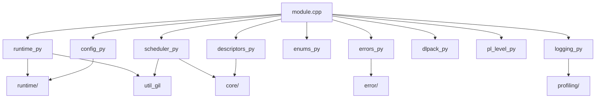
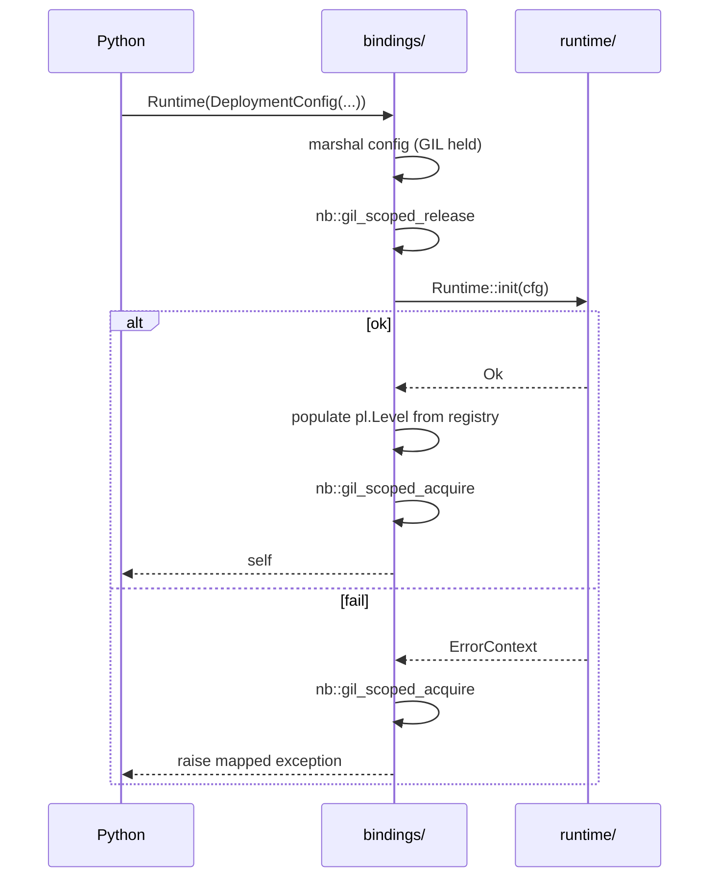
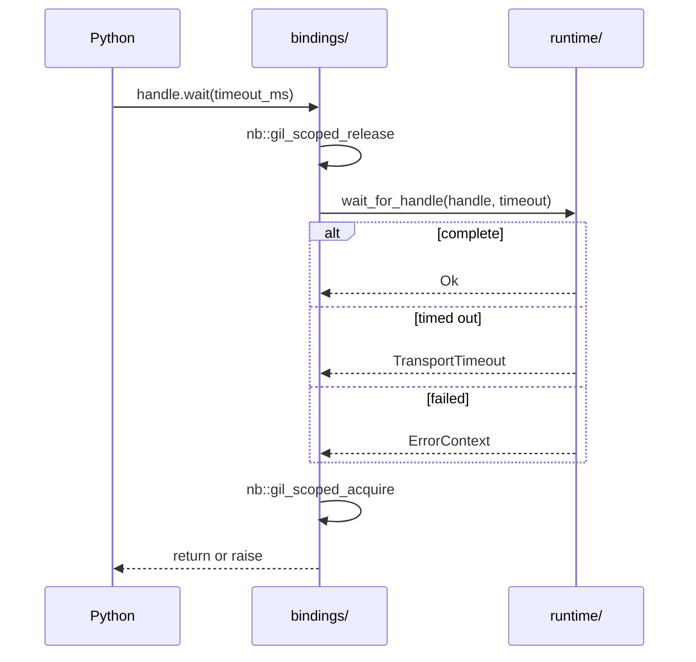

# Module Detailed Design: `bindings/`

## 1. Overview

### 1.1 Purpose

Expose the C++ runtime to **Python** via **nanobind**: `simpler.Runtime`, `simpler.DistributedRuntime`, task / submission handles, deployment configuration, distributed helpers, and a structured mapping from `ErrorContext` to Python exceptions. `bindings/` is the stable Python-facing surface and the only legitimate path from Python into the runtime.

### 1.2 Responsibility

**Single responsibility:** language boundary. Thin wrappers with type conversion, GIL lifecycle management, exception translation, and DLPack / capsule interop. No scheduling, no protocol, no memory logic.

### 1.3 Position in Architecture

- **Layer:** Highest in the C++ stack; single consumer of `runtime/`.
- **Depends on:** `runtime/`, `error/`, `core/` (for `TaskHandle`, `SubmissionHandle`, `TaskDescriptor`).
- **Depended on by:** PyPTO / user Python code only.
- **Logical View mapping:** Scenario view Python flows ([Scenario View §6](../06-scenario-view.md)); Deployment fields from [`runtime/`](runtime.md).

---

## 2. Public Interface

### 2.1 Python classes and signatures

All classes live in the `simpler` Python module. Internal C++ structs are hidden unless listed.

| Python class / function | Backing C++ | Signature | Description |
|---|---|---|---|
| `simpler.Runtime` | `Runtime` | `__init__(config: DeploymentConfig)` | Single-node runtime. Calls `Runtime::init` inside ctor; releases GIL during init. |
| `simpler.Runtime.root_scheduler` | `Runtime::root_scheduler` | `() -> Scheduler` | Entry scheduler wrapper. |
| `simpler.Runtime.layer` | `Runtime::layer_of` | `(name: str) -> Scheduler` | Lookup by name. |
| `simpler.Runtime.submit` | `ISchedulerLayer::submit` | `(task: Task \| Group \| SPMDTask) -> SubmissionHandle` | Thin wrapper; GIL held only during argument marshaling. |
| `simpler.Runtime.drain` | `Runtime::drain` | `(timeout_ms: int = 120000) -> None` | GIL released for entire call. |
| `simpler.Runtime.shutdown` | `Runtime::shutdown` | `() -> None` | Idempotent; GIL released. |
| `simpler.Runtime.stats` | `Runtime::stats` | `() -> RuntimeStats` | Snapshot as Python dict. |
| `simpler.Runtime.is_running` / `is_draining` | — | `() -> bool` | — |
| `simpler.DistributedRuntime` | `DistributedRuntime` | `__init__(config: DeploymentConfig)` | Multi-node runtime; extends `Runtime`. |
| `simpler.DistributedRuntime.cluster_view` | — | `() -> ClusterView` | Read-only snapshot. |
| `simpler.DistributedRuntime.local_node_id` | — | `() -> int` | — |
| `simpler.DistributedRuntime.drain_cluster` | — | `(timeout_ms: int) -> None` | — |
| `simpler.Scheduler` | `ISchedulerLayer*` | `submit(...)`, `submit_group(...)`, `submit_spmd(...)`, `scope_begin()`, `scope_end(ScopeHandle)` | Matches the scheduler interface; does not own the layer. |
| `simpler.SubmissionHandle` | `SubmissionHandle` | `tasks() -> list[TaskHandle]`, `wait(timeout_ms: int = -1) -> None`, `is_complete() -> bool` | Completion handles. |
| `simpler.TaskHandle` | `TaskHandle` | `wait(timeout_ms)`, `is_complete()`, `key() -> tuple` | Opaque task reference. |
| `simpler.Task` | `TaskDescriptor` builder | `Task(func_name: str, args: list, deps: list[TaskHandle] = [], level: str = "")` | DSL-style descriptor. |
| `simpler.Group` | `SubmissionDescriptor` builder | `Group(tasks: list[Task], edges: list[tuple[int,int]], dep_mode: DepMode = DATA)` | Group submission builder. |
| `simpler.SPMDTask` | `SPMDTaskDescriptor` | `SPMDTask(func_name, grid, args, level)` | SPMD submission. |
| `simpler.DeploymentConfig` | `DeploymentConfig` | `DeploymentConfig(**kwargs)` | Dataclass-style binding with keyword fields from [`runtime/`](runtime.md#24-deploymentconfig). |
| `simpler.pl.Level` | — | enum | DSL alias mapping resolved against `MachineLevelRegistry`. |
| `simpler.DepMode` | `DepMode` | enum { `BARRIER`, `DATA`, `NONE` } | Dependency mode. |
| `simpler.register_factory` | `Runtime::register_factory` | `(descriptor: MachineLevelDescriptor) -> None` | Expert use; typically called by compiled C++ modules, not Python. |
| `simpler.version` | — | `() -> str` | Runtime version. |
| `simpler.logging.set_level` / `simpler.logging.add_sink` | `Logger::set_level` / `Logger::add_sink` | — | Forward to `profiling/`. |

**Contract:**

- **GIL:** Released around every blocking or long call (`drain`, `drain_cluster`, `shutdown`, `wait`, `Runtime.__init__`). Re-acquired via `nb::gil_scoped_acquire` before any Python callback invocation.
- **Thread safety:** Matches `runtime/`. Python driver is typically single-threaded; `Scheduler`, `SubmissionHandle`, `TaskHandle` methods are safe from any Python thread after the runtime is initialized.
- **Handle lifetime:** `SubmissionHandle` / `TaskHandle` are weak references; they do not keep the runtime alive. Using them after `shutdown` raises `RuntimeShutdownError`.

### 2.2 Exception mapping (authoritative)

Exception classes are exposed under `simpler.errors` and registered with nanobind via `nb::exception<...>` translators. All derived from a common `simpler.errors.SimplerError` base (which itself subclasses `RuntimeError`).

| `ErrorCode` (`Domain`) | Python exception class | Base |
|---|---|---|
| `Ok` | — | — |
| `Hal` domain (`0x01`) | `simpler.errors.DeviceError` | `SimplerError` → `RuntimeError` |
| `Core` domain (`0x02`) | `simpler.errors.TaskError` | `SimplerError` |
| `Scheduler` domain (`0x03`) | `simpler.errors.SchedulerError` | `SimplerError` |
| `Memory` domain (`0x04`) (any `OutOfMemory`) | `simpler.errors.SimplerMemoryError` | `MemoryError` |
| `Memory` domain (other) | `simpler.errors.MemoryError` | `SimplerError` |
| `Transport` domain (`0x05`) | `simpler.errors.ConnectionError` | `ConnectionError` |
| `Distributed` domain (`0x06`) | `simpler.errors.DistributedError` | `SimplerError` |
| `Profiling` domain (`0x07`) | `simpler.errors.ProfilingError` | `SimplerError` (logged, usually non-fatal) |
| `Runtime` domain (`0x08`): `RuntimeInitFailed` | `simpler.errors.RuntimeInitError` | `SimplerError` |
| `Runtime` domain (`0x08`): `InvalidConfiguration` | `ValueError` (mapped) | `ValueError` |
| `Bindings` domain (`0x09`) | `simpler.errors.BindingError` | `SimplerError` |

Specific high-value subtypes:

| `ErrorCode` | Python subclass |
|---|---|
| `DmaTimeout`, `TransportTimeout` | `simpler.errors.TimeoutError(SimplerError, TimeoutError)` |
| `CyclicDependency` | `simpler.errors.CyclicDependencyError(SchedulerError)` |
| `WorkerCrashed` | `simpler.errors.WorkerCrashed(SchedulerError)` |
| `RemoteError` | `simpler.errors.RemoteError(DistributedError)` with `.remote_cause: list[SimplerError]` |
| `ProtocolVersionMismatch` | `simpler.errors.ProtocolMismatchError(DistributedError)` |

**Invariants:**
- Every `SimplerError` carries `.code: int` (raw `ErrorCode`), `.domain: str`, `.severity: str`, `.message: str`, optional `.task_key: tuple | None`, optional `.layer_id: int | None`, optional `.stack_trace: str`.
- `RemoteError.remote_cause` preserves the fan-in chain (`ErrorContext::remote_error_chain`) as a list of `SimplerError`.
- No raw `ErrorContext` objects cross the language boundary; a `from` chain is set using Python's `raise ... from ...` when a remote cause is present.

### 2.3 Public Data Types (Python-visible)

| Type | Purpose |
|---|---|
| `simpler.DeploymentConfig` | Runtime composition, dataclass-style. |
| `simpler.PeerSpec` | For `DeploymentConfig.peers`. |
| `simpler.LevelOverrides` | For `DeploymentConfig.level_overrides`. |
| `simpler.RuntimeStats` | Read-only mapping view of aggregated counters. |
| `simpler.ClusterView` | Nodes, health, coordinator id. |
| `simpler.pl.Level` | DSL level aliases (dynamic enum populated at init). |
| `simpler.DepMode`, `simpler.Variant`, `simpler.SimulationMode`, `simpler.TransportBackend` | C++ enums re-exported. |

Internal C++ structs (`TaskDescriptor`, `SubmissionDescriptor`, `SPMDTaskDescriptor`, `TaskSlotRef`, `BufferRef`, `WorkspaceHandle`, `ScopeHandle`) remain strictly implementation-side; Python interacts with them only via builders and handles.

### 2.4 DLPack / Tensor interop

- `bindings/` accepts tensor arguments that export DLPack (`__dlpack__`) or CUDA-Array-Interface (`__cuda_array_interface__`). Import paths prefer DLPack.
- The binding layer wraps the resulting device pointer + shape / dtype / stream info into a `BufferRef` via `IMemoryOps::register_external` (no-copy when layouts match).
- For producer-side tensors owned by the runtime, `SubmissionHandle.output(i)` returns a DLPack capsule that transfers ownership semantics per DLPack spec.

---

## 3. Internal Architecture

### 3.1 Internal Component Decomposition

```
bindings/
├── src/
│   ├── module.cpp                 # NB_MODULE(simpler, m) — top-level registration
│   ├── runtime_py.cpp             # Runtime / DistributedRuntime bindings
│   ├── scheduler_py.cpp           # Scheduler, SubmissionHandle, TaskHandle
│   ├── descriptors_py.cpp         # Task, Group, SPMDTask builders
│   ├── config_py.cpp              # DeploymentConfig, PeerSpec, LevelOverrides
│   ├── enums_py.cpp               # DepMode, Variant, SimulationMode, …
│   ├── errors_py.cpp              # Exception hierarchy and translators
│   ├── dlpack_py.cpp              # DLPack / CAI interop adapter
│   ├── pl_level_py.cpp            # Dynamic pl.Level enum + alias resolution
│   ├── logging_py.cpp             # simpler.logging bridge
│   └── util_gil.cpp               # GIL helpers, callback trampolines
├── python/
│   ├── simpler/__init__.py        # Python-side sugar; re-exports
│   ├── simpler/errors.py          # Thin Python shims over C++-registered exceptions
│   └── simpler/pl.py              # pl.Level surface
└── tests/
    ├── test_bindings.py           # Import / API surface
    ├── test_submit.py             # Task / Group / SPMD smoke
    ├── test_exception_mapping.py  # ErrorCode → Python exception coverage
    ├── test_dlpack.py             # Tensor interop
    ├── test_gil.py                # GIL release / re-entry around blocking calls
    └── test_distributed.py        # Multi-node sim smoke
```

### 3.2 Internal Dependency Diagram



### 3.3 Key Design Decisions (Module-Level)

- **Nanobind over pybind11** ([Development View §3.2](../03-development-view.md)). Faster compile times, smaller binaries, type-stubs-friendly, and cleaner GIL control.
- **Thin wrappers only.** No scheduling or error logic is duplicated in Python; Python classes translate arguments and forward calls.
- **Exception translators registered once at module init.** Every `ErrorContext` is inspected by a single translator that dispatches on `Domain` and specific `ErrorCode` values.
- **GIL released aggressively.** Any call that can block for > 100 µs releases the GIL. Callbacks into Python reacquire explicitly.
- **Dynamic `pl.Level` enum.** Populated from `MachineLevelRegistry` after `Runtime.__init__`, so DSL aliases always match the registered levels.
- **No hidden global state.** The module holds no singletons; `Runtime` instances are user-owned and garbage-collected deterministically via `shutdown` on `__del__`.

---

## 4. Key Data Structures

### 4.1 Handle wrappers

```cpp
struct PySubmissionHandle {
    SubmissionHandle handle;
    std::weak_ptr<RuntimeState> rt;  // keeps weak ref; does not extend lifetime
};

struct PyTaskHandle {
    TaskHandle handle;
    std::weak_ptr<RuntimeState> rt;
};
```

- POD layout aside from the weak_ptr; zero Python-side state beyond the wrapper.
- Rejects operations after `rt.expired()` with `RuntimeShutdownError`.

### 4.2 Callback trampoline

```cpp
struct PyCallback {
    nb::object fn;       // strong Python ref
    bool       owns_gil; // whether trampoline must acquire GIL on invocation
};

void invoke(const PyCallback& cb, const CallbackArgs& args) {
    nb::gil_scoped_acquire g;
    try {
        cb.fn(args_to_py(args));
    } catch (nb::python_error& e) {
        // Report to error/: ErrorCode::PythonCallbackFailed with trace.
        simpler::error::report_from_python(e);
    }
}
```

- Exceptions raised by a Python callback are converted to `ErrorContext{PythonCallbackFailed}` and propagated through the normal failure path.

### 4.3 Exception translator

```cpp
nb::register_exception_translator([](const std::exception_ptr& p, void*) {
    try { std::rethrow_exception(p); }
    catch (const SimplerException& e) {
        translate_error_context(e.ctx());   // dispatch on domain/code → PyErr_SetObject
    }
    catch (const std::bad_alloc&) {
        PyErr_SetString(PyExc_MemoryError, "allocation failure in simpler runtime");
    }
    // Other std::exception types fall through to default mapping.
});
```

The `translate_error_context` function walks the domain / severity / code triple, constructs the Python exception with preserved fields (`.code`, `.domain`, `.task_key`, `.remote_cause`), and raises it.

---

## 5. Processing Flows

### 5.1 Runtime construction



### 5.2 Submit from Python

1. Python `Task(...)` builder constructs a `TaskDescriptor` on the C++ side (GIL held, micro-op).
2. `Runtime.submit(task)`:
   - Convert arg list: primitive copies for scalars; DLPack-import path for tensors; `BufferRef`s for already-registered buffers.
   - Call `ISchedulerLayer::submit` (GIL released only if the call is configured as blocking; for the fast path GIL is held for the < 10 µs call).
   - Wrap the returned `SubmissionHandle` into `PySubmissionHandle` and return.
3. Errors from `submit` are translated to the exception hierarchy (no stack-unwinding across the C boundary without translation).

### 5.3 Blocking wait



### 5.4 Distributed error translation

- `RemoteError` arrives at the bindings layer with a populated `ErrorContext::remote_error_chain`.
- Translator builds a Python `RemoteError` instance; each element in `remote_error_chain` is recursively translated to its Python exception and attached as `.remote_cause` list.
- If the user re-raises the chain, the top-level `raise` already carries the local context; each element in `remote_cause` can be inspected or re-raised as desired.

### 5.5 Logging / profiling bridge

- `simpler.logging.set_level(level)` forwards to `Logger::set_level` with an atomic write.
- `simpler.logging.add_sink(callable)` registers a Python callable as an `ILogSink`. Invocations are batched on the C++ side, then acquire the GIL to call the Python sink. Log-sink failures never propagate back into the runtime (per `profiling/` contract).

---

## 6. Concurrency Model

- **Python driver threads.** Multiple Python threads may share a single `Runtime`. Each binding-side call that touches the C++ side either holds the GIL throughout (short calls) or releases + reacquires around the critical section.
- **C++ worker callbacks to Python.** Completion / error callbacks always enter through `util_gil` trampolines with `nb::gil_scoped_acquire`. Trampoline creation cost (~1 µs) is acceptable relative to the work on the Python side.
- **No binding-owned threads.** All long-running threads live in the runtime. `bindings/` never spawns a thread of its own.
- **Re-entrancy.** A Python callback invoked by the runtime may re-enter the runtime (e.g., submit a follow-up task). The submit path is safe because the callback already holds the GIL and the runtime side does not hold any runtime-level locks during Python dispatch.
- **Subinterpreters / free-threaded builds (PEP-703).** The binding is built with no per-interpreter state; free-threaded Python is supported as soon as nanobind advertises it (tracked as a follow-up).

---

## 7. Error Handling

- Every exported C++ call is wrapped in a `try { ... } catch (const SimplerException& e) { throw_py(e.ctx()); }` pattern.
- `throw_py` calls the translator (see §4.3) that dispatches on `ErrorCode` to the correct Python exception subclass.
- `KeyboardInterrupt` while in a blocking call (e.g., `drain`, `wait`) is supported: the binding installs a `PyErr_CheckSignals()` hook every 100 ms while the GIL is released; on interrupt, it calls `runtime/`'s cooperative cancel (if available) and raises `KeyboardInterrupt` once the GIL is reacquired.
- No raw pointers or `ErrorContext*` are exposed to Python. The exception objects carry only value-copies of the relevant fields.

---

## 8. Configuration

| Parameter | Type | Default | Description |
|---|---|---|---|
| `debug_import` | `bool` | false | Verbose import diagnostics. |
| `nanobind_leak_warn` | `bool` | true in debug builds | Report reference leaks on shutdown. |
| `wait_signal_poll_ms` | `int` | 100 | Interval at which blocking calls check for `KeyboardInterrupt`. |
| `default_dlpack_stream` | `int \| None` | None | Stream handle used when importing DLPack tensors with `__dlpack_stream__`. |
| `log_python_callback_errors` | `bool` | true | Whether Python-callback errors are forwarded to `profiling/` log. |

Most users never need to touch these; they are exposed via `simpler.config` for advanced tuning.

---

## 9. Testing Strategy

### 9.1 Unit Tests (C++ side)

- `test_translator.cpp`: drive `translate_error_context` with every registered `ErrorCode` and assert the resulting Python exception type and fields.
- `test_gil_helpers.cpp`: verify `gil_scoped_release` / `gil_scoped_acquire` nesting invariants.
- `test_handle_lifetime.cpp`: destroyed runtime → handle operations raise `RuntimeShutdownError`.

### 9.2 Unit Tests (Python side)

- `test_bindings.py`: import sanity, API surface, re-exports.
- `test_exception_mapping.py`: inject each error code via a test hook and assert Python-side exception type, `code`, `domain`, `task_key`, and preservation of `remote_cause` for `RemoteError`.
- `test_config.py`: `DeploymentConfig` round-trips through C++; bad fields raise `ValueError`.
- `test_dlpack.py`: numpy / torch tensors imported via DLPack; no copy for contiguous layouts; copy-on-mismatch.

### 9.3 Integration Tests

- `test_submit.py`: single-task, group, SPMD submissions on sim; handles complete; outputs readable.
- `test_distributed.py`: 3-node sim cluster; submit and complete; `cluster_view()` populated; drain succeeds.
- `test_callbacks.py`: Python completion callback invoked from worker thread; exception path funneled through `PythonCallbackFailed`.

### 9.4 Edge Cases and Failure Tests

- `test_interrupt.py`: `KeyboardInterrupt` during `drain()` wakes the call within `wait_signal_poll_ms`.
- `test_shutdown_during_submit.py`: shutting down while Python holds outstanding handles; handles raise `RuntimeShutdownError` on use.
- `test_exception_hierarchy.py`: catching base `SimplerError` catches all domain-specific subclasses; catching `MemoryError` catches `SimplerMemoryError`.
- `test_remote_error_chain.py`: build a synthetic 3-level remote error chain; Python `RemoteError.remote_cause` has length 3 with correct types.

### 9.5 Performance Tests

- Binding overhead on submit (argument marshaling + `ISchedulerLayer::submit`) < 2 µs for a 3-scalar-argument task.
- DLPack import of a 4 MB tensor: < 20 µs (no copy).

---

## 10. Performance Considerations

- **Submit fast path is microsecond-scale.** The GIL is held during marshaling but released eagerly when a call can block.
- **Zero-copy tensor interop.** DLPack and CAI paths avoid copies when strides and alignment match `memory/` requirements; otherwise `IMemoryOps::copy` is used with a diagnostic log.
- **Batched log-sink delivery.** Python sinks receive batches under a single GIL acquisition to amortize cost.
- **Handle objects are POD-size.** Creating and discarding thousands of `SubmissionHandle` wrappers per second is cheap.

---

## 11. Extension Points

- **New Python types** — add a `foo_py.cpp` file and include it from `module.cpp`.
- **New exception subclass** — register in `errors_py.cpp` and add a mapping entry; the translator dispatches automatically.
- **Additional submodules** (`simpler.distributed`, `simpler.debug`) — feature-flagged at compile time; their Python shims live under `python/simpler/`.
- **Custom Python sinks for tracing** — via `simpler.profiling.add_trace_sink(callable)` (mirrors logging bridge).
- **Alternative Python binding layer** (e.g., Cython for a specific subset) — not planned; `bindings/` is the single front door.

---

## 12. Open Questions (Module-Level)

- DSL backward-compat resolution location ([Q7](../09-open-questions.md)) — affects whether a handful of attributes are compiler-only or also exposed here.
- Free-threaded CPython support timeline (tied to nanobind's PEP-703 support).
- Whether `simpler.Scheduler` needs a `submit_async` that returns an `asyncio`-compatible awaitable — deferred until a user request arrives.

---

## 13. Review Amendments (R3)

This section records normative amendments from architecture-review run `2026-04-18-171357`. Each `[UPDATED: <id>: ...]` callout is authoritative over any prior wording it overlaps and is tied to an entry in `reviews/2026-04-18-171357/final/applied-changes/docs__pypto-runtime-design__modules__bindings.md.diff.md`.

> **[UPDATED: A1-P11: per-arg marshaling budget + inline validation]** *Target: §5.2 Submit from Python; §9.5 Performance Tests; §10 Performance Considerations.* Per-argument budget: scalar ≤ 20 ns; DLPack contiguous tensor import ≤ 200 ns; `BufferRef` passthrough ≤ 30 ns; total submit marshaling ≤ 500 ns for ≤ 8 args. Above 8 args, Python→C stage adds `0.2 μs + 0.05 μs × extra_args`. Inline structural validation (dtype / device / shape × stride overflow / capsule ownership / zero-length dtype) runs in a single pass under 30 ns. SPMD shape sub-codes surface here.

> **[UPDATED: A3-P7: submission preconditions checked at Python↔C boundary]** *Target: §5.2 Submit from Python.* Preconditions: `tasks.size() ≥ 1`; `intra_edges[i].producer ≠ consumer`; indices in `[0, tasks.size())`; boundary subsets valid; workspace subrange bounds. Sub-codes `EmptyTasks / SelfLoopEdge / EdgeIndexOOB / BoundaryIndexOOB / WorkspaceSubrangeOOB / WorkspaceSizeMismatch`. SPMD sub-codes `SpmdIndexOOB, SpmdSizeMismatch, SpmdBlockDimZero`. Routed `TaskSlotExhausted` / `ReadyQueueExhausted` from A1-P8. `FE_VALIDATED` flag on `SubmissionDescriptor.flags` lets release builds skip re-validation.

> **[UPDATED: A3-P10: Python exception mapping completeness (`simpler.SchedulerError` etc.)]** *Target: §2.2 Exception mapping (authoritative); §4.3 Exception translator.* One row per `Domain` value mapping to a `simpler.*Error` subclass. Scheduler-domain errors raise `simpler.SchedulerError` (not generic `simpler.RuntimeError`).

> **[UPDATED: A5-P4: `idempotent: bool` on Python-side Task constructor]** *Target: §2.1 Python classes — `simpler.Task`.* Add `idempotent=True` (default true) to `simpler.Task(...)`. Scheduler MAY retry only when `idempotent == True`. Caller retry of a rejected submission is independent of the flag.

> **[UPDATED: A6-P8: DLPack byte-cap + capsule ownership guards]** *Target: §2.4 DLPack / Tensor interop.* `DeploymentConfig.max_import_bytes` (default 1 GiB); stride × shape overflow guarded by the A1-P11 compare stack + this cap. Rejects negative / mismatched-device / overflowing tensors with `ValueError`. (Structural validation absorbed into A1-P11; byte-cap remains A6-owned.)

> **[UPDATED: A6-P10: capability-scoped log / trace sinks]** *Target: §2.1 `add_sink`; §5.5 Logging / profiling bridge.* `add_sink(callable, *, severity_min='INFO', domains=None, logical_system_id=None) → SinkHandle`. Dispatch filters events by capability. Caller-scoped default; unscoped admin sinks must carry `diagnostic_admin_token`.

> **[UPDATED: A6-P11: Python-side `register_factory` audit event]** *Target: §2.1 Python classes and signatures (line ~51).* `simpler.runtime.register_factory(descriptor, *, registration_token)`. Missing/wrong token → `simpler.AuthorizationError`. Post-`freeze()` → `simpler.RegistrationClosedError`. Emits an audit event server-side (A6-P6).

> **[UPDATED: A7-P9: Python `MemoryError` class dedup]** *Target: §2.2 Exception mapping.* Rename `simpler.errors.MemoryError(SimplerError)` → `simpler.errors.SimplerMemoryAccessError(SimplerError)`. Keep `simpler.errors.SimplerOutOfMemory(builtins.MemoryError)` distinct.

> **[UPDATED: A8-P4: `simpler.Runtime.dump_state() -> dict` binding]** *Target: §2.1 Python classes.* `simpler.Runtime.dump_state() -> dict` returns the structured JSON from `Runtime::dump_state(DumpOptions)` as a Python `dict`. Default scope = caller's `logical_system_id`; unscoped requires `diagnostic_admin_token`.

> **[UPDATED: A8-P5: `simpler.Runtime.on_alert(callback)`]** *Target: §2.1 Python classes.* Python binding for `Runtime::on_alert`. `AlertRule` is Python-visible with field `logical_system_id`.

> **[UPDATED: A8-P10: structured KV log bridge]** *Target: §5.5 Logging / profiling bridge.* Python `add_log_sink(callable)` receives events shaped as `{severity, category, kv_dict, correlation_id}` matching the C++ `Logger::log_kv` shape.

> **[UPDATED: A2-P9: Python-side trace schema version guard]** *Target: §5.5 Logging / profiling bridge (trace sink side).* Python trace sinks receive the `{magic, trace_schema_version, platform, mode}` header once at stream start and raise `ProtocolVersionMismatch` on mismatched major version.

> **[UPDATED: A8-P2-ref: `RecordedEventSource` seam exposed for tests]** *Target: §9.2 Unit Tests (Python side).* Python tests may obtain a driver via `simpler.testing.event_loop_driver(runtime)` when `enable_test_driver=True`; this drives `EventLoopRunner::step()` for deterministic replays.

> **[UPDATED: A4-P6-ref: end-of-file "Related ADRs" paragraph]** *Target: new footer subsection above Document status.* Binds to ADR-011-R2, ADR-015, ADR-016, ADR-017 where bindings-side behavior depends on them (SimulationMode gating, header independence, TaskState spelling, closed-enum rationale).

---

**Document status:** Draft — ready for review.
