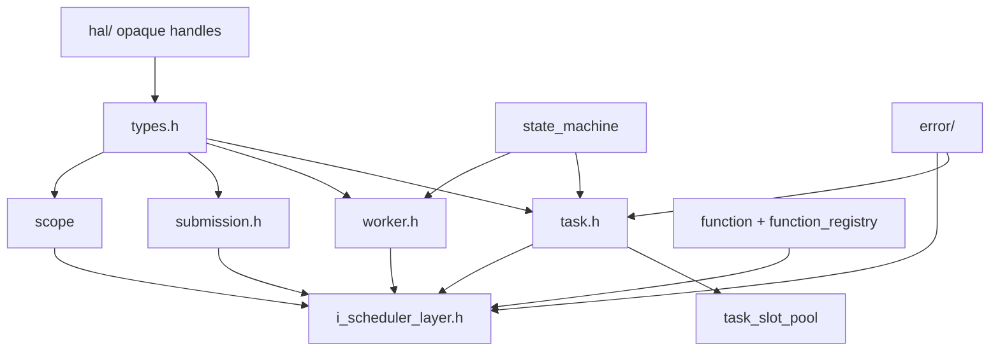
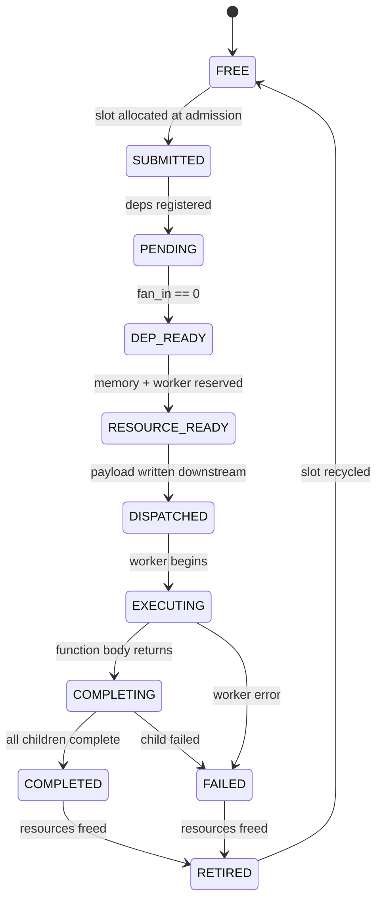
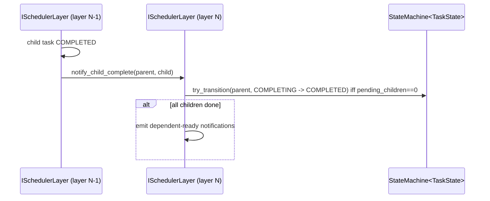

# Module Detailed Design: `core/`

## 1. Overview

### 1.1 Purpose

Define the **shared vocabulary** of the runtime: tasks, workers, function registry, hierarchical scheduler contract (`ISchedulerLayer`), submission model, and state machines — everything that higher layers compose without embedding platform logic or scheduling policy. This module is the ABI between `scheduler/`, `memory/`, `transport/`, `distributed/`, and `runtime/`.

### 1.2 Responsibility

Own **portable data structures and abstract scheduler API** used across the compiled runtime. No scheduling decisions, no allocation, no protocol — only the types through which those concerns talk.

### 1.3 Position in Architecture

- **Layer:** Above `hal/` and `error/`, below `scheduler/`, `memory/`, `transport/`, `distributed/`, and `runtime/`.
- **Depends on:** `hal/` (for opaque handle types `DeviceAddress`, `NodeId`) and `error/` (for `ErrorContext`).
- **Depended on by:** `scheduler/`, `memory/`, `transport/`, `distributed/`, `runtime/`, `profiling/` (trace ids).
- **Logical View mapping:** [Domain Model](../02-logical-view/01-domain-model.md), [Task Model](../02-logical-view/07-task-model.md), [Worker](../02-logical-view/03-worker.md), [Interfaces](../02-logical-view/09-interfaces.md), [Function Types](../02-logical-view/06-function-types.md).

---

## 2. Public Interface

### 2.1 `ISchedulerLayer`

**Purpose:** Uniform per-Layer scheduler contract — the key abstraction enabling recursive hierarchical execution (ADR-001, ADR-003). Every Machine Level exposes an `ISchedulerLayer`; composition is via pointer to this type (ADR-008).

**Sketch (authoritative for this module):**

```cpp
class ISchedulerLayer {
public:
    virtual ~ISchedulerLayer() = default;

    // --- Identity ---
    virtual LayerId           layer_id()    const = 0;
    virtual const std::string& level_name() const = 0;

    // --- Wiring (set during assembly; immutable after init()) ---
    virtual void set_memory_manager(IMemoryManager* mgr) = 0;
    virtual void set_memory_ops(IMemoryOps* ops) = 0;
    virtual void set_vertical_channel_to_child(IVerticalChannel* ch) = 0;
    virtual void set_vertical_channel_to_parent(IVerticalChannel* ch) = 0;
    virtual void set_horizontal_channel(IHorizontalChannel* ch) = 0;

    // --- Submission ---
    // All submissions flow through SubmissionDescriptor; the convenience wrappers
    // build one internally. submit() returns a SubmissionHandle once the Submission
    // has been atomically admitted; per-task handles resolved via submission_tasks().
    virtual SubmissionHandle submit(const SubmissionDescriptor& desc) = 0;
    virtual SubmissionHandle submit(const TaskDescriptor& desc) = 0;
    virtual SubmissionHandle submit_group(const TaskDescriptor  tasks[],
                                          size_t                task_count,
                                          const IntraGroupEdge  edges[],
                                          size_t                edge_count,
                                          DepMode               dep_mode = DepMode::DATA) = 0;
    virtual SubmissionHandle submit_spmd(const SPMDTaskDescriptor& desc,
                                         DepMode                    dep_mode = DepMode::DATA) = 0;

    virtual std::span<const TaskHandle> submission_tasks(SubmissionHandle s) const = 0;

    // --- Dependency / completion signaling ---
    virtual void notify_dep_satisfied(TaskHandle task, TaskHandle completed_dep) = 0;
    virtual void notify_child_complete(TaskHandle parent, TaskHandle child)      = 0;

    // --- Scope management ---
    virtual ScopeHandle scope_begin()                = 0;
    virtual void        scope_end(ScopeHandle scope) = 0;

    // --- Lifecycle ---
    virtual void init(const LayerConfig& config) = 0;
    virtual void drain()                          = 0;
    virtual void shutdown()                       = 0;

    // --- Status ---
    virtual bool       is_idle()   const = 0;
    virtual LayerStats get_stats() const = 0;
};
```

**Contract:**

- **Preconditions:** All `set_*` wiring methods must be called before `init`; `submit` is valid only after `init` and before `shutdown`.
- **Postconditions:**
  - `submit` either returns a valid `SubmissionHandle` (Submission admitted atomically — every Task slot allocated, every `intra_edges` entry installed) or blocks / returns back-pressure per `IResourceAllocationPolicy` when the Outstanding Submission Window is full.
  - `drain` returns when all submitted Tasks and their descendants have reached `RETIRED` and all Submissions have emitted `SUBMISSION_RETIRED`.
- **Invariants:** Wiring (memory manager, channels) is immutable after `init`. Handles are valid until their enclosing Submission retires; stale access is detected via `generation`.
- **Error behavior:** Method-level failures use `ErrorContext` out-channel (e.g., `submit` rejecting invalid `TaskDescriptor` via `ErrorCode::InvalidConfiguration`); runtime failures travel through the Task state machine (Task transitions to a failed state).
- **Thread safety:** One primary scheduler thread per Layer unless explicitly documented. `notify_dep_satisfied` / `notify_child_complete` are callable from any thread (thread-safe on the implementation's completion queue). `drain` and `shutdown` are caller-serialized.
- **Ownership semantics:** `IMemoryManager`, channels, and `IMemoryOps` are not owned by `ISchedulerLayer` — wired by `runtime/` and kept alive for the Layer's lifetime (ADR-003 / ADR-008).

**Internal delegation:** Each implementation decomposes into `TaskManager`, `WorkerManager`, and `ResourceManager` internally (owned by `scheduler/`, ADR-008); the external interface here does not change based on that decomposition.

### 2.2 Submission Types

Supporting data types for `ISchedulerLayer::submit(...)`.

```cpp
enum class DepMode : uint8_t {
    BARRIER,   // wait for all currently outstanding Submissions to complete
    DATA,      // install producer->consumer edges for tensors this Submission reads
    NONE,      // no external edges; caller-asserted independence
};

struct IntraGroupEdge {
    uint32_t producer_index;   // index into SubmissionDescriptor::tasks
    uint32_t consumer_index;   // index into SubmissionDescriptor::tasks
};

struct WorkspaceRequest {
    size_t                     total_bytes;     // sum of aligned non-boundary tensor sizes
    size_t                     alignment = 0;   // 0 => region.natural_alignment
    RegionId                   region    = RegionId::Default;
    std::vector<SubRangeSpec>  subranges;       // (task_index, arg_index, size, alignment)
};

struct SubmissionDescriptor {
    enum class Kind : uint8_t { SINGLE, GROUP, SPMD };

    Kind                              kind     = Kind::SINGLE;
    DepMode                           dep_mode = DepMode::DATA;

    std::vector<TaskDescriptor>       tasks;               // exactly 1 for SINGLE
    std::vector<IntraGroupEdge>       intra_edges;         // acyclic
    std::vector<uint32_t>             boundary_in_tasks;   // fan-in task indices
    std::vector<uint32_t>             boundary_out_tasks;  // fan-out task indices
    std::optional<WorkspaceRequest>   workspace_request;
    std::optional<SPMDTaskDescriptor> spmd;                // only when kind == SPMD
};

struct SubmissionHandle {
    uint32_t layer_id;
    uint32_t slot_index;
    uint32_t generation;
};
```

**Lifetime contract.** A `SubmissionHandle` is valid from successful return of `submit(...)` until the Submission emits `SUBMISSION_RETIRED`. Stale use is detected via `generation`.

### 2.3 `Task`, `TaskKey`, `TaskHandle`, `TaskState`

**Purpose:** Structured task identity and lifecycle state — the 10-state model shared by every Layer ([Process View §4.3](../04-process-view.md#43-task-state-machine)).

```cpp
struct TaskKey {
    LayerId  layer_id;      // 16 bits sufficient; packed as 32 here
    uint32_t slot_index;
    uint32_t generation;
};

struct TaskHandle {
    uint32_t slot_index;
    uint32_t generation;
};

enum class TaskState : uint8_t {
    FREE = 0,
    SUBMITTED,
    PENDING,
    DEP_READY,
    RESOURCE_READY,
    DISPATCHED,
    EXECUTING,
    COMPLETING,
    COMPLETED,
    RETIRED,
    FAILED,         // terminal; holds ErrorContext
};

struct alignas(64) Task {
    // --- hot fields (first cache line) ---
    TaskKey            key;
    uint64_t           submission_id;
    TaskState          state;
    uint8_t            flags;           // is_boundary_in/out, requires_worker_group, ...
    uint16_t           exec_type_id;    // -> TaskExecType
    LayerId            layer_id;
    uint32_t           fanin_remaining; // atomic decrement on predecessor completion

    // --- cold fields ---
    FunctionRef        func_ref;
    TaskArgs           args;
    DepList            deps;
    std::optional<TaskKey>       parent_key;
    std::optional<WorkspaceHandle> workspace_ref;
    ResourceReq                  resource_req;
    std::optional<NodeId>        source_node;
    ProfilingMeta                profiling;
    std::optional<ErrorContext>  error;
};
```

**Contract:**

- `TaskKey = (layer_id, slot_index, generation)` is unique across the entire machine for the lifetime of the underlying slot.
- Transitions between states happen only through `StateMachine<TaskState>` owned by the TaskManager (§4.3 process view), never by direct assignment.
- `TaskHandle` (layer-local) is the form used in most method signatures; `TaskKey` is used when the Layer must be disambiguated (cross-layer notifications, distributed proxies).

### 2.4 `Worker`, `WorkerState`

```cpp
enum class WorkerState : uint8_t {
    IDLE = 0,
    ASSIGNED,
    EXECUTING,
    COMPLETING,
    FAILED,
    RECOVERING,
    UNAVAILABLE,
};

struct Worker {
    WorkerId                id;
    WorkerTypeId            type_id;        // AIC / AIV / AICPU / ...
    std::optional<WorkerGroupId> group_id;  // Core Wrap membership, etc.
    WorkerState             state;
    std::optional<TaskHandle> current_task;
    HealthStatus            health;         // from hal/
};
```

**Contract:**

- Worker state machine transitions are owned by `WorkerManager` in `scheduler/` per [Process View §4.3.5](../04-process-view.md#435-worker-state-machine).
- `group_id` is set for heterogeneous Layers where Workers are bound into WorkerGroups (e.g., Core Wraps on the Chip level); absent for homogeneous Layers.

### 2.5 `StateMachine<T>`

**Purpose:** Generic driver enforcing a per-state-type transition table. Used for both `TaskState` and `WorkerState`.

```cpp
template <typename StateEnum>
class StateMachine {
public:
    using Handler = std::function<void(StateEnum from, StateEnum to)>;

    void define_transition(StateEnum from, StateEnum to, Handler on_transition = {});
    bool try_transition(StateEnum& current, StateEnum to);  // atomic CAS-driven
    bool is_terminal(StateEnum s) const;
};
```

**Contract:** `try_transition` returns false if the `(from, to)` pair is not defined; handlers run synchronously on the caller thread. No locks are taken across handler invocation.

### 2.6 `FunctionRegistry` and `FunctionRef`

**Purpose:** Register-once-invoke-many Function catalog keyed by content hash (ADR-007).

```cpp
struct FunctionDesc {
    std::string     name;            // debug / logs
    TaskExecType    exec_type;       // which Worker Types are required
    FunctionBlob    blob;            // binary / IR / CPU pointer (variant-dependent)
    ContentHash     hash;            // 256-bit hash; key of registration
};

class FunctionRegistry {
public:
    FunctionId register_function(FunctionDesc desc);  // idempotent by hash
    FunctionRef lookup(FunctionId id) const;
    FunctionRef lookup_by_hash(const ContentHash& h) const;

    bool        contains(FunctionId id) const;
    size_t      size() const;
};
```

**Contract:**

- **Idempotency:** Registering a Function whose `hash` already exists returns the existing id without rebinding.
- **Invariants:** `FunctionId` is monotonic and stable until `Runtime::shutdown`.
- **Thread safety:** `register_function` is safe under a mutex; `lookup*` is lock-free once the entry is published.

### 2.7 `TaskSlotPool`

**Purpose:** Fixed-size per-Layer pool of `Task` slots with generation-counter-based stale-handle detection.

```cpp
class TaskSlotPool {
public:
    explicit TaskSlotPool(size_t capacity);

    std::optional<TaskHandle> alloc();   // returns nullopt if full
    void                      free(TaskHandle h);

    Task*                     get(TaskHandle h);   // nullptr if generation stale
    const Task*               get(TaskHandle h) const;

    size_t size()     const;
    size_t capacity() const;
};
```

**Contract:**

- `alloc()` increments the slot's generation on reuse; a handle held past `free()` will fail `get()`.
- Generation wraparound (on 32-bit counters) is documented: after 2^32 reuses of a single slot, handles minted before wrap may alias. In practice this is > 1 yr even at 100 kHz reuse per slot; treated as an acceptable risk in v1.

### 2.8 Public Data Types

| Type | Description |
|------|-------------|
| `LayerId`, `LevelId`, `NodeId` | Identity integers for Machine Level / Node. |
| `TaskDescriptor`, `SPMDTaskDescriptor` | User-facing task specs. |
| `LayerConfig` | Per-layer init parameters (slot pool size, policies, queue depths). |
| `ScopeHandle` | Scope identifier for tensor lifetime management. |
| `ContinuousTensor` | Storage + valid-shape tensor argument (see [Task Model §2.4.3](../02-logical-view/07-task-model.md)). |
| `TaskExecType` | Required Worker Types and counts per Task ([Task Model §2.4.8](../02-logical-view/07-task-model.md)). |
| `LayerStats` | Read-only snapshot of counters (submitted, in-flight, retired, failed). |

---

## 3. Internal Architecture

### 3.1 Internal Component Decomposition

```
core/
├── include/core/
│   ├── task.h                  # Task, TaskKey, TaskHandle, TaskState, TaskDescriptor
│   ├── worker.h                # Worker, WorkerState, WorkerTypeDescriptor
│   ├── submission.h            # SubmissionDescriptor, IntraGroupEdge, DepMode, WorkspaceRequest
│   ├── function.h              # FunctionDesc, FunctionRef, ContentHash
│   ├── function_registry.h     # FunctionRegistry
│   ├── i_scheduler_layer.h     # ISchedulerLayer + LayerConfig + LayerStats
│   ├── state_machine.h         # Generic StateMachine<T>
│   ├── task_slot_pool.h        # TaskSlotPool
│   ├── scope.h                 # ScopeHandle and scope stack helpers
│   └── types.h                 # Shared enums / id aliases
├── src/
│   ├── function_registry.cpp   # Content-hash dedupe + lookup
│   ├── task_slot_pool.cpp      # Allocation with generation counter
│   ├── state_machine.cpp       # Transition tables + CAS loop
│   └── scope.cpp               # Scope stack accounting
└── tests/
    ├── test_task_slot_pool.cpp
    ├── test_state_machine.cpp
    ├── test_function_registry.cpp
    └── test_types_roundtrip.cpp
```

### 3.2 Internal Dependency Diagram



No upstream module dependencies beyond `hal/` handle types and `error/`.

### 3.3 Key Design Decisions (Module-Level)

- **`ISchedulerLayer` as the single cross-module contract (ADR-003).** `TaskManager`, `WorkerManager`, `ResourceManager` live in `scheduler/` and are not exposed here.
- **Submission as the admission unit (ADR-012).** `submit` is the only scheduler entry point; `SubmissionDescriptor` is the only admission payload. Convenience wrappers (`submit`, `submit_group`, `submit_spmd`) compose one internally.
- **Two-stage dependency analysis (ADR-013).** The frontend (above `bindings/`) supplies `intra_edges` and boundary classification; the runtime resolves only cross-Submission RAW via the `producer_index` (owned by `scheduler/`). `core/` exposes the types but does not perform analysis.
- **Content-hash Function identity (ADR-007).** `FunctionRegistry::register_function` is idempotent by hash; compiler caches and distributed peers can share `FunctionId` values deterministically.
- **POD-friendly Task layout.** Hot fields clustered in the first cache line for dispatch; cold fields (args, profiling, error) pushed behind.

---

## 4. Key Data Structures

### 4.1 `TaskKey` packing

```
   word 0: [layer_id : 16 | reserved : 16]
   word 1:  slot_index : 32
   word 2:  generation : 32
```

Total 12 B; passed by value across module boundaries. `TaskHandle` is the lower 8 B (slot_index, generation).

### 4.2 `Task` cache-line layout

```
 ┌─────────────────────── 64 B cache line ────────────────────────┐
 │  key (12) │ submission_id (8) │ state (1) │ flags (1) │        │
 │  exec_type_id (2) │ layer_id (4) │ fanin_remaining (4) │       │
 │  padding (32)                                                   │
 └─────────────────────────────────────────────────────────────────┘
 │  func_ref, args, deps, parent_key, workspace_ref, …             │
```

The dispatch path touches only the hot cache line (CAS on `state`, atomic decrement of `fanin_remaining`, lookup of `exec_type_id`).

### 4.3 `TaskSlotPool` invariants

- Backing storage: `std::vector<Task>` sized at capacity at construction; no growth.
- Free list: intrusive linked list of free slots (head pointer + `next_free` in each free slot).
- `generation` is stored per-slot and incremented on `free`; `alloc` observes the post-increment value.

### 4.4 `FunctionRegistry` layout

- Primary store: `std::vector<FunctionDesc>` indexed by `FunctionId`.
- Dedup index: `std::unordered_map<ContentHash, FunctionId>` for `register_function` and `lookup_by_hash`.
- After publication, readers access the vector lock-free; only `register_function` locks.

---

## 5. Processing Flows

### 5.1 Task state transitions



Full transition table and handler ownership live in [Process View §4.3.2](../04-process-view.md#432-transition-handlers); this module provides the state enum, the transition table registration helpers, and the atomic CAS used to drive transitions.

### 5.2 Child completion notification



`notify_child_complete` is the only `ISchedulerLayer` method explicitly required to be thread-safe — it is called from the child Layer's own thread.

### 5.3 Submission admission (external view)

`submit(SubmissionDescriptor)` is the canonical entry; the internal admission pipeline (window check, intra-edge install, dep-mode resolution, workspace allocation) is owned by `scheduler/TaskManager` per [scheduler.md §5.1](scheduler.md#5-processing-flows). From `core/`'s perspective, the contract is: either a valid `SubmissionHandle` is returned atomically or the call fails / back-pressures — no partial admission.

---

## 6. Concurrency Model

| Access | Thread |
|--------|--------|
| `ISchedulerLayer::submit` / `submit_group` / `submit_spmd` | Caller thread (user, parent layer). Implementations are expected to serialize on an internal scheduler thread. |
| `ISchedulerLayer::notify_dep_satisfied` / `notify_child_complete` | Any thread; implementation uses a lock-free MPSC into the scheduler thread. |
| `ISchedulerLayer::drain` / `shutdown` | Single caller thread; blocking. |
| `FunctionRegistry::register_function` | Mutex-guarded (init or infrequent). |
| `FunctionRegistry::lookup*` | Lock-free after publication. |
| `TaskSlotPool` | Typically owned by one thread (scheduler); no internal locks. Callers needing concurrent alloc must externally synchronize. |
| `StateMachine::try_transition` | Lock-free CAS loop on a single `StateEnum` word. |

`core/` itself owns no threads. All concurrency is imposed by the hosting implementations in `scheduler/` and `runtime/`.

---

## 7. Error Handling

- Invalid `TaskDescriptor` or `SubmissionDescriptor` (missing fields, cyclic `intra_edges`) → `ErrorCode::InvalidConfiguration` at `submit` call-site.
- Stale `TaskHandle` / `SubmissionHandle` (generation mismatch) → `ErrorCode::InvalidTaskHandle` / `InvalidSubmissionHandle`. `TaskSlotPool::get` returns `nullptr`; callers translate to `ErrorContext`.
- `TaskSlotPool::alloc` returns `nullopt` when capacity is exhausted → `ErrorCode::SlotPoolExhausted`.
- `FunctionRegistry::lookup` on an unknown id → `ErrorCode::FunctionNotRegistered`.
- Task-level failures are carried in `Task::error` and surfaced when the Task transitions to `FAILED`; runtime propagation rules live in [Process View §4.7](../04-process-view.md#47-error-handling-flows).
- This module never throws.

---

## 8. Configuration

| Parameter | Type | Default | Description | Valid Range |
|-----------|------|---------|-------------|-------------|
| `slot_pool_size` | `uint32_t` | 1024 (host), 4096 (device) | Per-layer Task slot pool | > 0 |
| `function_registry_reserve` | `uint32_t` | 512 | Pre-reserved capacity | ≥ 0 |
| `generation_wrap_warn` | `uint32_t` | 2^24 | Warn in logs when a slot's generation approaches this threshold | power-of-two |

Values are driven by `LayerConfig` (from `runtime/DeploymentConfig`).

---

## 9. Testing Strategy

### 9.1 Unit Tests

| Test | Verifies |
|------|----------|
| `slot_pool_alloc_free_cycle` | 1M alloc/free cycles; `get(stale_handle)` returns `nullptr` after reuse. |
| `slot_pool_exhaustion` | `alloc` returns `nullopt` at capacity; monitoring counter incremented. |
| `state_machine_table` | All 10 task transitions defined; illegal transitions rejected. |
| `state_machine_cas` | Concurrent `try_transition` with 8 threads produces exactly one winner per CAS. |
| `function_registry_dedup` | Duplicate registration by same `ContentHash` returns same `FunctionId`. |
| `function_registry_concurrent_lookup` | 16-reader / 1-writer stress; no torn reads. |
| `task_layout` | `static_assert(sizeof(Task) >= 64)` and `static_assert(offsetof(Task, func_ref) >= 64)` enforce hot-field locality. |
| `handle_stability` | `TaskKey` / `SubmissionHandle` sizes and alignments stable across builds. |

### 9.2 Integration Tests

- `core/` used against a mock `ISchedulerLayer` and in-memory channels to validate that a minimal submit → drain path exercises every state transition.
- Cross-module test asserts that `TaskHandle` round-trips losslessly through `transport/`'s `REMOTE_SUBMIT` message.

### 9.3 Edge Cases and Failure Tests

- Generation wraparound: force a slot to wrap and assert the warning counter fires and the subsequent alias is detected by a higher-level monotonic `task_key` check in `scheduler/`.
- Double-complete: call `notify_dep_satisfied` twice for the same `(task, dep)` pair → second call is a no-op (verified by counter invariant in the test harness).
- `SubmissionDescriptor::intra_edges` cycle: rejected at `submit` boundary.
- SPMD with `spmd_count == 0`: rejected.

---

## 10. Performance Considerations

- **Task struct is cache-line aligned.** Hot dispatch path touches one cache line; cold fields are accessed only on state transitions away from the hot path.
- **`StateMachine::try_transition` is a single CAS** plus a synchronous handler call; no allocation.
- **`TaskSlotPool::alloc/free` are O(1)** (intrusive free list).
- **`FunctionRegistry::lookup` is O(1)** after publication; `register_function` is amortized O(1).
- **No heap allocation on the hot dispatch path** — `args` and `deps` buffers are sized by `TaskDescriptor` at submit time, not reallocated thereafter.

Critical latency targets applicable to this module are the slot-pool and state-machine steps feeding into [Process View §4.8.1 (< 15 μs Host → AICore)](../04-process-view.md#481-single-node-kernel-dispatch-host--aicore-execution-start).

---

## 11. Extension Points

- **New `TaskExecType` variants** — added purely as data (content of `TaskExecType` struct); `core/` requires no code change.
- **New state-machine variants** — `StateMachine<T>` is generic; defining a new state enum + transition table suffices.
- **Alternative handle sizes** — `TaskHandle` / `SubmissionHandle` widths are a typedef compile-time choice; changes require coordinated ABI bump.
- **Custom `LayerConfig` fields** — forwarded by `runtime/MachineLevelDescriptor` without `core/` changes.

---

## 12. Open Questions (Module-Level)

- Full formalization of SPMD sub-task key scheme (expansion vs single-handle-with-index) — deferred; see [appendix-b-codebase-mapping.md](../appendix-b-codebase-mapping.md) gaps.
- Whether `TaskKey` should embed a short per-process nonce to detect cross-process handle mix-ups in tests — open; pending runtime test harness design.

---

## 13. Review Amendments (R3)

This section records normative amendments from architecture-review run `2026-04-18-171357`. Each `[UPDATED: <id>: ...]` callout is authoritative over any prior wording it overlaps and is tied to an entry in `reviews/2026-04-18-171357/final/applied-changes/docs__pypto-runtime-design__modules__core.md.diff.md`.

> **[UPDATED: A1-P4: normative Task hot/cold field split]** *Target: §2.3 `Task` struct; §4.2 `Task` cache-line layout.* Normative hot 64-B tier: `state, fan_in_counter, submission_id, exec_type_id, worker_id, dispatch_ts_ns`. Cold tail: `function_id, args_blob_ptr, parent_task_key, dbg_name, trace_flags, error_ctx_ptr`. AoS per-slot; first cache line hot; state-transition handlers touch only the hot line. `ErrorContext` is written only on FAILED (cold tail). SoA for `fan_in_counter` was considered and rejected (bench citation placeholder in §4.2).

> **[UPDATED: A3-P1: add `ERROR` (and optional `CANCELLED`) TaskState; canonical spelling]** *Target: §2.3 TaskState; §5.1 Task state transitions.* Add `ERROR` reachable from `DISPATCHED`, `EXECUTING`, `COMPLETING`; add `on_fail(task, error)` handler. Optionally add `CANCELLED` from `PENDING`, `DEP_READY`, `RESOURCE_READY`, `DISPATCHED`, `EXECUTING` with `on_cancel(task, reason)`. Canonical spelling is `COMPLETING → ERROR` (Task) and `FAILED` (Worker); see ADR-016.

> **[UPDATED: A6-P7: `FunctionDesc.Attestation` (multi-tenant gated)]** *Target: §2.6 `FunctionRegistry` / `FunctionRef`.* Add `FunctionDesc.Attestation { key_id; signature_over_hash; }`. `DeploymentConfig.allow_unsigned_functions` defaults **false** in multi-tenant, **true** in single-tenant / SIM. Unsigned with `allow_unsigned=false` → `FunctionNotAttested`. Gated by `trust_boundary.multi_tenant`.

> **[UPDATED: A7-P3: handle types sourced from `core/types.h`]** *Target: §2.8 Public Data Types.* `using DeviceAddress = std::uint64_t;` and `using NodeId = std::uint64_t;` are declared in `core/types.h` (authoritative). HAL re-exports via its own `types.h`. After this move, `core::TaskHandle` compiles without depending on `hal/`.

> **[UPDATED: A7-P7: forward-decl contract on `ISchedulerLayer`]** *Target: §3.3 Key Design Decisions.* `core/i_scheduler_layer.h` forward-declares `memory::IMemoryManager`, `memory::IMemoryOps`, `transport::IVerticalChannel`, `transport::IHorizontalChannel`; full definitions are included only by implementers. The logical DAG adds interface-reference edges annotated "interface reference only".

> **[UPDATED: A7-P8: consolidated `ScopeHandle` ownership]** *Target: §2 Public Interface; cross-link to `memory.md`.* Declare `ScopeHandle` in `core/include/core/scope.h`. `memory/` consumes it via `#include <core/scope.h>`. The glossary lists a single canonical definition.

> **[UPDATED: A8-P3: enumerate `LayerStats` + latency histograms at core]** *Target: §2.5 `StateMachine<T>` cross-ref; new stats struct surface.* Enumerate `LayerStats`, `TaskManagerStats`, `WorkerStats` with concrete fields + units on the core-owned surface. Add `LatencyHistogram` (pre-allocated log-scale buckets; branchless insert; seqlock snapshot). Histogram bucket arrays are pinned to the CONTROL region (cross-ref `profiling.md §13`).

---

**Document status:** Draft — ready for review.
