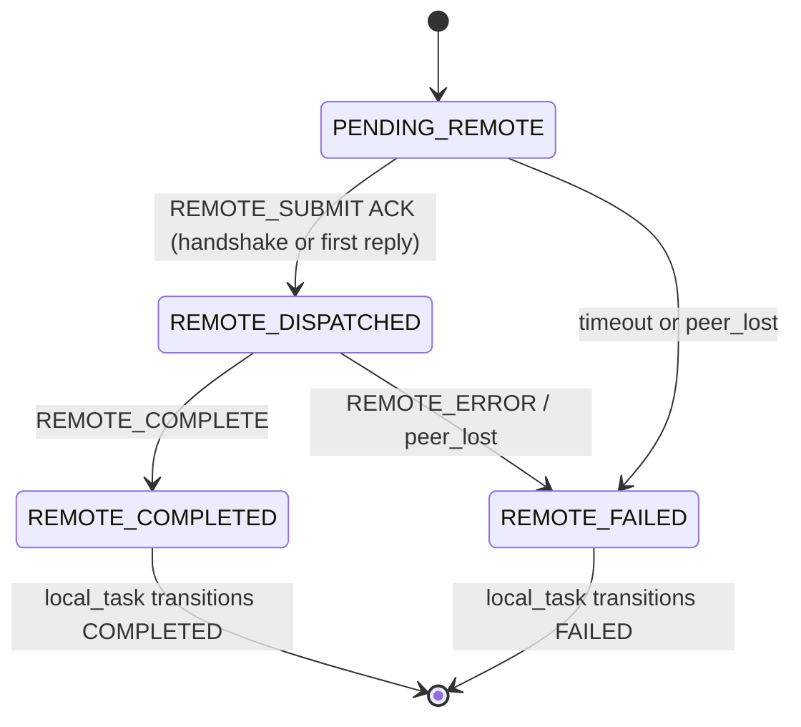
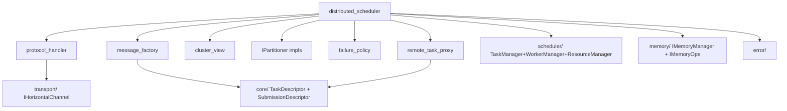
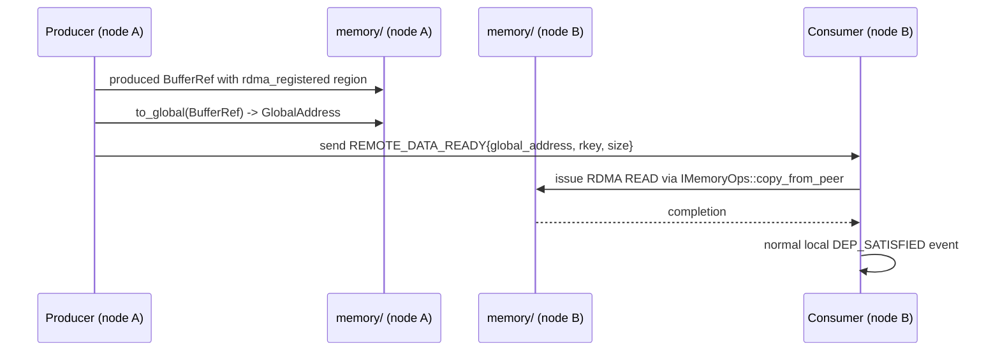

# Module Detailed Design: `distributed/`

## 1. Overview

### 1.1 Purpose

Implement the cross-node `ISchedulerLayer` variant (**`distributed_scheduler`**): partition Submissions across peer Nodes, drive the remote protocol (`REMOTE_SUBMIT` / `REMOTE_DEP_NOTIFY` / `REMOTE_COMPLETE` / `REMOTE_DATA_READY` / `REMOTE_ERROR`), and maintain the remote-task proxy state that ties local `TaskHandle`s to their remote producers.

### 1.2 Responsibility

**Single responsibility:** turn a local `SubmissionDescriptor` at the distributed Layer into well-formed remote submissions on one or more peers, and surface remote completions / errors back into the local scheduler via events. Transport, partition policy, and failure policy are delegated components injected at init.

### 1.3 Position in Architecture

- **Layer:** At and above the Pod Machine Level. Depends on `scheduler/` (base managers), `transport/` (horizontal channel), `memory/` (remote registration), `core/`, `error/`.
- **Depended on by:** `runtime/` composes it when deployment descriptor declares distributed levels.
- **Logical View mapping:** [Distributed Execution](../02-logical-view/02-scheduler.md#2133-distributed-scheduler), [Interfaces §2.6.2](../02-logical-view/09-interfaces.md#262-distributed-scheduler), [Process View §4.6](../04-process-view.md#46-distributed-scheduling-protocol).

---

## 2. Public Interface

### 2.1 `IPartitioner`

**Purpose:** Map a `SubmissionDescriptor` to a **PartitionPlan** — which Tasks go to which Nodes. Injected at Layer construction via `MachineLevelDescriptor::partitioner_factory`.

```cpp
struct PartitionPlan {
    struct Assignment {
        uint32_t task_index;     // into SubmissionDescriptor::tasks
        NodeId   target_node;    // local node for local execution
    };
    std::vector<Assignment> assignments;
    std::vector<NodeId>     participating_nodes;  // deduplicated union
};

class IPartitioner {
public:
    virtual ~IPartitioner() = default;

    virtual PartitionPlan partition(
        const SubmissionDescriptor& submission,
        const ClusterView&          cluster) = 0;

    virtual void on_cluster_change(const ClusterView& cluster) = 0;
};
```

**Strategies (default ships of this module):**

| Strategy | Contract | Determinism |
|----------|----------|-------------|
| `StaticPartitioner` | Uses `TaskDescriptor::target_node` set by the user / frontend. Missing value → local node. | **Fully deterministic** (caller-determined). |
| `RoundRobinPartitioner` | Assigns tasks to `participating_nodes` in index order. | **Deterministic** for a fixed cluster; policy re-initializes on `on_cluster_change`. |
| `DataLocalityPartitioner` | Inspects tensor arguments; assigns each Task to the Node holding the largest referenced input. Ties broken by `NodeId` order. | **Deterministic** given a cluster view. |
| `WorkStealingPartitioner` | Emits an initial plan (round-robin); publishes tasks to an idle-steal queue that peers pull from. | **Non-deterministic** (depends on peer response order); must not be used for replayable runs. |

**Contract:**

- **Preconditions:** `cluster.participating_nodes` non-empty; submission admitted at this Layer.
- **Postconditions:** `assignments.size() == submission.tasks.size()`; every target is a member of `participating_nodes`.
- **Determinism:** Documented per strategy (see table). `distributed_scheduler` invokes partitioners on the scheduler thread, so implementations may read/write their own state without locking.
- **Error behavior:** If no target can be found (all nodes unavailable) → `ErrorContext{PartitionTargetUnavailable}`; caller decides retry/fail.

### 2.2 `IDistributedProtocolHandler`

**Purpose:** Inbound message dispatch from the `IHorizontalChannel` into `distributed_scheduler` state machines. Concrete implementation owns decoding + validation + event emission; test seams may substitute fakes.

```cpp
class IDistributedProtocolHandler {
public:
    virtual ~IDistributedProtocolHandler() = default;

    // One method per message type. Each produces one or more SchedulerEvents
    // on the owning Layer's event queue.
    virtual void on_remote_submit     (NodeId from, const RemoteSubmitPayload&)     = 0;
    virtual void on_remote_dep_notify (NodeId from, const RemoteDepNotifyPayload&)  = 0;
    virtual void on_remote_complete   (NodeId from, const RemoteCompletePayload&)   = 0;
    virtual void on_remote_data_ready (NodeId from, const RemoteDataReadyPayload&)  = 0;
    virtual void on_remote_error      (NodeId from, const RemoteErrorPayload&)      = 0;
    virtual void on_heartbeat         (NodeId from, const HeartbeatPayload&)        = 0;
    virtual void on_peer_lost         (NodeId peer)                                 = 0;
};
```

**Contract:**

- **Correlation id required** on every inbound `HorizontalMessage`; dropped otherwise (diagnostic log + metric).
- **Thread safety:** Called from the horizontal-channel progress thread. Must not access `distributed_scheduler` state directly — only push events into the event queue.
- **Error behavior:** Malformed payloads → swallowed silently from the protocol perspective (transport already classifies corruption); a metric counter is incremented.

### 2.3 Remote Task Proxy

**Purpose:** A local shadow of a remote producer Task, used so local dependents can wait on it through the normal local state machine. Owned by `distributed_scheduler`.

```cpp
enum class RemoteProxyState : uint8_t {
    PENDING_REMOTE,      // REMOTE_SUBMIT queued but not acknowledged
    REMOTE_DISPATCHED,   // peer acknowledged submit
    REMOTE_COMPLETED,    // REMOTE_COMPLETE received
    REMOTE_FAILED,       // REMOTE_ERROR received or peer lost
};

struct RemoteTaskProxy {
    TaskKey          remote_task_key;  // producer key on peer node
    NodeId           peer_node;
    uint64_t         correlation_id;
    RemoteProxyState state;
    TaskHandle       local_task;       // task slot representing the proxy
    uint64_t         submit_ts_ns;
    uint32_t         retry_count;
};
```

**State machine (proxy-local):**



Each proxy owns exactly one local `TaskSlotRef` allocated from the `distributed_scheduler`'s `TaskSlotPool`. The proxy's `local_task` drives the same state machine in `core/TaskState` so local `DEP_SATISFIED` resolution works identically whether dependencies are local or remote.

### 2.4 `ClusterView`

**Purpose:** Read-only snapshot of the participating-node set + health; input to `IPartitioner` and internal balancing decisions.

```cpp
struct NodeEntry {
    NodeId       id;
    NodeRole     role;              // Coordinator, Worker, Storage, ...
    HealthStatus health;            // Ok, Degraded, Faulted
    uint64_t     last_heartbeat_ns;
    uint32_t     in_flight_tasks;
    uint32_t     declared_capacity; // from handshake
};

struct ClusterView {
    std::vector<NodeEntry>              nodes;
    std::vector<NodeId>                 participating_nodes;
    uint64_t                            version;       // bumped on any change
    uint64_t                            generation_ns; // monotonic update time
};
```

Published read-only via `DistributedScheduler::cluster_view()`. Updates serialized through the scheduler event loop.

### 2.5 Public Data Types

| Type | Description |
|------|-------------|
| `PartitionPlan`, `PartitionPlan::Assignment` | `IPartitioner` output. |
| `RemoteTaskProxy`, `RemoteProxyState` | Local shadow of a remote producer. |
| `ClusterView`, `NodeEntry`, `NodeRole`, `HealthStatus` | Cluster membership / health. |
| `FailurePolicy` | enum: `ABORT_ALL`, `CONTINUE_REDUCED`, `RETRY_ELSEWHERE`. |
| `DistributedStats` | Counters: remote_submits, remote_completes, remote_errors, peer_losses, retries. |

---

## 3. Internal Architecture

### 3.1 Internal Component Decomposition

```
distributed/
├── include/distributed/
│   ├── i_partitioner.h
│   ├── i_distributed_protocol_handler.h
│   ├── distributed_scheduler.h        # ISchedulerLayer impl facade
│   ├── cluster_view.h
│   └── remote_task_proxy.h
├── src/
│   ├── distributed_scheduler.cpp      # ISchedulerLayer composition
│   ├── protocol_handler.cpp           # Concrete IDistributedProtocolHandler
│   ├── remote_task_proxy.cpp          # Proxy pool + FSM driver
│   ├── cluster_view.cpp               # Membership + health tracking
│   ├── partitioners/
│   │   ├── static_partitioner.cpp
│   │   ├── round_robin_partitioner.cpp
│   │   ├── data_locality_partitioner.cpp
│   │   └── work_stealing_partitioner.cpp
│   ├── failure_policy.cpp             # ABORT_ALL / CONTINUE_REDUCED / RETRY_ELSEWHERE
│   └── message_factory.cpp            # Build RemoteSubmitPayload etc. from local SubmissionDescriptor
└── tests/
    ├── test_partitioners.cpp
    ├── test_remote_proxy_fsm.cpp
    ├── test_protocol_handler.cpp
    ├── test_cluster_view.cpp
    └── test_failure_policy.cpp
```

### 3.2 Internal Dependency Diagram



### 3.3 Key Design Decisions (Module-Level)

- **Remote dependencies use the local task state machine.** Remote proxies allocate real local slots and drive the same `TaskState` transitions, so `scheduler/` does not need special cases for remote deps.
- **Partitioner plugs in as a policy** — identical lifecycle rules to `ITaskSchedulePolicy` (synchronous, scheduler-thread only, no locks).
- **Protocol handler is a thin adapter** — it translates messages into `SchedulerEvent`s. All state mutation lives in `distributed_scheduler` proper, preserving the Stage-B mutation invariant (ADR-010).
- **Failure policy pluggable** — the three v1 modes (`ABORT_ALL`, `CONTINUE_REDUCED`, `RETRY_ELSEWHERE`) cover current deployments; additional policies are added as plug-ins.
- **Idempotent message handling.** Every inbound message carries `correlation_id` + `remote_task_key`; duplicate delivery is tolerated via a sliding dedup window.

---

[UPDATED: A5-P11: new section — unified peer-health FSM]

### 3.5 Unified peer-health FSM

`distributed_scheduler` owns a single **unified peer-health FSM** (`PeerHealthState`) co-owned by the circuit breaker (A5-P2), heartbeat (A10-P6), and authentication path (A6-P2). All scheduler-, memory-, and transport-side branches that read peer health MUST consult this FSM; no module keeps a shadow state. ADR-018 records the decision.

**States** (`enum class PeerHealthState`):

| State | Meaning | Outgoing sends allowed? |
|---|---|---|
| `HEALTHY` | Steady-state CLOSED breaker; heartbeats fresh; credential valid | yes |
| `SUSPECT` | First missed heartbeat or transient send error; below breaker threshold | yes (probed) |
| `OPEN` | Breaker tripped (`fail_threshold` reached); cooldown active | no |
| `HALF_OPEN` | Cooldown expired; `half_open_max_in_flight=1` probe outstanding | yes (1 probe) |
| `UNAVAILABLE(Quarantine)` | Known-bad peer held out for a bounded duration after repeated failures | no |
| `LOST` | Missed `heartbeat_miss_threshold` beats (fast path via `heartbeat_miss_threshold_fast=2` + hysteresis) | no |
| `AUTH_REVOKED` | HANDSHAKE failure or replayed-coordinator reject (`StaleCoordinatorClaim`); requires re-handshake | no |

**Ownership & transitions:**

- Breaker (A5-P2) drives `HEALTHY → SUSPECT → OPEN → HALF_OPEN → HEALTHY` with `AuthenticationFailed` weighted by `breaker_auth_fail_weight=10` (A5-P13).
- Heartbeat (A10-P6) drives `HEALTHY → SUSPECT → LOST` and `LOST → HEALTHY` through hysteresis; shards per 32 peers with pool cap = 4.
- Auth (A6-P2) drives `* → AUTH_REVOKED` on signature-verify failure or stale `coordinator_generation`; recovery requires a fresh HANDSHAKE (see ADR-020).
- Policy hook: callers use a single `get_peer_health(NodeId) → PeerHealthState` query; mutations go through `on_breaker_event / on_heartbeat_event / on_auth_event` — these are the only writers.

**Invariants:**

1. Exactly one `PeerHealthState` per peer at any instant; updates serialize on a per-peer seqlock.
2. Oscillation guard: `SUSPECT ↔ HEALTHY` transitions are rate-limited to prevent the 6.2.2 replay livelock (recovering network + credential churn).
3. `UNAVAILABLE(Quarantine)` and `AUTH_REVOKED` never auto-clear on timeout alone; they require an affirmative successful probe or re-handshake.

Cross-refs: A5-P2 (breaker), A5-P3 (coordinator fail-fast), A5-P13 (`breaker_auth_fail_weight`), A6-P2 (auth), A10-P6 (heartbeat sharding). ADR-018 is authoritative for the state set and transitions.

---

## 4. Key Data Structures

### 4.1 Outstanding remote dependency table

```cpp
struct OutstandingRemoteDep {
    TaskKey   remote_task_key;  // producer on peer
    NodeId    peer_node;
    TaskHandle local_dependent; // local consumer
    uint32_t   output_index;    // which OUT/INOUT satisfies the dep
    uint64_t   deadline_ns;
};

using OutstandingRemoteDeps =
    std::unordered_map<std::pair<TaskKey, NodeId>, OutstandingRemoteDep, PairHash>;
```

- Keyed by `(task_key, node_id)` for O(1) fan-out lookup when `REMOTE_DEP_NOTIFY` / `REMOTE_COMPLETE` arrives.
- Entries created on remote dispatch; removed on satisfaction or peer-lost.

### 4.2 Remote proxy pool

```cpp
class RemoteProxyPool {
    std::vector<RemoteTaskProxy> slots;
    std::vector<uint32_t>        free_slots;
    std::unordered_map<std::pair<TaskKey, NodeId>, uint32_t, PairHash> by_remote_key;
};
```

- Fixed capacity per Layer (configurable); exhaustion returns back-pressure at partition time.
- Lookup by `(TaskKey, NodeId)` for inbound message routing.

### 4.3 Dedup window

- Sliding ring of `{correlation_id, remote_task_key, message_type}` tuples, size `dedup_window` (default 4096).
- Duplicate inbound message → dropped with a metric; otherwise processed normally.

### 4.4 `ClusterView` storage

- Primary store: `std::vector<NodeEntry>` (keyed by array index for stable numbering during a run).
- `id → index` map for O(1) lookup.
- Immutable snapshots produced by bumping a seqlock; consumers can `cluster_view()` without blocking scheduler updates.

---

## 5. Processing Flows

### 5.1 `REMOTE_SUBMIT` → `REMOTE_DEP_NOTIFY` → `REMOTE_COMPLETE`

```mermaid
sequenceDiagram
    participant Sched as distributed_scheduler (local)
    participant Part as IPartitioner
    participant Proxy as RemoteProxyPool
    participant Tx as IHorizontalChannel
    participant Peer as remote distributed_scheduler
    participant Handler as protocol_handler (local)

    Sched->>Part: partition(SubmissionDescriptor, cluster)
    Part-->>Sched: PartitionPlan
    loop per remote assignment
        Sched->>Proxy: alloc proxy (PENDING_REMOTE, local_task)
        Sched->>Tx: send(peer, REMOTE_SUBMIT{submission, task_subset})
    end
    Peer->>Peer: local submit; allocate real tasks
    Note over Peer: Task executes; completes
    Peer->>Tx: send(local, REMOTE_DEP_NOTIFY{producer_key, consumer_key}) when producer done
    Tx->>Handler: on_remote_dep_notify(payload)
    Handler->>Sched: push DEP_SATISFIED event (local dependent)
    Peer->>Tx: send(local, REMOTE_COMPLETE{source_task_key, status, ts})
    Tx->>Handler: on_remote_complete(payload)
    Handler->>Sched: push REMOTE_COMPLETED event
    Sched->>Proxy: transition REMOTE_DISPATCHED -> REMOTE_COMPLETED
    Sched->>Sched: local_task transitions COMPLETED -> RETIRED
```

Key invariants:
- `REMOTE_DEP_NOTIFY` and `REMOTE_COMPLETE` carry the same `correlation_id` as the original `REMOTE_SUBMIT`.
- If a `REMOTE_DEP_NOTIFY` arrives before its producer's `REMOTE_DISPATCHED` ACK, it is buffered against the proxy's `local_task` in `PENDING_REMOTE`. Order is guaranteed by the horizontal channel's per-peer FIFO.

### 5.2 Partition to unavailable node with `failure_policy`

```mermaid
sequenceDiagram
    participant Sched as distributed_scheduler
    participant Part as IPartitioner
    participant Tx as IHorizontalChannel
    participant FP as FailurePolicy

    Sched->>Part: partition(SD, cluster)
    Part-->>Sched: PartitionPlan (includes node X)
    Sched->>Tx: send(X, REMOTE_SUBMIT)
    Tx-->>Sched: Status::TransportTimeout
    Sched->>FP: evaluate(peer=X, attempt=1, policy)
    alt RETRY_ELSEWHERE
        FP->>Part: re-partition excluding X
        Part-->>Sched: PartitionPlan (node Y)
        Sched->>Tx: send(Y, REMOTE_SUBMIT)
    else CONTINUE_REDUCED
        Sched->>Sched: mark affected local_task FAILED with PartialDistributedFailure
    else ABORT_ALL
        Sched->>Sched: emit REMOTE_ERROR to all peers; trigger shutdown
    end
```

### 5.3 Cross-node data movement hand-off



- `REMOTE_DATA_READY` is distinct from `REMOTE_DEP_NOTIFY`: the latter signals completion of a producer task; the former signals that its output bytes are addressable.
- The consumer's `IMemoryOps::copy_from_peer` is what actually moves bytes; `distributed/` only relays addresses and keys.

---

## 6. Concurrency Model

| Component | Thread |
|-----------|--------|
| `distributed_scheduler` state machines | Stage B of the scheduler event loop (inherited from `scheduler/`). |
| `IPartitioner` invocation | Scheduler thread only; synchronous. |
| `IDistributedProtocolHandler` | Horizontal-channel progress thread — produces events only; never mutates scheduler state. |
| `RemoteProxyPool` | Scheduler thread; dedup window accessed via relaxed atomics for read, scheduler-owned writes. |
| `ClusterView` | Scheduler thread writes; lock-free seqlock reads from any thread. |
| Heartbeat timer | Dedicated timer thread posts `TIMER_EXPIRED` events. |

No cross-thread locking required between `distributed/` and `scheduler/`: all information flows through the event queue.

---

## 7. Error Handling

| Condition | `ErrorCode` | Handling |
|-----------|-------------|----------|
| No target node available for a Task | `PartitionTargetUnavailable` | Returned from `partition()`; caller decides (usually `RETRY_ELSEWHERE` or fail Submission). |
| Peer heartbeat missed > threshold | `NodeLost` (critical) | Raise `peer_lost`; all outstanding proxies to that peer → REMOTE_FAILED; failure policy decides propagation. |
| Protocol version mismatch | `ProtocolVersionMismatch` | Connection rejected at handshake; peer excluded from `ClusterView`. |
| `REMOTE_ERROR` inbound | `RemoteError` (wraps original) | Proxy → REMOTE_FAILED; local `local_task` → FAILED with wrapped cause. |
| Remote submit timeout | `TransportTimeout` | Subject to `max_retries`; after exhaustion → failure policy. |
| Duplicate inbound message | none | Dropped; metric incremented. |
| Proxy pool exhausted | `SlotPoolExhausted` | Back-pressure: Submission admission blocked until proxies free. |

Errors reported by peers via `REMOTE_ERROR` preserve the original `ErrorContext` (via `RemoteErrorPayload::message_bytes`); the handler reconstructs and attaches it as the local proxy's cause.

---

## 8. Configuration

| Parameter | Type | Default | Description | Valid Range |
|-----------|------|---------|-------------|-------------|
| `partition_strategy` | enum | `DataLocality` | Selected `IPartitioner` | `{Static, RoundRobin, DataLocality, WorkStealing}` |
| `failure_policy` | enum | `RETRY_ELSEWHERE` | Default response to peer failures | `{AbortAll, ContinueReduced, RetryElsewhere}` |
| `max_retries` | `uint32_t` | 3 | Per-task remote retry count | ≥ 0 |
| `remote_proxy_pool_size` | `uint32_t` | 4096 | Outstanding remote-task proxies | > 0 |
| `dedup_window` | `uint32_t` | 4096 | Inbound message dedup ring size | ≥ 256 |
| `heartbeat_interval_ms` | `uint32_t` | 500 | Outbound heartbeat cadence (forwarded to transport) | matches `transport/` |
| `heartbeat_miss_threshold` | `uint32_t` | 6 | Heartbeats missed before `NodeLost` | ≥ 3 |
| `rdma_remote_read` | bool | true | Prefer RDMA READ for cross-node data | — |

---

## 9. Testing Strategy

### 9.1 Unit Tests

- `test_partitioners`:
  - Static partitioner honors `target_node`; missing field falls back to local.
  - Round-robin assigns tasks cyclically; cluster change re-shuffles cursor deterministically.
  - Data-locality assigns tasks to the node holding the largest input.
  - Work-stealing produces an initial valid plan; its non-determinism marker is asserted.
- `test_remote_proxy_fsm`: all `RemoteProxyState` transitions; no state leak on success and failure paths.
- `test_protocol_handler`: malformed messages rejected; duplicate messages de-duped.
- `test_cluster_view`: seqlock read consistency under concurrent updates.
- `test_failure_policy`: each mode behaves per its spec.

### 9.2 Integration Tests

- Three-node sim with `shm_loopback_horizontal` and one `distributed_scheduler` per node.
- 1000-Submission workload with `DataLocality` partitioner; assert all outputs correct and partition distribution near expected.
- Kill one node mid-workload: `RETRY_ELSEWHERE` keeps the workload draining; `ABORT_ALL` shuts down cleanly; `CONTINUE_REDUCED` surfaces partial failure per Submission.
- Protocol version mismatch: two nodes with incompatible `MessageHeader::version` refuse handshake; `runtime/init` fails at that node.

### 9.3 Edge Cases and Failure Tests

- `REMOTE_DEP_NOTIFY` arriving before producer's `REMOTE_SUBMIT` ACK (due to coalescing) — must be buffered and satisfied once the proxy exists.
- Simultaneous `NodeLost` for multiple peers — `FailurePolicy` evaluated per peer in `NodeId` order for determinism.
- Remote retry exhaustion after partial success — remaining dependents fail with `RemoteError`, cause preserved.
- Proxy pool exhaustion under burst — back-pressure surfaces as `AdmissionDecision::WAIT` upstream.

---

## 10. Performance Considerations

- **Cross-node submit budget < 50 μs** ([Process View §4.8.2](../04-process-view.md#482-cross-node-task-submission-pod-scheduler--remote-node-execution-start)). Dominant terms:
  - Partition decision: < 2 μs (pre-computed locality tables).
  - Serialize + send: < 5 μs.
  - Network transit: 1–5 μs RDMA / 5–50 μs TCP.
- **Proxy allocation O(1)** (pool + free list).
- **Dedup window O(1) lookup** (hash set of `correlation_id`s).
- **`ClusterView` snapshot lock-free** via seqlock; updates rare and small.
- **No heap allocation on inbound message handling** — payload parses into pre-sized structs; message factory reuses per-peer scratch buffer.

---

## 11. Extension Points

- **New `IPartitioner`** (e.g., topology-aware, cost-model-based) — implement against the interface, register factory in `runtime/` via `MachineLevelDescriptor`.
- **New `FailurePolicy`** — add enum value + `failure_policy.cpp` branch; document determinism.
- **New `MessageType`** — coordinate with `transport/` to bump `MessageHeader::version`; add handler in `IDistributedProtocolHandler`.
- **Custom `IDistributedProtocolHandler`** — test seams for protocol fuzzing / replay without a real transport.
- **Collectives extension** ([Q4](../09-open-questions.md)) — a future `ICollectiveScheduler` layer sits above `distributed_scheduler` without changing this module's contract.

---

## 12. Open Questions (Module-Level)

- Native collectives vs composed ([Q4](../09-open-questions.md)).
- Fine-grained failure policy per Task vs per Submission — current design is per peer; open whether to add Submission-level overrides.
- Cross-process determinism guarantee for `WorkStealing` — currently labeled non-deterministic; could be strengthened with a priority-queue contract.
- Handling of mid-run cluster resize (add/remove nodes) — `on_cluster_change` exists but semantics beyond round-robin cursor reset are deferred.

---

## 13. Review Amendments (R3)

This section records normative amendments from architecture-review run `2026-04-18-171357`. Each `[UPDATED: <id>: ...]` callout is authoritative over any prior wording it overlaps and is tied to an entry in `reviews/2026-04-18-171357/final/applied-changes/docs__pypto-runtime-design__modules__distributed.md.diff.md`. The unified peer-health FSM (A5-P11) is materialized as new §3.5 above.

> **[UPDATED: A1-P3: HEARTBEAT `function_bloom` advertises cache presence]** *Target: §5 Processing Flows (HEARTBEAT section).* `HeartbeatPayload.function_bloom[4]` is published by each peer so the coordinator can Bloom-check before inlining a binary in `REMOTE_SUBMIT`.

> **[UPDATED: A1-P6: `REMOTE_BINARY_PUSH` + per-peer descriptor template registry]** *Target: §5.1 Processing Flow; §8 Configuration.* Binaries travel on `REMOTE_BINARY_PUSH` before the first `REMOTE_SUBMIT` that needs them. `RemoteSubmitPayload` carries `descriptor_template_id` + delta-encoded `TaskDescriptor[]`; per-peer template registry. Partitioner projects per-peer (absorbs A10-P5).

> **[UPDATED: A2-P3: open extension-point enums; `DepMode` stays closed]** *Target: §2 Public Interface; §8 Configuration.* `FailurePolicy`, `TransportBackend`, `NodeRole` become string IDs resolved via registry at `Runtime::init`. `SimulationMode` stays open (A9-P6 option iii). `DepMode` remains closed `enum class` with rationale recorded in ADR-017.

> **[UPDATED: A2-P6: `DistributedMessageHandler` as free function in v1]** *Target: §2.2 `IDistributedProtocolHandler`.* v1 ships a **free function** `DistributedMessageHandler` in `distributed/protocol.hpp` keyed by `MessageType` (O(1) table; top-N builtin short-circuit + indexed load). Abstract `IDistributedProtocolHandler` class is demoted — declared as free function only until a second backend exists; ADR records adoption trigger. Invariant I-DIST-1 (A7-P4) keeps `distributed/` headers non-includable from `transport/`.

> **[UPDATED: A5-P1: `RetryPolicy` with exponential backoff + jitter]** *Target: §8 Configuration.* `struct RetryPolicy { uint32_t base_ms=50; uint32_t max_ms=2000; double jitter=0.3; uint32_t max_retries=5; };` n-th retry waits `min(max_ms, base_ms·2^n)·(1 + U[-jitter,+jitter])`. A8-P5 AlertRule surfaces SLO breach at n=4.

> **[UPDATED: A5-P2: per-peer circuit breaker (subsumed into §3.5 FSM)]** *Target: §3.4 cross-ref (now materialized as §3.5).* `struct CircuitBreaker { fail_threshold=5; cooldown_ms=10000; half_open_max_in_flight=1; };` States `{CLOSED, OPEN, HALF_OPEN}` per peer are mapped into the unified `PeerHealthState` (§3.5). Fast path: `thread_local` last-checked TSC short-circuits steady-state `HEALTHY`.

> **[UPDATED: A5-P3: v1 deterministic coordinator fail-fast]** *Target: §5 Processing Flows; §8 Configuration.* v1 surfaces `CoordinatorLost` within `heartbeat_timeout_ms` on every surviving peer; Python driver sees `DistributedError`. Add `coordinator_liveness_timeout_ms < heartbeat_timeout_ms`, default `3 × heartbeat_interval_ms`. Scope pinned to the failed Pod only; `cluster_view` generation bumps to the surviving-coordinator list (no cluster-wide fail-closed).

> **[UPDATED: A5-P10: DS4 per-`REMOTE_*` idempotency declaration]** *Target: §5 Processing Flows — message-idempotency table.* Every `REMOTE_*` handler MUST declare `idempotency ∈ {safe, at-most-once, at-least-once}` with an explicit dedup-key link. Doc-lint CI rule enforces the annotation.

> **[UPDATED: A5-P11: see new §3.5 Unified peer-health FSM above]** *Target: §3.5 (newly added).*

> **[UPDATED: A5-P13: `breaker_auth_fail_weight=10`]** *Target: §3.5 + §8 Configuration.* `AuthenticationFailed` events count 10× in the breaker accumulator so a flapping credential trips `OPEN` before normal `fail_threshold=5` is exhausted by benign retries.

> **[UPDATED: A6-P2: `coordinator_generation` on `HandshakePayload` + `StaleCoordinatorClaim` reject rule]** *Target: §2.4 `ClusterView` (now carries `verified: bool`); cross-ref transport.md §13.* `HandshakePayload` gains `coordinator_generation: uint64_t`. Mismatched generation is rejected with `StaleCoordinatorClaim`; recovery requires re-handshake (see ADR-020). Defeats malicious demoted-coordinator replay.

> **[UPDATED: A6-P11: `register_factory` post-`freeze()` gate (audit event)]** *Target: §2 Public Interface cross-ref to `runtime.md`.* Any factory registered into `distributed_scheduler` (policies, partitioners, handlers) flows through the single `register_factory` guard in `runtime/`; attempts after `freeze()` return `RegistrationClosed` and emit an audit event (A6-P6).

> **[UPDATED: A7-P1: strictly descending module graph; `distributed/` depended on by `runtime/` only]** *Target: §1.3 Position in Architecture.* Strictly descending edges `bindings > runtime > scheduler > distributed > transport > hal > core`. Remote notifications surface as `SchedulerEvent`s produced by `distributed/` and consumed by `scheduler/` via `core/` types. `scheduler/` must not `#include` `distributed/`.

> **[UPDATED: A7-P4: `distributed/include/distributed/protocol_payloads.h` owns payload structs (I-DIST-1)]** *Target: §2 Public Interface; §3.1.* All `RemoteXxxPayload` / `HeartbeatPayload` now live under `distributed/`. Transport public API narrows to `send(peer, MessageType, span<const std::byte>, Timeout)`. Invariant I-DIST-1 enforced via IWYU-CI (ADR-015).

> **[UPDATED: A7-P5: `distributed_scheduler` depends only on `ISchedulerLayer`]** *Target: §1.3; §3.1 Internal Component Decomposition.* Replace `scheduler/ TaskManager+WorkerManager+ResourceManager` dependency with `core/ ISchedulerLayer` (plus role interfaces from A7-P2). Shared machinery lifts to `scheduler/core/` abstract base if needed. `distributed_scheduler` stress-links only against `ISchedulerLayer.h`.

> **[UPDATED: A8-P3: `DistributedStats` schema]** *Target: §2.5 Public Data Types.* Enumerate `DistributedStats` with concrete fields + units (messages sent/received per type, retries, dup-detect hits, peer-health transitions). Latency histograms share the A8-P3 `LatencyHistogram` primitive.

> **[UPDATED: A8-P6: distributed trace time-alignment cross-ref]** *Target: §5 Processing Flows.* Merge algorithm per `07-cross-cutting-concerns.md §7.2.3`: primary sort by `(sequence, correlation_id, happens_before)` with skew-windowed reorder; tie-breaker `min(node_id)` in the youngest all-online epoch.

> **[UPDATED: A8-P7: `IFaultInjector` hooks in distributed dedup path]** *Target: §9 Testing Strategy.* `IFaultInjector::schedule_fault` is the sim-only seam feeding the A5-P5 chaos matrix; hooks in `distributed/` dedup cover RDMA-loss, heartbeat-miss, and coordinator isolation scenarios.

> **[UPDATED: A10-P2: v1 coordinator fail-fast (absorbed into A5-P3); v2 decentralize roadmap]** *Target: §2.4 ClusterView; §3.5 cross-ref.* v1 = fail-fast with scope pinned to failed Pod and `cluster_view` generation bump. v2 = decentralize via sticky routing + quorum `cluster_view` generation (roadmap-only ADR extension; not implemented in v1).

> **[UPDATED: A10-P6: heartbeat shard per 32 peers, pool cap=4]** *Target: §8 Configuration.* `heartbeat_miss_threshold_fast` (default 2), gated by transport-level TCP-keepalive / RDMA completion error; `heartbeat_miss_threshold=6` remains slow-path baseline. Sub-second `NodeLost` under hard failure; 5% packet loss tolerance via hysteresis. Shard heartbeat thread per 32 peers; thread-pool cap=4 (assumes ≤128 peers; Q18 revisit trigger).

> **[UPDATED: A10-P9: gate `WorkStealing` × `RETRY_ELSEWHERE`]** *Target: §3.1 Partitioner; §7 Error Handling.* Declare `WorkStealingPartitioner + RETRY_ELSEWHERE` incompatible unless an assignment log `(submission_id, task_index) → final_node_id` is written before dispatch. Live-only log (FUNCTIONAL mode; REPLAY not required).

---

**Document status:** Draft — ready for review.
