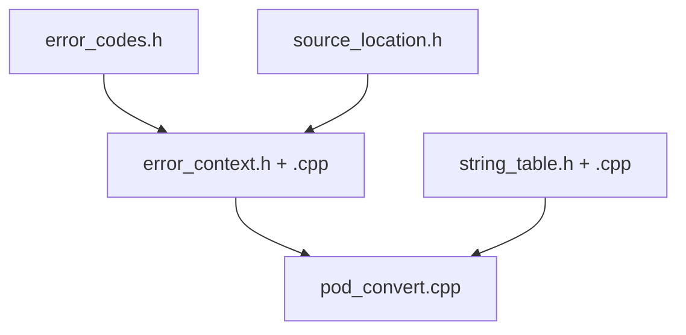
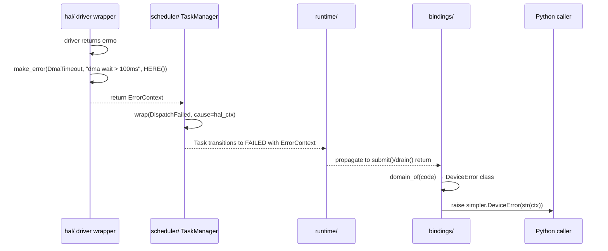
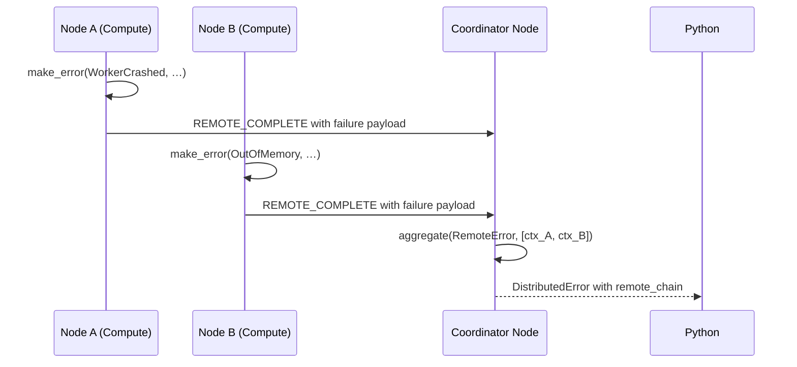

# Module Detailed Design: `error/`

## 1. Overview

### 1.1 Purpose

Centralize the runtime error model: stable error codes, structured `ErrorContext` for propagation across host and device boundaries, and mapping to Python exceptions in `bindings/`. This module is the single source of truth for the shape of a runtime error regardless of where it originated.

### 1.2 Responsibility

Own the **error taxonomy and signaling contract** used by every other module without taking dependencies on runtime logic. This module defines types; it does not classify, retry, or recover — those policies live in `scheduler/`, `distributed/`, and `runtime/`.

### 1.3 Position in Architecture

- **Layer:** Cross-cutting foundation (no dependency on `hal/` or `core/`).
- **Depends on:** Standard library only. No other runtime modules.
- **Depended on by:** All compiled modules; `bindings/` for exception mapping.
- **Logical View mapping:** Supports observability and failure scenarios described in the [Process View §4.7](../04-process-view.md) and [Scenario View](../06-scenario-view.md).

---

## 2. Public Interface

### 2.1 `ErrorCode`

**Purpose:** Stable, ABI-friendly identifier of a runtime failure category. Packed 32-bit integer per [Process View §4.7.2](../04-process-view.md#472-error-code-system): `[domain:8][severity:4][code:20]`.

**Sketch:**

```cpp
namespace simpler::error {

enum class Domain : uint8_t {
    Hal         = 0x01,
    Core        = 0x02,
    Scheduler   = 0x03,
    Memory      = 0x04,
    Transport   = 0x05,
    Distributed = 0x06,
    Profiling   = 0x07,
    Runtime     = 0x08,
    Bindings    = 0x09,
    Generic     = 0xFF,
};

enum class Severity : uint8_t {
    Info     = 0x0,   // diagnostic only
    Warning  = 0x1,   // degraded but continuing
    Error    = 0x2,   // operation failed, recoverable
    Critical = 0x3,   // shutdown required
};

// Packed 32-bit encoding: [domain:8][severity:4][code:20]
enum class ErrorCode : uint32_t {
    Ok                         = 0x0000'0000,

    // Hal (0x01)
    DeviceInitFailed           = 0x0120'0001,
    DmaTimeout                 = 0x0120'0002,
    RegisterReadFailed         = 0x0120'0003,
    DeviceReset               = 0x0130'0004,  // critical

    // Core (0x02)
    InvalidTaskHandle          = 0x0220'0001,
    InvalidSubmissionHandle    = 0x0220'0002,
    SlotPoolExhausted          = 0x0220'0003,
    FunctionNotRegistered      = 0x0220'0004,

    // Scheduler (0x03)
    DispatchFailed             = 0x0320'0001,
    WorkerCrashed              = 0x0320'0002,
    AdmissionRejected          = 0x0320'0003,
    CyclicDependency           = 0x0320'0004,

    // Memory (0x04)
    OutOfMemory                = 0x0420'0001,
    MemoryRegistrationFailed   = 0x0420'0002,
    AlignmentViolation         = 0x0420'0003,
    WorkspaceExhausted         = 0x0420'0004,

    // Transport (0x05)
    TransportDisconnected      = 0x0520'0001,
    TransportTimeout           = 0x0520'0002,
    TransportCorrupted         = 0x0520'0003,
    ChannelClosed              = 0x0520'0004,

    // Distributed (0x06)
    PartitionTargetUnavailable = 0x0620'0001,
    NodeLost                   = 0x0630'0002,  // critical
    ProtocolVersionMismatch    = 0x0620'0003,
    RemoteError                = 0x0620'0004,  // wraps cause

    // Runtime (0x08)
    RuntimeInitFailed          = 0x0830'0001,  // critical
    InvalidConfiguration       = 0x0820'0002,

    // Bindings (0x09)
    PythonCallbackFailed       = 0x0920'0001,
};

constexpr Domain   domain_of(ErrorCode c)   { return Domain  (uint32_t(c) >> 24); }
constexpr Severity severity_of(ErrorCode c) { return Severity((uint32_t(c) >> 20) & 0xF); }
constexpr uint32_t code_of(ErrorCode c)     { return  uint32_t(c) & 0xFFFFF; }

} // namespace simpler::error
```

**Contract:**

- **Stability:** Numeric values are stable across minor versions. Deprecated codes keep their number; new codes are appended. Removal requires a major version bump.
- **Domain partition:** Each module reserves its own `Domain` byte. `Generic` is reserved for `error/` itself.
- **Severity:** `Critical` implies distributed propagation per [Process View §4.7.5](../04-process-view.md#475-fatal-vs-recoverable); `Warning` must not fail user tasks.

### 2.2 `ErrorContext`

**Purpose:** Structured payload that travels with a failure from its origin to the caller (host C++, Python, or a remote node).

**Sketch (host form):**

```cpp
struct SourceLocation {
    const char* file;   // string literal; static storage
    const char* func;   // string literal; static storage
    uint32_t    line;
};

struct ErrorContext {
    ErrorCode                               code;
    std::string                             message;         // may be empty on device
    SourceLocation                          location;
    TaskKey                                 task_key;        // {layer_id, slot_index, generation}; may be zero
    LayerId                                 layer_id;        // may be 0 if origin has none
    uint32_t                                device_id = 0;
    uint32_t                                core_id   = 0;
    NodeId                                  node_id;         // default for local
    uint64_t                                timestamp_ns;    // monotonic
    uint64_t                                correlation_id;  // trace/span correlation
    std::shared_ptr<const ErrorContext>     cause;           // nested (host-only)
    std::vector<ErrorContext>               remote_chain;    // siblings from child nodes
};
```

**Sketch (device form — ABI-stable POD, no std types):**

```cpp
struct ErrorContextPod {
    uint32_t code;           // ErrorCode value
    uint32_t device_id;
    uint32_t core_id;
    uint32_t reserved;
    uint64_t task_key;       // packed TaskKey
    uint64_t timestamp_ns;
    uint32_t message_id;     // index into a fixed device-side string table
};
```

**Methods:**

| Method | Parameters | Returns | Description |
|--------|------------|---------|-------------|
| `make_error()` | `ErrorCode, std::string_view msg, SourceLocation` | `ErrorContext` | Construct a fresh error. Copies `msg`. |
| `wrap()` | `ErrorCode outer, ErrorContext cause` | `ErrorContext` | Add outer context while retaining cause chain. |
| `aggregate()` | `ErrorCode, span<ErrorContext>` | `ErrorContext` | Fan-in of distributed errors into `remote_chain`. |
| `to_pod()` | `const ErrorContext&` | `ErrorContextPod` | Lossy device-form conversion. |
| `from_pod()` | `const ErrorContextPod&, const StringTable&` | `ErrorContext` | Device-side error re-hydration on host. |
| `format()` | `const ErrorContext&` | `std::string` | Human-readable multi-line format (debug / logs). |

**Contract:**

- **Preconditions:** Factory functions accept either a string literal (safe) or an owned `std::string` — the internal representation owns the message bytes.
- **Postconditions:** `ErrorContext` is **immutable** after construction; methods return a new value rather than mutating.
- **Invariants:** Error codes are stable across minor versions. `cause` chain depth is bounded (§8: `max_cause_depth`, default 8); `aggregate` truncates past the bound.
- **Error behavior:** This module defines errors; it does not throw at the C ABI. Host wrappers may throw `std::runtime_error` for API misuse only; runtime errors travel as values.
- **Thread safety:** `ErrorContext` is immutable; shared via `shared_ptr` is safe concurrently. Factories are reentrant.
- **Ownership semantics:** `make_error` returns by value. `wrap` consumes the cause by value and retains it via `shared_ptr`. `aggregate` consumes its span.

### 2.3 Public Data Types

| Type | Description |
|------|-------------|
| `ErrorCode` | Packed `[domain:8][severity:4][code:20]` integer domain. |
| `Domain`, `Severity` | Decomposed fields of `ErrorCode` for routing / logging. |
| `ErrorContext` | Host-side carry type (owns message, cause). |
| `ErrorContextPod` | ABI-stable device-side form. |
| `SourceLocation` | Compile-time captured site (file/line/func). |
| `StringTable` | Monotonic id → string lookup for device-side messages. |

---

## 3. Internal Architecture

### 3.1 Internal Component Decomposition

```
error/
├── include/error/
│   ├── error_codes.h          # Public: ErrorCode, Domain, Severity, helpers
│   ├── error_context.h        # Public: ErrorContext, ErrorContextPod
│   ├── source_location.h      # Public: SourceLocation + SIMPLER_HERE() macro
│   └── string_table.h         # Public: device-side message id table
├── src/
│   ├── error_context.cpp      # Internal: wrap/aggregate/format helpers
│   ├── string_table.cpp       # Internal: registry management (host side)
│   └── pod_convert.cpp        # Internal: to_pod / from_pod converters
└── tests/
    ├── test_error_codes.cpp   # Code ranges, domain partition, stability
    ├── test_error_context.cpp # Immutability, cause depth cap, aggregate
    └── test_pod_convert.cpp   # Round-trip lossiness bounds
```

### 3.2 Internal Dependency Diagram



No upstream module dependencies. `error/` depends only on the standard library (and on a minimal freestanding subset when compiled for device).

### 3.3 Key Design Decisions (Module-Level)

- **Stable ABI-friendly codes** (§2.1 packed 32-bit form) are required for device-side reporting where exceptions are unavailable. See also [ADR-013](../08-design-decisions.md).
- **Two forms — rich host `ErrorContext`, POD `ErrorContextPod`** — avoids dragging `std::string` onto AICore while still allowing host callers to keep human-readable diagnostics. Device code references messages via a `message_id` that resolves against a host-side `StringTable`.
- **Immutability + `shared_ptr` cause chain** keeps propagation allocation-free on success paths and safe to share across threads on failure paths.

---

## 4. Key Data Structures

### 4.1 `ErrorCode` bit layout

```
  bit 31                                                     bit 0
  +--------+--------+--------+--------+--------+--------+--------+
  | domain:8        | sev:4  |           code:20                |
  +--------+--------+--------+--------+--------+--------+--------+
```

- **Hot path:** comparing against `ErrorCode::Ok` is a single 32-bit test; no table lookups.
- **Domain routing:** `domain_of(c)` is used by `bindings/` to pick the Python exception class (§2.2) without a hash map.

### 4.2 `ErrorContext` layout

| Field | Size (host) | Notes |
|-------|-------------|-------|
| `code` | 4 B | always populated |
| `location` | 24 B | three pointers/integer (literals; no alloc) |
| `task_key` | 12 B | optional |
| `device_id` / `core_id` / reserved | 12 B | optional |
| `node_id` | 16 B | default on local-only |
| `timestamp_ns` | 8 B | monotonic clock |
| `correlation_id` | 8 B | trace span id |
| `message` | 24 B (+ heap) | empty on success path |
| `cause` | 16 B | `shared_ptr` null by default |
| `remote_chain` | 24 B (+ heap) | empty by default |

Total ≈ 128 B; the shared pieces (`message`, `cause`, `remote_chain`) are zero-init / empty by default, so the common carry cost on the failure path is bounded without heap traffic until a message or cause is attached.

### 4.3 Device string table

```cpp
struct StringTable {
    static constexpr uint32_t kMaxEntries = 1024;
    std::array<std::string_view, kMaxEntries> strings;
    uint32_t count = 0;

    uint32_t register_static(std::string_view s); // init-time only
    std::string_view resolve(uint32_t id) const;
};
```

- **Invariant:** `register_static` is callable only during `runtime/` init before any device code runs; IDs are stable for the process lifetime.

---

## 5. Processing Flows

### 5.1 Local HAL failure → Python exception



Key points:
- Each boundary wraps rather than replacing, so the Python side sees both the outer class and the original `cause`.
- `correlation_id` is set once at `bindings/` entry and flows downward; every `wrap` / `make_error` inherits it.

### 5.2 Distributed error fan-in



- `aggregate` produces a single outer `RemoteError` with both child contexts in `remote_chain`.
- Truncation: if > `max_remote_chain` (§8, default 16) children fail, the remainder is summarized (`count`, `first_code`).

---

## 6. Concurrency Model

- `ErrorContext` is **immutable** after construction; all fields are copy-initialized and never mutated. Concurrent read across threads and shared ownership via `shared_ptr` is safe by construction.
- Factory functions (`make_error`, `wrap`, `aggregate`) are reentrant and do not hold any module-internal locks.
- `StringTable` registration is **init-phase only** and enforced by `runtime/`; after init the table is read-only and lock-free.
- No module-internal singletons on the hot path.

---

## 7. Error Handling

This module **is** the error representation. Internal failures during formatting or POD conversion use the following strategy:

| Scenario | Response |
|----------|----------|
| Message truncation (exceeds `max_message_bytes`) | Truncate with trailing `"…[truncated]"`; do not fail. |
| Cause chain exceeds `max_cause_depth` | Drop oldest frames; set `code=Generic::CauseChainTruncated` on the boundary frame. |
| `StringTable::resolve` miss | Return `"<unknown msg id N>"`; do not throw. |
| `to_pod` sees rich-only fields (`cause`, `remote_chain`) | Silently drop; caller is responsible for logging on host before conversion. |
| `from_pod` with unknown domain byte | Produce `ErrorContext{code=Generic(0xFF,Warning,1)}` so propagation continues. |

No `ErrorContext` construction path is allowed to throw beyond `std::bad_alloc`.

---

## 8. Configuration

| Parameter | Type | Default | Description | Valid Range |
|-----------|------|---------|-------------|-------------|
| `max_message_bytes` | `size_t` | 512 | Truncation bound for `ErrorContext::message` | [64, 4096] |
| `max_cause_depth` | `uint8_t` | 8 | Nested cause chain cap | [1, 32] |
| `max_remote_chain` | `uint16_t` | 16 | Fan-in width for distributed aggregation | [1, 256] |
| `capture_stack_trace` | `bool` | false | Debug builds only; expensive | — |

---

## 9. Testing Strategy

### 9.1 Unit Tests

| Test | Verifies |
|------|----------|
| `domain_partition` | Every runtime module's codes fall into its declared `Domain`; no overlap. |
| `code_stability` | Snapshot of public `ErrorCode` integer values matches golden table; any change triggers review. |
| `context_immutability` | `wrap`/`aggregate` do not mutate inputs. |
| `cause_chain_cap` | `wrap` chained > `max_cause_depth` times truncates with marker. |
| `pod_roundtrip` | `from_pod(to_pod(ctx))` preserves `code`, `task_key`, `timestamp_ns`, `device_id`, `core_id`. |
| `message_truncation` | Messages > `max_message_bytes` are trimmed with suffix. |
| `python_mapping_completeness` | Every `Domain` has a row in `bindings/`'s mapping table (static assertion via test fixture). |

### 9.2 Integration Tests

- Inject a failure at a mocked `hal::IExecutionEngine::submit_kernel` boundary and assert the Python call path raises the correct `simpler.*Error` with cause and correlation_id.
- Exercise distributed `REMOTE_ERROR` aggregation across a three-node loopback harness and check `remote_chain` content.

### 9.3 Edge Cases and Failure Tests

- `aggregate` with an empty span returns a well-formed `ErrorContext` with `code=Generic::EmptyAggregation`.
- `to_pod` on a context larger than POD capacity drops rich fields silently, test asserts host log line is emitted once (rate-limited).
- `StringTable` overflow at init aborts `runtime/init` with `InvalidConfiguration`.

---

## 10. Performance Considerations

- **Success path zero-alloc:** `ErrorCode::Ok` is a 32-bit compare; `ErrorContext` is never constructed on success.
- **Failure path:** one `ErrorContext` value (≈ 128 B) + optional `std::string` + optional cause allocation. `wrap` adds one `shared_ptr` cell.
- **Device path:** `ErrorContextPod` is 48 B, register-pressure compatible; no heap.
- Format helpers are opt-in (log/debug only); not on the propagation path.

---

## 11. Extension Points

- **New `ErrorCode` values** — pick the next unused `code:20` in the owning module's `Domain`. No other code changes required.
- **New Python exception mapping** — registered in `bindings/` against a `Domain`; see [bindings.md §2.2](bindings.md#22-exception-mapping).
- **Alternative sinks / formatters** — `format()` is the only host text path; replacements live in `profiling/` or consumer tools and do not modify this module.

---

## 12. Open Questions (Module-Level)

- Granularity of device-side messages: fixed `StringTable` vs per-build hash table — deferred until HAL review ([Q in 09-open-questions.md](../09-open-questions.md)).
- Whether `capture_stack_trace` should be available in release builds behind a runtime flag, or strictly debug-only.

**Document status:** Draft — ready for review.
