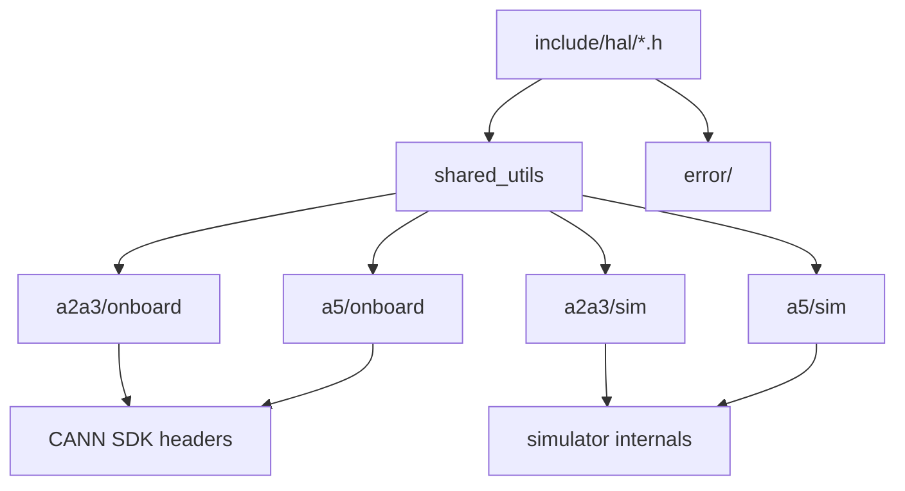
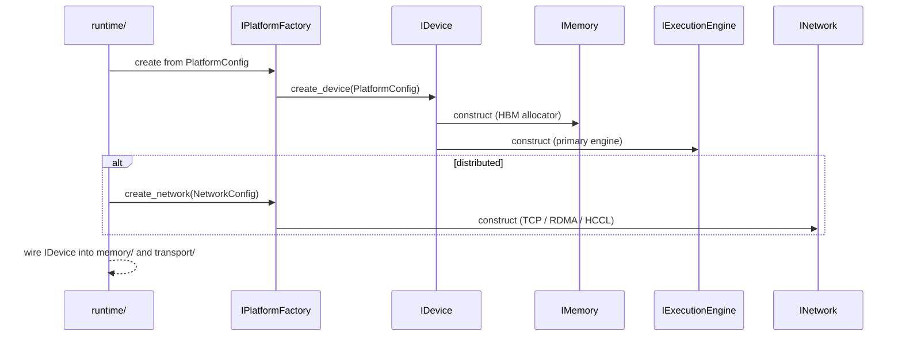

# Module Detailed Design: `hal/`

## 1. Overview

### 1.1 Purpose

Isolate platform-specific Ascend (`a2a3`, `a5`) and simulation details behind stable C++ interfaces so that `core/`, `memory/`, `transport/`, `scheduler/`, and `profiling/` remain platform-agnostic. `hal/` is the single seam where vendor SDKs (CANN) and simulator backends are allowed.

### 1.2 Responsibility

**Single responsibility:** expose `IDevice`, `IMemory`, `IExecutionEngine`, `IRegisterBank`, `INetwork`, and `IPlatformFactory` for the selected **Platform** and **Variant** (`ONBOARD` vs `SIM`). No scheduling, no memory placement policy, no protocol — only a thin, contractually stable wrapper around hardware primitives.

### 1.3 Position in Architecture

- **Layer:** Lowest compiled layer (with `error/`); no dependency on `core/`.
- **Depends on:** `error/` (for `ErrorContext`), vendor SDK headers under `onboard/` only, simulator internals under `sim/` only. No other modules.
- **Depended on by:** `core/` (for opaque handle types only), `memory/`, `transport/`, `scheduler/` (indirectly via `memory/`/`transport/`), `profiling/`, `runtime/`.
- **Logical View mapping:** Implements [Platform](../02-logical-view/10-platform.md) and the hardware-facing aspects of [Machine & Memory Model](../02-logical-view/11-machine-memory-model.md).

---

## 2. Public Interface

### 2.1 `IPlatformFactory`

**Purpose:** Construct the platform-bound set of HAL objects for a given deployment target `(Platform, Variant)` and (for `SIM`) a `SimulationMode`.

**Methods:**

| Method | Parameters | Returns | Description |
|--------|------------|---------|-------------|
| `name()` | — | `std::string` | Platform id, e.g. `"a2a3"`, `"a5"`. |
| `variant()` | — | `Variant` | `ONBOARD` or `SIM`. |
| `create_device()` | `const PlatformConfig&` | `std::unique_ptr<IDevice>` | Root device handle. |
| `create_network()` | `const NetworkConfig&` | `std::unique_ptr<INetwork>` | Network transport (may be null in pure-local deployments). |
| `platform_caps()` | — | `PlatformCaps` | Static capabilities: `max_blockdim`, `cores_per_blockdim`, `max_aicpu_threads`, `num_dies`, supported transports. |

**Contract:**

- **Preconditions:** Valid `PlatformConfig` from [runtime/](runtime.md) parsed deployment. `SIM` variants additionally require a valid `SimulationMode` (`PERFORMANCE`/`FUNCTIONAL`/`REPLAY`).
- **Postconditions:** Returned objects are owned by the caller (`unique_ptr`). Release order: children before factory.
- **Error behavior:** Returns `ErrorContext` with `ErrorCode::DeviceInitFailed` or `ErrorCode::InvalidConfiguration` on a creation failure; never throws across the module boundary.
- **Thread safety:** Factory methods are not required to be thread-safe; they are called once per factory during `Runtime::init`.
- **Ownership semantics:** `unique_ptr` transfer to runtime composition; no internal references retained by the factory.

### 2.2 `IDevice`

**Purpose:** Abstract a physical (or simulated) NPU device; root of HAL object graph for that device.

**Methods:**

| Method | Parameters | Returns | Description |
|--------|------------|---------|-------------|
| `id()` | — | `DeviceId` | Stable identifier within the runtime process. |
| `capabilities()` | — | `DeviceCaps` | Dynamic bitmask (DMA channels, SRIOV, HCCL support, …). |
| `memory()` | — | `IMemory&` | HBM / on-die memory backing. |
| `execution_engine()` | — | `IExecutionEngine&` | Primary compute engine. |
| `register_bank()` | — | `IRegisterBank&` | Memory-mapped register access (for fast dispatch). |
| `reset()` | — | `ErrorContext` | Hardware / simulator reset. |
| `query_health()` | — | `HealthStatus` | `Ok`, `Degraded`, `Faulted`. |

**Contract:**

- **Lifecycle:** `reset()` invalidates any outstanding `IExecutionEngine` handles; callers must re-bind. Documented in `runtime/` shutdown-recovery path.
- **Thread safety:** Accessors return references owned by the device; concurrent `const` access is safe. `reset()` is single-threaded.
- **Error behavior:** All methods report failures via `ErrorContext` return or out-parameter; `IDevice` never throws.

### 2.3 `IMemory`

**Purpose:** Low-level allocation on the device (HBM, SRAM, or simulator heap). This is **not** the scope-aware `IMemoryManager` (that lives in `memory/` and uses `IMemory`).

**Methods:**

| Method | Parameters | Returns | Description |
|--------|------------|---------|-------------|
| `allocate()` | `size_t bytes, size_t align, RegionId region` | `DeviceAddress` / error | Raw allocation. |
| `free()` | `DeviceAddress` | `void` | Release. |
| `map_host()` | `DeviceAddress, size_t bytes` | `HostMappedRange` | Host-visible window (may be unsupported per region). |
| `register_for_dma()` | `DeviceAddress, size_t bytes` | `DmaRegionHandle` / error | Pin for DMA / RDMA. |
| `deregister()` | `DmaRegionHandle` | `void` | Unpin. |
| `total_bytes()` / `free_bytes()` | — | `size_t` | Accounting. |

**Contract:**

- **Preconditions:** `align` is a power of two and ≥ 512 (per current architecture constraint).
- **Postconditions:** `allocate` either returns an aligned non-null `DeviceAddress` or an error; allocated ranges are disjoint.
- **Thread safety:** `allocate`/`free` are driver-serialized; `total_bytes`/`free_bytes` are atomic reads.
- **Error codes:** `ErrorCode::OutOfMemory`, `ErrorCode::AlignmentViolation`, `ErrorCode::MemoryRegistrationFailed`.

### 2.4 `IExecutionEngine`

**Purpose:** Submit kernel / Function invocations and observe completions. Implementations vary per Platform and per `SimulationMode` (see [Platform §2.8.1](../02-logical-view/10-platform.md)).

**Methods:**

| Method | Parameters | Returns | Description |
|--------|------------|---------|-------------|
| `submit_kernel()` | `KernelDispatch` | `EngineTicket` | Enqueue a kernel for execution. |
| `poll_complete()` | `EngineTicket`, out `CompletionInfo` | `bool` | Non-blocking completion query. |
| `wait_complete()` | `EngineTicket`, `Timeout` | `ErrorContext` | Blocking wait up to a timeout. |
| `abort()` | `EngineTicket` | `ErrorContext` | Attempt cancellation (may no-op on some engines). |
| `set_event_sink()` | `IEngineEventSink*` | `void` | Optional async notification (used by the event-driven scheduler). |

**Contract:**

- **Preconditions:** `KernelDispatch` references a `Function` already loaded in the engine's instruction cache (or is a simulator stub).
- **Postconditions:** `submit_kernel` returns a unique `EngineTicket`; `poll_complete(t)` eventually returns `true` or surfaces a timeout error.
- **Thread safety:** `submit_kernel` is allowed to be called from a dedicated dispatch thread per engine (the scheduler's Worker manager pins this). `poll_complete` is safe from any thread.
- **Error codes:** `ErrorCode::DispatchFailed`, `ErrorCode::DmaTimeout`, `ErrorCode::DeviceReset`.

**Simulation mode specialization (leaf engine only).** When `Variant = SIM`, the `IExecutionEngine` returned for the leaf Machine Level is one of three factories:

| Mode | Implementation | Compute |
|------|---------------|---------|
| `PERFORMANCE` | `sim::perf_engine` | No compute; advances a simulated clock using a per-`Function` timing model; emits trace events. |
| `FUNCTIONAL` | `sim::cpu_engine` | Runs a CPU backend of the kernel body; produces real outputs. |
| `REPLAY` | `sim::replay_engine` | Consumes a captured trace; reconstructs timing without re-executing compute. |

Higher-layer engines (`Chip`, `Device`, `Host`) use the same onboard implementations regardless of leaf mode — the abstraction is leaf-only per [Platform §2.8.1](../02-logical-view/10-platform.md).

### 2.5 `IRegisterBank`

**Purpose:** MMIO-style register poke/peek for the fast dispatch path (Host → AICPU / Chip → Core).

**Methods:**

| Method | Parameters | Returns | Description |
|--------|------------|---------|-------------|
| `poke_u32()` | `RegId, uint32_t value` | `void` | Unchecked write (latency < 100 ns target). |
| `peek_u32()` | `RegId` | `uint32_t` | Unchecked read. |
| `poke_block()` | `RegId base, span<const uint32_t>` | `void` | Contiguous write (register window). |
| `fence()` | — | `void` | Store barrier (flush write buffers). |

**Contract:**

- **Preconditions:** `RegId` is valid for the device variant; the caller has the write privilege (enforced by construction — HAL only hands out a `IRegisterBank&` to authorized components).
- **Thread safety:** **Caller-serialized.** Register access must be pinned to the scheduler/dispatch thread of the owning Layer; HAL does not serialize internally.
- **Error behavior:** Register read errors map to `ErrorCode::RegisterReadFailed`; these are rare and treated as device-reset signals by the caller.

### 2.6 `INetwork`

**Purpose:** Platform-level network abstraction used by `transport/` to build Horizontal Channels. May be null when distributed support is disabled.

**Methods:**

| Method | Parameters | Returns | Description |
|--------|------------|---------|-------------|
| `connect()` | `const EndpointSpec&` | `std::unique_ptr<INetConnection>` | Client-side connect. |
| `listen()` | `const EndpointSpec&` | `std::unique_ptr<INetListener>` | Server-side bind/accept. |
| `caps()` | — | `NetworkCaps` | RDMA/HCCL/TCP matrix, MTU. |

**Contract:**

- **Timeouts:** All `INetConnection` operations accept a mandatory timeout (see [transport.md](transport.md) and [03-development-view.md §3.4](../03-development-view.md)).
- **Thread safety:** Established connections can be read from and written to from different threads if the backend supports it; documented per backend.
- **Error codes:** `ErrorCode::TransportDisconnected`, `TransportTimeout`, `NodeLost` (for heartbeat loss).

### 2.7 Public Data Types

| Type | Description |
|------|-------------|
| `PlatformConfig` | Per-factory config: target (`a2a3`/`a5`), variant, `SimulationMode` (for `SIM`), device ids, capability overrides. |
| `Variant` | `enum class { Onboard, Sim }`. |
| `SimulationMode` | `enum class { Performance, Functional, Replay }` (SIM only). |
| `PlatformCaps`, `DeviceCaps`, `NetworkCaps` | Static and dynamic capability structs. |
| `DeviceId`, `DeviceAddress`, `DmaRegionHandle`, `EngineTicket`, `RegId` | Opaque handle types, POD-friendly. |
| `KernelDispatch` | `{function_id, args_blob, grid, block, stream_hint}` — language-neutral shape. |
| `CompletionInfo` | `{status_code, duration_ns, counters[]}`. |
| `HealthStatus` | `enum class { Ok, Degraded, Faulted }`. |

---

## 3. Internal Architecture

### 3.1 Internal Component Decomposition

```
hal/
├── include/hal/
│   ├── i_platform_factory.h    # Public: IPlatformFactory
│   ├── i_device.h              # Public: IDevice
│   ├── i_memory.h              # Public: IMemory
│   ├── i_execution_engine.h    # Public: IExecutionEngine
│   ├── i_register_bank.h       # Public: IRegisterBank
│   ├── i_network.h             # Public: INetwork / connection / listener
│   └── types.h                 # Public: opaque handles, caps, enums
├── src/
│   └── shared_utils/           # Caps merging, endpoint parsing, config validation
├── a2a3/
│   ├── onboard/
│   │   ├── cann_device.cpp     # CANN runtime wrapper around hardware device
│   │   ├── cann_memory.cpp     # HBM allocation via CANN memory APIs
│   │   ├── cann_engine.cpp     # AICore/AICPU kernel submission via CANN
│   │   ├── mmio_reg_bank.cpp   # MMIO register bank using CANN mmap
│   │   └── cann_network.cpp    # HCCL/RDMA wrapper
│   └── sim/
│       ├── sim_device.cpp      # Software device composition
│       ├── sim_memory.cpp      # Host-backed allocator with alignment
│       ├── perf_engine.cpp     # SIM PERFORMANCE mode leaf engine
│       ├── cpu_engine.cpp      # SIM FUNCTIONAL mode leaf engine (host CPU)
│       ├── replay_engine.cpp   # SIM REPLAY mode leaf engine
│       ├── sim_reg_bank.cpp    # Software register bank with memory store
│       └── loopback_network.cpp# In-process network for tests
├── a5/
│   ├── onboard/ (analogous files)
│   └── sim/     (analogous files)
└── tests/
    ├── test_caps.cpp
    ├── test_mmio.cpp            # Sim-only poke/peek
    ├── test_sim_engine.cpp      # All three modes
    └── test_network_loopback.cpp
```

### 3.2 Internal Dependency Diagram



- Variant-specific implementations depend only on driver/SDK headers plus public `hal/include`. No upward references to `core/`, `memory/`, etc.
- `onboard/` directories are the **only** place where vendor SDK symbols appear in the codebase.

### 3.3 Key Design Decisions (Module-Level)

- **Vendor SDK isolation:** CANN / HCCL symbols are banned outside `hal/*/onboard/`. Enforced by lint + build-time include scoping.
- **Simulation parity:** Sim implementations match onboard contracts verbatim for all non-leaf engines so scheduling tests are identical across variants (related to [ADR-011](../08-design-decisions.md)).
- **Leaf-only Simulation Mode specialization:** Only `IExecutionEngine` for the leaf level varies with `SimulationMode`; all other HAL objects are shared between modes — this is what keeps the rest of the runtime oblivious to simulation.
- **Link-time specialization for hot paths:** `IRegisterBank::poke_u32` and engine dispatch are inlined at the call site of the selected platform build; virtual indirection is kept off the nanosecond path.

---

## 4. Key Data Structures

### 4.1 `PlatformCaps` and `DeviceCaps`

```cpp
struct PlatformCaps {
    uint32_t max_blockdim;         // 24 (a2a3) / 36 (a5)
    uint32_t cores_per_blockdim;   // 3
    uint32_t max_aicpu_threads;    // 4 / 7
    uint32_t max_cores;            // 72 / 108
    uint32_t num_dies;             // 1 / 2
    uint32_t supported_transports; // bitmask: TCP=1, RDMA=2, HCCL=4, SHM=8
};

struct DeviceCaps {
    uint32_t flags;        // bitmask: DMA_CHANNELS, SRIOV, PEER_TO_PEER,
                           //          HCCL_LOCAL, PROFILING_SUPPORT
    uint32_t num_dma_channels;
    uint32_t num_execution_engines;
    uint64_t total_hbm_bytes;
};
```

### 4.2 `KernelDispatch`

```cpp
struct KernelDispatch {
    FunctionId  function_id;        // from FunctionRegistry (content-hash keyed)
    uint32_t    args_size;
    const void* args_blob;          // layout owned by scheduler; HAL copies to engine queue
    Grid        grid;               // x/y/z
    Block       block;              // x/y/z
    StreamHint  stream_hint;        // optional prioritization hint
};
```

Alignment: `args_blob` must be 64-byte aligned per Ascend DMA requirements; validation is in `shared_utils`.

### 4.3 Device capabilities bitmask

Device capability bitmask values are stable integers; new capabilities are added only by appending bits (never reordering) to preserve ABI for sim/onboard parity.

---

## 5. Processing Flows

### 5.1 Platform bootstrap (normal path)



### 5.2 Device reset / error recovery

```mermaid
sequenceDiagram
    participant Eng as IExecutionEngine
    participant Dev as IDevice
    participant Mem as IMemory
    participant Sched as scheduler/
    participant Run as runtime/

    Eng-->>Sched: wait_complete returns ErrorCode::DmaTimeout
    Sched->>Run: escalate FATAL ErrorContext
    Run->>Dev: reset()
    Dev->>Mem: invalidate mappings
    Dev->>Eng: invalidate tickets
    Dev-->>Run: ErrorContext Ok or DeviceReset (critical)
    alt recovered
        Run->>Run: rebind memory + engines; resume
    else unrecoverable
        Run-->>Run: propagate simpler.DeviceError; shutdown
    end
```

- `reset()` is the only HAL entry point that tears down internal state; other methods never silently rebuild it.

### 5.3 `SIM REPLAY` bring-up

- `IPlatformFactory::create_device` sees `SimulationMode::Replay`.
- The leaf `IExecutionEngine` factory returns `replay_engine` configured with a trace source path from `PlatformConfig`.
- Remaining HAL objects match `PERFORMANCE` mode exactly, differing only in which leaf engine is bound.

---

## 6. Concurrency Model

| Interface | Callable from |
|-----------|---------------|
| `IPlatformFactory` (all) | Single init thread only. |
| `IDevice::reset()` | Dedicated recovery thread or `runtime/` shutdown thread; never from scheduler. |
| `IDevice` accessors | Any thread (const). |
| `IMemory::allocate()/free()` | Driver-serialized internally on onboard; simulator uses a single mutex. Callers may use from any thread. |
| `IExecutionEngine::submit_kernel()` | Pinned to the owning Layer's dispatch thread (enforced by `scheduler/`). |
| `IExecutionEngine::poll_complete()` | Any thread (lock-free ticket store). |
| `IExecutionEngine::wait_complete()` | Dedicated progress thread or worker. |
| `IRegisterBank` | **Caller-serialized.** No internal locks; used only from the scheduler/dispatch thread of the layer that owns the bank. |
| `INetwork::connect/listen/accept` | Single progress thread per backend (or network reactor thread). |

No HAL object owns a lock that spans calls between methods; all locks are internal and short.

---

## 7. Error Handling

Translate driver errno / vendor SDK return codes into `ErrorCode` (domain `Hal = 0x01`). Preserve vendor diagnostic strings in `ErrorContext::message` when available.

| Driver / Source | `ErrorCode` |
|----------------|-------------|
| CANN DMA failure | `DmaTimeout` |
| CANN device init failure | `DeviceInitFailed` |
| MMIO read fault | `RegisterReadFailed` |
| HBM alloc failure | `OutOfMemory` (memory domain) |
| RDMA MR registration | `MemoryRegistrationFailed` |
| TCP disconnect | `TransportDisconnected` |
| Heartbeat loss | `NodeLost` (critical) |
| Hardware fault | `DeviceReset` (critical) |

**Fatal vs recoverable:** anything with `Severity::Critical` triggers the `runtime/` shutdown path; others are surfaced to `scheduler/` which decides retry/skip via policy.

---

## 8. Configuration

| Parameter | Type | Default | Description | Valid Range |
|-----------|------|---------|-------------|-------------|
| `variant` | enum | `Sim` in dev, `Onboard` in deployed | Build target variant | `{Onboard, Sim}` |
| `simulation_mode` | enum | `Performance` (when `Sim`) | Leaf simulator mode | `{Performance, Functional, Replay}` |
| `device_ids` | array | all discovered | Restrict to specific device IDs | platform-max |
| `engine_timeout_ms` | `uint32_t` | 5000 | Default `wait_complete` timeout | [1, 600'000] |
| `dma_alignment` | `size_t` | 512 | Required alignment for DMA buffers | pow2 ≥ 64 |
| `capability_overrides` | map | {} | Test-only override of `DeviceCaps` bits | — |

---

## 9. Testing Strategy

### 9.1 Unit Tests

- `test_caps`: `PlatformCaps` per target matches the values in [Platform §2.8](../02-logical-view/10-platform.md).
- `test_mmio`: Sim register bank poke/peek, fence semantics, register-block ordering.
- `test_sim_engine`: All three `SimulationMode` factories construct and execute a trivial function with expected output (compute for `Functional`, timing trace for `Performance`, replay output for `Replay`).
- `test_memory_alignment`: 512-byte alignment enforcement; overflow/underflow boundary tests.
- `test_handle_stability`: Opaque handles stable across runs at the ABI level.

### 9.2 Integration Tests

- Onboard CI on real hardware: full platform bootstrap, smoke kernel, teardown.
- Sim CI on host: full suite of `PERFORMANCE` / `FUNCTIONAL` / `REPLAY` runs.
- `network_loopback`: two `IPlatformFactory` instances in-process exchanging traffic over the in-process network backend.

### 9.3 Edge Cases and Failure Tests

- `reset()` during active submissions — assert all tickets surface `DeviceReset` in severity order.
- DMA timeout fault injection at the sim memory layer.
- Register read fault during dispatch; scheduler is expected to mark the task `FAILED` and the device `Faulted`.
- `INetwork::connect` to unreachable endpoint must fail within `engine_timeout_ms` with `TransportTimeout`.

---

## 10. Performance Considerations

- **Register path (< 100 ns).** `IRegisterBank::poke_u32` is a static-dispatched inline when built against a specific platform; the virtual interface is preserved in headers but eliminated by link-time specialization (one `IPlatformFactory` per build).
- **Engine submit path.** `submit_kernel` avoids allocation — `args_blob` is written into a preallocated ring shared with the engine; completions are reported through a lock-free ticket store (`poll_complete` is a single atomic load).
- **Memory alloc path.** Allocations live at `runtime/` init or per-Submission; the hot path uses `memory/`-level allocators backed by `IMemory` rather than calling `IMemory::allocate` per task.
- **Sim overhead.** `PERFORMANCE` mode keeps compute off the host; `FUNCTIONAL` mode allows compute but measures it separately (never reported as simulated time).
- Latency budgets to respect: [Process View §§4.8.1, 4.8.3](../04-process-view.md#48-latency-budgets-rule-x9) — the sub-budgets for engine submit and register poke are the HAL's responsibility.

---

## 11. Extension Points

- **New platform directory.** Add `hal/<new_platform>/{onboard,sim}/` implementing the same public interfaces; CMake's `platform.cmake` selects sources by `TARGET_PLATFORM` ([03-development-view.md §3.3.3](../03-development-view.md)).
- **New simulation mode.** Add a new `IExecutionEngine` factory under `sim/` and register it against `SimulationMode`; no changes above `hal/`.
- **New network backend.** Implement `INetwork` under the platform's `onboard/` or as a shared backend module selected via `transport/` build option ([03-development-view.md §3.3.4](../03-development-view.md)).
- **Capability bits.** Append new `DeviceCaps` flag bits; never reorder.

---

## 12. Open Questions (Module-Level)

- Alignment of `INetwork` with RDMA vs HCCL feature matrix — see [Q4](../09-open-questions.md).
- Whether `engine_timeout_ms` should be per-function-class (compute vs DMA) rather than a single default.
- Formalization of SPMD-level kernel dispatch shape — deferred until `core/` locks down SPMD handles.

---

## 13. Review Amendments (R3)

This section records normative amendments from architecture-review run `2026-04-18-171357` that apply to this module. Each `[UPDATED: <id>: ...]` callout is authoritative over any prior wording it overlaps, and is cross-referenced in `reviews/2026-04-18-171357/final/applied-changes/docs__pypto-runtime-design__modules__hal.md.diff.md`.

> **[UPDATED: A4-P1: canonical HAL enum casing]** *Target: §2.7 Public Data Types; §8 Configuration.* Rewrite `Variant { Onboard, Sim }` → `{ ONBOARD, SIM }`; `SimulationMode { Performance, Functional, Replay }` → `{ PERFORMANCE, FUNCTIONAL, REPLAY }` to match every other view and ADR-011. Config column examples are updated accordingly; the rename is contained in `modules/hal.md` + ADR-011.

> **[UPDATED: A1-P3: Function Cache LRU bound + HEARTBEAT presence bloom]** *Target: §8 Configuration; references §2.6 `INetwork` / transport heartbeat cross-link.* Function Cache bounded by `function_cache_bytes` (default 64 MiB) with LRU; evictions recorded in `RuntimeStats`; peer cache presence published in `HeartbeatPayload.function_bloom[4]` (`uint64_t`); coordinator Bloom-checks before deciding to inline a binary in `REMOTE_SUBMIT`.

> **[UPDATED: A1-P13: bound `args_blob` copy cost with 1 KiB ring-slot fast path]** *Target: §2.4 `IExecutionEngine` — `KernelDispatch` contract; §8 Configuration.* For `args_size ≤ 1 KiB` HAL copies through a pre-registered ring slot (Host→Chip DMA ≥ 4 GB/s → ≤ 250 ns). For `args_size > 1 KiB`, the scheduler stages args in a data-plane `BufferRef` and passes a handle; §4.8.1 budget extends by `0.5 μs/KiB` above the threshold. Staging-allocation failure surfaces `ErrorCode::ResourceExhausted` (see A5-P12).

> **[UPDATED: A5-P12: name `ErrorCode::ResourceExhausted` for BufferRef staging alloc failure]** *Target: §7 Error Handling (slow-path note).* Staging `BufferRef` allocation failure on A1-P13's `>1 KiB` slow path surfaces `ErrorCode::ResourceExhausted`. Single-sentence normative note; mirrored by one row in `scheduler.md §5`.

> **[UPDATED: A7-P3: invert `core/` ↔ `hal/` for handle types]** *Target: §2.7 Public Data Types; §1.3 Position in Architecture.* Move `using DeviceAddress = std::uint64_t;` and `using NodeId = std::uint64_t;` from `hal/` to `core/types.h`. HAL re-exports from its own `types.h` (which `#include <core/types.h>`). After the move, `core::TaskHandle` compiles without depending on `hal/`.

> **[UPDATED: A8-P1: injectable `IClock`]** *Target: new §2.8 `IClock`.* Introduce `IClock { now_ns(); monotonic_raw_ns(); steady_tick(); }` with realizations `SystemClock`, `FakeClock`, `PerformanceSimClock`. Threaded via `ProfilingConfig`, `worker_timeout_ms`, heartbeat, and all `Timeout` uses. Release bin uses link-time specialization inlining `CLOCK_MONOTONIC_RAW`; no overhead vs today.

> **[UPDATED: A8-P6: trace time-alignment contract]** *Target: §2.8 `IClock` / `IClockSync` addendum.* Introduce `IClockSync::offset_ns()` alongside `IClock`. PTP/NTP dependency declared; `skew_max_ns ≤ 100 µs` bounded. Merge algorithm: primary sort by `(sequence, correlation_id, happens_before)` with skew-windowed reorder; tie-breaker `min(node_id)` in the youngest all-online epoch; correlation-id chain dominates timestamp ties.

> **[UPDATED: A8-P7: `IFaultInjector` sim-only seam]** *Target: §2 Public Interface (sim-only); §9.3 Edge Cases and Failure Tests.* Add `IFaultInjector::schedule_fault(FaultSpec)` compiled only under sim. Covers DMA-timeout, register-read-fault, RDMA-loss, heartbeat-miss, AICore-hang, slot-pool-exhausted. Hooks into `hal/sim`, `transport/`, `distributed/` dedup. Drives the A5-P5 chaos matrix; never linked in onboard release.

> **[UPDATED: A8-P11: HAL contract test suite + header-independence lint]** *Target: §9 Testing Strategy — Contract Test Suite bullet.* A single `.cpp` suite runs against both `a2a3sim` and `a2a3` onboard CI. An IWYU-CI rule is added to enforce Invariant I-DIST-1 (`distributed/` headers non-includable from `transport/` per A2-P6 / A7-P4), and to verify that HAL handle types remain sourced from `core/types.h` per A7-P3. This suite is a required CI check.

---

**Document status:** Draft — ready for review.
