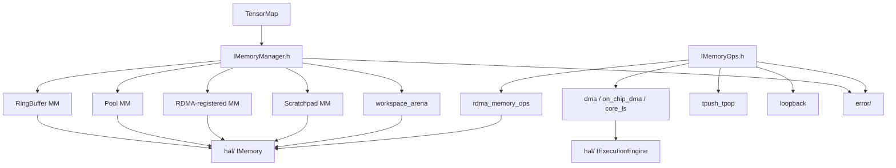
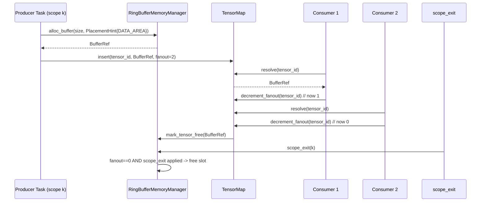

# Module Detailed Design: `memory/`

## 1. Overview

### 1.1 Purpose

Implement **per-Layer memory management**: region-aware allocation, Group Workspace arenas, tensor-address translation, and cross-scope transfer operations (`IMemoryOps`). This module is the exclusive owner of the Non-Aliasing Intermediate-Memref Invariant ([§2.1.6 Memory Manager](../02-logical-view/04-memory.md#216-memory-manager)) that makes the runtime's single-valued `producer_index` sound (ADR-012, ADR-013).

### 1.2 Responsibility

**Single responsibility:** allocate, map, and transfer tensor data across Machine-Level **Memory Scopes** using HAL primitives, without embedding scheduling policy. Both control-plane and data-plane consumers use this module — separation is by **Region**, not by module ([§2.1.5.1](../02-logical-view/04-memory.md#2151-memory-region)).

### 1.3 Position in Architecture

- **Layer:** Infrastructure parallel to `transport/`.
- **Depends on:** `hal/` (`IMemory`, `IDevice`), `core/` (Task / BufferRef types), `error/`.
- **Depended on by:** `scheduler/` (workspace + buffer lifecycle), `distributed/` (remote registration), `runtime/` (composition).
- **Logical View mapping:** [Memory](../02-logical-view/04-memory.md), [Machine & Memory Model](../02-logical-view/11-machine-memory-model.md), [Task Model §2.4.D](../02-logical-view/07-task-model.md#24d-group-workspace-memory).

---

## 2. Public Interface

### 2.1 `IMemoryManager`

**Purpose:** Allocate, free, and track the lifetime of backing storage within one Memory Scope (pool, ring buffer, RDMA-registered region, scratchpad, etc.). Uniform interface across all Machine Levels; implementation pluggable per Level.

**Sketch (authoritative for this module):**

```cpp
class IMemoryManager {
public:
    virtual ~IMemoryManager() = default;

    // --- Region-aware allocation (preferred) ---
    virtual TaskSlotRef alloc_task_slot(PlacementHint hint = {})                 = 0;
    virtual void        free_task_slot(TaskSlotRef slot)                         = 0;

    virtual BufferRef   alloc_buffer(size_t size, PlacementHint hint = {})       = 0;
    virtual void        free_buffer(BufferRef buf)                               = 0;

    // Backwards-compatible overload (targets RegionId::Default).
    virtual BufferRef   alloc_buffer(size_t size, size_t alignment)              = 0;

    // --- Group Workspace (§2.1.6.A) ---
    virtual WorkspaceHandle alloc_workspace(size_t total_bytes,
                                            PlacementHint hint = {})             = 0;
    virtual BufferRef       workspace_subrange(WorkspaceHandle handle,
                                               size_t offset, size_t size)       = 0;
    virtual void            free_workspace(WorkspaceHandle handle)               = 0;

    // --- Scope lifetime ---
    virtual ScopeHandle scope_enter()                                            = 0;
    virtual void        scope_exit(ScopeHandle scope)                            = 0;
    virtual void        mark_tensor_free(BufferRef buf)                          = 0;

    // --- Address + diagnostics ---
    virtual void*       resolve_address(BufferRef buf) const                     = 0;
    virtual size_t      available() const                                        = 0;
    virtual size_t      available(RegionId region) const                         = 0;
    virtual MemoryStats get_stats() const                                        = 0;

    // --- Region introspection ---
    virtual std::span<const MemoryRegionDescriptor> regions() const              = 0;
    virtual const MemoryRegionDescriptor&           describe(RegionId) const     = 0;
    virtual RegionId                                region_of(BufferRef) const   = 0;

    // --- Lifecycle ---
    virtual void init(const MemoryManagerConfig& config)                         = 0;
    virtual void shutdown()                                                       = 0;
};
```

**Contract:**

- **Preconditions:** `init` supplied with a valid `MemoryManagerConfig` referencing HAL `IMemory`. `alloc_*` callable only after `init`.
- **Postconditions:**
  - `alloc_buffer` / `alloc_task_slot` return a `BufferRef` disjoint from every other still-live `BufferRef` from this Manager — see the **Non-Aliasing Intermediate-Memref Invariant** below.
  - `alloc_workspace` returns a single coherent arena; `workspace_subrange` produces ordinary `BufferRef`s whose validity window is bounded by Submission retirement.
  - `free_workspace` is O(1) and releases every sub-range as one unit.
- **Invariants:**
  - **Non-Aliasing Intermediate-Memref Invariant (normative, §2.1.6):** A `BufferRef` returned from `alloc_buffer` / `alloc_task_slot` does not share any address range with another still-live `BufferRef`, except through explicit sub-range APIs (`workspace_subrange`) whose callers opt into shared-arena lifetime. This invariant is consumed by [Dependency Model §2.10](../02-logical-view/12-dependency-model.md) to make the single-valued `producer_index` sound for cross-Submission RAW.
  - Every allocation honors the region's `natural_alignment` unless the caller supplies a stricter alignment via `PlacementHint`.
- **Thread safety:** Serialized with the owning Layer's `ResourceManager` by default. Concrete implementations document per-method safety (see §6 below).
- **Error behavior:** OOM → `ErrorCode::OutOfMemory`; registration failure → `ErrorCode::MemoryRegistrationFailed`; alignment mismatch → `ErrorCode::AlignmentViolation`; workspace sub-range out-of-arena → `ErrorCode::WorkspaceExhausted`.
- **Ownership semantics:** `BufferRef` / `TaskSlotRef` / `WorkspaceHandle` are borrowed handles; the Manager owns the backing storage and reclaims it on `free_*`, `scope_exit`, or `shutdown`.

### 2.2 `IMemoryOps`

**Purpose:** Cross-scope data movement primitives (`copy_to_child`, `copy_from_child`, peer copies, local copy/fill, async variants). Separates the **what** from the **how** so DMA engines, RDMA, and host memcpy can be swapped per Level without changing callers.

**Methods:** See [Memory §2.1.7](../02-logical-view/04-memory.md#217-memory-operations); repeating here with implementation annotations.

| Method | Parameters | Returns | Description |
|--------|-----------|---------|-------------|
| `copy_to_child` | `BufferRef src, BufferRef dst, size_t` | `Status` | Vertical parent→child copy (host→device). |
| `copy_from_child` | `BufferRef src, BufferRef dst, size_t` | `Status` | Vertical child→parent copy. |
| `copy_to_peer` / `copy_from_peer` | `peer_index, BufferRef src/dst, size_t` | `Status` | Horizontal sibling copy. |
| `copy_local` | `BufferRef src, BufferRef dst, size_t` | `Status` | Within one scope. |
| `fill` | `BufferRef dst, uint8_t, size_t` | `Status` | Write a byte constant. |
| `to_global` / `from_global` | `BufferRef` / `GlobalAddress` | translated handle | Address-space translation. |
| `copy_async` | `BufferRef src, BufferRef dst, size_t` | `AsyncHandle` | Non-blocking. |
| `wait` / `poll` | `AsyncHandle` | `Status` / `bool` | Sync on async op. |
| `init` / `shutdown` | `MemoryOpsConfig` | `void` | Lifecycle. |

**Contract:**

- **Atomicity:** Partial transfers are prohibited; on failure the destination is left undefined and the caller receives a `Status` with `ErrorCode::TransportDisconnected`, `DmaTimeout`, or `MemoryRegistrationFailed`.
- **Ordering:** Within a single `IMemoryOps` instance, issued async operations complete in the order `poll`/`wait` is called against them unless the backend documents a stronger guarantee.
- **Thread safety:** Submission (`copy_async`) is typically pinned to the owning scheduler thread; `poll` / `wait` are safe from any thread. RDMA backends have a dedicated progress thread (see `transport/`).

### 2.3 `TensorMap`

**Purpose:** Per-Layer registry mapping logical tensor IDs → `BufferRef` addresses under the Layer's placement policy. Used by the Worker path to resolve a Task's `ContinuousTensor` args to addresses it can write / read. Not to be confused with `producer_index` (owned by `scheduler/`).

**Methods:**

| Method | Parameters | Returns | Description |
|--------|-----------|---------|-------------|
| `insert` | `TensorId, BufferRef, uint32_t fanout` | `void` | Register a tensor with its consumer fan-out count. |
| `resolve` | `TensorId` | `BufferRef` | Lookup; `invalid` if absent. |
| `decrement_fanout` | `TensorId` | `uint32_t` | Atomic decrement; returns remaining. |
| `release_if_zero` | `TensorId` | `void` | If fan-out is zero and scope allows, frees the backing `BufferRef`. |
| `clear_scope` | `ScopeHandle` | `void` | Drop all tensors from a scope on `scope_exit`. |

**Contract:**

- **Preconditions:** `TensorId` unique within the Layer; not shared across Layers.
- **Invariants:** `decrement_fanout` is atomic; `release_if_zero` is idempotent once the counter hits zero.
- **Thread safety:** Lookups lock-free (hash map with seqlock); insertions on scheduler thread.

### 2.4 Public Data Types

```cpp
struct BufferRef {
    uint64_t address;      // device-space address
    uint32_t size;
    RegionId region;
    uint32_t generation;   // slot generation; stale detection
};

struct TaskSlotRef {
    uint64_t address;
    uint32_t size;
    uint32_t slot_index;
};

struct WorkspaceHandle {
    uint64_t arena_id;
    uint32_t total_bytes;
    RegionId region;
};

struct PlacementHint {
    RegionId region        = RegionId::Default;
    size_t   alignment     = 0;    // 0 => region.natural_alignment
    bool     pad_to_cache_line  = false;
    bool     isolate_cache_line = false;
};

struct MemoryStats {
    size_t total_bytes;
    size_t used_bytes;
    size_t peak_bytes;
    uint64_t allocations;
    uint64_t frees;
    uint32_t active_workspaces;
};

struct MemoryRegionDescriptor {
    RegionId     id;
    std::string  name;            // "CONTROL_AREA", "DATA_L1", ...
    size_t       total_bytes;
    size_t       natural_alignment;
    size_t       cache_line_bytes;
    bool         host_visible;
    bool         dma_capable;
    bool         rdma_registered;
    // ... further characteristics per §2.1.5.1
};
```

| Type | Description |
|------|-------------|
| `BufferRef` | Addressable tensor handle (address + size + region + generation). |
| `TaskSlotRef` | Control-plane slot handle (scheduler metadata). |
| `WorkspaceHandle` | Opaque handle for one Group Workspace arena. |
| `PlacementHint` | Caller-supplied efficiency intent ([§2.1.6](../02-logical-view/04-memory.md#216-memory-manager)). |
| `MemoryRegionDescriptor` | Characteristics of one memory Region ([§2.1.5.1](../02-logical-view/04-memory.md#2151-memory-region)). |
| `MemoryManagerConfig`, `MemoryOpsConfig` | Factory-supplied init params. |
| `GlobalAddress` | Cross-Layer address used for RDMA / peer copy. |

---

## 3. Internal Architecture

### 3.1 Internal Component Decomposition

```
memory/
├── include/memory/
│   ├── i_memory_manager.h              # Public IMemoryManager + PlacementHint, region types
│   ├── i_memory_ops.h                  # Public IMemoryOps
│   ├── tensor_map.h                    # Public TensorMap
│   ├── types.h                         # BufferRef / TaskSlotRef / WorkspaceHandle
│   └── region.h                        # MemoryRegionDescriptor + RegionId
├── src/
│   ├── ring_buffer_memory_manager.cpp  # Ring buffer (Chip, Device) — SPSC per channel
│   ├── pool_memory_manager.cpp         # Slab + free-list (Host)
│   ├── rdma_registered_memory_manager.cpp  # RDMA MR-backed pool (Pod, Supernode)
│   ├── scratchpad_memory_manager.cpp   # Static SRAM partitioning (Core)
│   ├── workspace_arena.cpp             # Bump/offset arena shared by all managers
│   ├── tensor_map.cpp                  # Lock-free lookup table
│   └── memory_ops/
│       ├── dma_memory_ops.cpp          # DMA engine via hal/IExecutionEngine
│       ├── on_chip_dma_memory_ops.cpp
│       ├── core_load_store_memory_ops.cpp
│       ├── rdma_memory_ops.cpp         # RDMA read/write (Pod horizontal)
│       ├── tpush_tpop_memory_ops.cpp   # Flag-based ring (Chip/CoreGroup horizontal)
│       └── loopback_memory_ops.cpp     # Host memcpy (SIM)
└── tests/
    ├── test_ring_buffer.cpp
    ├── test_pool.cpp
    ├── test_workspace.cpp
    ├── test_tensor_map.cpp
    ├── test_rdma_registered.cpp       # Integration with sim RDMA
    └── test_invariant_non_aliasing.cpp
```

### 3.2 Internal Dependency Diagram



Only HAL handle types cross the upstream boundary; vendor SDK symbols stay within `hal/`.

### 3.3 Key Design Decisions (Module-Level)

- **Region-first allocation.** `PlacementHint` expresses caller intent; region descriptors express hardware facts; the manager composes them. Control-plane code must read region characteristics via `describe()` rather than hard-coding cache line / alignment constants ([§2.1.8](../02-logical-view/04-memory.md#218-access-efficiency-considerations)).
- **Ring-buffer pattern for Device↔Chip.** Mirrors existing PTO2 protocol ([Appendix B](../appendix-b-codebase-mapping.md)); per-scope-depth ring stack eliminates cross-scope structural blocking.
- **Group Workspace arena is shared infrastructure.** The same `workspace_arena` implementation is reused across all four managers — differences live only in which Region it is cut from and which HAL primitive backs the bytes.
- **Non-Aliasing Intermediate-Memref Invariant is tested separately.** A dedicated test fixture asserts the invariant under adversarial alloc/free sequences; any implementation that regresses fails CI (ADR-013 consumer).
- **Tensor lifecycle via scope tokens + fanout count** (ADR-006) — applies to boundary tensors. Non-boundary tensors live in a Group Workspace and bypass both.

---

## 4. Key Data Structures

### 4.1 `BufferRef` layout

```
 ┌───────────────────────── 24 B ──────────────────────────┐
 │ address : 64 │ size : 32 │ region : 8 │ rsvd : 24 │     │
 │ generation : 32                                         │
 └─────────────────────────────────────────────────────────┘
```

Pass-by-value across module boundaries. 512-byte alignment of the underlying `address` is enforced at allocation; the architecture-wide constraint matches Ascend DMA requirements.

### 4.2 `WorkspaceArena`

```cpp
struct WorkspaceArena {
    uint64_t   base_address;
    uint32_t   total_bytes;
    uint32_t   watermark;       // bump offset
    RegionId   region;
    uint32_t   sub_ranges_out;  // debug accounting
    uint32_t   submission_id;   // for logs / metrics
};
```

- Invariant: `watermark ≤ total_bytes` at all times.
- `workspace_subrange(offset, size)` is a pure lookup — no allocation; bounds-checked against `total_bytes` with `AlignmentViolation` if offset is not suitably aligned.
- `free_workspace` resets `watermark` to zero and returns the arena bytes to the owning region.

### 4.3 Ring buffer layout (per channel / per scope depth)

```
   HEAD  (atomic uint32_t)  producer
   TAIL  (atomic uint32_t)  consumer
   slots[N] of size S
```

- **SPSC** between one producer thread and one consumer thread per channel endpoint.
- Padded to separate cache lines (`PlacementHint.isolate_cache_line = true`) to avoid false sharing — the exact line size comes from the region descriptor, not hard-coded.

### 4.4 `TensorMap` layout

```cpp
struct TensorMapEntry {
    BufferRef        buf;
    std::atomic<uint32_t> fanout_remaining;
    ScopeHandle      scope;
};

class TensorMap {
    // open-addressed hash map; insert on scheduler thread; lookup lock-free.
    std::vector<TensorMapEntry> entries;
};
```

Seqlocked reader protocol: `resolve` reads `entries[i]`, checks a version counter, re-reads on mismatch. Insertion rewrites then bumps the version.

### 4.5 RDMA MR descriptor

```cpp
struct DmaRegionDescriptor {
    DmaRegionHandle handle;      // from hal/IMemory::register_for_dma
    uint64_t        base;
    size_t          length;
    uint32_t        lkey;        // local RDMA key
    uint32_t        rkey;        // remote RDMA key (published)
};
```

- Registered once at `RDMARegisteredMemoryManager::init`; registrations are pinned to an init thread per HAL contract.

---

## 5. Processing Flows

### 5.1 Group Workspace lifecycle (admission → retirement)

```mermaid
sequenceDiagram
    participant Sched as scheduler/TaskManager
    participant MM as IMemoryManager
    participant Arena as WorkspaceArena
    participant Pool as underlying Region
    participant Worker as Worker

    Sched->>MM: alloc_workspace(total_bytes, hint) on SUBMISSION admission
    MM->>Pool: allocate contiguous total_bytes (aligned)
    Pool-->>MM: base_address
    MM->>Arena: initialize (base, total_bytes, watermark=0)
    MM-->>Sched: WorkspaceHandle
    loop for each non-boundary tensor
        Sched->>MM: workspace_subrange(handle, offset, size)
        MM->>Arena: bounds-check; return BufferRef
        MM-->>Sched: BufferRef
    end
    Sched->>Worker: dispatch tasks with BufferRefs
    Worker-->>Sched: task completions
    Sched->>MM: free_workspace(handle) on SUBMISSION_RETIRED
    MM->>Arena: reset watermark=0
    MM->>Pool: release total_bytes as one unit
```

Properties ([§2.4.D](../02-logical-view/07-task-model.md#24d-group-workspace-memory)):

- One `alloc_workspace` + one `free_workspace` per Submission instead of N allocs/frees.
- Boundary tensors use ordinary `alloc_buffer` and keep the scope-exit / fanout protocol.
- Sub-range `BufferRef`s MUST NOT outlive the Submission; the frontend's boundary classification ensures this.

### 5.2 Ring-buffer buffer lifecycle with fanout



- Either the `mark_tensor_free` token or `scope_exit` may come first; reclamation happens when both conditions hold (ADR-006).
- Explicit `mark_tensor_free` is idempotent and does not bypass the fanout check.

### 5.3 RDMA registration at init

- `RDMARegisteredMemoryManager::init` iterates regions marked `rdma_registered=true` and calls `hal::IMemory::register_for_dma` once per region, storing the `DmaRegionDescriptor`.
- The manager publishes `rkey`s to peers via `distributed/` protocol (not shown here) during handshake.
- Re-registration after `IDevice::reset` is driven by `runtime/` recovery path.

---

## 6. Concurrency Model

| Implementation | Lock strategy | Thread rules |
|---------------|---------------|--------------|
| `RingBufferMemoryManager` | Lock-free SPSC per channel endpoint. One producer thread and one consumer thread per ring. | `alloc_buffer` on scheduler thread; consumer advances TAIL. |
| `PoolMemoryManager` | Mutex on the free-list head; fine-grained per slab. | Any thread may allocate; contention is rare (allocations mostly at Submission admission). |
| `RDMARegisteredMemoryManager` | Registration is init-only (no lock). Steady state: mutex-guarded free-list per region. | Registrations pinned to the HAL registration thread; allocations from scheduler thread. |
| `ScratchpadMemoryManager` | Single-threaded (Core level has a single AICore dispatcher). | All ops on the dispatcher thread. |
| `workspace_arena` | Single writer (admission on scheduler thread). | `workspace_subrange` callable without locks since the arena is bump-only between admission and retirement. |
| `TensorMap` | Seqlock: insertions on scheduler thread bump a version counter; readers loop until a stable version is observed. | Lookups safe from any thread. |
| `IMemoryOps` backends | Progress-thread pattern for DMA/RDMA (async completions). | `copy_async` pinned to scheduler dispatch thread; `wait`/`poll` thread-safe. |

Shared rule: no `IMemoryManager` implementation holds a lock across a HAL call; HAL calls are bounded-latency or async.

---

## 7. Error Handling

| Condition | `ErrorCode` | Behavior |
|-----------|-------------|----------|
| Region exhausted | `OutOfMemory` | Returned to caller; scheduler typically returns WAIT from `should_admit`. |
| Alignment mismatch on user-supplied hint | `AlignmentViolation` | Returned; no allocation side-effect. |
| RDMA MR registration failure | `MemoryRegistrationFailed` | Fatal at init; recoverable at runtime only via `IDevice::reset`. |
| Workspace sub-range out of arena | `WorkspaceExhausted` | Returned; scheduler fails the Submission admission (sizing bug). |
| DMA / RDMA transfer failure | `DmaTimeout` / `TransportDisconnected` (wrapped) | Partial transfers prohibited; destination undefined; task marked FAILED. |
| Double-free of `BufferRef` | logged; `ErrorCode::InvalidConfiguration` | No silent reuse; easier debug. |

Errors from HAL are **wrapped** with an outer memory/transport error so the original `ErrorContext` cause chain is preserved for [bindings/](bindings.md#22-exception-mapping) translation.

---

## 8. Configuration

| Parameter | Type | Default | Description | Valid Range |
|-----------|------|---------|-------------|-------------|
| `pool_size_bytes` | `size_t` | deployment | Host pool total | platform max |
| `ring_slots` | `uint32_t` | per topology | Per-endpoint ring depth | > 0 |
| `scratchpad_partitioning` | map | per-Platform defaults | L1 / L0A / L0B / L0C partition sizes | region capacities |
| `rdma_pinned_bytes` | `size_t` | deployment | Upper bound of RDMA-registered memory | ≤ host pinnable |
| `workspace_default_alignment` | `size_t` | 512 | Group Workspace arena alignment | pow2 ≥ 64 |
| `fanout_free_policy` | enum | `Both` | Free when (a) fanout==0, (b) scope exits, (c) both | {FanoutOnly, ScopeOnly, Both} |

Per-region sizes and characteristics come from `MemoryRegionDescriptor` supplied by the Machine Level factory, not from this module's configuration.

---

## 9. Testing Strategy

### 9.1 Unit Tests

- `test_non_aliasing_invariant`: randomized alloc/free stream; assert no two live `BufferRef`s overlap. Separate test for `workspace_subrange` paths confirming that shared-arena sub-ranges disclaim the invariant for their issuing arena.
- `test_ring_buffer`: SPSC head/tail correctness; wrap-around; producer saturation and consumer drain.
- `test_pool`: slab allocation, free-list integrity, alignment enforcement.
- `test_workspace`: bump allocation, bounds checks, free-as-one-unit, idempotent double-free handling.
- `test_scratchpad`: static partitioning honored; partition overflow → `OutOfMemory` on the specific region.
- `test_tensor_map`: fan-out decrement races; lookup consistency under concurrent insertions.
- `test_placement_hint`: `pad_to_cache_line`, `isolate_cache_line` honored against a test region whose descriptor is supplied by the fixture.

### 9.2 Integration Tests

- Sim HAL end-to-end tensor movement: Host → Device → Chip → Core via the corresponding `IMemoryOps` variants; verify byte-for-byte round-trip.
- Distributed RDMA loopback: two `RDMARegisteredMemoryManager` instances publish `rkey`s and exchange tensors; correctness and latency under injected jitter.
- Group Workspace at scale: 1000 Submissions × 32 non-boundary tensors each; verify no pool fragmentation beyond theoretical upper bound.

### 9.3 Edge Cases and Failure Tests

- Pool exhaustion under burst — verify `OutOfMemory` is returned and back-pressure propagates to `scheduler/`.
- Double-free detection — second `free_buffer` on the same `BufferRef` logged; handle invalidated.
- RDMA registration failure path — simulate HAL return; verify `runtime/init` aborts with wrapped cause.
- Workspace sub-range past arena end — `WorkspaceExhausted` returned; no partial write observable.
- `scope_exit` of non-innermost scope — rejected; logs a warning; no silent leak.

---

## 10. Performance Considerations

- **Steady-state allocation is O(1).** Pool managers pre-allocate slabs; ring buffers advance head/tail with a single atomic store; scratchpad is a static partition.
- **No locking on ring buffer hit path.** Producer/consumer separation enforced via `PlacementHint.isolate_cache_line` (value read from region descriptor, not constant).
- **RDMA MRs registered once at init** — no per-task registration cost. Re-registration only on `IDevice::reset`.
- **Group Workspace admission** cost bounded by [Process View §4.8.4](../04-process-view.md#484-submission-admission-budget): < 1 μs single bump allocation.
- **`workspace_subrange` is pure arithmetic** — no dynamic allocation; < 20 ns.
- **`TensorMap::resolve`** is a bounded-probe hash lookup with seqlock verification; typical cost < 100 ns.
- Critical latency budgets to respect: Host → AICore DMA descriptor write < 5 μs ([Process View §4.8.1](../04-process-view.md#481-single-node-kernel-dispatch-host--aicore-execution-start)).

---

## 11. Extension Points

- **New `IMemoryManager` variant** (e.g., HBM tier, CXL fabric) — subclass `IMemoryManager`; register factory via `runtime/MachineLevelDescriptor`.
- **New `IMemoryOps` transport** (e.g., NVLink, custom DMA engine) — subclass `IMemoryOps`; register per Layer.
- **New Region types** — extend `MemoryRegionDescriptor` with characteristic fields; managers read them through `describe()`.
- **Alternative fanout-free policy** — driven by `fanout_free_policy` config; no code changes needed.

---

## 12. Open Questions (Module-Level)

- `valid_shapes` tensor support gap — see [Appendix B](../appendix-b-codebase-mapping.md); requires coordinated frontend + memory changes.
- Whether `workspace_arena` should support multi-region composition (one Submission's non-boundary tensors spread across DATA and CONTROL regions) — deferred.
- Cross-process SHM-backed pool variant for sim loopback — pending performance need.

---

## 13. Review Amendments (R3)

This section records normative amendments from architecture-review run `2026-04-18-171357`. Each `[UPDATED: <id>: ...]` callout is authoritative over any prior wording it overlaps and is tied to an entry in `reviews/2026-04-18-171357/final/applied-changes/docs__pypto-runtime-design__modules__memory.md.diff.md`.

> **[UPDATED: A5-P7: `Timeout` on `IMemoryOps` async]** *Target: §2.2 `IMemoryOps` method table.* `wait(AsyncHandle) → Status` becomes `wait(AsyncHandle, Timeout) → Status`; `poll(AsyncHandle) → bool` becomes `poll(AsyncHandle, Timeout = Timeout::zero()) → bool`. Returns `TransportTimeout` on deadline. RDMA backend dedup-window + A5-P10 idempotency cover retry side-effects.

> **[UPDATED: A6-P5: scoped, revocable RDMA `rkey`]** *Target: §2.2 `IMemoryOps` API; §4.5 RDMA MR descriptor.* Add `register_peer_read(BufferRef, NodeId, Scope) → RkeyToken` + `deregister_peer_read(RkeyToken)`. `distributed_scheduler` deregisters on `SUBMISSION_RETIRED`. Replayed `REMOTE_DATA_READY` after retirement fails with `RkeyRevoked`.

> **[UPDATED: A8-P3: `MemoryStats` schema]** *Target: §2.4 Public Data Types (new stats surface).* Enumerate `MemoryStats` with concrete fields + units (arena peak bytes, ring-buffer occupancy, RDMA outstanding MRs, registration churn). Latency histogram for `alloc/register/wait` shares the A8-P3 `LatencyHistogram` primitive; bucket arrays pinned to CONTROL (see `profiling.md §13`).

> **[UPDATED: A3-P2-ref: `std::expected<SubmissionHandle, ErrorContext>` is the normative submit signature]** *Target: §2.1 `IMemoryManager` cross-ref (error-context consumers).* Memory-side error surfaces that bubble through `submit()` are packaged as `ErrorContext{code, domain, logical_system_id?, remote_chain}` and returned as `unexpected(ErrorContext{...})`; see `02-logical-view/09-interfaces.md`.

---

**Document status:** Draft — ready for review.
