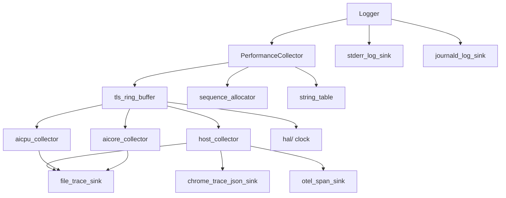

# Module Detailed Design: `profiling/`

## 1. Overview

### 1.1 Purpose

Provide a cross-cutting, low-overhead tracing and logging facility that every other module can emit into. `profiling/` owns the `PerformanceCollector` facade, the `TraceEvent` layout, per-thread TLS ring buffers, collectors (per-execution-context), sinks (output targets), and the logging facade. It is the single source of truth for latency-budget validation and runtime observability.

### 1.2 Responsibility

**Single responsibility:** collect, format, and ship timing / counter / log events with bounded overhead and without creating synchronization between unrelated producers. Never alter program behavior on the success path; never fail user tasks on output failures.

### 1.3 Position in Architecture

- **Layer:** Cross-cutting; callable from every compiled module.
- **Depends on:** `error/`, `hal/` (clock access), standard library.
- **Depended on by:** `scheduler/`, `memory/`, `transport/`, `distributed/`, `runtime/`, `bindings/`, HAL implementations for counter emission.
- **Logical View mapping:** [Cross-Cutting Concerns §7.2 Profiling](../05-cross-cutting.md#72-profiling) and [§7.3 Observability](../05-cross-cutting.md#73-observability); [Process View §4.8.5](../04-process-view.md#485-budget-validation-strategy).

---

## 2. Public Interface

### 2.1 `PerformanceCollector`

**Purpose:** Primary API for runtime code to record a timed phase, emit a counter, or log a correlated event. All work is delegated to per-thread collectors; this class is the call-site seam.

**Sketch:**

```cpp
class PerformanceCollector {
public:
    // Lifecycle (called from runtime/)
    static void init(const ProfilingConfig& config);
    static void shutdown();
    static void flush();

    // Phase timing — RAII scope-based
    struct Phase {
        Phase(PhaseId id, TaskKey task = {}, uint64_t correlation_id = 0);
        ~Phase(); // emits END event with elapsed_ns
        Phase(const Phase&) = delete;
        Phase& operator=(const Phase&) = delete;
    };

    // Explicit phase timing (for async scopes)
    static void begin_phase(PhaseId, TaskKey = {}, uint64_t correlation_id = 0);
    static void end_phase  (PhaseId, TaskKey = {}, uint64_t correlation_id = 0);

    // Counters
    static void emit_counter(CounterId, int64_t value, TaskKey = {});

    // Structured annotation (free-form)
    static void annotate(AnnotationId, const AnnotationValue&, TaskKey = {});

    // Compile-time / runtime gating
    static bool enabled(ProfilingLevel level);
};
```

**Contract:**

- **Preconditions:** `init` called once at `runtime/init`; `shutdown` called once during teardown.
- **Postconditions:** Every `begin_phase` has a matching `end_phase` (enforced by `Phase` RAII); unmatched end events are logged and counted but do not throw.
- **Invariants:** No allocation on the hot path after init; all event buffers are pre-sized per-thread.
- **Thread safety:** Thread-safe by construction — each thread uses its own TLS ring buffer. Cross-thread ordering is provided by monotonic sequence numbers assigned at emit time.
- **Error behavior:** I/O errors in sinks never fail user tasks; they are counted and optionally logged to `stderr` (rate-limited).

### 2.2 Trace Event Model

**Purpose:** Binary log format emitted by the hot path and consumed by sinks. 64-byte aligned to fit one cache line and written atomically.

```cpp
enum class EventType : uint16_t {
    PHASE_BEGIN = 1,
    PHASE_END   = 2,
    COUNTER     = 3,
    ANNOTATION  = 4,
    MARKER      = 5,   // Level-2 coarse markers
};

struct alignas(64) TraceEvent {
    uint64_t  timestamp_ns;      // monotonic clock
    uint64_t  sequence;          // global monotonic (atomic)
    uint64_t  correlation_id;    // trace span id
    uint64_t  task_key_packed;   // TaskKey packed
    uint32_t  phase_or_counter;  // PhaseId or CounterId
    EventType type;
    uint16_t  thread_id;         // logical thread id
    uint16_t  layer_id;
    uint16_t  reserved;
    union {
        int64_t counter_value;
        uint64_t annotation_ptr; // string-table index for ANNOTATION
        struct { uint32_t payload[2]; } small;
    };
    uint32_t  padding;
};
static_assert(sizeof(TraceEvent) == 64, "TraceEvent must be cache-line sized");
```

**Contract:**

- **Layout stability:** Stable across patch releases; version bumps for breaking changes recorded in header metadata written by sinks.
- **Timestamp source:** `CLOCK_MONOTONIC_RAW` on Linux; monotonic across sink flushes.
- **Sequence source:** Global `std::atomic<uint64_t>` incremented on every emit; used for cross-thread ordering reconstruction.

### 2.3 Logging Facade

**Purpose:** Severity-leveled structured logging that integrates with the trace stream (so logs, counters, and phases share `correlation_id`).

```cpp
enum class Severity : uint8_t { TRACE, DEBUG, INFO, WARN, ERROR, FATAL };

class Logger {
public:
    static void init(const LoggingConfig& config);

    static void log(Severity,
                    std::string_view category,
                    std::string_view message,
                    uint64_t correlation_id = 0);

    static void set_sink(std::unique_ptr<ILogSink>);
    static void set_min_severity(Severity);
};
```

**Contract:**

- **Thread safety:** Log calls are safe from any thread; the default sink uses a lock-free MPSC queue.
- **Severity gating:** Below-`min_severity` calls are compiled away when the `LOGGING_LEVEL` macro matches; otherwise a branch-predicted `if` check.
- **Sink failure:** Never fails user tasks. Sink write errors are retried with bounded backoff; after exhaustion the event is dropped with a counter increment.

### 2.4 `ILogSink` and `ITraceSink`

**Purpose:** Output targets (file, OTEL, Chrome Trace JSON).

```cpp
class ITraceSink {
public:
    virtual ~ITraceSink() = default;
    virtual void emit(const TraceEvent& ev) = 0;            // MAY buffer
    virtual void flush() = 0;                               // force durable output
    virtual void on_thread_start(uint16_t thread_id,
                                 std::string_view name) = 0;
};

class ILogSink {
public:
    virtual ~ILogSink() = default;
    virtual void emit(Severity, std::string_view category,
                      std::string_view message,
                      uint64_t correlation_id) = 0;
    virtual void flush() = 0;
};
```

Default sinks ship: `FileTraceSink` (binary), `ChromeTraceJsonSink`, `OtelSpanSink`, `StderrLogSink`, `JournaldLogSink`.

### 2.5 Public Data Types

| Type | Description |
|------|-------------|
| `ProfilingConfig` | Buffer sizes, enabled level, sink factories, flush policy. |
| `ProfilingLevel` | `Off`, `L1_Coarse`, `L2_Phase`, `L3_Counters`, `L4_Full`. |
| `PhaseId`, `CounterId`, `AnnotationId` | Stable integer ids with a string table for human readability. |
| `CategoryId` | Logger category (module + subsystem). |
| `AnnotationValue` | `std::variant<int64_t, double, string_view>`. |
| `ProfilingStats` | Drop counts, buffer occupancy peaks, sink latencies. |

---

## 3. Internal Architecture

### 3.1 Internal Component Decomposition

```
profiling/
├── include/profiling/
│   ├── performance_collector.h       # Public facade
│   ├── logger.h                      # Public logging facade
│   ├── trace_event.h                 # TraceEvent, EventType
│   ├── sinks.h                       # ITraceSink, ILogSink
│   └── ids.h                         # PhaseId / CounterId / AnnotationId string tables
├── src/
│   ├── performance_collector.cpp     # Facade dispatch + init/shutdown
│   ├── tls_ring_buffer.cpp           # Per-thread SPSC ring
│   ├── sequence_allocator.cpp        # Global atomic sequence
│   ├── string_table.cpp              # id -> name mapping for sinks
│   ├── logger.cpp                    # Severity gating + routing
│   ├── collectors/
│   │   ├── host_collector.cpp        # Host TLS ring harness
│   │   ├── aicpu_collector.cpp       # AICPU per-thread ring
│   │   └── aicore_collector.cpp      # AICore in-core buffer uploader
│   └── sinks/
│       ├── file_trace_sink.cpp       # Binary trace file
│       ├── chrome_trace_json_sink.cpp
│       ├── otel_span_sink.cpp        # OpenTelemetry
│       ├── stderr_log_sink.cpp
│       └── journald_log_sink.cpp
└── tests/
    ├── test_performance_collector.cpp
    ├── test_tls_ring.cpp
    ├── test_sinks.cpp
    ├── test_level_gating.cpp
    └── test_overhead.cpp             # Microbenchmark for < 2% overhead target
```

### 3.2 Internal Dependency Diagram



### 3.3 Key Design Decisions (Module-Level)

- **Per-thread TLS ring buffers (SPSC) eliminate cross-thread locking on the hot path.** Each thread writes its own ring; sinks flush from a dedicated consumer context.
- **Global monotonic sequence number** (one `std::atomic<uint64_t>`) provides cross-thread ordering without locks or per-thread merging on ingest.
- **Compile-time level gating via `PROFILING_LEVEL` macro.** Release builds can set `PROFILING_LEVEL = L1` to strip Level-2+ emissions entirely; the `Phase` destructor then becomes a no-op that the optimizer removes.
- **Sink failures are non-fatal.** Aligned with observability design principle: profiling must never cause a user task to fail.
- **Chrome Trace / Perfetto compatibility** for the `chrome_trace_json_sink`, so existing tooling can open traces directly ([Platform §2.8.1](../02-logical-view/10-platform.md) also relies on this format for `PERFORMANCE` / `REPLAY` sim output).

---

## 4. Key Data Structures

### 4.1 TLS ring buffer

```cpp
struct alignas(64) TlsRingBuffer {
    static constexpr size_t kSlots = 4096;       // per-thread; power of two
    std::array<TraceEvent, kSlots> events;
    uint32_t head;                               // producer only touches (not atomic within thread)
    alignas(64) std::atomic<uint32_t> tail;      // consumer
    uint16_t thread_id;
    uint16_t layer_id;
};

thread_local TlsRingBuffer* current_tls_ring;
```

- **Head** is only written by the owning thread; atomic only from the consumer's perspective via `std::memory_order_release`.
- **Tail** is the sink consumer's cursor; consumer uses `std::memory_order_acquire`.
- Ring overflow (producer catches tail): the oldest events are overwritten; a per-ring drop counter is incremented.

### 4.2 Global sequence allocator

```cpp
struct alignas(64) SequenceAllocator {
    alignas(64) std::atomic<uint64_t> next;
};
```

- Singleton; incremented with `fetch_add(1, std::memory_order_relaxed)` on every emit.
- Monotonic across threads; used by sinks to merge per-thread streams.

### 4.3 String table

```cpp
struct StringTable {
    std::unordered_map<uint32_t, std::string> by_id;
    std::mutex                               mu;  // init-phase only
    uint32_t register_id(std::string_view name);
    std::string_view resolve(uint32_t id) const;  // lock-free after init
};
```

- Populated at `runtime/init`; lock-free for reads once frozen.
- IDs embedded in `TraceEvent::phase_or_counter` are stable across process lifetime.

### 4.4 Collector / sink plumbing

- **Collector** = consumer attached to N TLS rings; runs on its own low-priority thread. One Collector per execution context (Host, AICPU, AICore upload).
- **Sink** = output target that a Collector hands `TraceEvent`s to. Sinks may be chained (e.g., Chrome JSON + OTEL). Each sink has its own buffering / flushing strategy.

---

## 5. Processing Flows

### 5.1 Phase timing emission (hot path)

```mermaid
sequenceDiagram
    participant Caller as scheduler/ (thread T)
    participant PC as PerformanceCollector
    participant TLS as TlsRingBuffer (thread T)
    participant Seq as SequenceAllocator
    participant Clock as hal clock

    Caller->>PC: Phase phase(DISPATCH, task_key, cid)
    PC->>PC: if level < L2 return; // no-op inline
    PC->>Clock: now_ns()
    PC->>Seq: fetch_add(1)
    PC->>TLS: events[head] = {PHASE_BEGIN, ts, seq, cid, task, DISPATCH}
    PC->>TLS: head = (head+1) & mask; release
    Caller-->>PC: ... work ...
    Caller->>PC: ~Phase()
    PC->>Clock: now_ns()
    PC->>Seq: fetch_add(1)
    PC->>TLS: events[head] = {PHASE_END, ts, seq, cid, task, DISPATCH}
```

Hot path: 2 × clock read + 2 × atomic increment + 2 × store. Target < 100 ns per Phase at Level 2.

### 5.2 Latency-budget validation flow

```mermaid
sequenceDiagram
    participant Run as runtime/drain
    participant PC as PerformanceCollector
    participant Col as Collector
    participant Sink as FileTraceSink
    participant Tool as Offline tool

    Run->>PC: flush()
    PC->>Col: drain all TLS rings
    Col->>Sink: emit batched events
    Sink->>Sink: write to disk; fsync
    Tool->>Sink: read trace file
    Tool->>Tool: compute per-stage latencies; compare to budgets §4.8.x
    Tool-->>User: report (budget violations flagged)
```

Budget values come from [Process View §4.8](../04-process-view.md#48-latency-budgets-rule-x9); the module only records and ships, never evaluates.

### 5.3 Dynamic level change

- `PerformanceCollector::set_level(ProfilingLevel)` is callable at runtime.
- Sets a global `std::atomic<uint8_t>` checked at the top of each hot-path call; the level check is branch-predicted.
- Useful for production: run at Level 1 by default and bump to Level 2 when an SLO alert fires ([Cross-Cutting §7.3.3](../05-cross-cutting.md#73-observability)).

---

## 6. Concurrency Model

| Component | Threading |
|-----------|-----------|
| `PerformanceCollector::Phase` ctor/dtor | Any thread; reads its own TLS ring; global `sequence` via relaxed atomic. |
| `TlsRingBuffer` write | Owning thread only. |
| `TlsRingBuffer` read (consumer) | One collector thread per ring. |
| `Logger::log` | Any thread; feeds into MPSC queue for the log sink. |
| Sinks | Collector-owned threads. Sink methods (`emit`/`flush`) are **not** required to be thread-safe across collectors; each collector owns its sink invocation. |
| `StringTable::register_id` | Init thread only. |
| `set_level` / `set_min_severity` | Any thread (atomic write). |

**Sequence merging.** The global atomic `sequence` produces a total order across all emits. Offline tools reconstruct a merged stream by sorting per-thread streams on `sequence`.

---

## 7. Error Handling

| Condition | Behavior |
|-----------|----------|
| Ring overflow (producer too fast) | Oldest events overwritten; per-ring drop counter incremented; never blocks. |
| Sink IO error (e.g., disk full) | Sink enters `degraded` state; continues to accept events into its own bounded buffer; writes rate-limited warning to `stderr`. Never propagates to callers. |
| Unmatched `end_phase` | Logged once per `(thread, PhaseId)` pair with sequence of last unmatched; counters incremented. |
| `begin_phase` without prior `init` | No-op (PerformanceCollector disabled); counters track "pre-init events". |
| Unknown `PhaseId` at sink | Emitted as `phase_<hex>`; never dropped. |

Never uses exceptions. Internal severity errors escalated via `Logger` with `Severity::WARN` at most — `profiling/` bugs must not mask real failures.

---

## 8. Configuration

| Parameter | Type | Default | Description | Valid Range |
|-----------|------|---------|-------------|-------------|
| `PROFILING_LEVEL` | compile macro | `L1_Coarse` | Compile-time strip level | L0..L4 |
| `profiling.level` | runtime enum | `L2_Phase` | Current runtime level | L0..L4 |
| `tls_ring_slots` | `uint32_t` | 4096 | Per-thread event ring capacity | power-of-two ≥ 256 |
| `sink_flush_interval_ms` | `uint32_t` | 50 | Collector flush cadence | ≥ 1 |
| `sink_max_queue_bytes` | `size_t` | 32 MiB | Per-sink buffer cap | — |
| `stderr_rate_limit_ms` | `uint32_t` | 1000 | Diagnostic suppression window | — |
| `logger.min_severity` | enum | `INFO` | Below-threshold logs dropped | TRACE..FATAL |
| `enabled_sinks` | list | `[File]` | Trace sinks to attach | any subset |
| `correlation_clock` | enum | `MonotonicRaw` | Clock source | `Monotonic`, `MonotonicRaw` |

---

## 9. Testing Strategy

### 9.1 Unit Tests

- `test_performance_collector`: `Phase` RAII emits matching BEGIN/END; explicit begin/end also supported; `emit_counter` and `annotate` round-trip through a mock sink.
- `test_tls_ring`: SPSC head/tail correctness; overflow behavior counted; concurrent producer/consumer stress.
- `test_level_gating`: Below-level calls are no-op (verified by mock sink seeing zero events); compile-time gating confirmed by macro test build.
- `test_sinks`: Each sink's output format parsed by its consumer tool (Chrome JSON → Chrome, OTEL → test backend).
- `test_logger`: Severity gating; sink routing; correlation id propagation.
- `test_overhead`: Microbench confirming < 100 ns per `Phase` at L2 on host reference hardware.

### 9.2 Integration Tests

- End-to-end: run `scheduler/` + sim HAL with L2 profiling; verify Host → AICore dispatch breakdown matches [Process View §4.8.1](../04-process-view.md#481-single-node-kernel-dispatch-host--aicore-execution-start) stage boundaries.
- Distributed: traces from multiple nodes merged by `correlation_id` reconstruct an end-to-end span.
- SIM `PERFORMANCE` mode: timing-model traces indistinguishable in format from live L2 traces (verified by schema equality test).

### 9.3 Edge Cases and Failure Tests

- Sink disk full: collector continues, drops counted, no user-visible fault.
- Ring overflow burst: 10× normal rate for 1 s; producer never blocks; drop counter reflects loss.
- `shutdown` with outstanding events: `flush` drains all rings before sink close; no lost events under clean shutdown.
- Clock step backward (tested with fake clock): monotonic sequence still orders events correctly.
- Severity change under load: dynamic `set_min_severity` / `set_level` takes effect within one event.

---

## 10. Performance Considerations

- **Hot-path target:** < 100 ns per `Phase` begin+end at Level 2; < 1% overhead on the critical dispatch path ([Cross-Cutting §7.2](../05-cross-cutting.md#72-profiling)).
- **No heap allocation** on the hot path; TLS rings and sequence allocator are pre-sized.
- **Cache-line alignment** on `TraceEvent`, `TlsRingBuffer` members, and `SequenceAllocator` prevents false sharing.
- **Compile-time strip** via `PROFILING_LEVEL` macro: release builds can eliminate Level-2+ emissions entirely, reducing the hot path to zero cost.
- **Clock access** uses `CLOCK_MONOTONIC_RAW` via `hal`; two reads per `Phase`. Hardware TSC is an optional fast path on x86, not used on Ascend devices.
- **Sinks run on their own threads**; the hot path never waits on I/O.

---

## 11. Extension Points

- **Custom `ITraceSink` / `ILogSink`** — implement the interface, register via `ProfilingConfig::sink_factories`.
- **New collectors** — for new execution contexts (e.g., custom accelerator). Each collector consumes its TLS rings and feeds registered sinks.
- **New `PhaseId` / `CounterId`** — added as data in `ids.h` + `string_table`; no code changes.
- **Dynamic level** — `set_level` + `set_min_severity` are public; higher layers (SLO alerting, observability control plane) hook these for adaptive profiling.
- **Alternate clock sources** — pluggable via `correlation_clock` config.

---

## 12. Open Questions (Module-Level)

- AICore in-core buffer upload protocol — currently bounded-size batch at kernel end; alternative streaming upload is deferred pending HAL capability review.
- OTEL semantic conventions for PyPTO traces — working schema; may evolve before v1 GA.
- Whether the logging facade should adopt structured logging (key/value) as the default rather than plain strings — open pending ecosystem survey.
- Device-side `ErrorContextPod` ↔ log entry correlation — coordination with `error/StringTable` pending.

---

## 13. Review Amendments (R3)

This section records normative amendments from architecture-review run `2026-04-18-171357`. Each `[UPDATED: <id>: ...]` callout is authoritative over any prior wording it overlaps and is tied to an entry in `reviews/2026-04-18-171357/final/applied-changes/docs__pypto-runtime-design__modules__profiling.md.diff.md`.

> **[UPDATED: A1-P7: per-thread local seq + offline merge]** *Target: §4.1 TLS ring buffer; §4.2 Global sequence allocator; §6 sink merge.* Each `TlsRingBuffer` owns its own `uint64_t local_seq`. The global `SequenceAllocator::next` atomic is removed. The sink collector merges per-thread streams at drain time, ordered by `(timestamp_ns, thread_id, local_seq)`; `thread_id` is the deterministic tiebreak.

> **[UPDATED: A1-P10: workload-level profiling-overhead CI gate]** *Target: new §9.2.4.* Add `bench_profiling_overhead.cpp` driving 10 s of 1 M task submissions at `PROFILING_LEVEL` `L0/L1/L2` on the sim target. CI asserts `L1 ≤ 1.01× L0` wall-time and `L2 ≤ 1.05× L0`. Regression blocks merge.

> **[UPDATED: A2-P9: versioned trace schema header]** *Target: §2.2 Trace Event Model; §7 Error Handling.* Prepend one-off trace-file header `{magic, trace_schema_version: uint16_t, platform, mode}`. `replay_engine` validates the header at REPLAY init; mismatched major version → `ProtocolVersionMismatch`. Header-only (not per-event).

> **[UPDATED: A8-P3: stats structs + latency histograms pinned to CONTROL]** *Target: §2.5 Public Data Types; §4 Key Data Structures.* Add `LatencyHistogram` with pre-allocated log-scale buckets, branchless insert (< 5 ns), and seqlock snapshot. The bucket array is pinned to the **CONTROL region** (cache-line-resident; no competition with admission-queue drain). `RuntimeStats` aggregator pulls from every module-owned stats struct (A8-P3 across core/scheduler/memory/transport/distributed/runtime).

> **[UPDATED: A8-P5: external alert-rules file; `AlertRule` schema with `logical_system_id`]** *Target: §7 Error Handling; §8 Configuration.* `AlertRule { metric, op, threshold, window_ms, severity, logical_system_id }` (4-field base + tenant scope). Prom/OTEL sinks (`PrometheusSink`, `OpenMetricsSink`) are opt-in deviation (recorded in `10-known-deviations.md`). Rules externalized to parameterize A5-P8 policies.

> **[UPDATED: A8-P6: trace time-alignment with `IClockSync`]** *Target: §2.1 `PerformanceCollector`; §7.2.3 cross-ref.* PTP/NTP dependency declared; `skew_max_ns ≤ 100 µs`. Merge: primary sort by `(sequence, correlation_id, happens_before)` with skew-windowed reorder. Tie-breaker `min(node_id)` in the youngest all-online epoch. Correlation-id chain dominates timestamp ties. `IClockSync::offset_ns()` added alongside `IClock` (A8-P1).

> **[UPDATED: A8-P8: AICore in-core trace ring + DMA uploader; L2 opt-in]** *Target: §3.1 Internal Component Decomposition; §3.4 Collector / sink plumbing.* Fixed-size AICore event ring + Chip-level DMA uploader at `sink_flush_interval_ms`. Capability bit `AICORE_TRACE_RING_SUPPORTED`. Default `PROFILING_LEVEL = L1_Coarse` compile-time-strips Level-2 emits; L2 ring write < 50 ns amortized.

> **[UPDATED: A8-P9: profiling drop/degraded as first-class alerts]** *Target: §4.1; §7 Error Handling.* Expose `TraceEvents_dropped`, `TraceSink_degraded_ms`, `LogEvents_dropped`. Alert rules: "Trace drop rate > 0 over 1 min → Warning"; "Sink degraded > 5 s → Warning".

> **[UPDATED: A8-P10: structured KV logging]** *Target: §2.3 Logging Facade.* `Logger::log_kv(Severity, category, {kv...}, correlation_id)`. String-message shim retained for legacy sites. JSON-line sink default.

> **[UPDATED: A8-P12: stable PhaseIds for Submission lifecycle]** *Target: §2.5 Public Data Types (new constants).* `SUBMISSION_ADMIT, SUBMISSION_RETIRE, DATA_DEP_SCAN, BARRIER_ATTACH, NONE_ATTACH, WORKSPACE_ALLOC, ADMISSION_QUEUE_DRAIN, WORKER_DISPATCH, WORKER_COMPLETE`. Per-phase durations sum to admission latency within 1%.

---

**Document status:** Draft — ready for review.
