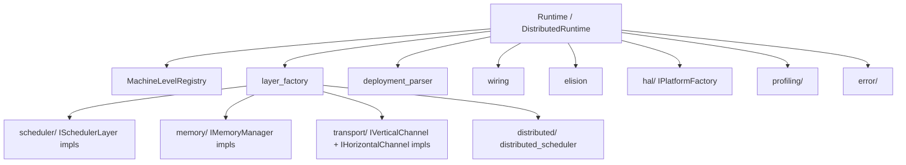
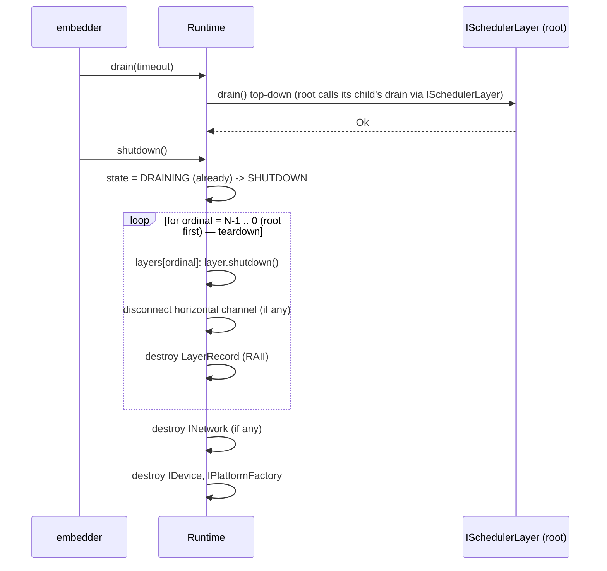

# Module Detailed Design: `runtime/`

## 1. Overview

### 1.1 Purpose

Compose the concrete Layer hierarchy from `DeploymentConfig`, own the `MachineLevelRegistry`, drive the Runtime lifecycle (init → running → drain → shutdown), and wire every Machine Level's scheduler, memory manager, channels, and policies using the factories registered by each compiled module. `runtime/` is the single place where the rest of the runtime becomes an executable topology.

### 1.2 Responsibility

**Single responsibility:** translate declarative deployment (`DeploymentConfig`, `MachineLevelRegistry`) into a running set of wired `ISchedulerLayer` instances, then manage their lifecycle. No scheduling logic, no protocol, no platform code — it only composes.

### 1.3 Position in Architecture

- **Layer:** Top compiled layer (below `bindings/`). Sees every other module.
- **Depends on:** `core/`, `scheduler/`, `memory/`, `transport/`, `distributed/`, `profiling/`, `hal/`, `error/`.
- **Depended on by:** `bindings/`, user C++ embedding code.
- **Logical View mapping:** [Machine Level Registry](../02-logical-view/05-machine-level-registry.md), [Lifecycle §4.9](../04-process-view.md#49-layer-lifecycle), [Physical View](../05-physical-view.md).

---

## 2. Public Interface

### 2.1 `Runtime`

**Purpose:** Single-node runtime handle. Represents the composed Layer stack (leaf → root) and exposes the entry scheduler for user submissions.

**Methods:**

| Method | Parameters | Returns | Description |
|--------|-----------|---------|-------------|
| `init` | `DeploymentConfig` | `ErrorContext` | Build the Layer stack: HAL platform + per-level scheduler, memory, channels, policies. Full RAII rollback on failure. |
| `freeze_registry` | — | `void` | Lock the `MachineLevelRegistry`; no further registrations. Called automatically inside `init`. |
| `root_scheduler` | — | `ISchedulerLayer*` | Entry point for user submissions. |
| `get_layer` | `LevelId` | `ISchedulerLayer*` | Lookup a specific Layer. |
| `layer_of` | `const std::string& level_name` | `ISchedulerLayer*` | Lookup by registered name. |
| `register_factory` | `MachineLevelDescriptor` | `ErrorContext` | Register a Machine Level; must be called before `init`. |
| `drain` | `Timeout` | `ErrorContext` | Block until all admitted Submissions reach `RETIRED` across the whole stack. |
| `shutdown` | — | `void` | Teardown leaf-first; invariants freed in reverse init order. |
| `is_running` / `is_draining` | — | `bool` | State query. |
| `stats` | — | `RuntimeStats` | Aggregated cross-layer counters. |

**Contract:**

- **Preconditions:** `register_factory` calls precede `init`. `DeploymentConfig` validates against the registry on entry.
- **Postconditions:** After successful `init`, every registered (non-elided) Machine Level has exactly one `ISchedulerLayer` instance; `root_scheduler()` returns the highest-ordinal non-elided Layer.
- **Invariants:** Layer hierarchy is constructed leaf-first and torn down leaf-first; parent connections exist only when all children are initialized.
- **Thread safety:** `init` / `shutdown` / `register_factory` / `freeze_registry` — single-threaded caller. `root_scheduler` / `get_layer` / `layer_of` / `stats` — safe from any thread after `init`.
- **Error behavior:** `init` partial failure releases every already-created Layer via RAII; returns `ErrorCode::RuntimeInitFailed` with wrapped cause.

### 2.2 `DistributedRuntime`

**Purpose:** Multi-node runtime. Wraps a `Runtime` plus `distributed_scheduler` wiring across peers.

**Methods:**

| Method | Parameters | Returns | Description |
|--------|-----------|---------|-------------|
| `init` | `DeploymentConfig` (with `peers`) | `ErrorContext` | Same as `Runtime::init`, plus establishes horizontal channels and performs version handshake with peers. |
| `cluster_view` | — | `ClusterView` | Current cluster membership. |
| `local_node_id` | — | `NodeId` | Identity of this node. |
| `coordinator` | — | `bool` | Whether this node is designated coordinator. |
| `drain_cluster` | `Timeout` | `ErrorContext` | Coordinated drain across all peers. |
| `shutdown_cluster` | — | `void` | Coordinated shutdown. |

Inherits `register_factory`, `root_scheduler`, `get_layer`, `stats` from `Runtime`.

**Contract:** Identical to `Runtime` for local operations. Cross-cluster operations require the peer set to be quorate — partial init is explicitly disallowed (ADR-012 consumer).

### 2.3 `MachineLevelRegistry`

**Purpose:** Register Machine Levels, validate the layer stack, hand out descriptors during `init`.

**Methods:**

| Method | Parameters | Returns | Description |
|--------|-----------|---------|-------------|
| `register_level` | `const MachineLevelDescriptor&` | `ErrorContext` | Add level; rejected after `freeze`. |
| `freeze` | — | `ErrorContext` | Run `validate_topology` and lock. |
| `level_count` | — | `size_t` | Count of registered levels. |
| `get_level` | `uint32_t ordinal` | `const MachineLevelDescriptor&` | By ordinal. |
| `find_level` | `const std::string& name` | `const MachineLevelDescriptor*` | By name, nullptr if absent. |
| `validate_topology` | — | `ErrorContext` | DAG validity, leaf uniqueness, elision compatibility ([Q2](../09-open-questions.md)). |

**Validation rules:**
- Exactly one `is_leaf = true` level at ordinal 0.
- All non-leaf levels supply `vertical_channel_factory` (unless elided via `instance_count = 0`).
- Ordinals contiguous; no duplicates.
- `horizontal_channel_factory` optional at any level.
- Elision (`LevelParams.instance_count == 0`) is valid only if the elided level has no level-specific participants in `DeploymentConfig` ([§2.2.4](../02-logical-view/05-machine-level-registry.md#224-level-elision)).

### 2.4 `DeploymentConfig`

**Purpose:** Declarative runtime composition parameters supplied by the embedder (Python, C++ app). Parsed once at `init`.

```cpp
struct DeploymentConfig {
    // --- Target ---
    std::string             platform;           // "a2a3" | "a5" | ...
    Variant                 variant = Variant::Sim;
    std::optional<SimulationMode> simulation_mode; // required when variant == Sim

    // --- Local node ---
    NodeId                  local_node_id;
    std::vector<uint32_t>   device_ids;         // physical device selection

    // --- Peers (distributed only) ---
    std::vector<PeerSpec>   peers;              // empty => single-node
    NodeRole                role = NodeRole::Worker;

    // --- Transport ---
    TransportBackend        transport_backend = TransportBackend::Tcp; // tcp/rdma/shm
    uint32_t                remote_timeout_ms = 30000;

    // --- Per-level overrides (keyed by level name) ---
    std::unordered_map<std::string, LevelOverrides> level_overrides;

    // --- Policy factory bindings (optional; override Registry defaults) ---
    PolicyFactoryMap        policy_factories;

    // --- Profiling ---
    ProfilingConfig         profiling;

    // --- Timeouts ---
    Timeouts                timeouts;
};

struct PeerSpec {
    NodeId      id;
    std::string endpoint;    // "rdma://10.0.0.1:7777"
    NodeRole    role;
};

struct LevelOverrides {
    std::optional<uint32_t>              instance_count;   // 0 => elide
    std::optional<uint32_t>              slot_pool_size;
    std::optional<uint32_t>              max_outstanding_submissions;
    std::optional<std::string>           partitioner;      // e.g. "DataLocality"
    std::optional<FailurePolicy>         failure_policy;
    std::optional<SourceCollectionConfig> event_loop;
    // arbitrary level_params overrides:
    std::unordered_map<std::string, std::string> extra;
};

struct Timeouts {
    uint32_t init_ms            = 60000;
    uint32_t drain_ms           = 120000;
    uint32_t shutdown_ms        = 30000;
    uint32_t heartbeat_ms       = 500;
    uint32_t heartbeat_miss     = 6;
};
```

**Contract:**

- Validated against the frozen `MachineLevelRegistry` during `init`. Unknown level names in `level_overrides` → `ErrorCode::InvalidConfiguration`.
- Field defaults aim for sensible single-node developer experience (Sim + Tcp + no peers).

### 2.5 `MachineLevelDescriptor`

Inline from [§2.2.1](../02-logical-view/05-machine-level-registry.md#221-machine-level) with implementation annotations.

```cpp
struct MachineLevelDescriptor {
    // Identity
    std::string         level_name;       // unique
    uint32_t            ordinal;          // 0 leaf .. N root
    bool                is_leaf = false;

    // Factories (all optional that can be defaulted are nullable)
    ISchedulerFactory*            scheduler_factory            = nullptr;
    IWorkerFactory*               worker_factory               = nullptr;
    IMemoryManagerFactory*        memory_manager_factory       = nullptr;
    IMemoryOpsFactory*            memory_ops_factory           = nullptr;
    IVerticalChannelFactory*      vertical_channel_factory     = nullptr;  // null for leaf
    IHorizontalChannelFactory*    horizontal_channel_factory   = nullptr;  // optional

    // Policy factories (optional; default = built-in)
    ITaskSchedulePolicyFactory*        task_schedule_policy_factory       = nullptr;
    IWorkerSelectionPolicyFactory*     worker_selection_policy_factory    = nullptr;
    IResourceAllocationPolicyFactory*  resource_allocation_policy_factory = nullptr;

    // Worker topology
    std::vector<WorkerTypeDescriptor>  worker_types;
    std::vector<TaskExecType>          task_exec_types;
    std::vector<WorkerGroup>           worker_groups;

    // Event loop
    std::vector<IEventSourceFactory*>  event_source_factories;
    IExecutionPolicyFactory*           execution_policy_factory = nullptr;

    // Parameters ([Q6](../09-open-questions.md) — LevelParams surface in flux)
    LevelParams                        level_params;

    // DSL aliases
    std::vector<std::string>           dsl_aliases;              // e.g., "pl.Level.Chip"
};
```

**Lifetime:** Descriptors live in the Registry; their factories are owned by the caller (typically static singletons compiled into the `scheduler/`, `memory/`, `transport/` modules).

### 2.6 Public Data Types

| Type | Description |
|------|-------------|
| `RuntimeStats` | Aggregated `LayerStats` + `ChannelStats` + `DistributedStats`. |
| `LevelParams` | Per-level tunables (queue depths, slot counts, workspace caps, event config). |
| `PolicyFactoryMap` | Name → factory mapping for runtime policy overrides. |
| `Timeouts` | Init / drain / shutdown / heartbeat bounds. |
| `PlatformConfig` | Forwarded to `hal::IPlatformFactory`. |

---

## 3. Internal Architecture

### 3.1 Internal Component Decomposition

```
runtime/
├── include/runtime/
│   ├── runtime.h                    # Runtime, DistributedRuntime public API
│   ├── machine_level_registry.h     # Registry + descriptor
│   ├── deployment_config.h          # DeploymentConfig + LevelOverrides
│   ├── level_params.h               # Per-level knobs (aligned with LevelParams §2.2.1)
│   └── types.h                      # RuntimeStats, PolicyFactoryMap, Timeouts
├── src/
│   ├── runtime.cpp                  # Composition and lifecycle
│   ├── distributed_runtime.cpp      # Adds cross-node coordination
│   ├── machine_level_registry.cpp   # Register / freeze / validate_topology
│   ├── layer_factory.cpp            # Turns MachineLevelDescriptor + overrides into Layer instances
│   ├── deployment_parser.cpp        # Validates DeploymentConfig against the Registry
│   ├── wiring.cpp                   # Wires Vertical / Horizontal channels leaf-first
│   ├── elision.cpp                  # Level-elision routing fixups
│   └── version.cpp                  # Runtime version string + handshake helper
└── tests/
    ├── test_registry.cpp
    ├── test_validate_topology.cpp
    ├── test_deployment_parser.cpp
    ├── test_init_rollback.cpp
    ├── test_elision.cpp
    └── test_distributed_init.cpp
```

### 3.2 Internal Dependency Diagram



Runtime is the only module that legitimately depends on every other compiled module.

### 3.3 Key Design Decisions (Module-Level)

- **Composition at a single place (ADR-002).** Every factory reference flows through `MachineLevelDescriptor`; `runtime/` owns the wiring.
- **RAII rollback on partial init.** Any failure during Layer construction unwinds already-created Layers in reverse order; no state is left behind (consumer of [Process View §4.7.5](../04-process-view.md#475-fatal-vs-recoverable) fatal-error policy).
- **Registry frozen at init.** After `freeze_registry` no new Machine Levels can be added — static layer stack matches ADR-003 stability requirement.
- **Elision in the wiring layer, not in `scheduler/`.** When `instance_count = 0`, `wiring.cpp` rewires the parent's Vertical Channel to point directly at the next non-elided child. `scheduler/` sees an ordinary parent / child pair.
- **Distributed init is atomic across peers.** A node either succeeds in its full distributed handshake or returns `RuntimeInitFailed`; no coordinator continues with a partial peer set without explicit `failure_policy=CONTINUE_REDUCED`.

---

## 4. Key Data Structures

### 4.1 `Runtime` composition tree

```cpp
class Runtime {
    PlatformConfig                              platform_cfg;
    std::unique_ptr<hal::IPlatformFactory>      platform_factory;
    std::unique_ptr<hal::IDevice>               device;
    std::optional<std::unique_ptr<hal::INetwork>> network;

    MachineLevelRegistry                        registry;
    DeploymentConfig                            config;

    std::vector<LayerRecord>                    layers;  // leaf-first order
    std::atomic<State>                          state;   // UNINIT, INITIALIZING, RUNNING, DRAINING, SHUTDOWN
};

struct LayerRecord {
    uint32_t                                  ordinal;
    std::string                               name;
    std::unique_ptr<ISchedulerLayer>          scheduler;
    std::unique_ptr<IMemoryManager>           memory;
    std::unique_ptr<IMemoryOps>               memory_ops;
    std::unique_ptr<IVerticalChannel>         vertical_to_child;    // null at leaf
    std::unique_ptr<IVerticalChannel>         vertical_to_parent;   // null at root
    std::unique_ptr<IHorizontalChannel>       horizontal;           // optional
    std::vector<std::unique_ptr<Worker>>      workers;
    std::vector<std::unique_ptr<IEventSource>> event_sources;
    LevelParams                               effective_params;
};
```

Ownership tree matches construction / teardown order. `LayerRecord` is move-only; `layers` vector is the authoritative store.

### 4.2 Policy factory binding

```cpp
using PolicyFactoryMap = std::unordered_map<std::string /*level_name*/, LevelPolicies>;

struct LevelPolicies {
    ITaskSchedulePolicyFactory*       task_schedule       = nullptr;
    IWorkerSelectionPolicyFactory*    worker_selection    = nullptr;
    IResourceAllocationPolicyFactory* resource_allocation = nullptr;
};
```

Overrides `MachineLevelDescriptor` values at construction; `nullptr` falls through to descriptor defaults.

### 4.3 Version handshake record

```cpp
struct PeerHandshakeRecord {
    NodeId      id;
    std::string runtime_version;
    uint32_t    protocol_version;
    uint32_t    capabilities;     // bitmask
    HealthStatus health;
};
```

Collected at distributed init; any mismatch → `RuntimeInitFailed` with `ProtocolVersionMismatch` cause.

---

## 5. Processing Flows

### 5.1 Startup sequence

```mermaid
sequenceDiagram
    participant App as embedder (bindings/ or C++)
    participant RT as Runtime
    participant Reg as Registry
    participant HAL as hal/IPlatformFactory
    participant LF as layer_factory
    participant Wire as wiring

    App->>RT: register_factory(descriptor) ... N times
    App->>RT: init(DeploymentConfig)
    RT->>Reg: freeze() + validate_topology()
    RT->>Reg: parser: reconcile DeploymentConfig + Registry
    RT->>HAL: create PlatformFactory, IDevice, [INetwork]
    loop for ordinal = 0 .. N-1 (leaf first)
        RT->>LF: build LayerRecord(ordinal, descriptor, overrides)
        LF->>LF: create IMemoryManager (regions from HAL)
        LF->>LF: create IMemoryOps
        LF->>LF: create Workers + ISchedulerLayer
        LF->>LF: attach policies (from PolicyFactoryMap or descriptor)
        LF->>LF: create event sources
        RT-->>RT: layers.push_back(record)
    end
    RT->>Wire: wire_vertical_channels(layers) (with elision)
    opt distributed
        RT->>Wire: create IHorizontalChannel
        Wire->>Wire: connect to peers; handshake
    end
    RT->>RT: each layer.init(LayerConfig)
    RT->>RT: state = RUNNING
    RT-->>App: Ok
```

**Failure path.** If any step returns an error, the already-created `LayerRecord`s are destroyed in reverse order by `unique_ptr` destructors; `IDevice` + `IPlatformFactory` are destroyed last.

### 5.2 Shutdown sequence



Shutdown is idempotent; calling `shutdown` twice is a no-op on the second call.

### 5.3 Elision path

- If `level_overrides[name].instance_count == 0`:
  - `validate_topology` verifies the level has a valid parent and child (or is at the root with a clear semantic).
  - `wiring.cpp` creates the parent's `IVerticalChannel` with the **child's child** as its peer, not the elided level.
  - The elided level's `scheduler_factory` / `memory_manager_factory` / etc. are never invoked.
  - Per [Q2](../09-open-questions.md), certain elision combinations are still under review; `validate_topology` rejects unknown-safe cases conservatively.

### 5.4 Distributed handshake

- Each node connects to each peer via `IHorizontalChannel::connect`.
- Exchanges `PeerHandshakeRecord`; any mismatch (protocol version, platform, runtime_version band) fails init.
- Publishes RDMA MR keys if transport backend requires (`transport/` handles the actual exchange).
- On completion, publishes initial `ClusterView` via `distributed/`.

---

## 6. Concurrency Model

- **`init` / `shutdown` / `register_factory` / `freeze_registry`** — single-threaded caller. Internally, `init` may spawn a handshake thread for distributed peer connection; that thread joins before `init` returns.
- **`root_scheduler`, `get_layer`, `layer_of`, `stats`** — safe from any thread after `init`; reads a stable layers vector (never resized post-init).
- **`drain` / `drain_cluster`** — blocking; caller thread owns the drain. Multiple concurrent drains are coalesced internally.
- **`cluster_view`** — lock-free seqlock read.

Runtime owns no long-running threads itself beyond the distributed handshake thread (init-only) and the profiling collector threads (owned by `profiling/`).

---

## 7. Error Handling

| Condition | `ErrorCode` | Handling |
|-----------|-------------|----------|
| Unknown level in `DeploymentConfig` | `InvalidConfiguration` | Returned from `init`; no state created. |
| Factory missing for non-leaf level | `InvalidConfiguration` | Validated in `validate_topology`. |
| HAL init failure | `DeviceInitFailed` (wrapped in `RuntimeInitFailed`) | Full RAII rollback. |
| Peer handshake timeout | `TransportTimeout` (wrapped) | Distributed init fails; local cleanup. |
| Peer version mismatch | `ProtocolVersionMismatch` | Distributed init fails. |
| Layer init failure | `RuntimeInitFailed` | Partial init rolled back; all created layers destroyed. |
| `drain` timeout | `TransportTimeout` | Returned to caller; still possible to `shutdown` afterwards. |
| `shutdown` after init failure | — | Safe no-op; guards `state`. |

Errors from lower modules are wrapped with an outer `RuntimeInitFailed` so `bindings/` can present a single top-level exception to Python while preserving the cause chain.

---

## 8. Configuration

All configuration flows through `DeploymentConfig`. Registry defaults apply when a field is absent.

| Parameter | Type | Default | Description |
|-----------|------|---------|-------------|
| `platform` | string | required | `"a2a3"` / `"a5"` / ... |
| `variant` | enum | `Sim` (dev), `Onboard` (deployed) | HAL build variant |
| `simulation_mode` | enum | `Performance` for sim | `Performance`/`Functional`/`Replay` |
| `device_ids` | `uint32_t[]` | all discovered | Physical device selection |
| `peers` | `PeerSpec[]` | empty | Distributed peers |
| `transport_backend` | enum | `Tcp` | `tcp`/`rdma`/`shm` |
| `level_overrides` | map | {} | Per-level knobs (elision, slot pool, max outstanding, partitioner, …) |
| `policy_factories` | map | {} | Override descriptor policy defaults |
| `timeouts.init_ms` | `uint32_t` | 60000 | Max init duration |
| `timeouts.drain_ms` | `uint32_t` | 120000 | Max drain duration |
| `timeouts.shutdown_ms` | `uint32_t` | 30000 | Max shutdown duration |

---

## 9. Testing Strategy

### 9.1 Unit Tests

- `test_registry`: duplicate names rejected; freeze prevents further registration; `get_level` / `find_level` behaviors.
- `test_validate_topology`: leaf uniqueness, missing `vertical_channel_factory`, non-contiguous ordinals, elision compatibility.
- `test_deployment_parser`: unknown level overrides, invalid variant / platform combinations, missing `simulation_mode` for sim.
- `test_init_rollback`: inject failure at every stage of `init`; verify full cleanup and no leaks.
- `test_elision`: 5-level stack with middle-level elided; parent communicates directly with grandchild; verified by behavioral equivalence.

### 9.2 Integration Tests

- Sim HAL end-to-end init + one-Submission smoke + drain + shutdown; no leaks, clean state.
- Distributed init against three sim peers; successful handshake; `ClusterView` populated; one cross-node Submission executes.
- Dynamic policy override via `PolicyFactoryMap` takes effect (verified by policy-specific counter).
- Multi-tier DSL alias: `pl.Level.Chip` resolves to the correct ordinal after init.

### 9.3 Edge Cases and Failure Tests

- One peer refuses handshake: local init fails cleanly.
- HAL `IDevice` reset during init: treated as fatal; init returns `DeviceReset`.
- `drain` called before any Submission: returns immediately.
- `shutdown` before `init` completes: safe no-op; state remains `UNINIT`.
- Repeated `register_factory` with same name: second call rejected with `InvalidConfiguration`.

---

## 10. Performance Considerations

- **Init is not a hot path.** Target: < 1 s local init on sim, < 5 s distributed over fast network.
- **Dispatch-time overhead from `runtime/` is zero.** After init, `root_scheduler()` returns a cached pointer; no level lookup on the submit path.
- **`layers` vector is never resized post-init**, avoiding reader/writer coordination for runtime introspection.
- **Distributed handshake parallelized** across peers; `init` joins once all handshakes complete.
- **`stats` aggregation** walks the `layers` vector once; cost linear in N (small).

---

## 11. Extension Points

- **New Machine Level** — register via `register_factory`; no changes to `runtime/` itself required.
- **New policy factory** — supply via `PolicyFactoryMap` in `DeploymentConfig`.
- **New transport backend** — `transport/` implements `IHorizontalChannel`; `runtime/` selects via `DeploymentConfig.transport_backend`.
- **New elision rule** — extend `validate_topology`; kept additive to avoid breaking existing configs.
- **Custom `DeploymentConfig` field** — `LevelOverrides::extra` carries free-form key/value strings passed through to the owning `LevelParams`.

---

## 12. Open Questions (Module-Level)

- Elision combinations' exact semantics and their interaction with horizontal channels ([Q2](../09-open-questions.md)).
- `LevelParams` surface finalization ([Q6](../09-open-questions.md)) — current struct is a superset and may slim down before v1 GA.
- Hot-reconfiguration (topology change at runtime) — deferred; today requires `shutdown` + fresh `init`.
- Graceful in-place upgrade of a running runtime — not in scope for v1.

---

## 13. Review Amendments (R3)

This section records normative amendments from architecture-review run `2026-04-18-171357`. Each `[UPDATED: <id>: ...]` callout is authoritative over any prior wording it overlaps and is tied to an entry in `reviews/2026-04-18-171357/final/applied-changes/docs__pypto-runtime-design__modules__runtime.md.diff.md`.

> **[UPDATED: A2-P2: `LevelOverrides` closed-for-v1; schema-registered v2 planned]** *Target: §2.4 `DeploymentConfig` — `LevelOverrides` struct.* Keep `LevelOverrides` typed and closed for v1 (satisfies YAGNI). Schema-registered v2 is recorded in Q6 with trigger "first concrete out-of-tree level". Validation happens at `deployment_parser` init only.

> **[UPDATED: A2-P3: open extension-point enums via string IDs; closed `DepMode`]** *Target: §2.4 `DeploymentConfig`; §5.1 Startup sequence.* `FailurePolicy`, `TransportBackend`, `NodeRole` become string IDs resolved via registry at `Runtime::init`. `SimulationMode` stays open (A9-P6 option iii). `DepMode` remains closed; rationale in ADR-017.

> **[UPDATED: A2-P5: BC policy + stability classes]** *Target: §4.3 Version handshake record.* Every public interface owned by `runtime/` carries a stability class `{stable-frozen, stable-additive, versioned-subinterface, unstable}` with the "mark, ship warning for one minor release, remove" deprecation procedure. Cross-referenced in `appendix-c-compatibility.md`. Unknown additive fields are tolerated by v1 readers.

> **[UPDATED: A5-P1: `RetryPolicy` lives on `DeploymentConfig`]** *Target: §2.4 `DeploymentConfig`.* `struct RetryPolicy { base_ms=50; max_ms=2000; jitter=0.3; max_retries=5; };` Wired through distributed retry paths; A8-P5 AlertRule surfaces breaches at n=4.

> **[UPDATED: A5-P2: CircuitBreaker config on `DeploymentConfig`]** *Target: §2.4 `DeploymentConfig`.* `struct CircuitBreaker { fail_threshold=5; cooldown_ms=10000; half_open_max_in_flight=1; };` States map into the unified `PeerHealthState` (see `distributed.md §3.5`). Fast path: thread_local TSC short-circuit in steady-state HEALTHY.

> **[UPDATED: A6-P4: `require_encrypted_transport=true` by default; fail-closed init]** *Target: §2.4 `DeploymentConfig`; §5.1 Startup sequence.* Multi-host plaintext TCP fails init with `ErrorCode::InsecureTransport`. RDMA uses RC + rkey scoping (A6-P5). Loopback unaffected. Recorded as Deviation 3.

> **[UPDATED: A6-P7: `allow_unsigned_functions` default gated by multi-tenant]** *Target: §2.4 `DeploymentConfig`.* `DeploymentConfig.allow_unsigned_functions` defaults **false** in multi-tenant, **true** in single-tenant / SIM. Unsigned function + `false` → `FunctionNotAttested`. Gated by `trust_boundary.multi_tenant`.

> **[UPDATED: A6-P11: `register_factory(..., registration_token)` + post-`freeze()` gate]** *Target: §2.2 `DistributedRuntime` / Runtime factory surface; §2.4 `DeploymentConfig`.* `register_factory(descriptor, *, registration_token)`. Token sourced from `DeploymentConfig.factory_registration_token` (deployer-provisioned). Missing / wrong → `Unauthorized`. Post-`freeze()` → `RegistrationClosed`. A single guard function in `runtime/` emits an audit event (A6-P6).

> **[UPDATED: A6-P13: per-tenant submit rate-limit wired through runtime]** *Target: §2.4 `DeploymentConfig`.* `DeploymentConfig.per_tenant_submit_qps: uint32 | None`; single-tenant default = no limit. Breach → `AdmissionDecision::REJECTED` with `TenantQuotaExceeded` (see `scheduler.md §13`).

> **[UPDATED: A7-P6: extract `runtime::composition` sub-namespace]** *Target: §3.1 Internal Component Decomposition.* Move `MachineLevelRegistry`, `MachineLevelDescriptor`, `DeploymentConfig`, `deployment_parser` into `runtime::composition` sub-namespace with its own `include/`; forbid cross-includes via IWYU rule. Frozen per ADR-014; promotion triggers: cross-consumer list ≥ 2 or deployment-schema churn > N/quarter. Compose-order freeze prevents silent reordering of init phases.

> **[UPDATED: A8-P1: `IClock` threaded through runtime]** *Target: §4.1 Runtime composition tree; §5.1 Startup sequence.* `Runtime` constructs a single `IClock` (release: link-time specialized to `CLOCK_MONOTONIC_RAW`) threaded via `ProfilingConfig`, `worker_timeout_ms`, heartbeat, and all `Timeout` uses.

> **[UPDATED: A8-P4: `Runtime::dump_state(DumpOptions)` endpoint]** *Target: §2.1 `Runtime`.* `Runtime::dump_state(DumpOptions) → StateDump` returns structured JSON aggregated from `ISchedulerLayer::describe()`, `IMemoryManager::describe_state()`, `DistributedRuntime::describe_cluster_state()`. Default scope = caller's `logical_system_id`; unscoped (cross-tenant) dump requires `diagnostic_admin_token`.

> **[UPDATED: A8-P5: `Runtime::on_alert` API + externalized rules]** *Target: §2.1 `Runtime`.* `Runtime::on_alert(callback)`; `AlertRule { metric, op, threshold, window_ms, severity, logical_system_id }`. `PrometheusSink` / `OpenMetricsSink` recorded as deviation in `10-known-deviations.md`.

> **[UPDATED: A2-P4-ref: migration & transition plan lives in `03-development-view.md §3.5`]** *Target: §5.1 Startup sequence cross-ref.* Phase table (feature flag `PTO_USE_NEW_SCHEDULER`, canary, on, retired-class, replacing-class, rollback gate, validation criterion) is authoritative there; `runtime/` respects phase flags during init.

> **[UPDATED: A9-P6-ref: `SimulationMode` stays open; REPLAY declared but not factory-registered]** *Target: §2.4 `DeploymentConfig`; §5.1 Startup sequence.* v1 registers `FUNCTIONAL` only. REPLAY scaffolding declared but not factory-registered; explicit `SimulationMode::REPLAY` request rejects with a clear error. ADR-011-R2 is authoritative.

---

**Document status:** Draft — ready for review.
