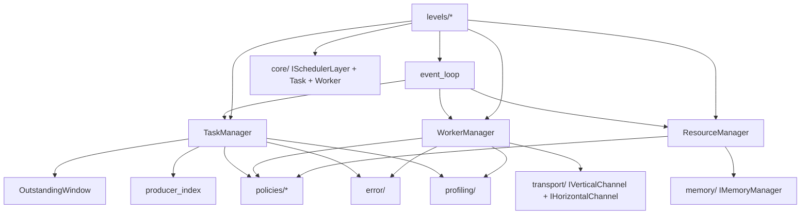
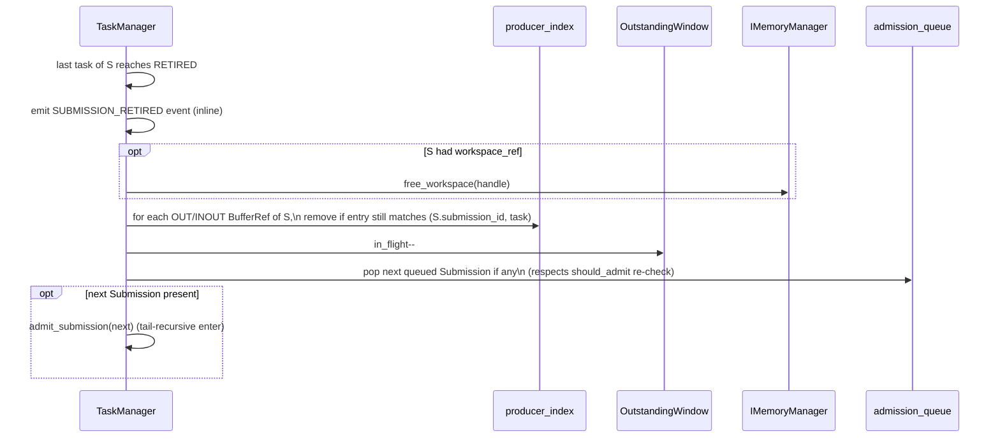

# Module Detailed Design: `scheduler/`

## 1. Overview

### 1.1 Purpose

Implement **per–Machine-Level** `ISchedulerLayer` instances using shared **TaskManager**, **WorkerManager**, and **ResourceManager** sub-components and pluggable policies (`ITaskSchedulePolicy`, `IWorkerSelectionPolicy`, `IResourceAllocationPolicy`). `scheduler/` is where dependency edges are installed, the task and worker state machines are driven, and Submissions are admitted under the Outstanding Submission Window.

### 1.2 Responsibility

**Single responsibility:** drive task state machines, match tasks to workers, and coordinate memory + channel resources for dispatch at each Layer. Policy decisions are delegated to plug-in policy objects; hardware-specific behavior is pushed down into `hal/`.

### 1.3 Position in Architecture

- **Layer:** Central orchestration between `core/` contracts and concrete workers.
- **Depends on:** `core/`, `memory/`, `transport/`, `error/`, `profiling/` (hooks), `hal/` (through `memory/` / `transport/`).
- **Depended on by:** `runtime/`; coordinates with `distributed/` for remote instances.
- **Logical View mapping:** [Scheduler](../02-logical-view/02-scheduler.md), [Worker](../02-logical-view/03-worker.md), [Interfaces §2.6](../02-logical-view/09-interfaces.md), [Dependency Model §2.10](../02-logical-view/12-dependency-model.md).

---

## 2. Public Interface

### 2.1 `TaskManager`

**Purpose:** Submission admission (Outstanding Submission Window, [§2.1.3.1.A](../02-logical-view/02-scheduler.md#2131a-submission-admission--outstanding-window)), dep-mode resolution ([§2.1.3.1.B](../02-logical-view/02-scheduler.md#2131b-dependency-resolution-per-submission)), intra-group edge installation, ready queues, `notify_dep_satisfied`, per-Submission retirement (`SUBMISSION_RETIRED` → Group Workspace release, window slot free, admission-queue drain), completion to parent. Owns the `producer_index` lifecycle ([Dependency Model §2.10](../02-logical-view/12-dependency-model.md); ADR-013).

**Methods:**

| Method | Parameters | Returns | Description |
|--------|-----------|---------|-------------|
| `admit_submission` | `const SubmissionDescriptor&` | `SubmissionHandle` / `ErrorContext` | Admit atomically or queue / reject per `IResourceAllocationPolicy::should_admit`. Drives `SUBMISSION_ADMITTED` event. |
| `resolve_dep_mode` | `SubmissionHandle, DepMode` | `void` | For the admitted Submission, install external edges (`DATA`/`BARRIER`/`NONE` per [§2.4.B](../02-logical-view/07-task-model.md#24b-dependency-modes)) on boundary-in tasks. |
| `install_intra_edges` | `SubmissionHandle, span<const IntraGroupEdge>` | `void` | Add producer→consumer fan-in counters from `SubmissionDescriptor::intra_edges`. |
| `notify_dep_satisfied` | `TaskHandle task, TaskHandle completed_dep` | `void` | Atomic decrement of `fanin_remaining`; emit `DEP_SATISFIED`. Thread-safe. |
| `on_task_complete` | `TaskHandle, const CompletionInfo&` | `void` | Transition task COMPLETING → COMPLETED → RETIRED; notify dependents; emit `WORKER_COMPLETED` follow-ons. |
| `on_submission_retired` | `SubmissionHandle` | `void` | Emit `SUBMISSION_RETIRED`; call `IMemoryManager::free_workspace` if the Submission owns a workspace; evict `producer_index` entries still matching; drain admission queue. |
| `notify_child_complete` | `TaskHandle parent, TaskHandle child` | `void` | Decrement parent's pending child counter; advance COMPLETING → COMPLETED when zero. |
| `submission_tasks` | `SubmissionHandle` | `span<const TaskHandle>` | Per-task handle resolution for the admitted Submission. |
| `get_stats` | — | `TaskManagerStats` | In-flight submissions, window occupancy, admission-queue depth. |

**Dependency state owned** ([Dependency Model §2.10](../02-logical-view/12-dependency-model.md)):

- `producer_index : BufferRef → (submission_id, TaskHandle)` — single-valued, **RAW-only** cross-Submission producer index.
  - **Insertion** at admission for every `OUT`/`INOUT` argument (upsert; most-recent-writer wins — safe because the frontend's `intra_edges` already serialize intra-Submission WAW hazards).
  - **Lookup** on `DATA`-mode admission for each boundary-in `IN`/`INOUT` argument; stale hits (generation mismatch on `TaskHandle`) are discarded.
  - **Eviction** on `SUBMISSION_RETIRED`: walk the retired Submission's `OUT`/`INOUT` `BufferRef`s and remove entries still matching the retired Submission. Entries already overwritten by a later Submission are left alone.
- Installed dependency edges on task slots: `intra_edges` verbatim plus `DATA`-mode-derived producer→consumer edges.
- No intra-Submission hazard detection is performed — that is the frontend's responsibility per [`tensor-dependency.md`](../../../tensor-dependency.md); a missing `intra_edges` entry is a frontend defect.

**Contract:**

- **Preconditions:** `IResourceAllocationPolicy`, `IMemoryManager`, and `ITaskSchedulePolicy` are wired; `init` has completed.
- **Postconditions:** After `admit_submission` returns `SubmissionHandle`, every Task is allocated, every `intra_edges` entry is installed, and every boundary-in task has its `dep_mode`-appropriate external edges attached — or the Submission is rejected as a whole.
- **Thread safety:** `notify_dep_satisfied`, `notify_child_complete`, and `on_task_complete` are safe from any thread (MPSC push into the scheduler event queue). All other methods execute on the scheduler event-loop thread (Stage B in [§2.1.3.5](../02-logical-view/02-scheduler.md#2135-event-driven-execution-model)).
- **Error behavior:** Admission rejection → `ErrorCode::AdmissionRejected`; cyclic `intra_edges` → `ErrorCode::CyclicDependency`; both are returned as `ErrorContext`, never thrown.

### 2.2 `WorkerManager`

**Purpose:** Worker pool lifecycle, worker-state machine driver, dispatch to execution engines (via `hal/IExecutionEngine` indirectly through Workers), group-aware allocation for heterogeneous Layers (Core Wraps, [§2.1.4.2](../02-logical-view/03-worker.md#2142-heterogeneous-worker-types-and-worker-groups)).

**Methods:**

| Method | Parameters | Returns | Description |
|--------|-----------|---------|-------------|
| `bind_worker` | `Worker` | `WorkerId` | Admit a new Worker into the pool (init / hot-plug). |
| `select_workers` | `const TaskDescriptor&, const TaskExecType&` | `WorkerAllocation` | Delegate to `IWorkerSelectionPolicy::select_workers`. |
| `dispatch` | `TaskHandle, WorkerAllocation` | `ErrorContext` | Write dispatch payload, transition Worker(s) → ASSIGNED, start timeout timer. |
| `on_worker_done` | `WorkerId, const CompletionInfo&` | `void` | Transition to IDLE; restore per-group availability; emit `WORKER_COMPLETED`. |
| `on_worker_failed` | `WorkerId, ErrorContext` | `void` | Transition FAILED → RECOVERING → IDLE/UNAVAILABLE. |
| `preempt` | `TaskHandle current, TaskHandle incoming` | `bool` | Only called when `ITaskSchedulePolicy::should_preempt` returned true. |
| `group_availability` | — | `span<const WorkerGroupAvailability>` | Snapshot for policy input. |

**Per-group availability index.** Per [Process View §4.3.5](../04-process-view.md#435-worker-state-machine), a per-group count of IDLE Workers per Worker Type is maintained. Updated on every Worker state transition; feeds `WorkerGroupAvailability` into `IWorkerSelectionPolicy`.

**Contract:**

- **Preconditions:** Workers bound before `dispatch`; `IWorkerSelectionPolicy` wired.
- **Thread safety:** All mutating methods run on the scheduler thread (Stage B). Worker completion signals enter via the event queue.
- **Error codes:** `ErrorCode::WorkerCrashed`, `ErrorCode::DispatchFailed`.

### 2.3 `ResourceManager`

**Purpose:** Join point between memory allocation (`IMemoryManager`) and worker binding (`WorkerManager`). Orchestrates the `DEP_READY → RESOURCE_READY` transition.

**Methods:**

| Method | Parameters | Returns | Description |
|--------|-----------|---------|-------------|
| `reserve` | `TaskHandle` | `ResourceAllocationResult` | Delegate to `IResourceAllocationPolicy::allocate_resources`; may return WAIT. |
| `release` | `TaskHandle` | `void` | Free buffer back to `IMemoryManager`; release Worker(s) back to `WorkerManager`. |
| `bind_memory_and_worker` | `TaskHandle, const ResourceAllocationResult&` | `void` | Apply the policy decision to the task slot. |
| `snapshot` | — | `ResourceSnapshot` | Current availability view for the policy (memory, slots, workers, window). |

**Contract:**

- **Preconditions:** `IMemoryManager`, `WorkerManager`, and `IResourceAllocationPolicy` wired.
- **Postconditions:** On success, task has valid `BufferRef` and allocated Worker(s); on WAIT, the task remains in `DEP_READY` and the policy re-evaluates on `RESOURCE_AVAILABLE`.
- **Thread safety:** Scheduler thread only. Incoming `RESOURCE_AVAILABLE` events from `memory/` are enqueued via the event queue.

### 2.4 Policy Interfaces

Inline from [Interfaces §2.6.3](../02-logical-view/09-interfaces.md#263-schedule-policy-interfaces); all three are optional — default implementations are provided. Policies are injected at Layer construction via `MachineLevelDescriptor` and remain fixed for the Layer's lifetime.

```cpp
class ITaskSchedulePolicy {
public:
    virtual ~ITaskSchedulePolicy() = default;
    virtual void rank_ready_tasks(TaskHandle ready[], size_t count) = 0;
    virtual bool should_preempt(const TaskDescriptor& new_task,
                                const TaskDescriptor& current_task) = 0;
    virtual void on_task_state_change(TaskHandle task,
                                      TaskState old_state,
                                      TaskState new_state) = 0;
};

class IWorkerSelectionPolicy {
public:
    virtual ~IWorkerSelectionPolicy() = default;
    virtual WorkerAllocation select_workers(
        const TaskDescriptor& task,
        const TaskExecType& exec_type,
        const std::vector<WorkerGroupAvailability>& group_availability,
        const WorkerState all_workers[], size_t worker_count) = 0;
    virtual void on_worker_state_change(uint32_t worker_id,
                                        WorkerState old_state,
                                        WorkerState new_state) = 0;
};

class IResourceAllocationPolicy {
public:
    virtual ~IResourceAllocationPolicy() = default;
    enum class AdmissionDecision : uint8_t { ADMIT, WAIT, REJECT };
    virtual AdmissionDecision should_admit(
        const SubmissionDescriptor& submission,
        const ResourceSnapshot&     available) = 0;
    virtual ResourceAllocationResult allocate_resources(
        const TaskDescriptor& task, const ResourceSnapshot& available) = 0;
    virtual bool should_backpressure(const ResourceSnapshot& available) = 0;
    virtual void on_resource_change(const ResourceSnapshot& snapshot) = 0;
};
```

**Policy invocation contract:**

- **Synchronous only for v1** ([Open Question Q11](../09-open-questions.md)). Policies must not block, allocate from critical paths, or take mutexes that a scheduler event might hold.
- **Called exclusively from the scheduler event-loop thread (Stage B)** — implementations may read/write their own internal state without locking.
- **Observation hooks (`on_*_state_change`, `on_resource_change`) run inline with the triggering transition.** They must be O(1) or near-O(1).

### 2.5 Per-Layer Implementations

The module ships five concrete `ISchedulerLayer` implementations; each binds the three managers with level-specific memory managers, channels, and event sources.

| Implementation | Level | Workers | Memory | Channels | Event sources |
|---------------|-------|---------|--------|----------|--------------|
| `aicore_dispatcher` | Core (L0) | AICore hardware workers (Core Wraps) | On-chip scratchpad + ring buffer | Register bank poke + COND register poll | `RegisterPollEventSource` (COND) |
| `aicpu_scheduler` | Chip (L1) | AICore cluster (pool) | SRAM pool | Ring buffer to Core; SPSC to Device | `SPSCRingEventQueue` |
| `device_orchestrator` | Device (L2) | AICPU threads | HBM pool + scratchpad | SPSC to Chip; SPSC+DMA to Host | `MPSCRingEventQueue` |
| `host_scheduler` | Host (L3) | Device worker thread(s) | Host pool + RDMA-registered regions | DMA to Device; Horizontal to peers | `MPSCRingEventQueue` |
| `distributed_scheduler` | Pod+ (L4+) | Node worker(s) | Remote-aware registration | Horizontal channel | `ChannelEventSource` |

Each implementation inherits the Stage A/B/C event loop pattern from [§2.1.3.5](../02-logical-view/02-scheduler.md#2135-event-driven-execution-model) and differs only in `EventLoopDeploymentConfig` and event-source wiring.

### 2.6 Public Data Types

| Type | Description |
|------|-------------|
| `LayerStats`, `TaskManagerStats` | Read-only counters for `ISchedulerLayer::get_stats`. |
| `ResourceSnapshot`, `ResourceAllocationResult`, `WorkerAllocation` | Policy I/O (per [§2.6.3](../02-logical-view/09-interfaces.md)). |
| `SchedulerEvent` (re-exported from `core/`) | Event loop currency. |
| `OutstandingWindowState` | Struct exposing `{in_flight, max_concurrent, admission_queue_depth}` for tests / metrics. |

---

## 3. Internal Architecture

### 3.1 Internal Component Decomposition

```
scheduler/
├── include/scheduler/
│   ├── task_manager.h                   # TaskManager public surface
│   ├── worker_manager.h                 # WorkerManager public surface
│   ├── resource_manager.h               # ResourceManager public surface
│   ├── i_task_schedule_policy.h         # Policy interface (re-exposed)
│   ├── i_worker_selection_policy.h
│   ├── i_resource_allocation_policy.h
│   ├── producer_index.h                 # Types for the cross-submission index
│   ├── event_loop.h                     # Stage A/B/C runner + config
│   └── levels/                          # Per-level public factories
├── src/
│   ├── task_manager.cpp                 # Admission, dep-mode, retirement
│   ├── worker_manager.cpp               # Worker FSM + group availability
│   ├── resource_manager.cpp             # Memory + Worker coordination
│   ├── event_loop.cpp                   # Collection/Classify/Drain runner
│   ├── outstanding_window.cpp           # Window + admission queue
│   ├── producer_index.cpp               # Upsert/lookup/evict
│   ├── policies/
│   │   ├── fifo_task_policy.cpp         # Default ITaskSchedulePolicy (earliest-submission bias)
│   │   ├── priority_task_policy.cpp     # Optional priority-based variant
│   │   ├── round_robin_worker_policy.cpp # Default IWorkerSelectionPolicy
│   │   ├── locality_worker_policy.cpp   # Data-locality variant
│   │   └── greedy_resource_policy.cpp   # Default IResourceAllocationPolicy
│   └── levels/
│       ├── aicore_dispatcher.cpp        # L0
│       ├── aicpu_scheduler.cpp          # L1
│       ├── device_orchestrator.cpp      # L2
│       ├── host_scheduler.cpp           # L3
│       └── distributed_scheduler.cpp    # L4+
└── tests/
    ├── test_admission_window.cpp
    ├── test_producer_index.cpp
    ├── test_event_loop_stages.cpp
    ├── test_policies.cpp
    └── test_per_level_smoke.cpp
```

### 3.2 Internal Dependency Diagram



All levels share the three managers; level-specific code only supplies worker/memory/channel bindings and event-source composition.

### 3.3 Key Design Decisions (Module-Level)

- **External `ISchedulerLayer` stable (ADR-003).** The internal split into TaskManager / WorkerManager / ResourceManager is an implementation detail (ADR-008) — policies attach here, not at the `ISchedulerLayer` boundary.
- **Event-driven state-machine mutation only in Stage B (ADR-010).** No external thread mutates Task/Worker/Resource state directly; they push events.
- **Policies synchronous for v1.** Async policy hooks deferred until need proven.
- **`producer_index` is single-valued, RAW-only (ADR-013).** Intra-submission WAR/WAW is the frontend's responsibility via `intra_edges`.
- **Default admission queue ordering: FIFO.** Biased by the earliest-`submission_id` rule in `FifoTaskSchedulePolicy` to keep the window draining.

---

## 4. Key Data Structures

### 4.1 `OutstandingWindow`

```cpp
struct OutstandingWindow {
    uint32_t                       max_concurrent;     // LevelParams.max_outstanding_submissions
    std::atomic<uint32_t>          in_flight;          // current depth
    std::deque<SubmissionDescriptor> admission_queue;   // blocked submissions (FIFO)
    std::unordered_map<uint64_t, SubmissionSlot> active; // submission_id -> slot
};
```

Invariants: `in_flight <= max_concurrent`; every active submission has a unique `submission_id` (monotonic per Layer).

### 4.2 `producer_index` entry

```cpp
struct ProducerIndexEntry {
    uint64_t   submission_id;   // owning Submission
    TaskHandle task;            // producer task (with generation)
    uint32_t   arg_index;       // which OUT/INOUT arg emitted the BufferRef
};

using ProducerIndex = std::unordered_map<BufferRef, ProducerIndexEntry, BufferRefHash>;
```

- **Single-valued:** upsert on each OUT/INOUT at admission.
- **Keyed by `BufferRef`** (stable across WAR/WAW because frontend guarantees no aliasing within the outstanding window).
- **Eviction walks only the retired Submission's outputs**, not the whole map.

### 4.3 Ready queue

Per-Layer data structure feeding `ITaskSchedulePolicy::rank_ready_tasks`:

```cpp
struct ReadyQueue {
    std::vector<TaskHandle> tasks;         // reused buffer; no alloc in steady state
    size_t                  rank_cursor;   // last ranked index
};
```

The default `FifoTaskSchedulePolicy` ranks by ascending `submission_id`, then arrival order; ranking is O(N log N) with a small N (bounded by `DEP_READY` fan-out per cycle).

### 4.4 Per-group availability cache

```cpp
struct GroupAvailabilityCache {
    struct GroupEntry {
        uint32_t group_id;
        std::array<uint32_t, kMaxWorkerTypes> idle_by_type;  // indexed by WorkerTypeId
    };
    std::vector<GroupEntry> entries;
};
```

Updated on every Worker state transition; O(G × S) evaluation for `select_workers` when a Task requires a group-bound allocation.

---

## 5. Processing Flows

### 5.1 Submission admission with dep-mode resolution

```mermaid
sequenceDiagram
    participant Caller as Caller (runtime/ or parent Layer)
    participant TM as TaskManager
    participant Pol as IResourceAllocationPolicy
    participant Win as OutstandingWindow
    participant PI as producer_index
    participant Pool as TaskSlotPool
    participant Mem as IMemoryManager

    Caller->>TM: admit_submission(SD)
    TM->>Pol: should_admit(SD, snapshot)
    alt ADMIT
        TM->>Win: reserve slot (in_flight++)
        TM->>Pool: alloc slot per TaskDescriptor
        TM->>TM: install_intra_edges(SD.intra_edges)
        alt DATA
            TM->>PI: lookup BufferRef for each boundary-in IN/INOUT
            PI-->>TM: (submission_id, TaskHandle) or stale
            TM->>Pool: attach producer→consumer edge
        else BARRIER
            TM->>Pool: join on every currently outstanding Submission
        else NONE
            TM->>Pool: no external edges
        end
        opt workspace_request.has_value()
            TM->>Mem: alloc_workspace(total_bytes, hint)
            Mem-->>TM: WorkspaceHandle
            TM->>Pool: set workspace_ref on non-boundary tasks
        end
        TM->>PI: upsert OUT/INOUT BufferRef = (submission_id, TaskHandle)
        TM-->>Caller: SubmissionHandle
    else WAIT
        TM->>Win: enqueue(SD)
        TM-->>Caller: SubmissionHandle (queued); or back-pressure status
    else REJECT
        TM-->>Caller: ErrorCode::AdmissionRejected
    end
```

All state-machine mutations occur inside Stage B; the method is not thread-safe to call from multiple threads simultaneously.

### 5.2 Event-driven dispatch

```mermaid
sequenceDiagram
    participant Src as IEventSource
    participant A as Stage A (Collection)
    participant B as Stage B (Classify+Inline)
    participant TM as TaskManager
    participant RM as ResourceManager
    participant WM as WorkerManager
    participant D as Stage C (Deferred Drain)

    Src->>A: poll / queue event (WORKER_COMPLETED)
    A->>B: inline_dispatch_queue.push
    B->>TM: on_worker_done(task)
    TM->>TM: COMPLETING -> COMPLETED; for each dependent d:
    TM->>TM:   notify_dep_satisfied(d, task) -> emit DEP_SATISFIED
    B->>TM: handle DEP_SATISFIED (inline)
    TM->>RM: reserve(task) -> RESOURCE_READY (if policy allocates)
    B->>WM: dispatch(task, WorkerAllocation)
    WM->>Src: (posts payload to lower layer or hardware)
    Note over B,D: rank_ready_tasks() is deferred if many DEP_SATISFIED<br/>events accumulate
    B-->>D: push DEP_SATISFIED if config marks it deferred
    D->>TM: batch rank_ready_tasks(ready[], count)
```

Key invariant: only Stage B mutates Task/Worker/Resource state; Stages A and C handle collection and batching without holding scheduler locks.

### 5.3 `SUBMISSION_RETIRED` eviction



Retirement is strictly local to the Submission's outputs; prior Submissions' entries remain undisturbed unless overwritten by later Submissions, preserving single-valued semantics.

---

## 6. Concurrency Model

Aligned with [Process View §4.1.4](../04-process-view.md#414-scheduler-event-loop) and [§2.1.3.5](../02-logical-view/02-scheduler.md#2135-event-driven-execution-model).

| Thread | Responsibility |
|--------|---------------|
| Scheduler (Stage B) | Sole mutator of Task/Worker/Resource state. Runs policies and handlers synchronously. |
| Collection thread (Stage A, optional) | Drains `IEventSource`s; pushes into `inline_dispatch_queue`. Default: same thread as Stage B. |
| Deferred drain thread (Stage C, optional) | Batches `DEP_SATISFIED`, `RESOURCE_AVAILABLE`, and policy-level work. Default: same thread as Stage B. |
| Worker threads / hardware | Produce completion events via MPSC queues; never touch scheduler state directly. |
| Network progress thread (distributed) | Translates horizontal-channel messages into `REMOTE_COMPLETED` / `REMOTE_DEP_NOTIFY` events via `ChannelEventSource`. |

**Synchronization primitives:**

- `OutstandingWindow.in_flight` — `std::atomic<uint32_t>` (read by policies on other threads; written only by Stage B).
- Inline dispatch queue — `SPSCRingEventQueue` when collection is co-resident, `MPSCRingEventQueue` otherwise.
- Deferred queue — `SPSCRingEventQueue` (one producer: Stage B).
- Per-Layer ready queue and `producer_index` — Stage B only; no locking.

**External method thread safety recap:**

- `notify_dep_satisfied`, `notify_child_complete`, `on_worker_done` — thread-safe (MPSC push).
- `admit_submission`, `resolve_dep_mode`, `dispatch`, `reserve`, `release` — Stage B only.
- `get_stats`, `group_availability`, `snapshot` — snapshot reads via relaxed atomics (eventually consistent).

---

## 7. Error Handling

| Condition | `ErrorCode` | Handling |
|-----------|-------------|----------|
| `IResourceAllocationPolicy::should_admit` returns `REJECT` | `AdmissionRejected` | Returned to `submit` caller; no Submission state created. |
| Cyclic `intra_edges` detected | `CyclicDependency` | Admission rejected before slot allocation. |
| Dispatch failure (HAL returned error) | `DispatchFailed` | Task transitions DISPATCHED → FAILED with wrapped cause; scheduler propagates via state machine. |
| Worker hardware fault / timeout | `WorkerCrashed` | WorkerManager transitions Worker to FAILED → RECOVERING; task FAILED; group availability updated. |
| `TaskSlotPool` exhausted | `SlotPoolExhausted` | Treated as `WAIT` by default policy; surfaces as back-pressure when exhaustion is prolonged. |
| Stale `TaskHandle` in `notify_dep_satisfied` | logged; no-op | Expected for generation-mismatched entries. |

Errors from `memory/`, `transport/`, and `hal/` are **wrapped** (`wrap(outer=DispatchFailed, cause=…)`) before being attached to the task; this preserves the original cause for Python exception formatting.

Fatal errors (`Severity::Critical` from HAL, e.g., `DeviceReset`, `NodeLost`) propagate to `runtime/` through `ISchedulerLayer::shutdown`; scheduler refuses new submissions and drains.

---

## 8. Configuration

| Parameter | Type | Default | Description | Valid Range |
|-----------|------|---------|-------------|-------------|
| `max_outstanding_submissions` | `uint32_t` | 8–64 at Host, 2–16 at Device/Chip | Outstanding Submission Window size ([§2.1.3.1.A](../02-logical-view/02-scheduler.md#2131a-submission-admission--outstanding-window)) | > 0 |
| `default_dep_mode` | `DepMode` | `DATA` | Default dep-mode when a Submission omits it | `BARRIER`/`DATA`/`NONE` |
| `policy_factories` | registry | defaults (FIFO / Round-Robin / Greedy) | Injected at layer construction via `MachineLevelDescriptor` | — |
| `queue_depth` | `uint32_t` | 1024 (inline), 256 (deferred) | Inline dispatch + deferred queue sizes | ≥ 64 |
| `collection_policy` | enum | `FIXED_PRIORITY` | Stage A collection strategy | See [§2.1.3.5](../02-logical-view/02-scheduler.md#2135-event-driven-execution-model) |
| `deployment_mode` | enum | `Single-threaded` | A/B/C stage mapping | Single/Split-A/Split-C/Fully-split |
| `admission_queue_depth` | `uint32_t` | 1024 | Pending-submission queue size before `should_admit` returns REJECT | ≥ 1 |
| `worker_timeout_ms` | `uint32_t` | 5000 (host), 1000 (device) | Worker watchdog | > 0 |
| `generation_wrap_warn` | `uint32_t` | 2^24 | Slot generation-counter warning threshold | — |

---

## 9. Testing Strategy

### 9.1 Unit Tests

- `test_admission_window`:
  - `should_admit=ADMIT` with empty window → `SubmissionHandle` returned.
  - `should_admit=WAIT` puts Submission on admission queue; retirement drains.
  - `should_admit=REJECT` produces `AdmissionRejected`.
  - Window saturation + drain: `max_outstanding_submissions` respected even under burst.
- `test_producer_index`:
  - Upsert / lookup / eviction correctness.
  - Stale hit on generation mismatch is discarded.
  - Retirement evicts only matching entries.
- `test_event_loop_stages`:
  - Single-threaded, split-A, split-C, and fully-split deployments all process the same trace identically.
  - Stage B holds all state mutation (instrumented assertion).
- `test_policies`:
  - Default FIFO policy biases by `submission_id`.
  - Round-Robin worker policy rotates among idle workers of the correct type.
  - Greedy resource policy honors workspace and pool-utilization back-pressure.
- `test_worker_state_machine`:
  - Full transition table coverage (IDLE → ASSIGNED → EXECUTING → COMPLETING → IDLE).
  - Failure path (FAILED → RECOVERING → IDLE / UNAVAILABLE).
- `test_group_availability`:
  - `requires_worker_group` Tasks only scheduled on groups whose slots are all satisfiable.

### 9.2 Integration Tests

- Sim HAL end-to-end: a 3-layer stack (Host → Device → Chip → Core via `aicore_dispatcher`) drains a 1000-Submission stream with mixed `SINGLE`/`GROUP`/`SPMD`.
- Distributed: two `distributed_scheduler` instances with an in-process horizontal channel exchange `REMOTE_SUBMIT` and `REMOTE_DEP_NOTIFY`; remote dependency chains resolve correctly.

### 9.3 Edge Cases and Failure Tests

- Preemption disabled path: `should_preempt` returns false always; verify no preemption occurs even under priority inversion.
- Worker exhaustion: all Workers FAILED; scheduler parks tasks until `on_worker_failed` → recovery; no lost tasks.
- Remote dependency chain: A waits on B@remote which waits on C@remote; completion propagates back correctly; timeouts surface as `TransportTimeout`.
- Admission-queue drain starvation: verify earliest-Submission bias prevents a long-running later Submission from blocking the queue.
- `SUBMISSION_RETIRED` during active admission of another Submission (interleave via event loop) — state-machine invariant preserved.

---

## 10. Performance Considerations

- **Critical-path latency budgets** ([Process View §§4.8.1, 4.8.3, 4.8.4](../04-process-view.md#48-latency-budgets-rule-x9)):
  - Window check + slot reservation: < 100 ns amortized.
  - Intra-group edge install: < 50 ns per edge.
  - `DATA`-mode external edge scan: O(B × A) with W-bounded producer-index lookups.
  - `BARRIER`-mode attach: O(W + B).
  - `NONE`-mode attach: < 10 ns.
  - Host → AICore dispatch: < 15 μs end-to-end.
- **Policy invocations** are the dominant variable cost; defaults keep them O(N) in ready-queue depth, O(1) in worker selection (pre-shuffled round-robin cursor).
- **No heap allocation on the hot path.** Ready queues, admission queues, and event queues are pre-sized; `producer_index` is reserved at `init` from expected workload estimates.
- **Ranking deferred to Stage C** when multiple `DEP_SATISFIED` events arrive in a cycle, batching N tasks into one `rank_ready_tasks` call instead of N.
- Profiling hooks (§7.2 in cross-cutting concerns) are branch-predictable `if (enabled)` checks when compiled with `PROFILING_LEVEL ≥ 2`.

---

## 11. Extension Points

- **Custom policies** via `MachineLevelDescriptor::policy_factories` — no code change to `scheduler/` beyond adding a new `.cpp` under `policies/` if shipped as default.
- **Custom `ISchedulerLayer` per level** — implement against the three managers; register via `MachineLevelRegistry` in `runtime/` (ADR-002).
- **Alternative event-loop deployments** — change `EventLoopDeploymentConfig` without touching manager code.
- **Alternative `IEventSource` / `IEventQueue` implementations** — required for new hardware signaling patterns; register per level.
- **New `TaskExecType`** — pure data in `MachineLevelDescriptor`; `WorkerManager`/`ResourceManager` read it generically.

---

## 12. Open Questions (Module-Level)

- Async policy hooks ([Q11](../09-open-questions.md)).
- Static vs dynamic queue sizing strategy ([Q3](../09-open-questions.md)).
- Multi-die placement at the Device level ([Q1](../09-open-questions.md)).
- Preemption semantics under `DATA`-mode chains — when `should_preempt` fires mid-flight.

---

## 13. Review Amendments (R3)

This section records normative amendments from architecture-review run `2026-04-18-171357`. Each `[UPDATED: <id>: ...]` callout is authoritative over any prior wording it overlaps and is tied to an entry in `reviews/2026-04-18-171357/final/applied-changes/docs__pypto-runtime-design__modules__scheduler.md.diff.md`.

> **[UPDATED: A1-P1: pre-size `producer_index`; forbid rehash on hot path]** *Target: §4.2 `producer_index` entry; §8 Configuration.* Allocate `producer_index` at Layer init with `capacity = max_outstanding_submissions × expected_outputs_per_submission × 2`, place in CONTROL region with `isolate_cache_line=true`, no rehash. Overflow uses bounded open-addressed probing (L<0.5, probe ≤2); probe exhaustion returns `ErrorCode::ResourceExhausted` and triggers `IResourceAllocationPolicy.should_admit` back-pressure. Mirror config field `producer_index_capacity`.

> **[UPDATED: A1-P2: bound DATA-mode lock hold time; shard count as LevelParam]** *Target: §6 Concurrency Model.* Shared-mode admission hold ≤ `B×A` probes (≤ 500 ns for B=4,A=4); exclusive-mode hold bounded by `B×A` fan-in RMWs + `|S.OUT∪S.INOUT|` removals. Default `producer_index_shards = max(1, scheduler_thread_count)`; p99 reader ≤ 3 μs, p99 writer ≤ 10 μs per shard under 8 shards.

> **[UPDATED: A1-P8: pre-size Outstanding/Ready; CONTROL placement]** *Target: §4.1 `OutstandingWindow`; §4.3 Ready queue; §8 Configuration.* `ReadyQueue` = intrusive min-heap over Task slot indices, capacity `max_outstanding_submissions × expected_tasks_per_submission × 2`, CONTROL region, `isolate_cache_line`. `Admission queue` = bounded SPSC ring of `SubmissionDescriptor*`, capacity `max_admission_backlog` (default 64), overflow returns `WouldBlock`. `OutstandingWindow` = fixed array indexed by `submission_id % max_outstanding_submissions`. Diagnostic sub-codes `TaskSlotExhausted` / `ReadyQueueExhausted` are routed via A3-P7.

> **[UPDATED: A1-P14: `producer_index` CONTROL placement + shard default]** *Target: §4.2; §8 Configuration.* `producer_index` resides in the Layer's CONTROL region (CONTROL_AREA at Chip/Device, CONTROL_HEAP at Host). Default shard count `max(1, scheduler_thread_count)`. Rehash disabled (A1-P1). Admission reads fit in the CONTROL region.

> **[UPDATED: A5-P6: scheduler-thread watchdog / deadman timer with normative write-elision]** *Target: §2.5 Per-Layer Implementations (event-loop description); §4 / §8.* Scheduler writes a monotonic timestamp to a deadman slot at the top of each event-loop cycle. Low-priority monitor thread checks at `scheduler_watchdog_ms` (default 250 ms) and raises `SchedulerStalled` when delta > budget. Normative write-elision (A1 handoff): the store is elided into per-cycle TSC capture and may skip up to K=16 cycles on burst (≤ 1.6 ms ≪ 250 ms watchdog).

> **[UPDATED: A5-P8: admission-pressure + partial-group degradation policies]** *Target: §2.4 Policy Interfaces; §5.1 admission flow.* `admission_pressure_policy ∈ {REJECT, COALESCE, DEFER}` with `max_deferred` bound to prevent memory exhaust. `partial_group_policy ∈ {FAIL_SUBMISSION, SHRINK_AND_RETRY, DEGRADED_CONTINUE}`. Externalized rules file parameterizes both; each value is tied to an A8-P5 AlertRule.

> **[UPDATED: A5-P9: Worker `UNAVAILABLE + {Permanent, Quarantine(duration)}` policy variants]** *Target: §3.2 Internal Dependency Diagram (Worker FSM cross-ref); §2.2 WorkerManager.* Replace a separate `QUARANTINED` state with `UNAVAILABLE + {Permanent, Quarantine(worker_quarantine_ms)}` policy variants. Transitions: `RECOVERING → UNAVAILABLE(Quarantine)`; probe success → `IDLE`; probe failure / `max_quarantine_cycles` → `UNAVAILABLE(Permanent)`. Config: `worker_quarantine_ms`, `worker_probe_retries`.

> **[UPDATED: A5-P12: `ErrorCode::ResourceExhausted` row for BufferRef staging alloc]** *Target: §5 Processing Flows / §7 Error Handling (new table row).* Staging `BufferRef` allocation failure on A1-P13's `>1 KiB` slow path surfaces `ErrorCode::ResourceExhausted`. Mirrored in `hal.md §13`.

> **[UPDATED: A6-P13: per-tenant submit rate-limit (multi-tenant only)]** *Target: §5.1 admission flow.* `DeploymentConfig.per_tenant_submit_qps: uint32 | None`. Leaky-bucket relaxed counter; on breach → `AdmissionDecision::REJECTED` with `TenantQuotaExceeded`. Single-tenant default = no limit. Counters partitioned per tenant so tenant-A flood does not affect tenant-B.

> **[UPDATED: A8-P2: single `IEventLoopDriver` test seam + `step()` + `RecordedEventSource`]** *Target: §2.5 Per-Layer Implementations; §5.2 Event-driven dispatch.* Introduce `IEventLoopDriver` gated on `enable_test_driver`. `EventLoopRunner::step(max_events)` is the single control entry. `RecordedEventSource` replays serialized traces to produce bit-identical state transitions across deployments. Release binary is unaffected.

> **[UPDATED: A8-P3: scheduler-side stats + latency histograms]** *Target: §2.6 Public Data Types; §4.3 Ready queue (metrics); §8 Configuration.* `LayerStats`, `TaskManagerStats`, `WorkerStats` with concrete fields + units. `LatencyHistogram` with pre-allocated log-scale buckets; branchless insert < 5 ns; seqlock snapshot; bucket array pinned to CONTROL region (see `profiling.md §13`).

> **[UPDATED: A8-P12: stable PhaseIds for Submission lifecycle]** *Target: §5.1 admission flow; §5.3 retirement.* PhaseIds: `SUBMISSION_ADMIT`, `SUBMISSION_RETIRE`, `DATA_DEP_SCAN`, `BARRIER_ATTACH`, `NONE_ATTACH`, `WORKSPACE_ALLOC`, `ADMISSION_QUEUE_DRAIN`, `WORKER_DISPATCH`, `WORKER_COMPLETE`. Per-phase durations sum to admission latency within 1%.

> **[UPDATED: A10-P1: default `producer_index` sharding policy]** *Target: §6 Concurrency Model.* Shard count default = 8 at Host, 4 at Device, 1 at Chip and below. Each shard has its own RW lock; admission takes shard lock keyed by `hash(BufferRef) mod N`. Default `shards=1` preserves today's single-thread fast path. Deployment cue in `05-physical-view.md` (A10-P7) triggers opt-in when `concurrent_submitters × cluster_nodes ≥ 64`.

> **[UPDATED: A5-P11-ref: PeerHealthState source-of-truth is `distributed.md §3.5`]** *Target: §2.4 Policy Interfaces cross-ref.* Any scheduler-side decision that branches on peer health consults the unified peer-health FSM owned by `distributed.md §3.5` (states `{HEALTHY, SUSPECT, OPEN, HALF_OPEN, UNAVAILABLE(Quarantine), LOST, AUTH_REVOKED}`); no scheduler-local shadow state.

---

**Document status:** Draft — ready for review.
