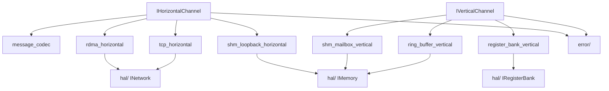
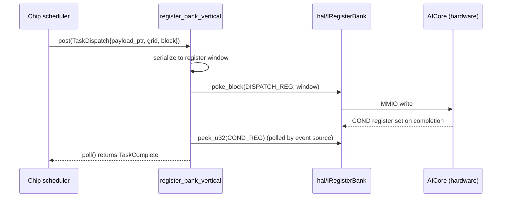

# Module Detailed Design: `transport/`

## 1. Overview

### 1.1 Purpose

Provide **Vertical Channels** (parent↔child signaling / data within a node) and **Horizontal Channels** (sibling / multi-node messaging) over HAL network and memory primitives. This module owns the protocol-agnostic transport surface that `scheduler/`, `distributed/`, and `runtime/` compose into the hierarchy.

### 1.2 Responsibility

**Single responsibility:** reliable, ordered, bounded-latency messaging and data movement abstractions. No scheduling, no tensor lifecycle, no partitioning — transport only. Vertical Channels carry **control** messages; the bulk data plane is `memory/IMemoryOps` ([§2.1.7 Memory Operations](../02-logical-view/04-memory.md#217-memory-operations)).

### 1.3 Position in Architecture

- **Layer:** Parallel to `memory/`, above `hal/`.
- **Depends on:** `hal/` (`INetwork`, `IRegisterBank`, `IMemory`), `core/` (handles, `TaskDescriptor` for serialization), `error/`.
- **Depended on by:** `scheduler/` (completion events, vertical dispatch), `distributed/` (remote protocol), `runtime/` (wiring).
- **Logical View mapping:** [Communication §2.7](../02-logical-view/08-communication.md), [Process View §4.6 Distributed Scheduling Protocol](../04-process-view.md#46-distributed-scheduling-protocol).

---

## 2. Public Interface

### 2.1 `IVerticalChannel`

**Purpose:** Intra-node signaling between a Layer and its parent / child Layer. Realized as a ring buffer, register-bank poke, or shared-memory mailbox depending on the Layer pair.

**Methods:**

| Method | Parameters | Returns | Description |
|--------|-----------|---------|-------------|
| `post` | `const VerticalMessage&` | `Status` | Enqueue one message to the peer endpoint. Non-blocking; returns `WouldBlock` when the ring is full (policy-driven). |
| `poll` | `VerticalMessage* out` | `bool` | Non-blocking drain; returns true iff a message was retrieved. |
| `try_post_batch` | `span<const VerticalMessage>` | `size_t accepted` | Attempt to enqueue up to N messages; returns the count actually posted. |
| `subscribe` | `IEventSink*` | `void` | Optional: wire a completion sink so the peer's scheduler event loop sees arrivals as events. |
| `flush` | — | `Status` | Force any buffered stores / MMIO writes to complete (memory fence or driver `fence()`). |
| `capacity` | — | `size_t` | Backing storage depth. |
| `depth` | — | `size_t` | Current occupancy (approximate; relaxed atomic). |

**Contract:**

- **Ordering:** FIFO per endpoint pair. Batch posts preserve their relative order.
- **Reliability:** Within a node, messages are never dropped once `post` returns `Ok`. Capacity exhaustion returns `WouldBlock` — never silently overwrites.
- **Latency:** Vertical register-bank implementation targets < 2 μs ([Process View §4.8.1](../04-process-view.md#481-single-node-kernel-dispatch-host--aicore-execution-start)).
- **Thread safety:** Implementation-dependent; see §6. Register-bank and SPSC ring backends are single-producer, single-consumer — callers serialize externally. Shared-memory mailbox backends are MPSC-safe.
- **Error codes:** `ErrorCode::ChannelClosed` when the peer endpoint has shut down; `ErrorCode::TransportCorrupted` on CRC mismatch (shared-memory backend).

### 2.2 `IHorizontalChannel`

**Purpose:** Inter-node messaging between peer Layers. Backed by TCP, RDMA, or shared memory (loopback / sim).

**Methods:**

| Method | Parameters | Returns | Description |
|--------|-----------|---------|-------------|
| `send` | `NodeId peer, const HorizontalMessage&, Timeout` | `Status` | Unicast send; **mandatory timeout** per [Development View §3.4](../03-development-view.md). |
| `recv` | `NodeId peer, HorizontalMessage* out, Timeout` | `Status` | Receive from a specific peer; timeout mandatory. |
| `broadcast` | `span<NodeId>, const HorizontalMessage&, Timeout` | `Status` | Fan-out to multiple peers; best-effort where backend supports it, else loop-based. |
| `subscribe` | `IEventSink*` | `void` | Event-source hook for incoming messages. |
| `connect` | `const EndpointSpec&` | `Status` | Establish / accept a connection to a peer (init-time for RDMA / TCP). |
| `disconnect` | `NodeId peer` | `void` | Graceful close; in-flight messages reject with `ChannelClosed`. |
| `connected_peers` | — | `span<const NodeId>` | Snapshot of active peers. |

**Contract:**

- **Timeouts:** Every remote operation has an explicit timeout. A `Timeout::infinite()` constant exists only for shutdown draining.
- **Ordering:** FIFO per `(self, peer)` pair. Cross-peer order is not guaranteed.
- **Reliability:** `send` is **reliable** (backend-level retries + ACK) or returns an error; application-level retry is the caller's decision (see `distributed/failure_policy`).
- **Thread safety:** Safe to call `send` from multiple threads concurrently — implementations lock per peer or use per-peer work queues. `recv` is typically pinned to a progress thread that feeds the event source.
- **Error codes:** `TransportDisconnected`, `TransportTimeout`, `TransportCorrupted`, `NodeLost` (critical), `ProtocolVersionMismatch`.

### 2.3 Message Envelopes

All distributed messages share a common header and then a type-specific payload. The wire format is versioned per ADR-013 and stable across patch releases.

```cpp
enum class MessageType : uint16_t {
    REMOTE_SUBMIT       = 1,
    REMOTE_DEP_NOTIFY   = 2,
    REMOTE_COMPLETE     = 3,
    REMOTE_DATA_READY   = 4,
    REMOTE_ERROR        = 5,
    HEARTBEAT           = 6,
    HANDSHAKE           = 7,
};

struct MessageHeader {
    uint16_t    magic;         // 0x5054 "PT"
    uint8_t     version;       // protocol version; bump on breaking change
    uint8_t     flags;
    MessageType type;
    uint16_t    reserved;
    uint32_t    payload_bytes;
    uint64_t    correlation_id; // span id; flows end-to-end
    uint64_t    source_node;
    uint64_t    target_node;
    uint32_t    crc32;         // over payload only
};
```

Per-type payloads (inlined here — normative for this module):

```cpp
struct RemoteSubmitPayload {
    uint64_t parent_task_key;    // TaskKey of parent on source node
    uint64_t submission_id;      // source-node submission id
    uint32_t task_count;
    uint32_t edge_count;
    uint8_t  dep_mode;           // DepMode
    // followed by: TaskDescriptor[task_count], IntraGroupEdge[edge_count],
    //              boundary_in[]/boundary_out[], optional WorkspaceRequest.
};

struct RemoteDepNotifyPayload {
    uint64_t source_task_key;    // producer on source node
    uint64_t dependent_task_key; // consumer on target node
    uint32_t output_index;
    uint32_t tensor_meta_bytes;
    // followed by: output BufferRef global metadata (size, dtype, shape).
};

struct RemoteCompletePayload {
    uint64_t source_task_key;
    uint64_t parent_task_key;
    uint32_t status_code;        // ErrorCode (Ok on success)
    uint32_t profiling_bytes;    // optional trailing profiling blob
    uint64_t completion_ts_ns;
};

struct RemoteDataReadyPayload {
    uint64_t source_task_key;
    uint64_t consumer_task_key;
    uint64_t global_address;     // RDMA-addressable remote buffer
    uint32_t size;
    uint32_t rkey;               // RDMA key for direct read
};

struct RemoteErrorPayload {
    uint64_t task_key;
    uint32_t error_code;         // ErrorCode
    uint32_t message_bytes;      // UTF-8 message, truncated
    // followed by message[message_bytes]
};

struct HeartbeatPayload {
    uint64_t monotonic_ts_ns;
    uint32_t in_flight;          // info for coordinator tuning
    uint32_t queue_depth;
};
```

**Versioning:** `MessageHeader::version` is bumped on any breaking schema change; peers negotiate the highest mutually supported version during `HANDSHAKE`. Mismatch → `ErrorCode::ProtocolVersionMismatch`.

### 2.4 Public Data Types

| Type | Description |
|------|-------------|
| `VerticalMessage` | Tagged union of `TaskDispatch`, `TaskComplete`, `DepNotify`, `Drain`. Fixed size (control-plane only). |
| `HorizontalMessage` | Serialized envelope (see §2.3). |
| `EndpointSpec` | `{transport: Tcp|Rdma|Shm, address, port, credentials?}`. |
| `Timeout` | `std::chrono::microseconds` plus an `infinite` sentinel for shutdown. |
| `NodeId` | Opaque 64-bit node identity. |
| `ChannelStats` | Bytes in/out, messages in/out, timeouts, disconnects. |

---

## 3. Internal Architecture

### 3.1 Internal Component Decomposition

```
transport/
├── include/transport/
│   ├── i_vertical_channel.h
│   ├── i_horizontal_channel.h
│   ├── messages.h                     # Header, payloads, codec
│   ├── endpoint.h                     # EndpointSpec, Timeout
│   └── types.h
├── src/
│   ├── intra_node/
│   │   ├── ring_buffer_vertical.cpp   # SPSC ring for Chip↔Core, Device↔Chip
│   │   ├── register_bank_vertical.cpp # MMIO poke/peek fast path
│   │   └── shm_mailbox_vertical.cpp   # Host↔Device shared-memory mailbox
│   └── inter_node/
│       ├── tcp_horizontal.cpp         # TCP backend (fallback, cross-rack)
│       ├── rdma_horizontal.cpp        # RDMA RC backend (intra-Pod)
│       └── shm_loopback_horizontal.cpp# In-process loopback for sim / tests
├── src/codec/
│   ├── message_codec.cpp              # Header framing + CRC
│   └── version_negotiate.cpp          # Handshake logic
└── tests/
    ├── test_ring_buffer_vertical.cpp
    ├── test_register_bank_vertical.cpp
    ├── test_message_codec.cpp
    ├── test_rdma_loopback.cpp
    └── test_version_negotiate.cpp
```

### 3.2 Internal Dependency Diagram



### 3.3 Key Design Decisions (Module-Level)

- **Vertical vs Horizontal separation** keeps the intra-node fast path free of network-backend complexity.
- **Control-plane-only for Vertical.** Bulk data is routed through `memory/IMemoryOps` and referenced by `BufferRef` inside Vertical messages. This preserves a narrow control-plane path with < 2 μs register-bank latency.
- **Mandatory timeouts on Horizontal** per [03-development-view.md §3.4](../03-development-view.md).
- **Backend selection at build + runtime.** CMake option `TRANSPORT_BACKEND` (`tcp` / `rdma` / `shm`) controls which `inter_node` sources compile in; the runtime selects a backend at init from `DeploymentConfig`.
- **Pass-through / elision** hooks (per [Q2](../09-open-questions.md)): a Layer whose parent↔child channel degenerates to the identity skips the channel entirely — wired at `runtime/init`, not inside channel implementations.

---

## 4. Key Data Structures

### 4.1 SPSC ring-buffer layout (intra-node vertical)

```
 ┌─── 64 B cache line ───┐
 │  head : u32 (producer) padding                     │
 ├────────────────────────────────────────────────────┤
 │  tail : u32 (consumer) padding                     │
 ├────────────────────────────────────────────────────┤
 │  slot_size : u32   capacity : u32   flags : u32    │
 ├────────────────────────────────────────────────────┤
 │  slots[capacity] of fixed slot_size bytes          │
 └────────────────────────────────────────────────────┘
```

- `head` and `tail` are cache-line isolated via `PlacementHint.isolate_cache_line = true`; cache line size read from `MemoryRegionDescriptor`.
- `slot_size` is sized for the largest `VerticalMessage` variant; messages smaller than the slot pad with zero.

### 4.2 RDMA work-request pool

```cpp
struct RdmaWorkRequest {
    uint64_t wr_id;        // application cookie
    NodeId   peer;
    void*    send_buf;     // pre-registered MR
    size_t   send_bytes;
    void*    recv_buf;     // optional, for two-sided RDMA
    size_t   recv_bytes;
    uint32_t lkey;
    uint32_t rkey;
};

struct RdmaWorkRequestPool {
    std::vector<RdmaWorkRequest> slots;
    std::atomic<uint32_t>        free_head;  // LIFO free list
};
```

- Pre-allocated at `connect` time. Steady state: producers CAS off the free list; progress thread CASes back on completion.

### 4.3 Message codec buffers

- One send buffer + one recv buffer per connected peer, each sized to `max_message_bytes`, RDMA-registered once via `hal::IMemory::register_for_dma`.
- Large payloads (> `max_message_bytes`) are chunked with a continuation bit in `MessageHeader::flags`; chunk reassembly owned by the codec.

---

## 5. Processing Flows

### 5.1 Remote submit / dep-notify / complete round trip

```mermaid
sequenceDiagram
    participant Coord as Coordinator (Node A)
    participant CA as IHorizontalChannel (A)
    participant CB as IHorizontalChannel (B)
    participant Target as Remote Scheduler (Node B)

    Coord->>CA: send(B, REMOTE_SUBMIT, timeout)
    CA->>CB: framed message (TCP/RDMA)
    CB->>Target: subscribe sink raises SchedulerEvent
    Target->>Target: local ISchedulerLayer::submit(...)
    Target->>CB: send(A, REMOTE_DEP_NOTIFY) when producer completes
    CB->>CA: framed message
    CA->>Coord: event raised for dependent task
    Target->>CB: send(A, REMOTE_COMPLETE) on finish
    CB->>CA: framed message
    CA->>Coord: event raised; task marked COMPLETED
```

Properties:
- Every message carries `correlation_id` threaded from the originating `bindings/` call.
- Failure of any step surfaces `REMOTE_ERROR` (CRC mismatch, timeout, peer disconnect); `distributed/` decides retry/skip per policy.

### 5.2 Vertical register-bank signaling fast path (Chip → Core)



- No intermediate allocation on the post path; `window` is reused per call.
- Polling is replaced by hardware interrupts where available; the choice lives in `RegisterPollEventSource` per level.

### 5.3 Connection setup and version handshake

- `connect()` establishes the TCP / RDMA connection.
- Codec immediately exchanges a `HANDSHAKE` message: self `version`, supported extensions, node identity.
- Peers settle on min(version). Mismatch → `ProtocolVersionMismatch` and the connection is dropped.
- RDMA: `rkey` exchange occurs in the handshake for pre-registered MRs.

---

## 6. Concurrency Model

| Component | Thread |
|-----------|--------|
| SPSC ring-buffer vertical | Caller-serialized: one producer thread, one consumer thread per endpoint. No internal locks. |
| Register-bank vertical | Caller-pinned to scheduler / dispatch thread; HAL does not serialize. |
| Shared-memory mailbox | MPSC inside the node; futex-backed wakeup. |
| TCP horizontal | Per-peer dedicated IO thread + scheduler-facing MPMC queue. |
| RDMA horizontal | Dedicated progress thread per `IHorizontalChannel` instance; pre-posts receives; processes completions via CQ poll. |
| Codec | Runs on the IO / progress thread; codec state is per-peer (no shared mutable state). |

**Synchronization primitives:**

- SPSC ring head / tail — `std::atomic<uint32_t>` with acquire/release semantics.
- RDMA CQ poll — lock-free; completions handed off to the scheduler via `ChannelEventSource`.
- Peer registry — `absl::flat_hash_map<NodeId, PeerState>` guarded by a sharded mutex (one per 16 peers).

**External method thread safety recap:**

- `IVerticalChannel::post` / `poll` — caller-serialized per endpoint unless the backend documents MPSC support.
- `IHorizontalChannel::send` — safe from multiple threads (per-peer work queue).
- `IHorizontalChannel::recv` — typically only called by the progress thread; sinks see messages via the event source.

---

## 7. Error Handling

| Condition | `ErrorCode` | Behavior |
|-----------|-------------|----------|
| Peer disconnect mid-send | `TransportDisconnected` | Surface to `distributed/`; `failure_policy` decides. |
| Timeout on `send` / `recv` | `TransportTimeout` | Caller retries per `remote_timeout_ms` + `max_retries` config. |
| CRC / magic mismatch | `TransportCorrupted` | Drop connection; count into `ChannelStats`. |
| Version mismatch on handshake | `ProtocolVersionMismatch` | Connection not established; fatal for that peer. |
| Heartbeat missed > N cycles | `NodeLost` (critical) | Propagate via `REMOTE_ERROR`; `runtime/` evaluates shutdown. |
| Ring overflow on vertical post | `ChannelClosed` (soft) / `WouldBlock` | Caller back-pressures via scheduler policy. |

Errors from HAL (`TransportDisconnected` when `INetConnection::send` returns disconnect) are passed through unchanged where the HAL already uses the `Transport` domain; otherwise wrapped with an outer `Transport` code.

---

## 8. Configuration

| Parameter | Type | Default | Description | Valid Range |
|-----------|------|---------|-------------|-------------|
| `TRANSPORT_BACKEND` | CMake option | `tcp` (default), `rdma` (Pod), `shm` (sim) | Selected inter-node backend | `{tcp, rdma, shm}` |
| `remote_timeout_ms` | `uint32_t` | 30000 | Default send/recv timeout | > 0 |
| `max_message_bytes` | `size_t` | 65536 | Largest framed message; larger chunked | [4 KiB, 16 MiB] |
| `rdma_wr_pool_size` | `uint32_t` | 256 | Pre-allocated RDMA WRs per peer | ≥ ring depth |
| `tcp_sndbuf` / `tcp_rcvbuf` | `size_t` | 4 MiB | Socket buffer sizes | OS limits |
| `heartbeat_interval_ms` | `uint32_t` | 500 | Inter-peer heartbeat cadence | [50, 10000] |
| `heartbeat_timeout_ms` | `uint32_t` | 3000 | Declare peer `NodeLost` after this | > `heartbeat_interval_ms × 2` |
| `vertical_ring_depth` | `uint32_t` | 256 (chip↔core), 1024 (host↔device) | Per-endpoint ring capacity | power-of-two |

---

## 9. Testing Strategy

### 9.1 Unit Tests

- `test_message_codec`: header framing, CRC, chunked continuation, version-negotiation result table.
- `test_ring_buffer_vertical`: SPSC head/tail correctness, wrap-around, full/empty boundary, post_batch partial acceptance.
- `test_register_bank_vertical`: serialization of `VerticalMessage` variants into register window; fence visibility.
- `test_timeouts`: `send` / `recv` with small timeouts against non-responding mocks; verify exact elapsed time vs requested.
- `test_version_negotiate`: compatible versions settle correctly; incompatible versions drop.

### 9.2 Integration Tests

- TCP loopback between two `IHorizontalChannel` instances in one process.
- Sim RDMA loopback via `shm_loopback_horizontal` simulating RDMA semantics.
- Full `REMOTE_SUBMIT` → `REMOTE_COMPLETE` round trip across two simulated nodes; asserts `correlation_id` preservation.
- Heartbeat + disconnect detection: kill peer, assert `NodeLost` within `heartbeat_timeout_ms`.

### 9.3 Edge Cases and Failure Tests

- Partial send: inject IO error mid-payload; reassembly must not deliver corrupted frames.
- Connection reset during `send`: caller receives `TransportDisconnected` exactly once.
- Ring overflow on vertical post: back-pressure signal raised; scheduler should not spin.
- Fuzzing `message_codec` with randomized inputs; must reject cleanly with `TransportCorrupted`.
- Clock skew for `Timeout`: monotonic clock only; tested on machines with NTP step.

---

## 10. Performance Considerations

- **Vertical register path < 2 μs** — register-bank serialization + `IRegisterBank::poke_block` fence ([Process View §4.8.1](../04-process-view.md#481-single-node-kernel-dispatch-host--aicore-execution-start)).
- **Inter-node RDMA transit: 1–5 μs intra-Pod**, TCP 5–50 μs fallback ([Process View §4.8.2](../04-process-view.md#482-cross-node-task-submission-pod-scheduler--remote-node-execution-start)).
- **Batched posting** via `try_post_batch` amortizes fence / signaling cost; used by the scheduler when multiple `DEP_SATISFIED` events are ready in a single cycle.
- **Pre-registered RDMA MRs** avoid per-task registration cost (MR registration is expensive; it stays in `init`).
- **Codec path is zero-copy** for payloads that fit into the pre-registered send buffer; larger payloads copy into a chunked stream rather than reallocating.
- **Connection work queues** absorb bursts without head-of-line blocking across peers.

---

## 11. Extension Points

- **New `IHorizontalChannel` backend** (e.g., InfiniBand HDR, HCCL collectives, CXL fabric) — implement against the interface; register factory at `runtime/init` (per-Layer `transport_factory`).
- **Custom `MessageType`** — append new type ids; ensure the version handshake exposes a feature flag; peers without the feature treat it as unknown and drop.
- **Collectives extension** ([Q4](../09-open-questions.md)) — a dedicated `ICollectiveChannel` may be layered above `IHorizontalChannel` later without changing this module.
- **Alternative Vertical fast path** (e.g., signal-based instead of polled registers) — plug a new `IVerticalChannel` implementation under `intra_node/`.

---

## 12. Open Questions (Module-Level)

- Native collectives vs composition ([Q4](../09-open-questions.md)).
- TLS / encryption enforcement in the framework vs backend ([Known Deviations §3](../10-known-deviations.md)).
- Adaptive vs fixed `remote_timeout_ms` — open until distributed workloads profiled.
- RDMA queue-pair count per connection — tradeoff between throughput and memory cost.

---

## 13. Review Amendments (R3)

This section records normative amendments from architecture-review run `2026-04-18-171357`. Each `[UPDATED: <id>: ...]` callout is authoritative over any prior wording it overlaps and is tied to an entry in `reviews/2026-04-18-171357/final/applied-changes/docs__pypto-runtime-design__modules__transport.md.diff.md`.

> **[UPDATED: A1-P3: HEARTBEAT `function_bloom[4]` presence bit-set]** *Target: §2.3 Message Envelopes — `HeartbeatPayload`.* `HeartbeatPayload.function_bloom[4]` (four `uint64_t`) advertises each peer's Function Cache presence. Coordinator Bloom-checks before deciding to inline a binary in `REMOTE_SUBMIT`.

> **[UPDATED: A1-P6: new `MessageType::REMOTE_BINARY_PUSH` + descriptor-template registry]** *Target: §2.3 Message Envelopes; §4.3 Message codec buffers (template table).* Add `MessageType::REMOTE_BINARY_PUSH` carrying function binaries before the first `REMOTE_SUBMIT` that needs them, gated by receiver `function_bloom` (A1-P3). `RemoteSubmitPayload` gains `uint32_t descriptor_template_id` plus delta-encoded `TaskDescriptor[]`; maintain a per-peer template registry. First-use template-miss cold-start budget ≤ 15 μs (tracked in §4.8.2 of the process view).

> **[UPDATED: A2-P1: `schema_version` on wire headers]** *Target: §2.3 Message Envelopes — `MessageHeader`.* Add `uint16_t schema_version` to `MessageHeader` (covers `TaskDescriptor`, `FunctionDescriptor`, stats payloads). Unknown additive fields are tolerated by v1 readers; validation runs at bindings/handshake boundaries only.

> **[UPDATED: A6-P2: concrete HANDSHAKE authentication + `coordinator_generation`]** *Target: §2.3 — `HandshakePayload`; §5.3 Connection setup.* `HandshakePayload { uint64_t node_id; bytes nonce; bytes signature_over_nonce_and_version; uint32_t credential_id; uint64_t coordinator_generation; }`. v1 = mTLS cert-pinned against `DeploymentConfig.peers[].public_key`; v2 = SPIFFE. Failure → `ErrorCode::AuthenticationFailed`. `ClusterView` gains `verified: bool`. `StaleCoordinatorClaim` reject rule: mismatched `coordinator_generation` is rejected (see ADR-020).

> **[UPDATED: A6-P3: bounded payload parsing (entry-gate guard)]** *Target: §2.3 Message Envelopes; §8 Configuration.* Single length-prefix guard per message. Config: `max_task_count_per_remote_submit` (1024); `max_edge_count_per_remote_submit` (4096); `max_remote_error_message_bytes` (4 KiB); `max_tensor_meta_bytes` (16 KiB). Overflow → drop frame with `TransportCorrupted` before allocation; metric `corrupted_frames` increments.

> **[UPDATED: A6-P4: default-encrypted TCP control; fail-closed init check]** *Target: §8 Configuration.* `DeploymentConfig.require_encrypted_transport: bool = true`. Multi-host plaintext TCP fails init with `ErrorCode::InsecureTransport`. RDMA uses RC + `rkey` scoping (A6-P5) — explicit exemption. Loopback unaffected. Deviation 3 reflects "enforced at init unless explicitly disabled".

> **[UPDATED: A6-P9: `logical_system_id` on `MessageHeader` (outside 64-B hot line)]** *Target: §2.3 Message Envelopes — `MessageHeader`.* Add `uint32_t logical_system_id` at an offset placed **outside** the 64-B hot cache line; bump header version. Protocol handler drops cross-tenant inbound → metric `cross_tenant_rejected` + `CrossTenantDenied`. The hot-line compare budget is ≤ 1 compare on the slow framing path.

> **[UPDATED: A7-P4: payload structs move to `distributed/`; transport keeps framing only]** *Target: §2.3 Message Envelopes; §3.1 Internal Component Decomposition.* Remove all `RemoteXxxPayload` / `HeartbeatPayload` from `transport/messages.h`; keep only `MessageHeader`, framing, and `MessageType` tags. Move to `distributed/include/distributed/protocol_payloads.h`. Public transport API narrows to `send(peer, MessageType, span<const std::byte>, Timeout)`. Invariant **I-DIST-1** enforces `distributed/` headers non-includable from `transport/` via IWYU-CI (ADR-015).

> **[UPDATED: A8-P3: `ChannelStats` schema]** *Target: §2.4 Public Data Types.* Enumerate `ChannelStats` with concrete fields + units (bytes-in/out, frames dropped, corrupted_frames, queue occupancy). Latency histograms share the A8-P3 `LatencyHistogram` primitive.

> **[UPDATED: A10-P5: per-peer REMOTE_SUBMIT projection (absorbed into A1-P6)]** *Target: §5.1 Remote submit flow.* Partitioner emits a per-peer sub-submission containing only tasks/edges/boundaries touching that peer subset; a shared `correlation_id` keeps `REMOTE_DEP_NOTIFY` joinable across peers.

---

**Document status:** Draft — ready for review.
