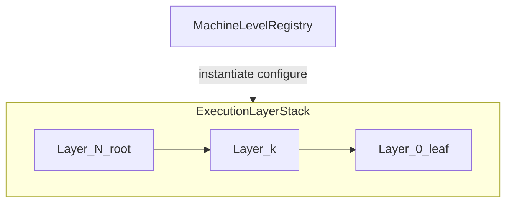

# White Paper — Simpler Runtime Architecture (Redesign)

| Field | Value |
|-------|--------|
| **Audience** | Internal engineering (runtime, compiler stack, adjacent platform teams) |
| **Status** | Draft (same design status as the 4+1 document set) |
| **Scope** | Architectural intent, goals, scenarios, philosophy, and principles. **Not** a substitute for the detailed views in [00-index.md](00-index.md). |
| **Non-scope** | Implementation detail: APIs, memory layouts, build targets, and per-module Section 8 specifications live in the linked design documents. |

---

## Abstract

The **Simpler runtime** is the execution engine that schedules work, moves data, and manages hardware resources for the PTO compiler stack on Ascend NPU hardware. This white paper summarizes the **redesign** documented under `docs/design/`: a move from a hardcoded, shallow hierarchy toward a **recursive hierarchical execution model** with a **Machine Level Registry**, a uniform **`ISchedulerLayer`** contract at every layer, **distributed-first** scheduling and data movement, and a **HAL** that lets the same logical runtime run **on device (ONBOARD)** and in **simulation (SIM)**. The design optimizes for **extensibility** (new levels without modifying existing framework code), **observability**, and **clear failure semantics** across host, device, and multi-node deployments. Readers should treat this document as an **on-ramp**; precision, interfaces, and scenarios in full depth appear in the Introduction, Logical, Process, Physical, Scenario, and Cross-Cutting views and in the Architecture Decision Records (ADRs).

---

## Executive summary

- **What we are building:** A modular runtime framed as an **Abstract Machine**: a configurable stack of **Execution Layers**, each with a **Scheduler**, **Workers**, and **Memory** scope, over which **Tasks** move according to a shared lifecycle and policy hooks.
- **Why:** Fixed depth and ad hoc distribution do not scale with product needs (clusters, new hardware levels, simulation parity, testability).
- **How:** **Topology is configuration** (registry + factories), **behavior is layered recursion** (same scheduler contract, different semantics per level), **control and data paths are separated**, and **cross-node** concerns use the same conceptual machinery as intra-node channels.
- **Where to read next:** [01-introduction.md](01-introduction.md) for requirements and assumptions; [02-logical-view.md](02-logical-view.md) for the domain model; [04-process-view.md](04-process-view.md) for concurrency and state machines; [06-scenario-view.md](06-scenario-view.md) for end-to-end walks; [08-design-decisions.md](08-design-decisions.md) for ADRs.

---

## 1. Context and problem statement

Today's trajectory couples runtime behavior to a **small, fixed number of levels** and makes **distributed** and **simulation** concerns feel bolted on. That coupling increases the cost of **adding a hardware tier**, **partitioning across nodes**, and **reasoning about failures** end-to-end. It also fragments observability and makes it harder to give compiler and DSL teams a **stable contract** (what the runtime guarantees vs. what the platform adapter owns).

The redesign therefore targets a runtime that is **easier to extend by registration**, **easier to validate by scenario**, and **easier to operate** under partial failure—without sacrificing the performance discipline needed on hot paths. The problem statement is aligned with the functional and non-functional requirements summarized in [01-introduction.md §1.3](01-introduction.md#13-requirements-summary).

---

## 2. Design goals and success criteria

### 2.1 Engineering goals

| Goal | Meaning |
|------|--------|
| **Extensible hierarchy** | Support an **N-layer** stack, not only host → device → core; distributed tiers are first-class. |
| **Uniform mental model** | Every layer speaks the same scheduling vocabulary (**submit → schedule → dispatch → complete**) via **`ISchedulerLayer`**. |
| **Portability of logic** | **ONBOARD** and **SIM** share the same abstract control flow; platform specifics sit behind **HAL** and channel implementations. |
| **Distributed coherence** | Cross-node submission, data movement, and failure policies are part of the architecture, not a side channel. |
| **Observable execution** | Tracing, profiling, and logging share a coherent event model suitable for correlation (including distributed traces). |

### 2.2 Measurable design alignment (pointers, not a full spec)

Success is evidenced by satisfying the documented **FR** and **NFR** identifiers in [01-introduction.md §1.3](01-introduction.md#13-requirements-summary)—notably hierarchical scheduling (**FR-1**), distributed execution (**FR-2**), uniform layer interface (**FR-3**), simulation parity with onboard control paths (**FR-10**, **NFR-3**), extensibility (**NFR-2**), modularity (**NFR-4**), and observability (**NFR-7**).

---

## 3. Design philosophy

**Configuration over special cases.** The shape of the machine (how many levels, what each level means) is intended to be described by **registration and configuration**, not by sprinkling conditionals through the framework.

**One recursion, many instants.** Developers learn **one** pattern—a layer, a scheduler, workers, memory, vertical descent to children, horizontal peer cooperation—and reuse it from chip to cluster.

**Separation of concerns along natural seams.** **Control** (what runs next, with what dependencies) and **data** (where tensors live and how they move) are distinct conceptual paths, even when a concrete transport bundles them on some platforms.

**Observability is a contract, not an afterthought.** When profiling is off, cost must be negligible; when it is on, events must be sufficient to reconstruct timelines— including simulation and replay modes where appropriate.

**Failures are data.** Errors carry structured context so parent tasks, distributed coordinators, and user-facing surfaces can apply policy (abort, continue-reduced, retry) consistently.

These stances are intentionally **normative**; they explain tradeoffs that show up throughout the views and ADRs.

---

## 4. Design principles

1. **Hierarchical recursion.** Work submitted at layer *N* is scheduled and may spawn children executed at layer *N−1* (or peers), preserving a clear parent/child structure for dependencies and cancellation.

2. **Distributed-first.** Any abstraction that only works single-node is suspect: **vertical** (parent/child) and **horizontal** (peer) channels must generalize to **remote** peers where the deployment requires it.

3. **Uniform layer interface.** **`ISchedulerLayer`** is the stable seam; differences between levels are expressed by **policies**, **worker kinds**, **memory scopes**, and **transport**—not by forking the lifecycle contract.

4. **Open for extension, closed for modification (at the framework core).** New machine levels and transports are added by **implementing and registering** factories in the **Machine Level Registry**, not by editing the generic orchestration skeleton (see ADR-002).

5. **Explicit lifecycle and canonical states.** Task state names and transitions are **single-sourced** in the design so logs, traces, and APIs agree (ADR-016).

6. **Dependency discipline.** Producer/consumer relationships are analyzed in defined stages so the runtime does not guess unsafe aliasing; the **Dependency Model** constrains how edges cross submission boundaries ([02-logical-view/12-dependency-model.md](02-logical-view/12-dependency-model.md)).

7. **Security and tenancy awareness.** Logical isolation (namespaces), trust boundaries at bindings and wire ingress, and least-privilege patterns are treated as **cross-cutting** requirements ([07-cross-cutting-concerns.md](07-cross-cutting-concerns.md)).

Principles 1–3 mirror [01-introduction.md §1.4](01-introduction.md#14-key-architectural-principles); principles 4–7 extend them with decisions codified across ADRs and the logical view.

---

## 5. Representative scenarios (architecture-level)

Each scenario below is a **compressed narrative**. Step tables, failure matrices, and view-by-view traces live in [06-scenario-view.md](06-scenario-view.md) and [04-process-view.md](04-process-view.md).

### 5.1 Single-node hierarchical execution

**Actors:** User program (e.g. Python binding), host scheduler, device orchestration, chip-level scheduling, AICore workers.  
**Goal:** Run an orchestrated computation on **one** node from host submission down to leaf kernels.  
**Architectural story:** A root **Task** enters at the highest **Execution Layer**; schedulers along the stack use **vertical channels** to pass work and completion signals downward and upward. **Memory scopes** and **memory operations** keep tensor placement and movement explicit at each boundary. Leaf work is modeled as **AICore**-class **Functions**; orchestration is modeled as higher-level **Function** types.  
**Design stress:** Dependency readiness, resource readiness, dispatch fairness, and completion fan-in are all expressed through the **shared task model** and **scheduler policies** rather than ad hoc state.

### 5.2 Distributed multi-node execution

**Actors:** Coordinator or pod-level logic, per-node host stacks, network transports.  
**Goal:** Partition or replicate work across nodes with consistent task identity and data movement.  
**Architectural story:** Distributed tiers are **layers in the same recursion**, not a separate runtime. **Horizontal channels** carry remote submission and completion; **data movement** uses the memory/operations abstractions appropriate to RDMA or other transports. Failure of a peer becomes a **policy-driven** branch (abort all, continue with partial results, retry on alternate node) feeding the same **error context** model as local faults.

### 5.3 SPMD-style parallel launch

**Actors:** Orchestration function at device (or chip) tier, many leaf workers.  
**Goal:** Launch **one** logical kernel description across many workers with **per-shard** arguments and indexed addressing.  
**Architectural story:** The **task model** distinguishes the SPMD group from individual shard tasks so schedulers can aggregate completion, propagate **shard-aware** errors, and cancel or discard work consistently when a shard fails.

### 5.4 Simulation (ONBOARD vs SIM)

**Actors:** Same runtime stack; **HAL** and leaf backends differ.  
**Goal:** Exercise scheduling, dependencies, and tracing without full hardware fidelity—or replay prior captures.  
**Architectural story:** **SIM** reuses **`ISchedulerLayer`** and task lifecycles; leaf execution is **modeled** (performance), **executed on host** (functional), or **replayed** from captured traces, per the simulation ADR (ADR-011). This supports **NFR-3** portability: logic proven in simulation applies to onboard execution.

### 5.5 Failure and recovery patterns

**Actors:** Schedulers at any layer, distributed coordinator, user.  
**Goal:** Classify **fatal vs. recoverable** faults, bound blast radius, and surface actionable errors.  
**Architectural story:** Timeouts, hardware hangs, slot exhaustion, and remote **peer health** integrate with a **unified health / peer FSM** mindset (ADR-018) and **canonical task states** (ADR-016). The **Process View** is authoritative for flows; this white paper only asserts that **errors are first-class events** in the dependency graph, not side-channel strings.

---

## 6. Architectural design (conceptual detail)

This section names the **contracts** that anchor the architecture. It does **not** duplicate interface method lists, struct layouts, or module implementation specs.

### 6.1 Abstract Machine and Execution Layer stack

The runtime is specified as an **Abstract Machine** with five pillars: **Machine Level Registry**, **Execution Layers**, **Function** types, **Tasks**, and **Communication** ([02-logical-view.md §2.0](02-logical-view.md#20-overview)). Each **Execution Layer** is a triple **(Scheduler, Workers, Memory scope)**. **Workers** execute **Tasks**; **Schedulers** order and dispatch them subject to **policies** and **resource** constraints.

The registry **instantiates** a **Layer Stack** from declarative configuration: which levels exist, which factories build their components, and which **vertical** and **horizontal** channels connect them ([02-logical-view/05-machine-level-registry.md](02-logical-view/05-machine-level-registry.md)).

### 6.2 Uniform scheduling surface

**`ISchedulerLayer`** is the contract that every layer implements so upper layers, tools, and tests can treat scheduling **homogeneously** ([02-logical-view/09-interfaces.md](02-logical-view/09-interfaces.md), ADR-003). **Policy hooks** (scheduling, worker selection, resource allocation, execution policy) allow specialization without fragmenting the lifecycle.

### 6.3 Functions and tasks

**Functions** are the registered units of work (AICore compute, orchestration, host-side logic, distributed orchestration); the **function cache** (content hash) supports register-once, invoke-many semantics (ADR-007). **Tasks** carry dependencies, execution type (including SPMD), and tensor **lifecycle** rules (implicit scope with explicit free—ADR-006). Precise task fields and state names belong to the **Task Model** and **Process View** ([02-logical-view/07-task-model.md](02-logical-view/07-task-model.md), [04-process-view.md](04-process-view.md)).

### 6.4 Communication and separation of paths

**Vertical** channels carry parent/child work and completion; **horizontal** channels carry peer coordination (including cross-node). The design **separates control-plane messages from data movement** so transports can optimize each without conflating semantics (ADR-004, [02-logical-view/08-communication.md](02-logical-view/08-communication.md)). The **transport** and **distributed** modules own wire-adjacent behavior at the design level; this white paper does not specify encodings (see **Appendix C** for compatibility policy scope).

### 6.5 HAL, platform, and variants

**HAL** abstracts execution engines, synchronization primitives, timers, and other platform operations so the same orchestration code targets **a2a3**, **a5**, and simulation backends ([modules/hal.md](modules/hal.md), [02-logical-view/10-platform.md](02-logical-view/10-platform.md)). **Platform variant** (**ONBOARD** vs **SIM**) selects how leaf execution and time progress are realized while preserving the **same** scheduling graph.

### 6.6 Submission, dependencies, and ordering

Cross-submission dependencies and frontend/runtime division of labor are governed by the **two-stage dependency** model (ADR-013) and the **dependency model** chapter ([02-logical-view/12-dependency-model.md](02-logical-view/12-dependency-model.md)). **Submission windows**, **group workspaces**, and dependency modes (ADR-012) exist so high-throughput pipelines do not sacrifice determinism where the product requires it.

### 6.7 Code organization (pointer only)

Source is arranged into a **DAG** of modules (`hal/`, `core/`, `scheduler/`, `memory/`, `transport/`, `distributed/`, `profiling/`, `error/`, `runtime/`, `bindings/`) as described in [03-development-view.md](03-development-view.md). The white paper does not prescribe build targets or package graphs.

---

## 7. Cross-cutting concerns (summary)

- **Security:** Trust boundaries (bindings, remote ingress), tenancy, and secret-handling patterns are summarized in [07-cross-cutting-concerns.md](07-cross-cutting-concerns.md).
- **Observability:** Profiling, tracing, and logging share design goals with **NFR-1** and **NFR-7**; event models aim for compatibility with common trace consumers.
- **Performance:** Hot-path discipline (e.g. closed enums where ADRs require—ADR-017), minimal overhead when instrumentation is disabled, and data-movement minimization are architectural constraints, not microbenchmark results in this document.

---

## 8. Physical deployment and scaling (summary)

Deployment **topologies** (single device, multi-device, multi-node), **network** roles, and **scaling** strategies are covered in [05-physical-view.md](05-physical-view.md). Architecturally, the runtime expects **clearly defined coordinator vs. worker node roles**, health checking, and transport-matched configuration—without embedding concrete port lists or vendor-specific tuning in this white paper.

---

## 9. Architecture decision records (spine)

The table below lists **accepted** ADRs in [08-design-decisions.md](08-design-decisions.md). Each row links to the start of that ADR in the consolidated file.

| ADR | Title | Why it matters (one line) |
|-----|--------|---------------------------|
| [ADR-001](08-design-decisions.md#adr-001-recursive-hierarchical-execution-model) | Recursive Hierarchical Execution Model | Replaces fixed-depth special casing with one recursive pattern. |
| [ADR-002](08-design-decisions.md#adr-002-machine-level-registry-with-pluggable-factories) | Machine Level Registry with Pluggable Factories | Topology becomes configuration; supports OCP-style extension. |
| [ADR-003](08-design-decisions.md#adr-003-uniform-ischedulerlayer-interface) | Uniform ISchedulerLayer Interface | One lifecycle contract for every layer. |
| [ADR-004](08-design-decisions.md#adr-004-separate-control-and-data-paths) | Separate Control and Data Paths | Lets transports optimize control vs. bulk data cleanly. |
| [ADR-005](08-design-decisions.md#adr-005-distributed-first-design) | Distributed-First Design | Avoids retro-fitting multi-node semantics later. |
| [ADR-006](08-design-decisions.md#adr-006-tensor-lifecycle-with-implicit-scope-and-explicit-free) | Tensor Lifecycle with Implicit Scope and Explicit Free | Balances ergonomics with deterministic reclamation. |
| [ADR-007](08-design-decisions.md#adr-007-function-caching-via-content-hash) | Function Caching via Content Hash | Stable identity for repeated invocation. |
| [ADR-008](08-design-decisions.md#adr-008-scheduler-internal-decomposition-with-strategy-pattern-policy-hooks) | Scheduler Internal Decomposition with Strategy-Pattern Policy Hooks | Keeps core loop thin; policies swappable. |
| [ADR-009](08-design-decisions.md#adr-009-heterogeneous-worker-types-with-worker-group-affinity) | Heterogeneous Worker Types with Worker Group Affinity | Models real hardware heterogeneity and affinity. |
| [ADR-010](08-design-decisions.md#adr-010-event-driven-scheduler-with-configurable-delivery-and-deployment) | Event-Driven Scheduler with Configurable Delivery and Deployment | Unifies reactive scheduling across deployments. |
| [ADR-011](08-design-decisions.md#adr-011-simulation-facility-with-three-leaf-execution-modes) | Simulation Facility with Three Leaf-Execution Modes | Performance, functional, and replay modes share the same stack. |
| [ADR-012](08-design-decisions.md#adr-012-submission-model-with-dependency-modes-outstanding-window-and-group-workspace) | Submission Model with Dependency Modes, Outstanding Window, and Group Workspace | Defines throughput vs. determinism knobs at submission boundary. |
| [ADR-013](08-design-decisions.md#adr-013-two-stage-dependency-analysis--frontend-intra-submission-dag--runtime-cross-submission-raw) | Two-Stage Dependency Analysis | Splits compiler-time intra-DAG from runtime cross-submission RAW rules. |
| [ADR-014](08-design-decisions.md#adr-014-freeze-runtimecomposition-sub-namespace--promotion-triggers) | Freeze runtime::composition Sub-Namespace + Promotion Triggers | Stabilizes a sensitive composition surface. |
| [ADR-015](08-design-decisions.md#adr-015-distributed-header-registration-policy-invariant-i-dist-1) | Distributed Header Registration Policy | Keeps remote registration safe and consistent. |
| [ADR-016](08-design-decisions.md#adr-016-taskstate-canonical-spelling--transitions) | TaskState Canonical Spelling + Transitions | Single source of truth for task states. |
| [ADR-017](08-design-decisions.md#adr-017-closed-enum-in-hot-path-policy) | Closed-Enum-in-Hot-Path Policy | Performance predictability on critical paths. |
| [ADR-018](08-design-decisions.md#adr-018-single-unified-peer-health-fsm) | Single Unified Peer-Health FSM | Consistent distributed failure detection semantics. |
| [ADR-019](08-design-decisions.md#adr-019-admission-shard-default--deployment-cue) | Admission Shard Default + Deployment Cue | Aligns defaults with common deployment shapes. |
| [ADR-020](08-design-decisions.md#adr-020-coordinator-generation--stale-coordinator-reject) | Coordinator Generation + Stale-Coordinator Reject | Safe coordinator handoff under churn. |

---

## 10. Risks, limitations, and follow-on work

- **Open questions** are centralized in [09-open-questions.md](09-open-questions.md).
- **Known deviations** from methodology rules (with justification) appear in [10-known-deviations.md](10-known-deviations.md).
- **Terminology** is normalized in [appendix-a-glossary.md](appendix-a-glossary.md).
- **Backward compatibility and versioning scope** for wire and persistent artifacts are indexed from [appendix-c-compatibility.md](appendix-c-compatibility.md).

The largest **programmatic risk** is conceptual: the recursive model asks every contributor to internalize **one deep pattern** instead of many shallow ones. Mitigation is strong **scenarios**, **glossary discipline**, and **ADR traceability**—which this document set already emphasizes.

---

## 11. Conclusion

The redesigned Simpler runtime aims to be **recursive without being ad hoc**, **distributed without a parallel stack**, and **portable across platform and simulation** through **HAL** and explicit **channel** abstractions. **`ISchedulerLayer`**, the **Machine Level Registry**, and the **task/function** model form the stable spine; **ADRs** capture the contentious choices. For every claim that requires line-level precision, the **4+1 views** and **module designs** remain authoritative.

---

## References

| Document | Role |
|----------|------|
| [00-index.md](00-index.md) | Canonical map of the design set |
| [01-introduction.md](01-introduction.md) | Purpose, scope, requirements, assumptions |
| [02-logical-view.md](02-logical-view.md) | Abstract Machine and module map |
| [03-development-view.md](03-development-view.md) | Module DAG and ownership (not build recipes in this white paper) |
| [04-process-view.md](04-process-view.md) | Concurrency, lifecycles, interactions |
| [05-physical-view.md](05-physical-view.md) | Deployment and scaling |
| [06-scenario-view.md](06-scenario-view.md) | End-to-end and failure scenarios |
| [07-cross-cutting-concerns.md](07-cross-cutting-concerns.md) | Security, observability, performance |
| [08-design-decisions.md](08-design-decisions.md) | ADRs |
| [appendix-a-glossary.md](appendix-a-glossary.md) | Definitions |
| [appendix-b-codebase-mapping.md](appendix-b-codebase-mapping.md) | Legacy mapping |
| [appendix-c-compatibility.md](appendix-c-compatibility.md) | Compatibility policy index |
